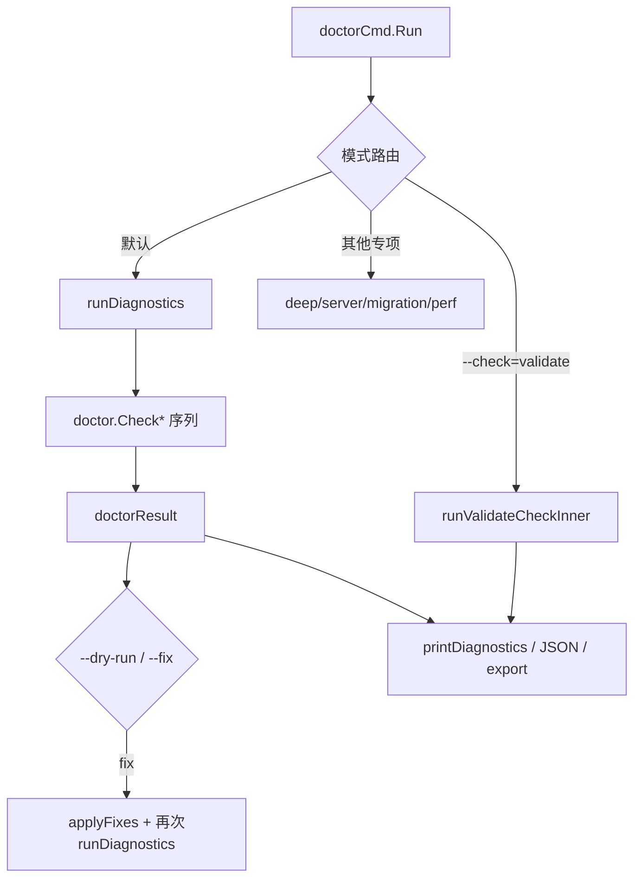

# command_entry_and_output_pipeline

`command_entry_and_output_pipeline` 是 `bd doctor` 的“总入口 + 总出口”层：它把大量底层健康检查组织成一条可控的执行流水线（选路径、跑检查、可选修复、重新验证、最终输出）。你可以把它理解成机场的塔台——真正执行飞行的是各检查子模块，但由它决定谁先起飞、谁降落、是否复飞，以及最终对外广播什么状态。

---

## 1. 为什么这个模块存在（问题空间）

在 beads 里，诊断不是单一维度：既有本地仓库结构、数据库/迁移状态，也有 Git hooks、Dolt 锁、文档集成、专项校验（`--check=validate`）等。单纯“调用几个 `Check*` 再打印”会有三个问题：

1. **检查有时序依赖**：例如源码明确把 `CheckLockHealth` 提前，避免被 doctor 自己创建的 lock 误报。
2. **输出消费者不同**：人要看分组和修复建议，CI 要看稳定 JSON 与退出码，归档要落文件。
3. **修复需要闭环**：`--fix` 后必须复检，否则“命令执行成功”不等于“状态恢复成功”。

所以该模块的职责不是检查逻辑本身，而是**检查生命周期编排**。

---

## 2. 心智模型（如何在脑中理解它）

建议用“门诊流程”来理解：

- **分诊台**：`doctorCmd.Run` 根据 flag 选择模式（全量、专项、deep、server、migration、perf）。
- **检查单**：每个检查最终都被归一成 `doctorCheck`。
- **病历**：一次运行汇总为 `doctorResult`（含 `OverallOK`、版本、可选时间戳/平台信息）。
- **处置室**：`--dry-run` 预演，`--fix` 真实修复。
- **复查**：修复后再次 `runDiagnostics`。
- **对外系统**：`printDiagnostics`（人类输出）/ `outputJSON`（机器输出）/ `exportDiagnostics`（归档文件）。

而 `validate` 专项路径额外用 `validateCheckResult` 给每条检查打上 `fixable` 元信息，表达“这条问题能不能自动修”。

---

## 3. 架构总览

### 走读（端到端数据流）

1. `doctorCmd.Run` 先决定目标路径：`args[0]` > `BEADS_DIR` 父目录 > `.`。
2. 按 flag 进行“短路路由”：`--perf`、`--check-health`、`--check`、`--deep`、`--server`、`--migration`。
3. 默认进入 `runDiagnostics(path)`：
   - 调用大量 `doctor.Check*`；
   - 每条结果转为 `doctorCheck`（`convertDoctorCheck` / `convertWithCategory`）；
   - 更新 `doctorResult.OverallOK`。
4. 若 `--fix`：先 `releaseDiagnosticLocks`，再 `applyFixes`，再复跑 `runDiagnostics` 验证。
5. 输出阶段：
   - `jsonOutput=true`：输出结构化 JSON；
   - `--output`：写文件并附时间戳与平台信息；
   - 否则控制台分组打印。
6. 若 `OverallOK=false`，进程 `os.Exit(1)`。

---

## 4. 关键设计选择与取舍

### 4.1 顺序执行优先于并发执行
- **选择**：检查按固定顺序串行运行。
- **收益**：避免检查互相干扰（尤其 lock 假阳性）。
- **代价**：全量诊断耗时更长。
- **适配场景**：健康诊断更看重正确性和可解释性。

### 4.2 统一薄契约（`doctorCheck` / `doctorResult`）
- **选择**：统一输出结构，而不是每个检查自定义返回。
- **收益**：打印、JSON、导出、统计、分类逻辑可复用。
- **代价**：复杂细节可能退化为 `Detail` 文本。

### 4.3 修复后强制复检
- **选择**：`--fix` 后再次完整诊断。
- **收益**：把“尝试修复”升级为“确认已修复”。
- **代价**：执行时间增加。

### 4.4 专项 validate 采用“严格门禁”
- **选择**：`validateOverallOK` 将 warning/error 都视为失败。
- **收益**：数据完整性问题不会被“仅 warning”放过。
- **代价**：比常规 doctor 更严格，可能提高失败率。

### 4.5 全局 flag 驱动而非显式依赖注入
- **选择**：复用 CLI 全局变量（如 `doctorFix`、`doctorYes`、`jsonOutput`）。
- **收益**：接线简单，与命令行为一致。
- **代价**：测试和复用需要关注全局状态副作用。

---

## 5. 核心组件说明（本模块）

### `cmd.bd.doctor.doctorCheck`
单条诊断结果的数据契约，字段包括 `Name/Status/Message/Detail/Fix/Category`。它是输出流水线的最小原子，既服务展示，也服务 JSON。

### `cmd.bd.doctor.doctorResult`
一次诊断会话的聚合结构，核心字段是 `Checks` 和 `OverallOK`，并附 `Path/CLIVersion`，可选 `Timestamp/Platform` 用于导出和回溯。

### `cmd.bd.doctor_validate.validateCheckResult`
`validate` 专项用的包装结构：`doctorCheck + fixable`。用于把“问题状态”和“可自动修复能力”解耦。

---

## 6. 子模块文档导航

- [doctor_command_entry_orchestration](doctor_command_entry_orchestration.md)  
  详细解释 `doctorCmd.Run`、`runDiagnostics`、`printDiagnostics`、`runMigrationValidation` 的入口编排与输出策略；并覆盖 `releaseDiagnosticLocks`、`runInitDiagnostics` 等“容易被忽略但影响稳定性”的流程节点。

- [validate_check_focus_pipeline](validate_check_focus_pipeline.md)  
  聚焦 `--check=validate` 路径：四项检查收敛、`fixable` 判定、交互式确认与自动修复闭环；说明为什么该路径对 warning 采取更严格的失败策略。

---

## 7. 跨模块依赖关系（连接点）

从给定源码可确认，本模块直接依赖：

- [CLI Doctor Commands](CLI Doctor Commands.md)：通过 `github.com/steveyegge/beads/cmd/bd/doctor` 调用具体 `Check*`。
- [Beads Repository Context](Beads Repository Context.md)：`beads.FollowRedirect` 解析真实 `.beads` 路径。
- [Configuration](Configuration.md)：`configfile.Load`、`GetBackend`、`DatabasePath` 用于 lock 清理分支判断。
- [UI Utilities](UI Utilities.md)：`internal/ui` 提供统一终端渲染（图标、分类、样式）。

> 说明：当前提供的代码片段未展示 `doctorCmd` 在根命令中的注册位置，因此“谁调用该命令对象”的精确函数名在此无法从片段内直接验证。

---

## 8. 新贡献者注意事项（易踩坑）

1. **不要随意调整检查顺序**：`CheckLockHealth` 前置是显式防误报策略。  
2. **`OverallOK` 规则不统一**：有些 warning 仅提示，有些 warning/error 会拉低整体状态，新增检查时要明确语义。  
3. **修复键隐式依赖检查名**：`validate` 修复通过 `applyFixList` 分发，检查名称变更可能导致修复失联。  
4. **非交互环境默认不确认修复**：`--fix` 在非终端且无 `--yes` 时会跳过自动修复。  
5. **JSON 字段是外部契约**：修改 `doctorCheck`/`doctorResult` 字段名会影响自动化脚本与历史工具。
