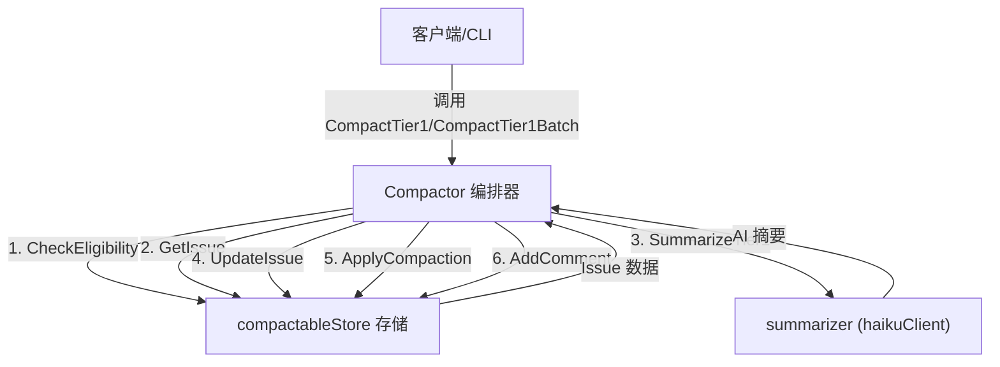

# Compaction Orchestration 模块技术深度解析

## 1. 模块概述与问题空间

### 问题是什么？
在 issue 管理系统的长期使用过程中，一个常见的问题是 issue 的内容会变得冗长且占用空间。随着时间推移，大量的设计文档、讨论、笔记和验收标准会积累在 issue 中，这会导致：
- 存储空间的浪费
- 传输和处理延迟
- 信息过载，使关键细节淹没在历史噪声中

### 本模块解决的核心问题
`compaction_orchestration` 模块通过使用 AI 驱动的摘要技术，智能地压缩 issue 内容，同时保留关键信息。它并非简单地截断文本，而是通过 AI 模型生成有意义的摘要，确保压缩后的内容仍然具有可读性和参考价值。

## 2. 核心心智模型与抽象

### 核心抽象与类比
你可以把这个模块想象成一个**档案管理员**：
- 他检查哪些文档需要归档（资格检查）
- 他保留文档的关键信息但压缩体积（AI 摘要）
- 他记录压缩过程以便追踪（元数据记录）
- 他确保整个过程是可验证和可审计的（审计支持）

### 关键抽象
模块围绕三个核心抽象构建：
1. **`compactableStore`**：存储层契约，抽象出与 issue 存储系统交互的必要操作
2. **`summarizer`**：AI 摘要器契约，定义了生成内容摘要的接口
3. **`Compactor`**：编排器，协调存储、摘要和配置以执行压缩操作

## 3. 架构与数据流

### 架构图示


### 核心组件数据流

#### 单个 Issue 压缩 (`CompactTier1`)
1. **资格检查**：首先调用 `store.CheckEligibility` 确保 issue 适合压缩
2. **获取原始内容**：从存储中获取完整 issue 数据
3. **大小计算**：统计原始内容的总字节大小
4. **AI 摘要**：使用 `summarizer` 生成压缩后的摘要内容
5. **大小验证**：确保摘要确实比原始内容小，否则跳过压缩
6. **更新存储**：将摘要写回 issue 的 `description` 字段，清空其他字段
7. **记录元数据**：使用 `store.ApplyCompaction` 记录压缩前后的大小、版本和 git 提交哈希
8. **添加评论**：记录压缩操作的详细信息

#### 批量压缩 (`CompactTier1Batch`)
- 使用信号量 (`semaphore`) 模式控制并发数
- 为每个 issue 启动独立的 goroutine
- 收集所有结果后返回，包括每个 issue 的压缩前后大小和错误信息

## 4. 核心组件深度解析

### `Compactor` 结构体
**目的**：作为整个压缩流程的编排器
- 持有对存储层、摘要器和配置的引用
- 提供单个和批量压缩的入口方法

**设计考量**：
- 使用依赖注入模式，`store` 和 `summarizer` 都是接口，便于测试和替换
- 配置通过 `Config` 结构体集中管理，提供合理默认值

### `compactableStore` 接口
**目的**：定义存储层必须实现的契约，使压缩逻辑与特定存储实现解耦

**核心方法**：
- `CheckEligibility`: 判断 issue 是否适合压缩
- `GetIssue`: 获取完整 issue 数据
- `UpdateIssue`: 更新 issue 内容
- `ApplyCompaction`: 记录压缩元数据
- `AddComment`: 添加压缩操作的评论

**设计决策**：
- 这个接口是故意设计得比较窄的，只包含压缩过程必需的操作，这符合接口隔离原则 (ISP)
- 任何支持这些方法的存储后端都可以使用压缩功能

### `summarizer` 接口
**目的**：抽象 AI 摘要生成能力
- 当前只有 `SummarizeTier1` 方法，为未来的压缩层级预留了扩展空间

**设计考量**：
- 接口非常简单，便于更换不同的 AI 服务提供商
- 当前实现是 Haiku (Anthropic 的 Claude 模型)，但可以轻松替换为其他模型

### `Config` 结构体
**配置项**：
- `APIKey`: AI 服务的 API 密钥
- `Concurrency`: 批量压缩时的并发数
- `DryRun`: 试运行模式，不实际修改数据
- `AuditEnabled`: 是否启用审计功能
- `Actor`: 执行压缩操作的主体标识

### `BatchResult` 结构体
**目的**：捕获批量压缩中每个 issue 的结果
- 包含 issue ID、压缩前后大小、可能的错误

## 5. 设计决策与权衡

### 1. 接口驱动设计 vs 具体实现
**选择**：使用 `compactableStore` 和 `summarizer` 接口而非直接依赖具体实现
**原因**：
- 提高可测试性：可以轻松 mock 存储和 AI 服务
- 增强灵活性：未来可以更换不同的存储后端或 AI 提供商
- 降低耦合：压缩逻辑不绑定到特定的存储或 AI 技术

**权衡**：
- 增加了一层抽象，对于简单场景可能稍显过度设计
- 但考虑到系统的长期可维护性和可扩展性，这是值得的

### 2. 资格检查作为前置条件
**选择**：在开始压缩流程前先调用 `CheckEligibility`
**原因**：
- 快速失败：避免浪费资源在不适合压缩的 issue 上
- 策略解耦：将"什么可以压缩"的决定交给存储层实现

### 3. 并发控制使用信号量模式
**选择**：在 `CompactTier1Batch` 中使用缓冲通道作为信号量
**原因**：
- 简单有效：Go 的缓冲通道天然适合作为信号量
- 可控的并发：通过配置限制同时进行的压缩操作数量
- 防止资源耗尽：避免同时发起过多 AI API 请求或数据库操作

### 4. 大小验证作为安全措施
**选择**：在应用压缩前检查摘要是否确实更小
**原因**：
- 防止 AI 生成更长的内容（有时可能发生）
- 确保压缩操作是真正有价值的

### 5. 详细的元数据记录和评论
**选择**：记录压缩前后大小、git 提交哈希，并添加评论
**原因**：
- 可追溯性：知道谁在什么时候压缩了什么
- 可恢复性：git 提交哈希允许在需要时恢复原始内容
- 透明度：通过评论让用户知道发生了什么

## 6. 使用方法与示例

### 基本用法

```go
// 创建配置
config := &compact.Config{
    APIKey:      "your-api-key",
    Concurrency: 5,
    DryRun:      false,
    Actor:       "user@example.com",
}

// 创建 Compactor 实例
compactor, err := compact.New(store, apiKey, config)
if err != nil {
    // 处理错误
}

// 压缩单个 issue
err = compactor.CompactTier1(ctx, "issue-123")

// 批量压缩
issueIDs := []string{"issue-1", "issue-2", "issue-3"}
results, err := compactor.CompactTier1Batch(ctx, issueIDs)
```

### 试运行模式

```go
config := &compact.Config{
    DryRun: true, // 只检查，不修改
}
compactor, _ := compact.New(store, apiKey, config)
err := compactor.CompactTier1(ctx, "issue-123")
// err 将包含会执行的操作描述
```

## 7. 边界情况与注意事项

### 关键隐含契约
1. **存储的原子性**：`UpdateIssue`、`ApplyCompaction` 和 `AddComment` 应该在同一个事务中执行，否则可能出现部分更新的状态
2. **资格检查的稳定性**：`CheckEligibility` 的结果应该相对稳定，避免在压缩过程中资格状态发生变化
3. **内容字段的语义**：当前实现假设 `description`、`design`、`notes` 和 `acceptance_criteria` 是需要压缩的主要文本字段

### 常见陷阱
1. **AI API 失败**：网络问题或 API 限流可能导致压缩失败，模块会正确传播错误但不会重试
2. **并发数过大**：设置过高的 `Concurrency` 可能导致 API 限流或数据库连接耗尽
3. **忽略资格检查**：直接绕过 `CheckEligibility` 可能导致压缩不适合的 issue

### 已知限制
1. 当前只实现了 "Tier 1" 压缩（基础摘要）
2. 没有自动恢复机制
3. 压缩逻辑是单向的，没有内置的解压缩功能（依赖 git 历史进行恢复）

## 8. 依赖关系与模块连接

### 调用本模块的组件
- CLI 命令层（可能通过 `compact` 相关的 CLI 命令）

### 本模块依赖的组件
- **存储接口**：由 `compactableStore` 定义，需要外部实现
- **AI 摘要服务**：当前使用 [haiku_summarization_client](compaction-haiku_summarization_client.md) 模块实现
- **核心类型系统**：使用 `types.Issue` 等类型
- **Git 集成**：通过 `GetCurrentCommitHash` 获取当前提交哈希

### 相关文档
- [haiku_summarization_client](compaction-haiku_summarization_client.md)：AI 摘要实现模块
- [Storage Interfaces](storage-interfaces.md)：存储层契约定义
- [Core Domain Types](core-domain-types.md)：核心数据类型

## 9. 总结

`compaction_orchestration` 模块通过精心设计的接口和编排逻辑，实现了 issue 内容的智能压缩。它的核心价值在于：
- **解耦**：通过接口将压缩逻辑与存储和 AI 服务分离
- **安全**：包含多重检查确保压缩是安全和有益的
- **可观测**：详细记录压缩过程的元数据和评论
- **可扩展**：为未来的压缩层级和功能预留了空间

这个模块是一个很好的例子，展示了如何通过清晰的抽象和关注点分离，构建一个既灵活又健壮的功能组件。
