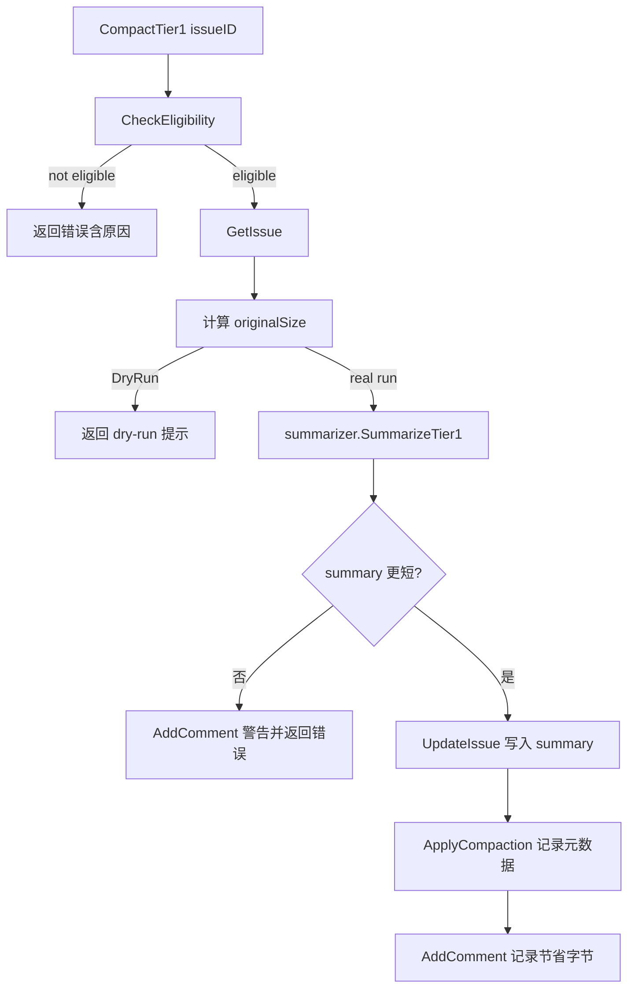

# compaction_orchestration

`compaction_orchestration`（`internal/compact/compactor.go`）是 Compaction 模块的“总调度器”。如果把整个压缩流程想成一次档案馆整理：`haikuClient` 像“自动摘要机器”，那 `Compactor` 就是“馆员”——先检查哪些文档允许压缩、再调用机器摘要、最后把结果安全写回并留下审计痕迹。它存在的意义不是“会调一个 AI API”，而是把**业务约束（可压缩性、不能变长、元数据记录）**落实到可执行流程里。

## 这个子模块解决什么问题

仅靠 LLM 摘要函数不够，因为真实系统还要回答：

- 哪些 issue 可以压缩？（状态/规则判断）
- 摘要后如果更长怎么办？
- 如何批量并发执行而不把存储打爆？
- 如何记录压缩行为（尺寸变化、commit hash、comment）？

`Compactor` 用一个清晰的编排管道把这些问题封装起来，把“AI 不确定性”包在“业务确定性”边界内。

## 核心抽象与心智模型

### `compactableStore`：能力契约而非具体实现

`compactableStore` 是编排层和存储层之间的最小接口，要求实现 5 个能力：

- `CheckEligibility`
- `GetIssue`
- `UpdateIssue`
- `ApplyCompaction`
- `AddComment`

这是一种典型的“端口-适配器（Ports & Adapters）”做法：`Compactor` 只关心“要什么能力”，不关心后端是 Dolt 还是其他实现。

### `summarizer`：AI 能力的窄接口

`summarizer` 只有一个方法 `SummarizeTier1(ctx, issue)`，让编排层无需知道模型、prompt、重试策略等细节。当前默认实现是 [`haiku_summarization_client`](haiku_summarization_client.md) 里的 `haikuClient`。

### `Config`：行为开关集合

`Config` 定义了 orchestrator 的关键行为：

- `Concurrency`：批处理并发度
- `DryRun`：只演练不写库
- `AuditEnabled` / `Actor`：透传到 `haikuClient` 的审计配置
- `APIKey`：构造摘要客户端时使用

其中 `defaultConcurrency = 5` 是保守默认值，体现“吞吐优先但不激进”的系统偏好。

## 数据流（单条压缩）



关键点：

1. **Fail Fast**：先 `CheckEligibility` 再读 issue，避免不必要 IO。
2. **双重防线**：prompt 层要求“更短”，编排层再做硬校验 `compactedSize >= originalSize`。
3. **落库顺序**：先 `UpdateIssue`，再 `ApplyCompaction`，再 `AddComment`；每一步失败都中断并返回。

## 数据流（批量压缩）

```mermaid
flowchart LR
    A[CompactTier1Batch(issueIDs)] --> B[初始化 results]
    B --> C[创建 semaphore: Concurrency]
    C --> D[每个 issue 启 goroutine]
    D --> E[GetIssue 预取 originalSize]
    E --> F[CompactTier1]
    F --> G[GetIssue 读取压缩后大小]
    G --> H[写入对应 idx 的 BatchResult]
```

实现上用 `WaitGroup + buffered channel semaphore` 控制并发。`results[idx]` 按输入顺序返回，这对 CLI 展示和脚本消费很友好。

## 非显而易见的设计选择与取舍

### 1) API key 缺失时自动降级 DryRun

`New()` 中若 `newHaikuClient` 返回 `errAPIKeyRequired`，不会直接失败，而是把 `config.DryRun = true`。这让模块在本地/CI 无密钥环境下仍可演练流程。取舍是：你可能“以为在真压缩，实际在 dry-run”，所以调用方应显式展示模式状态。

### 2) 批处理里会“重复读取 issue”

`CompactTier1Batch` 先 `GetIssue` 算原始大小，`CompactTier1` 内又会 `GetIssue`。这是一次额外 IO，但换来代码复用（单条逻辑只维护一份）与行为一致性。偏向简单正确，而不是极致性能。

### 3) DryRun 用 error 返回

`CompactTier1` 在 dry-run 路径返回的是 `fmt.Errorf("dry-run: would compact ...")`。这让调用方必须把这类 error 当“预期信号”而非“异常失败”。优点是无需新结果类型；缺点是语义不够强类型，批处理统计时要做文案/类型识别。

### 4) `UpdateIssue` actor 固定为 `"compactor"`

即使 `Config.Actor` 可用于审计，这里写库 actor 仍固定字符串。这简化了行为一致性，但限制了多租户/多机器人身份区分能力。

## 组件级说明

### `New(store, apiKey, config) (*Compactor, error)`

- 归一化配置（nil/非正并发都回退默认）
- 处理 API key（参数可覆盖到 `config.APIKey`）
- 非 dry-run 时创建 `haikuClient`
- 若拿到具体 `*haikuClient`，注入审计开关和 actor

注意：`summarizer` 可能为 nil（例如 dry-run），当前流程安全，因为 dry-run 在调用摘要前就返回。

### `CompactTier1(ctx, issueID) error`

单条压缩主流程，负责：资格校验、摘要调用、体积校验、落库、元数据和注释记录。它是整个模块最关键的业务函数。

### `CompactTier1Batch(ctx, issueIDs) ([]BatchResult, error)`

并发执行多个 `CompactTier1`，返回逐条结果；函数本身通常返回 `nil` error（除非未来增加全局失败语义），单条失败放在 `BatchResult.Err`。

### `BatchResult`

批处理输出 DTO：`IssueID`、`OriginalSize`、`CompactedSize`、`Err`。调用方可以据此做统计、重试或报告。

## 新贡献者需要注意的坑

1. **并发安全依赖“每个 idx 只写一次”**：当前 goroutine 只写 `results[idx]`，所以无需额外锁。不要引入跨 idx 聚合写入而忘记同步。
2. **`GetIssue(ctx)` 在 batch 末尾忽略错误**：`issueAfter, _ := c.store.GetIssue(...)` 是 best-effort 读取，`CompactedSize` 可能为 0。使用方不应把 0 一定当失败。
3. **上下文取消传播**：`CompactTier1` 开头和 `haikuClient` 内部都检查 `ctx`；批处理中一个超时可能让多个 goroutine 快速失败，这是预期。
4. **资格判断是强契约**：`CheckEligibility` 的 reason 会进入用户可见错误文案，后端实现应保证 reason 可读。

## 相关模块

- [haiku_summarization_client](haiku_summarization_client.md)：`summarizer` 默认实现，负责 LLM 调用与重试/观测。
- [Storage Interfaces](Storage%20Interfaces.md)：`compactableStore` 背后的存储抽象来源。
- [Core Domain Types](Core%20Domain%20Types.md)：`types.Issue` 字段（描述、设计、验收标准、备注）。
- [Dolt Storage Backend](Dolt%20Storage%20Backend.md)：常见后端实现，实际承接 compaction 的数据落库。
