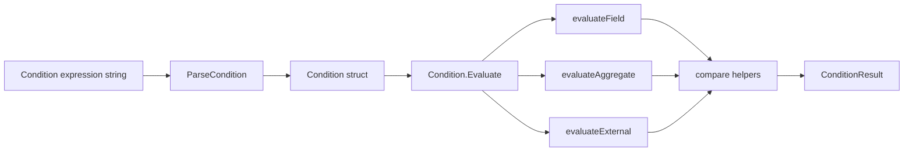

# condition_evaluation_runtime 模块深度解析

`condition_evaluation_runtime` 是 Formula 引擎里的“闸门裁判”。当某个 step 要不要启动、某个 gate 是否放行、某个循环是否继续时，系统不直接执行任意脚本，而是把条件表达式交给这个模块做**受限、可预测、可解释**的判定。你可以把它想成 CI 流水线里的规则引擎：规则表达力够用，但刻意不图灵完备，这样系统才能保证安全、可诊断和一致行为。

## 它解决的核心问题：在“表达力”与“可控性”之间找平衡

在工作流系统里，条件判断几乎是刚需：例如“review 完成后才能 merge”“至少 3 个测试任务完成才能继续”“只有 CI 环境才触发某步”。朴素做法通常有两种，一种是允许用户写任意脚本（最灵活，但有安全和可移植性风险），另一种是硬编码 if/else（安全但扩展性很差）。

这个模块选择第三条路：提供一个**小型 DSL（条件字符串）+ 固定运行时上下文 + 明确结果对象**。这样既能覆盖主流 gating 需求，又不会把执行权交给不受控代码。源码顶部注释已经明确了设计边界：支持 step 状态、step 输出字段、聚合条件、外部 file/env 检查，不允许 arbitrary code execution。

这种设计背后的洞见是：公式系统并不需要“完整编程语言”，它需要的是“可验证、可解释、稳定演进”的判定子系统。

## 心智模型：两阶段“编译 + 执行”的小规则机

理解这个模块最有效的方式，是把它看成一个迷你规则机：

第一阶段是 `ParseCondition(expr)`，把字符串编译成 `Condition` 结构；第二阶段是 `Condition.Evaluate(ctx)`，把结构化条件在 `ConditionContext` 上执行，得到 `ConditionResult`。

类比一下：这像机场安检。`ParseCondition` 是“把旅客分流到对应通道”（字段条件、聚合条件、外部条件），`Evaluate` 是“按通道规则逐项检查”。每次检查都输出“是否通过 + 原因”，而不是只有布尔值。

在脑中建议保留 4 个核心对象：

- `Condition`：已解析的规则本体（类型、操作符、目标字段、期望值等）。
- `ConditionContext`：运行时上下文（steps 当前状态、当前 step、变量）。
- `StepState`：每个 step 的运行时快照（status/output/children）。
- `ConditionResult`：判定结果（`Satisfied` + `Reason`）。

这四者拼起来就是模块的最小闭环。

## 架构与数据流



这个模块在架构上扮演的是 **Transformer + Evaluator**：先把文本条件转换成内部模型，再在运行态上下文中求值。对外暴露两条使用路径：你可以显式两步走（`ParseCondition` + `Evaluate`），也可以直接用 `EvaluateCondition(expr, ctx)` 走便捷路径。

从模块关系看，它属于 Formula Engine 运行期子层，和 schema 层的 [formula_schema_and_composition](formula_schema_and_composition.md) 紧密相关：例如 `GateRule.Condition` 注释明确“格式匹配 condition evaluator syntax”。而条件字符串通常由加载链路 [formula_loading_and_resolution](formula_loading_and_resolution.md) 产出后进入运行期判定。

> 说明：当前提供的依赖图数据未直接给出该模块完整 `depended_by` 列表；因此“谁调用它”的跨模块细节只能依据已提供类型注释和模块树关系来描述，而不臆造具体调用函数名。

## 组件深潜

### `ConditionResult`

`ConditionResult` 很简单，但设计意图非常实用：不仅告诉你条件是否满足（`Satisfied`），还带上人类可读解释（`Reason`）。这使它天然适合 CLI 展示、日志审计和排障。

`Reason` 的生成策略贯穿整个模块，几乎每个分支都尽量给出“比较了什么、结果为何”的字符串。这是一个典型“可观测性优先”取舍：多一些字符串拼装开销，换来高可诊断性。

### `StepState`

`StepState` 是条件求值时的运行态对象，而不是公式定义对象。核心字段：

- `ID`：step 标识。
- `Status`：`pending/in_progress/complete/failed`。
- `Output`：结构化输出。
- `Children`：子 step（聚合条件会用到）。

它把条件系统和实际执行系统解耦：条件模块不关心 issue 如何落库、任务如何执行，只吃“状态快照”。这让模块保持纯函数风格（除了 external 条件访问 OS）。

### `ConditionContext`

`ConditionContext` 是求值环境容器：

- `Steps map[string]*StepState`：按 ID 快速索引。
- `CurrentStep string`：支持 `step.xxx` 这种相对引用。
- `Vars map[string]string`：用于 external `file.exists` 的 `{{var}}` 替换。

这里的隐含契约是：调用方要保证 `Steps` 与 `CurrentStep` 一致且完整；否则很多条件会返回“step not found”或 nil 比较结果。

### `Condition` 与 `ConditionType`

`Condition` 是统一 IR（中间表示）。它用 `Type` 分发三类求值逻辑：

- `ConditionTypeField`
- `ConditionTypeAggregate`
- `ConditionTypeExternal`

结构体里把三类字段放在同一个对象中，这是“单一载体 + 类型标签”的做法，避免了多态层级复杂度。代价是某些字段在特定类型下无意义（例如 field 条件不会用 `AggregateFunc`）。

### `ParseCondition(expr string)`

`ParseCondition` 是整个模块的入口。它按固定优先顺序匹配正则：

1. `file.exists('...')`
2. `env.X ...`
3. `children/descendants/steps(...).all/any/count(...)`
4. `steps.complete >= 3` 这种统计快捷语法
5. 普通字段比较（如 `step.status == 'complete'`）

这体现了“语法优先级通过匹配顺序编码”的设计。实现简单，但也意味着新增语法时要谨慎检查是否和旧模式冲突。

对字段路径解析有一个关键点：

- `step.status` 里的 `step` 解释为 `CurrentStep`。
- `output.xxx` 也默认相对 `CurrentStep`。
- `review.status` 则把 `review` 解释为显式 step 引用。

这让表达式对“当前上下文”友好，减少重复写 step 名。

### `(*Condition).Evaluate(ctx)`

`Evaluate` 是类型分发器，本身不做业务判断，而是根据 `ConditionType` 委托到：

- `evaluateField`
- `evaluateAggregate`
- `evaluateExternal`

这个分层让每类语义独立演化，避免一个超长函数塞满所有分支。

### `evaluateField`

字段条件路径是最热路径。流程是：

1. 解析 step 引用（`step` -> `ctx.CurrentStep`）。
2. 从 `ctx.Steps` 找到目标 `StepState`。
3. 读取字段值：仅支持 `status` 或 `output.*`。
4. 用 `compare(actual, op, expected)` 做比较。

如果 step 不存在，不报 error，而是返回 `Satisfied=false` + reason。这个选择偏向“运行继续 + 可解释失败”，而不是把整个流程炸掉。

### `evaluateAggregate`

聚合条件分两步：先选集合，再做聚合函数。

集合来源：

- `children(step)`：直接子节点。
- `descendants(step)`：递归后代（`collectDescendants`）。
- `steps`：上下文所有 steps。

聚合函数：

- `all`：全满足；**空集合返回 false**（故意避免“子任务未创建就误放行”）。
- `any`：任一满足。
- `count`：计数后用 `compareInt` 比较。

`all` 对空集返回 false 是很有意图的语义设计，不是数学上的 vacuous truth。它服务的是工作流安全性而不是逻辑学纯粹性。

### `evaluateExternal`

目前只支持两类外部检查：

- `file.exists(path)`：可做 `{{var}}` 替换后 `os.Stat`。
- `env.NAME ...`：读取环境变量后比较。

这类条件是模块里少数有副作用依赖（OS 文件系统/环境变量）的路径，也因此在测试和可重复性上要更谨慎。

### 辅助函数簇

`unquote`、`getNestedValue`、`compare`、`compareInt`、`compareFloat`、`compareString`、`matchStep`、`collectDescendants` 这些函数共同承担了“值提取 + 类型比较 + 递归遍历”的底层机制。

其中 `compare` 的策略是“尽量比较”：先处理 nil/bool，再尝试数字，失败后退回字符串比较。这提高了 DSL 容错性，但也引入了一些隐式行为（见后文 gotchas）。

### `EvaluateCondition(expr, ctx)`

这是便捷封装：内部就是 `ParseCondition` + `Evaluate`。适合调用方只关心一次性判定，不需要缓存解析结果的场景。

## 依赖与契约分析

这个模块对外部依赖极轻，只使用标准库：`fmt`、`os`、`regexp`、`strconv`、`strings`。这符合它作为运行时小内核的定位：少依赖、低耦合、易测试。

对上游（调用方）它依赖的契约主要是数据形状，而不是接口实现：

- `ConditionContext.Steps` 必须包含被引用 step。
- `StepState.Output` 需要是层级 `map[string]interface{}` 才能被 `getNestedValue` 深取值。
- 表达式字符串要符合 `ParseCondition` 支持语法。

对下游（被它调用）主要是 OS 能力：文件系统状态和环境变量。这意味着同一条件在不同机器/CI 环境可能结果不同，属于“显式环境耦合”。

与 Formula schema 层的连接点可从类型注释确认：`GateRule.Condition` 的格式合同直接绑定本模块语法；因此如果你修改本模块语法兼容性，就会影响 gate 条件写法与已有公式可运行性。

## 关键设计取舍与为什么这样做

第一个取舍是“正则驱动解析”而不是完整 parser/AST。当前 DSL 很小，正则实现成本低、可读性高、维护快，适合早期稳定语法集。代价是语法扩展到更复杂优先级/嵌套时会变脆，尤其在 pattern 顺序和歧义处理上。

第二个取舍是“受限能力”而非可编程能力。没有函数调用、没有用户脚本执行，直接降低了安全风险和不可预测行为，这对跨环境运行（本地/CI/代理）非常重要。

第三个取舍是“返回可解释失败”多于“直接 error”。例如 step 不存在时多数路径返回 `Satisfied=false`。这让运行层更稳健，也利于展示为什么 gate 没开。但同时，配置错误可能被“业务失败”掩盖，而不是立刻抛异常。

第四个取舍是“动态比较 + 字符串兼容”。`compare` 自动做 bool/float/string 兼容，用户写条件更省心；但这种隐式转换在边界输入下可能出现意外匹配，需要调用方理解其规则。

## 使用方式与示例

```go
ctx := &formula.ConditionContext{
    Steps: map[string]*formula.StepState{
        "review": {
            ID:     "review",
            Status: "complete",
            Output: map[string]interface{}{
                "approved": true,
            },
        },
    },
    CurrentStep: "review",
    Vars: map[string]string{
        "repo_root": "/workspace/project",
    },
}

res, err := formula.EvaluateCondition("step.status == 'complete'", ctx)
if err != nil {
    panic(err)
}
fmt.Println(res.Satisfied, res.Reason)
```

聚合条件示例：

```go
res, err := formula.EvaluateCondition(
    "children(step).all(status == 'complete')",
    ctx,
)
```

外部条件示例：

```go
res, err := formula.EvaluateCondition(
    "file.exists('{{repo_root}}/go.mod')",
    ctx,
)
```

如果你要高频反复判断同一表达式，建议手动先 `ParseCondition` 缓存 `*Condition`，再多次 `Evaluate(ctx)`，避免每次重复正则解析。

## 新贡献者最该注意的边界与坑

第一，`StepState.Output` 注释写的是“Keys are dot-separated paths”，但实现 `getNestedValue` 期待的是嵌套 map（例如 `{"a": {"b": 1}}`），不是扁平键 `"a.b"`。如果上游给的是扁平 map，`output.a.b` 会读不到值并变成 nil 比较。

第二，`count` 语义当前实现有明显约束/异常行为：

- `steps.complete >= 3` 这种快捷统计是专门支持的。
- 对 `children(x).count(...) >= N`，解析阶段会把 `Value` 覆盖为 `N`，而计数阶段又用这个 `Value` 去匹配内部条件，导致内部匹配语义非常受限（代码行为如此，修改时要连带考虑解析与执行的数据结构）。

第三，`compare` 对 bool 的处理主要针对 `==`/`!=`；若写 `env.FLAG > true` 这类表达式，行为并不直观，因为 bool 分支不会按大小比较语义处理。

第四，`[=!<>]+` 会接受很多非常规操作符组合，真正非法性可能延迟到 `compare` 才暴露为 `unknown operator`。也就是说“能 parse”不等于“语义有效”。

第五，external 条件依赖运行环境：`file.exists` 和 `env` 在本地与 CI 可能不同。写公式时要把这类条件当成“环境门”，并给出可诊断 reason。

第六，`all` 在空集合上返回 false 是刻意策略。如果你从逻辑学直觉出发以为会是 true，会在动态子任务场景踩坑。

## 参考阅读

若你希望把本模块放进完整 Formula 生命周期里看，建议按这个顺序继续读：

1. [formula_schema_and_composition](formula_schema_and_composition.md)：条件字符串出现在哪些 schema 字段、有哪些静态约束。
2. [formula_loading_and_resolution](formula_loading_and_resolution.md)：条件表达式如何从文件加载、继承解析并进入运行期。

这样你会更清楚：`condition_evaluation_runtime` 不是孤立工具函数集合，而是 Formula 运行时“可控决策层”的核心。