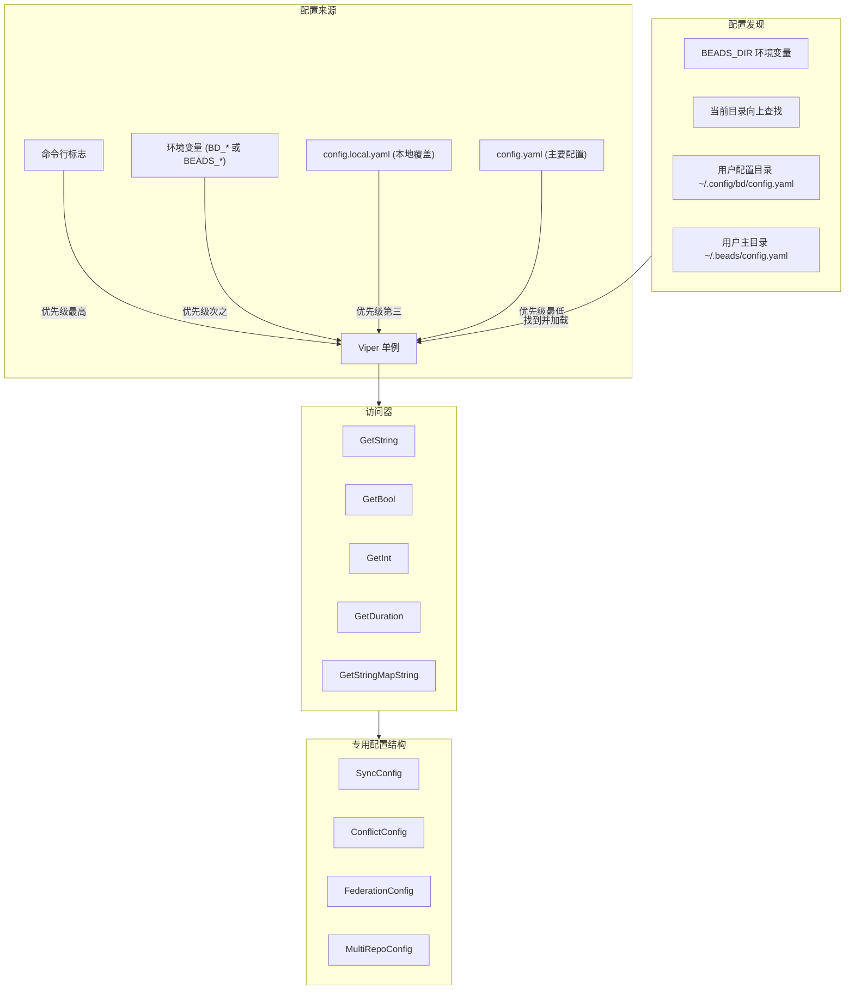

# Configuration Engine 模块技术深度解析

## 1. 问题空间与解决方案

### 1.1 问题是什么

在构建一个复杂的项目管理工具时，配置管理是一个核心挑战。团队需要：

- **灵活的配置来源**：从配置文件、环境变量、命令行标志等多个来源读取配置
- **配置优先级**：确保命令行标志优先于环境变量，而环境变量又优先于配置文件
- **项目本地化**：在多仓库和单仓库工作流中找到并加载正确的配置
- **安全的本地覆盖**：允许开发者在本地覆盖配置而不提交到版本控制
- **跨项目依赖解析**：在大型组织中管理跨仓库的依赖关系
- **配置验证**：确保配置符合预期的格式和约束

一个简单的配置加载器（比如直接读取单个 config.yaml 文件）无法满足这些需求。它会缺乏灵活性，难以处理复杂的优先级逻辑，并且在多仓库环境中会出现问题。

### 1.2 设计洞察

configuration_engine 模块的核心洞察是：**配置是一个多层次的、可覆盖的系统，而不是单个静态文件**。通过使用 Viper 库作为基础，并在其之上构建项目感知的配置发现机制，该模块解决了上述所有问题。

## 2. 架构与核心概念

### 2.1 核心架构图



### 2.2 核心概念

#### 2.2.1 配置源优先级

configuration_engine 实现了严格的配置优先级机制：

1. **命令行标志**（最高优先级）
2. **环境变量**（以 `BD_` 或 `BEADS_` 为前缀）
3. **本地配置覆盖**（`config.local.yaml`）
4. **主要配置文件**（`config.yaml`）
5. **内置默认值**（最低优先级）

这确保了用户可以灵活地覆盖配置，同时保持合理的默认行为。

#### 2.2.2 配置发现机制

该模块实现了智能的配置文件查找机制，优先级如下：

1. **BEADS_DIR 环境变量**：如果设置了此环境变量，首先在该目录下查找 `config.yaml`
2. **当前工作目录向上查找**：从当前工作目录开始，向上遍历父目录，查找 `.beads/config.yaml`
3. **用户配置目录**：在 `~/.config/bd/config.yaml` 查找
4. **用户主目录**：在 `~/.beads/config.yaml` 查找

这种设计使得：
- 项目级配置可以存放在仓库的 `.beads` 目录中
- 用户级配置可以存放在主目录中
- 环境变量可以用于临时覆盖

#### 2.2.3 本地配置覆盖

为了支持开发者在本地修改配置而不污染版本控制，该模块支持 `config.local.yaml` 文件。这个文件会在加载 `config.yaml` 后合并进来，允许开发者在本地覆盖特定配置项。

## 3. 核心组件详解

### 3.1 SyncConfig

**目的**：管理同步模式和触发条件

```go
type SyncConfig struct {
    Mode     SyncMode // 同步模式，目前只支持 "dolt-native"
    ExportOn string   // 何时导出："push" 或 "change"
    ImportOn string   // 何时导入："pull" 或 "change"
}
```

**设计意图**：这个结构体将同步相关的配置集中管理，使得调用者可以一次性获取所有同步相关的设置，而不必分别查询多个配置键。

**使用方式**：
```go
syncConfig := config.GetSyncConfig()
if syncConfig.Mode == config.SyncModeDoltNative {
    // 使用 Dolt 原生同步模式
}
```

### 3.2 ConflictConfig

**目的**：管理冲突解决策略

```go
type ConflictConfig struct {
    Strategy ConflictStrategy         // 全局默认策略
    Fields   map[string]FieldStrategy // 特定字段的策略覆盖
}
```

**设计意图**：冲突解决策略是配置的一个重要方面，因为在同步过程中经常会遇到冲突。这个结构体不仅允许设置全局默认策略，还支持为特定字段配置不同的策略，提供了极大的灵活性。

**支持的策略**：
- `newest`：使用最新的更改
- `ours`：使用本地更改
- `theirs`：使用远程更改
- `manual`：需要手动解决
- 字段特定策略如 `union`（用于集合字段）、`max`（用于数值字段）等

### 3.3 FederationConfig

**目的**：管理联邦（Dolt 远程）配置

```go
type FederationConfig struct {
    Remote      string      // 远程仓库地址
    Sovereignty Sovereignty // 主权级别（T1-T4）
}
```

**设计意图**：联邦功能允许将本地 Dolt 仓库与远程仓库同步。这个结构体集中管理了联邦相关的配置，包括远程仓库地址和数据主权级别。

### 3.4 MultiRepoConfig

**目的**：管理多仓库支持配置

```go
type MultiRepoConfig struct {
    Primary    string   // 主仓库路径（规范问题所在）
    Additional []string // 其他要从中获取数据的仓库
}
```

**设计意图**：在大型组织中，问题可能分布在多个仓库中。这个结构体允许配置一个主仓库（包含规范问题）和多个附加仓库，从而支持跨仓库的问题管理。

### 3.5 ConfigOverride

**目的**：表示检测到的配置覆盖

```go
type ConfigOverride struct {
    Key            string
    EffectiveValue interface{}
    OverriddenBy   ConfigSource
    OriginalSource ConfigSource
    OriginalValue  interface{}
}
```

**设计意图**：当用户通过命令行标志或环境变量覆盖配置文件中的值时，这可能会导致混淆。这个结构体用于记录和报告这些覆盖，帮助用户理解当前生效的配置值来自哪里。

## 4. 数据流程

### 4.1 初始化流程

configuration_engine 模块的初始化是在应用启动时通过 `Initialize()` 函数完成的：

1. **创建 Viper 实例**：创建一个新的 Viper 单例
2. **设置配置类型**：明确设置为 YAML 格式
3. **查找配置文件**：按照优先级顺序查找 config.yaml 文件
4. **加载环境变量绑定**：设置环境变量前缀和替换规则
5. **设置默认值**：为所有配置项设置合理的默认值
6. **读取配置文件**：如果找到配置文件，则读取它
7. **合并本地覆盖**：如果存在 config.local.yaml，则合并进来

### 4.2 配置访问流程

当代码需要访问配置值时：

1. **调用类型安全的访问器**：如 `GetString()`, `GetBool()` 等
2. **Viper 处理优先级**：Viper 内部会根据配置源优先级返回正确的值
3. **返回类型化的值**：访问器函数会将值转换为正确的类型

对于专用配置结构（如 SyncConfig）：

1. **调用专用获取函数**：如 `GetSyncConfig()`
2. **内部使用基础访问器**：该函数内部会调用多个基础访问器来构建结构体
3. **返回完整的配置结构**：返回填充好的结构体给调用者

## 5. 关键设计决策与权衡

### 5.1 使用 Viper 作为基础 vs 自建配置系统

**决策**：使用 Viper 库作为配置系统的基础

**理由**：
- Viper 已经处理了大多数配置需求（多种来源、优先级、环境变量绑定等）
- 减少了需要维护的代码量
- Viper 是一个成熟、广泛使用的库

**权衡**：
- 对 Viper 的依赖增加了项目的外部依赖
- 在某些特定需求上（如配置文件发现）需要在 Viper 之上构建额外逻辑

### 5.2 单例模式 vs 依赖注入

**决策**：使用单例模式管理 Viper 实例

**理由**：
- 配置是全局的，通常在整个应用程序中共享
- 简化了 API，调用者不必传递配置对象
- 符合常见的配置库使用模式

**权衡**：
- 使测试稍微复杂一些（需要 `ResetForTesting()` 函数）
- 减少了配置的可替代性（在需要多个配置的场景下不够灵活）

### 5.3 显式配置文件定位 vs 让 Viper 自动查找

**决策**：实现显式的配置文件查找逻辑，而不是使用 Viper 的自动查找功能

**理由**：
- 需要支持特定的查找顺序（BEADS_DIR、向上查找、用户目录等）
- 需要在测试中灵活控制配置加载行为
- 避免意外加载错误的配置文件

**权衡**：
- 增加了代码复杂度
- 需要自行处理文件查找逻辑

### 5.4 本地覆盖文件 (config.local.yaml) vs 其他机制

**决策**：支持 config.local.yaml 作为本地覆盖机制

**理由**：
- 允许开发者在本地修改配置而不提交到版本控制
- 简单明了，易于理解和使用
- 与 config.yaml 并列存放，易于发现

**权衡**：
- 需要确保 config.local.yaml 在 .gitignore 中
- 可能导致开发者本地配置与生产配置不一致的问题

## 6. 常见用法与模式

### 6.1 基本配置访问

```go
// 初始化配置（应用启动时）
if err := config.Initialize(); err != nil {
    log.Fatalf("Failed to initialize config: %v", err)
}

// 读取字符串配置
dbPath := config.GetString("db")

// 读取布尔配置
jsonOutput := config.GetBool("json")

// 读取整数配置
maxDepth := config.GetInt("hierarchy.max-depth")

// 读取持续时间配置
backupInterval := config.GetDuration("backup.interval")

// 读取字符串映射
dirLabels := config.GetStringMapString("directory.labels")
```

### 6.2 使用专用配置结构

```go
// 获取同步配置
syncConfig := config.GetSyncConfig()
fmt.Printf("Sync mode: %s\n", syncConfig.Mode)
fmt.Printf("Export on: %s\n", syncConfig.ExportOn)
fmt.Printf("Import on: %s\n", syncConfig.ImportOn)

// 获取冲突解决配置
conflictConfig := config.GetConflictConfig()
fmt.Printf("Default conflict strategy: %s\n", conflictConfig.Strategy)
for field, strategy := range conflictConfig.Fields {
    fmt.Printf("Field %s uses strategy: %s\n", field, strategy)
}

// 获取联邦配置
federationConfig := config.GetFederationConfig()
if federationConfig.Remote != "" {
    fmt.Printf("Federation remote: %s\n", federationConfig.Remote)
}
```

### 6.3 保存配置值

```go
// 设置并保存一个配置值
err := config.SaveConfigValue("sync.mode", "dolt-native", beadsDir)
if err != nil {
    log.Fatalf("Failed to save config: %v", err)
}
```

### 6.4 检测配置覆盖

```go
// 检查配置覆盖
flagOverrides := map[string]struct{
    Value interface{}
    WasSet bool
}{
    "json": {Value: true, WasSet: true},
}

overrides := config.CheckOverrides(flagOverrides)
for _, override := range overrides {
    config.LogOverride(override)
}
```

### 6.5 解析外部项目路径

```go
// 解析外部项目路径
projectPath := config.ResolveExternalProjectPath("beads")
if projectPath != "" {
    fmt.Printf("Beads project path: %s\n", projectPath)
}
```

## 7. 注意事项与陷阱

### 7.1 初始化要求

**注意**：必须在使用任何配置访问函数之前调用 `Initialize()`。

如果在未初始化的情况下调用配置访问函数，它们会返回零值（空字符串、false、0 等），而不会报错。这可能导致难以调试的问题。

### 7.2 线程安全性

**注意**：该模块不是完全线程安全的。

特别是 `ResetForTesting()` 函数会清除全局状态，不应该在多线程环境中使用。在测试中，确保只在单个线程中调用此函数。

### 7.3 配置键命名约定

**注意**：配置键使用点号分隔的命名空间约定（如 "sync.mode"），而对应的环境变量使用下划线分隔（如 "BD_SYNC_MODE"）。

这是由 Viper 自动处理的，但在手动设置环境变量时需要记住这一点。

### 7.4 本地覆盖文件

**注意**：确保 `config.local.yaml` 在 `.gitignore` 中，以避免提交本地特定的配置。

否则，开发者可能会意外提交包含本地路径、密钥或其他敏感信息的配置。

### 7.5 相对路径解析

**注意**：当使用 `ResolveExternalProjectPath()` 解析相对路径时，它会相对于仓库根目录（配置文件所在目录的父目录）解析，而不是相对于当前工作目录。

这确保了无论从哪个子目录运行命令，路径解析都是一致的，但在某些情况下可能会导致意外行为。

## 8. 扩展与集成点

### 8.1 添加新的配置项

要添加新的配置项，需要：

1. 在 `Initialize()` 函数中设置默认值
2. （可选）添加类型安全的访问器函数
3. （可选）如果是一组相关配置，考虑添加专用的配置结构和获取函数

### 8.2 与其他模块集成

configuration_engine 模块被设计为其他模块的基础依赖。其他模块应该：

1. 在初始化阶段依赖 `Initialize()` 被调用
2. 使用提供的访问器函数读取配置
3. （如果需要）使用 `SaveConfigValue()` 保存配置

## 9. 总结

configuration_engine 模块是整个项目的基础组件之一，它提供了灵活、强大且易用的配置管理系统。通过使用 Viper 作为基础，并在其之上构建项目感知的配置发现和管理机制，它解决了复杂项目中的配置管理挑战。

该模块的关键优势包括：
- 灵活的配置来源和优先级机制
- 智能的配置文件发现
- 本地配置覆盖支持
- 类型安全的访问器
- 专用配置结构
- 跨项目依赖解析支持

对于新加入团队的开发者，理解这个模块的设计和使用方式是至关重要的，因为它几乎被所有其他模块所依赖。
