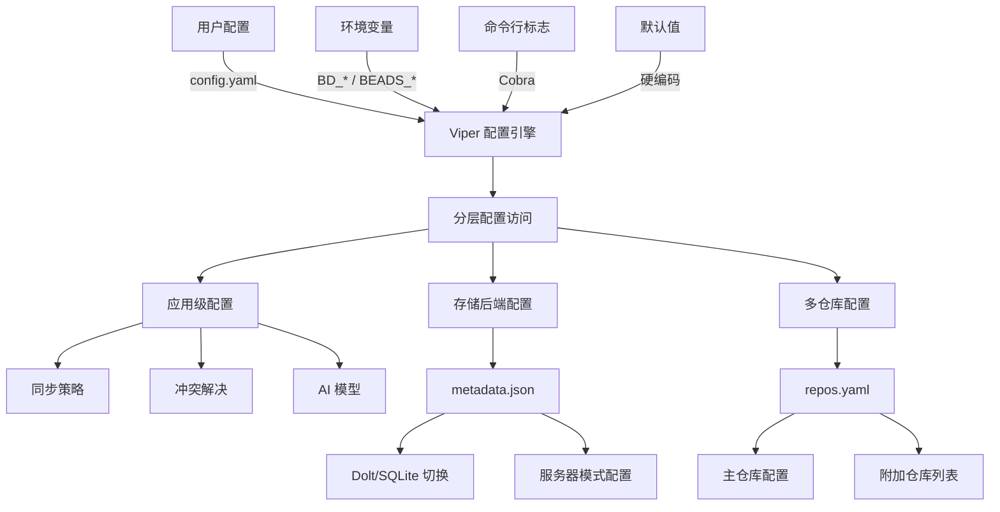

# Configuration 模块

Configuration 模块是整个 Beads 系统的中央配置枢纽，负责管理从用户偏好到存储后端的所有配置项。它不是一个简单的配置读取器，而是一个精心设计的配置分层系统，解决了多环境、多优先级、动态更新等复杂配置场景。

## 核心问题

在开发 Configuration 模块之前，团队面临以下痛点：
- **配置分散**：不同模块有各自的配置读取逻辑，难以统一管理
- **优先级混乱**：环境变量、命令行标志、配置文件之间的优先级不明确
- **多仓库支持缺失**：无法优雅地处理跨仓库的配置共享
- **后端切换困难**：在 Dolt 和 SQLite 之间切换需要修改代码
- **测试配置污染**：测试时容易读取到生产配置文件

Configuration 模块的存在就是为了一次性解决这些问题。

## 架构概览



### 配置分层机制

Configuration 模块采用四层配置架构，优先级从高到低：

1. **命令行标志**：最高优先级，用于临时覆盖
2. **环境变量**：`BD_*` 前缀，适合 CI/CD 环境
3. **配置文件**：`config.yaml` + `config.local.yaml`，持久化配置
4. **默认值**：硬编码的安全默认值

这种设计确保了灵活性的同时保持了可预测性。例如，你可以在 `config.yaml` 中设置默认同步模式，但在 CI 环境中通过 `BD_SYNC_MODE=change` 临时覆盖。

## 核心设计决策

### 1. 双配置文件策略

**选择**：同时使用 `config.yaml`（跟踪）和 `config.local.yaml`（本地覆盖）

**原因**：
- `config.yaml` 可以提交到仓库，共享团队配置
- `config.local.yaml` 加入 `.gitignore`，存放机器特定配置
- 避免了"在提交前临时修改配置"的错误模式

**替代方案考虑**：
- 单一配置文件：会导致团队成员频繁冲突
- 完全基于环境变量：配置不可见，难以调试

### 2. Viper + 直接 YAML 读写

**选择**：Viper 用于运行时配置，直接 YAML 操作用于持久化

**原因**：
- Viper 处理复杂的优先级合并
- 直接 YAML 操作确保只修改目标键，不丢失注释和格式
- 避免将默认值和环境变量写入配置文件

**实现细节**：在 `SaveConfigValue` 中，先读取现有 YAML，只修改目标键，然后写回，而不是直接 dump Viper 的全部状态。

### 3. 配置 vs 元数据分离

**选择**：将用户偏好（config.yaml）与存储元数据（metadata.json）分离

**原因**：
- **生命周期不同**：配置是用户偏好，可以随时更改；元数据是存储状态，与数据共存亡
- **备份策略不同**：配置需要版本控制，元数据需要与数据库一起备份
- **迁移路径清晰**：更换后端时，配置不变，只需更新元数据

### 4. 后端能力抽象

**选择**：通过 `BackendCapabilities` 而不是直接检查后端类型

**原因**：
- 避免代码中散落的 `if backend == "dolt"` 检查
- 能力可以组合（例如 Dolt 服务器模式支持多进程，但嵌入式不支持）
- 易于添加新后端而不修改调用代码

## 子模块详解

### 配置引擎（config.go）

这是模块的核心，负责配置的初始化、读取和写入。关键组件包括：

- **Initialize()**：设置配置查找路径，建立优先级链
- **Get*() 族函数**：类型安全的配置读取
- **SaveConfigValue()**：安全的配置持久化
- **ConfigOverride**：检测和报告配置覆盖

### 仓库配置（repos.go）

处理多仓库场景的配置管理：

- **ReposConfig**：主仓库和附加仓库的结构化表示
- **SetReposInYAML()**：使用 yaml.Node 保留注释和格式
- **AddRepo/RemoveRepo**：高阶仓库管理操作

### 元数据配置（configfile.go）

存储后端的元数据管理：

- **Config**：数据库路径、后端类型、服务器配置
- **BackendCapabilities**：后端能力抽象
- **DatabasePath()**：智能路径解析，支持自定义数据目录

## 数据流向

### 配置读取流程

```
用户调用 GetString("sync.mode")
    ↓
检查 Viper 初始化状态
    ↓
Viper 按优先级查找：
  1. 命令行标志（如果已绑定）
  2. 环境变量 BD_SYNC_MODE
  3. config.yaml 中的 sync.mode
  4. 默认值 "dolt-native"
    ↓
返回类型安全的值
```

### 配置写入流程

```
用户调用 SaveConfigValue("sync.mode", "change")
    ↓
读取现有 config.yaml 到 map
    ↓
使用 setNestedKey() 修改目标键
    ↓
序列化回 YAML（保留其他键和格式）
    ↓
写入文件
    ↓
重新加载 Viper 配置（立即可用）
```

## 使用指南

### 基本读取

```go
// 简单配置读取
syncMode := config.GetString("sync.mode")
autoCommit := config.GetBool("dolt.auto-commit")

// 结构化配置访问
syncConfig := config.GetSyncConfig()
conflictConfig := config.GetConflictConfig()
```

### 持久化修改

```go
// 修改单个配置项
err := config.SaveConfigValue("ai.model", "claude-3-5-sonnet-20241022", beadsDir)

// 管理仓库
err := config.AddRepo(configPath, "../other-repo")
err := config.RemoveRepo(configPath, "../other-repo")
```

### 后端配置

```go
// 加载元数据配置
cfg, err := configfile.Load(beadsDir)

// 检查后端能力
caps := cfg.GetCapabilities()
if caps.SingleProcessOnly {
    // 避免多进程访问
}

// 获取数据库路径
dbPath := cfg.DatabasePath(beadsDir)
```

## 注意事项和陷阱

### 1. 配置路径查找顺序

**陷阱**：`BEADS_DIR` 环境变量会覆盖所有其他路径查找

**原因**：这是设计特性，但容易被忽略。如果设置了 `BEADS_DIR`，即使当前目录有 `.beads/config.yaml` 也不会被读取。

**建议**：在调试配置问题时，首先检查 `BEADS_DIR` 是否设置。

### 2. 测试配置隔离

**陷阱**：测试可能读取到仓库根目录的配置

**解决方案**：设置 `BEADS_TEST_IGNORE_REPO_CONFIG=1` 环境变量，或者使用 `ResetForTesting()` 在测试间重置配置。

### 3. metadata.json vs config.yaml

**陷阱**：混淆这两个文件的用途

**清晰区分**：
- `config.yaml`：用户偏好（同步模式、AI 模型、冲突策略）
- `metadata.json`：存储状态（数据库路径、后端类型、服务器配置）

### 4. 相对路径解析

**陷阱**：外部项目路径的解析基点

**关键细节**：`ResolveExternalProjectPath()` 从配置文件所在目录的父目录（即仓库根）解析相对路径，而不是从当前工作目录。这确保了配置的可移植性。

### 5. Viper 状态全局共享

**陷阱**：并发测试中的配置污染

**建议**：
- 单线程测试：使用 `ResetForTesting()`
- 并行测试：避免修改全局配置，使用依赖注入

## 与其他模块的关系

- **Storage Interfaces**：通过 `configfile` 获取后端配置和能力
- **Dolt Storage Backend**：使用 `SyncConfig` 和 `ConflictConfig`
- **Tracker Integration Framework**：读取同步相关配置
- **CLI Command Context**：初始化配置并处理标志覆盖

## 扩展点

Configuration 模块设计为相对稳定的核心组件，但仍有几个明确的扩展点：

1. **新的后端类型**：在 `configfile.go` 中添加新的 `Backend*` 常量和对应的 `CapabilitiesForBackend` 逻辑
2. **配置验证**：可以添加验证钩子，在保存配置前验证值的合法性
3. **配置观察者**：可以实现配置变更通知机制，允许模块订阅配置变更

## 总结

Configuration 模块看似是一个"简单的配置读取器"，实则是一个精心设计的配置管理系统。它通过分层优先级、双文件策略、配置/元数据分离等设计，解决了复杂场景下的配置管理问题。

理解这个模块的关键是认识到：**配置不是静态数据，而是动态的决策系统**。每个配置项都代表一个用户决策，Configuration 模块的职责就是确保这些决策被正确、一致地应用到整个系统中。
