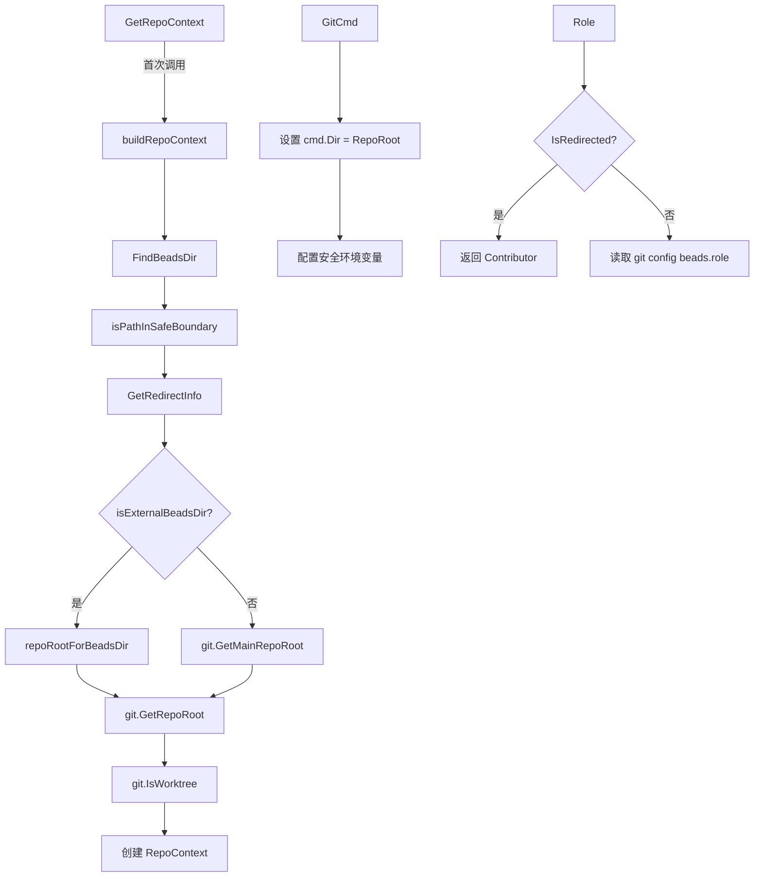

# Context 模块技术深度解析

## 1. 问题空间：为什么需要 RepoContext？

在深入代码之前，让我们先理解这个模块要解决的核心问题。想象一下：你有一个工具，它需要在不同的目录环境下运行 git 命令，但是代码库中有 50+ 个 git 命令都假设当前工作目录（CWD）是仓库根目录。当用户设置 `BEADS_DIR` 指向另一个仓库，或者从 git worktree 中运行命令时，这些命令就会在错误的目录中执行，导致各种难以调试的问题。

这就是 `RepoContext` 诞生的背景。它提供了一个单一的真相来源，用于解析仓库路径，并确保 git 命令在正确的仓库中运行，无论用户当前在哪个目录下工作。

## 2. 核心抽象与心智模型

### 2.1 RepoContext 结构体

把 `RepoContext` 想象成一个"仓库导航仪"，它知道三个关键位置：

- **BeadsDir**: 实际的 `.beads` 目录路径（在遵循重定向之后）
- **RepoRoot**: 包含 `BeadsDir` 的仓库根目录（beads 相关的 git 操作应该在这里运行）
- **CWDRepoRoot**: 包含当前工作目录的仓库根目录（可能与 `RepoRoot` 不同）

另外，它还跟踪两个重要的状态标志：

- **IsRedirected**: 如果 `BeadsDir` 解析到与 CWD 不同的仓库，则为 true
- **IsWorktree**: 如果 CWD 在 git worktree 中，则为 true

### 2.2 用户角色抽象

`RepoContext` 还引入了用户角色的概念，用于区分：
- **Contributor**: 用户正在向一个 fork 贡献代码（不是维护者）
- **Maintainer**: 用户拥有/维护这个仓库

## 3. 架构与数据流

让我们通过一个 Mermaid 图表来理解 RepoContext 的构建和使用流程：



### 3.1 关键路径分析

1. **RepoContext 构建流程**：
   - 调用 `GetRepoContext()` 时，它使用 `sync.Once` 确保只构建一次上下文
   - 首先查找 `.beads` 目录（尊重 `BEADS_DIR` 环境变量）
   - 验证路径安全性（防止路径遍历攻击）
   - 检查重定向文件
   - 确定 `RepoRoot`（可能与 CWD 不同）
   - 获取 CWD 的仓库根目录
   - 检查 worktree 状态

2. **Git 命令执行流程**：
   - `GitCmd()` 方法创建一个配置好的 `exec.Cmd`
   - 设置 `cmd.Dir` 为 `RepoRoot`
   - 配置安全相关的环境变量（禁用 git hooks 和模板）
   - 明确设置 `GIT_DIR` 和 `GIT_WORK_TREE` 以确保 git 操作在正确的仓库上

## 4. 核心组件深度解析

### 4.1 RepoContext 结构体

```go
type RepoContext struct {
    BeadsDir     string
    RepoRoot     string
    CWDRepoRoot  string
    IsRedirected bool
    IsWorktree   bool
}
```

**设计意图**：
- 分离 `RepoRoot` 和 `CWDRepoRoot` 是关键设计，允许工具在用户当前工作目录和 beads 数据所在目录之间进行区分
- `IsRedirected` 和 `IsWorktree` 标志提供了上下文信息，用于调整工具行为

### 4.2 GetRepoContext 函数

```go
func GetRepoContext() (*RepoContext, error) {
    repoCtxOnce.Do(func() {
        repoCtx, repoCtxErr = buildRepoContext()
    })
    return repoCtx, repoCtxErr
}
```

**设计意图**：
- 使用 `sync.Once` 确保只初始化一次，避免重复的文件系统操作
- 缓存结果，因为在命令执行期间 CWD 和 BEADS_DIR 不会改变
- 这种设计既提高了性能，又确保了上下文的一致性

### 4.3 GitCmd 方法

```go
func (rc *RepoContext) GitCmd(ctx context.Context, args ...string) *exec.Cmd {
    cmd := exec.CommandContext(ctx, "git", args...)
    cmd.Dir = rc.RepoRoot
    
    // 安全和正确性配置
    cmd.Env = append(os.Environ(),
        "GIT_HOOKS_PATH=",            // 禁用 hooks
        "GIT_TEMPLATE_DIR=",          // 禁用 templates
        "GIT_DIR="+gitDir,            // 确保使用正确的 .git 目录
        "GIT_WORK_TREE="+rc.RepoRoot, // 确保使用正确的工作树
    )
    return cmd
}
```

**设计意图**：
- 这是一个关键的安全和正确性抽象
- 禁用 git hooks 和模板是为了防止在可能恶意的仓库中执行代码（SEC-001, SEC-002）
- 明确设置 `GIT_DIR` 和 `GIT_WORK_TREE` 解决了从 git worktree 运行时的问题（GH#2538）

### 4.4 路径安全验证

```go
func isPathInSafeBoundary(path string) bool {
    // 检查是否在系统敏感目录中
    // 允许临时目录
    // 允许用户自己的主目录
    // 拒绝其他用户的主目录
}
```

**设计意图**：
- 这是一个重要的安全层，防止路径遍历攻击（SEC-003）
- 它有选择地允许某些目录（如临时目录），同时拒绝系统敏感目录
- 特别处理了 `/var/home` 以支持 Fedora Silverblue 等系统

### 4.5 用户角色管理

```go
func (rc *RepoContext) Role() (UserRole, bool) {
    if rc.IsRedirected {
        return Contributor, true
    }
    // 读取 git config beads.role
}
```

**设计意图**：
- 角色决定了工具的行为方式（例如，fork 贡献者 vs 维护者）
- `BEADS_DIR` 重定向自动暗示 Contributor 角色
- 提供了显式配置（通过 git config）和隐式检测（通过重定向）的结合

## 5. 设计权衡与决策

### 5.1 缓存 vs 灵活性

**决策**：使用 `sync.Once` 缓存 RepoContext，只初始化一次。

**权衡**：
- ✅ 优点：避免重复的文件系统操作，提高性能
- ❌ 缺点：在命令执行期间如果 CWD 或 BEADS_DIR 改变，不会反映出来
- **合理性**：在命令执行期间，这些值通常不会改变，所以缓存是安全的

### 5.2 安全 vs 功能

**决策**：禁用 git hooks 和模板，明确设置 GIT_DIR 和 GIT_WORK_TREE。

**权衡**：
- ✅ 优点：防止恶意仓库执行代码，确保 git 操作在正确的仓库上
- ❌ 缺点：可能会禁用一些用户期望的 git hooks 功能
- **合理性**：安全性优先，工具可以提供自己的 hooks 机制

### 5.3 单一真相来源 vs 灵活性

**决策**：RepoContext 作为单一真相来源，所有 git 命令都通过它执行。

**权衡**：
- ✅ 优点：确保一致性，减少错误
- ❌ 缺点：需要修改所有现有的 git 命令使用这个抽象
- **合理性**：长期收益大于短期成本，减少了难以调试的路径相关错误

## 6. 使用指南与常见模式

### 6.1 基本使用

```go
// 获取 RepoContext
rc, err := beads.GetRepoContext()
if err != nil {
    return err
}

// 创建 git 命令
cmd := rc.GitCmd(ctx, "status")
output, err := cmd.Output()

// 或者使用便捷方法
output, err := rc.GitOutput(ctx, "config", "--get", "beads.role")
```

### 6.2 用户角色检查

```go
// 检查是否为贡献者
if rc.IsContributor() {
    // 贡献者特定逻辑
}

// 检查是否为维护者
if rc.IsMaintainer() {
    // 维护者特定逻辑
}

// 强制要求角色配置
if err := rc.RequireRole(); err != nil {
    // 显示初始化提示
}
```

### 6.3 测试中的使用

```go
// 在测试中重置缓存
t.Cleanup(func() {
    beads.ResetCaches()
    git.ResetCaches()
})
```

## 7. 边缘情况与注意事项

### 7.1 Git Worktree

**问题**：当从 git worktree 运行时，git 可能会继承指向 worktree 的 `.git` 的环境变量，而不是主仓库。

**解决方案**：`GitCmd` 明确设置 `GIT_DIR` 和 `GIT_WORK_TREE`，确保 git 操作在包含 `.beads/` 的仓库上执行。

### 7.2 路径安全

**问题**：`BEADS_DIR` 可能指向系统敏感目录，导致安全问题。

**解决方案**：`isPathInSafeBoundary` 函数验证路径不在系统敏感目录中，并且只允许用户自己的主目录。

### 7.3 重定向循环

**注意**：代码中没有显式处理重定向循环，`FollowRedirect` 函数（在其他地方定义）应该确保不会发生无限循环。

### 7.4 缓存失效

**注意**：在长运行进程（如守护进程）中，缓存的 RepoContext 可能会变得过时。使用 `GetRepoContextForWorkspace` 和 `Validate` 方法来处理这种情况。

## 8. 与其他模块的关系

RepoContext 是一个基础模块，被许多其他模块使用：

- **CLI 命令**：几乎所有的 CLI 命令都使用 RepoContext 来确保在正确的目录中执行 git 命令
- **Storage 模块**：可能使用 RepoContext 来定位 beads 数据目录
- **Tracker 集成**：可能使用 RepoContext 来确定仓库上下文和用户角色

有关更多信息，请参阅相关模块的文档：
- [Beads 模块](beads.md)
- [Beads Repository Context](Beads Repository Context.md)
- [CLI Command Context](CLI Command Context.md)

## 9. 总结

RepoContext 模块是 beads 工具的基础组件，解决了在不同目录环境下正确执行 git 命令的问题。它通过提供单一的真相来源、安全的 git 命令执行和用户角色管理，简化了代码库中的路径处理，并提高了工具的安全性和可靠性。

关键要点：
- RepoContext 确保 git 命令在正确的仓库中运行，无论 CWD 是什么
- 它提供了安全保障，防止恶意仓库执行代码
- 它管理用户角色，影响工具的行为
- 它使用缓存来提高性能，但在测试和长运行进程中需要注意缓存失效
