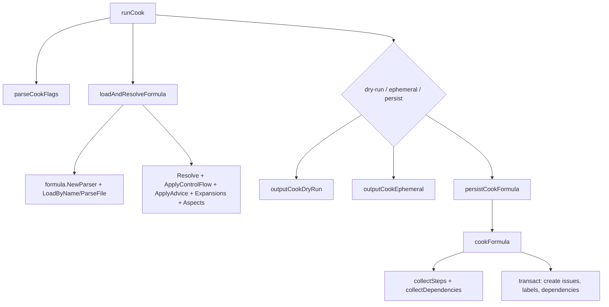

# cook_command_pipeline 模块深度解析

`cook_command_pipeline` 的核心价值，不是“把一个 JSON 读进来再吐出去”，而是把 **公式（formula）这种高层、可组合、可继承、带控制流和变量的声明式模板**，稳定地编译成下游可执行的 issue 子图（proto/subgraph）。你可以把它想成一个“工作流编译器前端 + 图构建后端”：前端负责把抽象语法（继承、expand、advice、aspects、condition）展平，后端负责把展平后的步骤变成 `types.Issue` 与 `types.Dependency`。如果没有这个模块，调用方（`bd cook`、`bd mol pour`、`bd mol wisp`）就不得不各自实现一套解析、变量处理、依赖映射和事务写入逻辑，最终会出现行为漂移、数据结构不一致、以及难以维护的重复代码。

---

## 1) 这个模块解决的到底是什么问题？

在 Beads 体系里，formula 不是简单的“任务清单”。它支持继承（`parser.Resolve`）、控制流（`formula.ApplyControlFlow`）、advice/aspect 注入（`formula.ApplyAdvice` + `compose.aspects`）、扩展与内联展开（`formula.ApplyInlineExpansions` / `formula.ApplyExpansions`），甚至还包含运行时条件过滤（`formula.FilterStepsByCondition`）与扩展模板物化（`formula.MaterializeExpansion`）。

这意味着一个朴素实现（“读文件 -> 遍历 steps -> 创建 issue”）会立刻失败：

- 你拿到的 `steps` 可能还没继承合并；
- `depends_on`/`needs` 的 ID 还没映射成最终 issue ID；
- `waits_for` 需要转成 `types.DepWaitsFor` 且塞入 `types.WaitsForMeta` JSON；
- 有 `Gate` 的 step 需要额外生成一个 gate issue，并插入阻塞依赖；
- compile-time 和 runtime 的变量语义不同，不能混用；
- 同一个 cooking 结果要支持两条路径：
  - **ephemeral**：直接 JSON 输出或传给 pour/wisp 的内存子图；
  - **persist**：原子事务落库（issue、label、dependency 一致提交）。

所以该模块的设计本质是：**把公式语义归一化，再把结果投影成统一 issue graph**，并且让“CLI 展示、内存实例化、数据库持久化”共享同一套图构建逻辑，避免分叉。

---

## 2) 心智模型：把它当成“两阶段编译器 + 双后端”

最容易记住的模型是：

- 第一阶段（语义归一化）：`loadAndResolveFormula` / `resolveAndCookFormulaWithVars`。
- 第二阶段（图生成）：`collectSteps` + `collectDependencies` + `cookFormulaToSubgraph` / `cookFormula`。

像编译器一样，前半段做“语义展开”，后半段做“目标表示生成”。而目标表示有两种后端：

1. **内存后端**：返回 `TemplateSubgraph`，供 `bd mol pour`、`bd mol wisp` 直接实例化；
2. **持久化后端**：`cookFormula` 通过事务创建数据库实体（legacy persist 模式）。

这套模型最关键的设计点是 `collectSteps`：它通过 `labelHandler` 回调和 `issueMap` 可选参数，把“同一份 step->issue 转换逻辑”复用于内存与数据库两条路径。你可以把它看成一个小型“代码生成中间层”。

---

## 3) 架构与数据流



### 3.1 CLI 主路径（`bd cook`）

`runCook` 是入口 orchestrator。它先调用 `parseCookFlags` 做参数标准化，然后调用 `loadAndResolveFormula` 完成公式语义变换，再按模式分发到 dry-run、ephemeral、persist。这个函数本身几乎不做业务细节，职责是“流程调度 + 模式切换”，这让行为切换点非常清晰。

### 3.2 公式归一化路径

`loadAndResolveFormula` 先 `LoadByName`，失败后回退 `ParseFile`。这个双路径支持两种用户输入习惯：配方名（registry）和文件路径。随后固定执行一条变换链：

1. `parser.Resolve`（继承解析）
2. `formula.ApplyControlFlow`（循环/分支/gate 控制流展开）
3. `formula.ApplyAdvice`（advice 注入）
4. `formula.ApplyInlineExpansions`
5. `formula.ApplyExpansions`
6. `compose.aspects` -> 加载 aspect 并再次 `ApplyAdvice`

顺序是有设计意图的：先把结构展开，再做注入与扩展，最终得到“可落地 steps”。

### 3.3 图构建路径（共享核心）

`collectSteps` 和 `collectDependencies` 是热点函数。

- `collectSteps` 负责：
  - `formula.Step -> types.Issue`（通过 `processStepToIssue`）
  - 维护 `idMapping`（step.ID -> issue.ID）
  - 插入 parent-child 依赖
  - 处理 gate step（`createGateIssue` + `DepBlocks`）
  - 递归 children
- `collectDependencies` 负责把 `depends_on` / `needs` / `waits_for` 映射为 dependency records，其中 `waits_for` 会写 `types.WaitsForMeta` 到 `Metadata`。

注意这里是两遍：先收集 issue（并建立 mapping），再解析横向依赖。这是典型的“先建符号表再连边”策略，避免前向引用问题。

### 3.4 持久化路径

`persistCookFormula` 先检查冲突（已有 proto），`--force` 时调用 `deleteProtoSubgraph` 清理旧图，再进入 `cookFormula`。`cookFormula` 在单个 `transact(...)` 内依次执行 `CreateIssues`、`AddLabel`、`AddDependency`，用事务保证图一致性，避免“issue 已创建但依赖没写完”的半成功状态。

### 3.5 被谁调用（跨命令复用）

除了 `runCook`，`resolveAndCookFormulaWithVars` 还被 `runPour` 与 `runWispCreate` 直接调用，用于“inline cooking”（无需先 persist proto）。这解释了为什么模块里同时存在 CLI 输出函数和可复用的子图构建函数：它既服务命令，也服务命令之间的共享领域逻辑。

---

## 4) 关键组件深潜

## `cookFlags` / `parseCookFlags`

`cookFlags` 是把 Cobra 原始 flag 读数压缩成业务语义对象。`parseCookFlags` 做了三件关键事：

- 解析 `--var key=value` 到 `map[string]string`；
- 校验 `--mode` 仅允许 `compile|runtime`；
- 推导 `runtimeMode := mode==runtime || 提供了 --var`。

最后这个推导非常实用：用户只要给变量就自动进入 runtime，不强迫写 `--mode=runtime`。这是典型“减少用户仪式感”的 CLI 设计。

## `cookResult` / `cookFormulaResult`

`cookResult` 面向 CLI JSON 输出（字段带 json tag），`cookFormulaResult` 面向内部流程（无 tag，字段更少）。这是“对外输出模型”和“内部返回模型”分离，降低耦合。

## `loadAndResolveFormula`

这是 compile pipeline 的“前端”。最大价值在于它统一了公式变换顺序，调用方不需要知道每一步是否必需、何时应用 aspect。任何新增变换规则，放在这里能一次覆盖 cook/pour/wisp 共享路径（`resolveAndCookFormulaWithVars` 里也有同构逻辑）。

## `resolveAndCookFormulaWithVars`

这个函数是更“运行时友好”的入口：

- 支持 `conditionVars` 触发 `formula.FilterStepsByCondition`；
- 支持 standalone expansion 通过 `formula.MaterializeExpansion` 物化到 `Steps`；
- 返回 `TemplateSubgraph`，并通过 `cookFormulaToSubgraphWithVars` 挂上 `VarDefs`/`Phase` 给 pour/wisp 后续使用。

它是“公式世界”到“模板子图世界”的桥梁，也是 ephemeral proto 体验的核心。

## `cookFormulaToSubgraph` / `cookFormulaToSubgraphWithVars`

前者构建纯 in-memory 子图，后者附加变量定义与 phase 元信息。一个细节很重要：root 标题/描述会在存在 `title`/`desc` 变量时变成 `{{title}}` / `{{desc}}` 占位符（而不是立即写死），保证后续实例化阶段还能替换。

## `processStepToIssue`

这是 step 到 issue 的标准投影层。几个非显然决策：

- step 有 children 时强制 `IssueType` 为 `types.TypeEpic`；
- 未识别 step type 回退 `types.TypeTask`（`stepTypeToIssueType`）；
- 保留模板变量占位符，不在这里替换；
- 透传 `SourceFormula` / `SourceLocation`，为溯源调试服务。

## `collectSteps`

该函数通过参数设计实现“一套逻辑两种存储语义”:

- `issueMap != nil`：构建内存索引（subgraph path）；
- `labelHandler != nil`：把 label 外提并清空 `issue.Labels`（DB path，标签分表存储）。

另一个关键点是 gate 处理：`step.Gate != nil` 时会生成独立 gate issue，并建立“step 依赖 gate”的阻塞边，这让异步门控成为一等图结构，而不是隐藏状态。

## `collectDependencies`

它把三类关系并行处理：

- `depends_on` -> `types.DepBlocks`
- `needs` -> `types.DepBlocks`（同义简写）
- `waits_for` -> `types.DepWaitsFor` + `WaitsForMeta` JSON

对缺失映射 ID 的依赖选择 `continue`，注释写明“由 validation 捕获”。这体现了职责边界：这里做转换，不做完整语义校验。

## `cookFormula`

持久化实现。关键是单事务写入三类实体，保证图原子性。并且通过 `MoleculeLabel` 标记 root proto，兼容 legacy proto 发现逻辑。

## `persistCookFormula` / `deleteProtoSubgraph`

`persistCookFormula` 管理 replace 语义：默认拒绝覆盖，`--force` 时先删旧子图再重建。`deleteProtoSubgraph` 逆序删除 issue（children first），避免依赖约束冲突。

## `outputCookDryRun` / `outputCookEphemeral` / `substituteFormulaVars`

这组函数负责“展示语义与执行语义分离”。

- dry-run 可展示 compile-time（保留占位符）或 runtime（替换后预览）；
- ephemeral 输出是 JSON 公式对象；runtime 下会先补默认值、再检查缺失变量；
- `substituteFormulaVars` 只替换描述与 step 文本，不改结构。

注意：这些函数会就地修改 `resolved`（in-place substitution），调用方应避免复用同一对象做多次不同模式输出。

---

## 5) 依赖分析（调用与被调用）

这个模块的外部依赖主要分三层：

第一层是公式引擎：`formula.NewParser`、`LoadByName`、`ParseFile`、`Resolve`、`ApplyControlFlow`、`ApplyAdvice`、`ApplyInlineExpansions`、`ApplyExpansions`、`FilterStepsByCondition`、`MaterializeExpansion`、`ExtractVariables`、`ParseWaitsFor`。这决定了 cook pipeline 的“语义前端”能力边界。

第二层是领域与存储：`types.Issue`、`types.Dependency`、`types.WaitsForMeta` 与 `storage.Transaction`（`CreateIssues` / `AddLabel` / `AddDependency` / `DeleteIssue`）。这定义了输出契约：最终必须落成 issue graph。

第三层是 CLI 运行时环境：全局 `store`、`rootCtx`、`jsonOutput`、`FatalError`、`CheckReadonly`、`outputJSON`。这让模块在命令执行中可直接操作上下文，但也意味着它与 `cmd/bd` 主程序层是紧耦合的。

反向看依赖：`resolveAndCookFormulaWithVars` 被 `runPour` 与 `runWispCreate` 使用，承担 inline cooking。也就是说，该模块不仅服务 `bd cook`，还是分子创建命令的共享编译内核。

数据契约方面，最关键的是：

- `idMapping` 的 key 采用 step.ID（gate 用 `gate-{step.ID}`），被 `collectDependencies` 假设可查；
- root proto 通过 `MoleculeLabel` 识别（legacy path）；
- `TemplateSubgraph.VarDefs/Phase` 被 pour/wisp 用于默认值与 phase 提示。

---

## 6) 设计取舍与原因

这个模块里最值得注意的取舍有四个。

第一，**共享转换逻辑优先于纯粹分层**。`collectSteps` 用回调和可选 map 兼容 DB 与内存路径，减少重复代码和行为偏差。代价是函数签名较“工程化”，读起来不如两份专用实现直观。

第二，**runtime 便利性优先于严格显式性**。提供 `--var` 即进入 runtime mode，降低使用门槛。代价是用户可能没意识到自己切换了模式。

第三，**事务一致性优先于极致吞吐**。`cookFormula` 把创建 issue/label/dependency 放在同一事务里，降低并发吞吐但保证图一致性。对模板烹饪这种低频高价值操作，这是合理的。

第四，**转换与校验适度分离**。`collectDependencies` 遇到找不到 mapping 的依赖不会报错，而是跳过并依赖上游 validation 捕获。这样转换管道更健壮，但如果 validation 被绕过，可能产生“静默缺边”。

---

## 7) 使用方式与常见模式

典型命令：

```bash
# compile-time：保留 {{vars}}
bd cook mol-feature.formula.json

# runtime：变量替换（提供 --var 自动触发）
bd cook mol-feature --var name=auth

# 仅预览图结构
bd cook mol-feature --dry-run

# legacy 持久化 proto
bd cook mol-release.formula.json --persist
bd cook mol-release.formula.json --persist --force
```

如果你在代码中复用“公式->子图”：

```go
subgraph, err := resolveAndCookFormulaWithVars("mol-feature", nil, map[string]string{
    "name": "auth",
})
if err != nil {
    // handle
}
// subgraph 可直接用于后续 clone/spawn
```

如果你扩展 pipeline，优先考虑把新规则放到 `loadAndResolveFormula` 与 `resolveAndCookFormulaWithVars` 的同一阶段位置，确保 cook/pour/wisp 行为一致。

---

## 8) 新贡献者最容易踩的坑

第一类坑是 **对象被原地修改**。`substituteFormulaVars` 会直接改 `resolved`。如果同一对象先 runtime dry-run，再想做 compile-time 展示，会得到错误结果。

第二类坑是 **依赖 ID 命名契约**。`collectDependencies` 依赖 `idMapping[step.ID]`；gate 又使用 `gate-{step.ID}`。改 ID 规则时必须同时更新映射与连边逻辑。

第三类坑是 **标签存储语义差异**。内存路径保留 `issue.Labels`，DB 路径会通过 `labelHandler` 抽取后清空 `issue.Labels`。调试时别把两条路径的数据形态混为一谈。

第四类坑是 **`--force` 删除行为**。`persistCookFormula` 会先删整棵旧 proto 子图再重建。若你未来要做增量更新，不能复用这条逻辑直接改。

第五类坑是 **`waits_for` 的隐式推断**。当 spec 未给 `SpawnerID` 时，逻辑会尝试从 `Needs[0]` 推断；这是一种方便但脆弱的约定，公式作者应尽量显式声明。

---

## 9) 参考文档

- [Formula Engine](Formula Engine.md)
- [formula_loading_and_resolution](formula_loading_and_resolution.md)
- [condition_evaluation_runtime](condition_evaluation_runtime.md)
- [storage_contracts](storage_contracts.md)
- [store_core](store_core.md)
- [Core Domain Types](Core Domain Types.md)
- [Dolt Storage Backend](Dolt Storage Backend.md)

如果你要继续追踪“cook 结果如何被实例化成真实 issue”，下一站建议读 `template` / `pour` / `wisp` 相关命令实现（它们直接消费 `TemplateSubgraph`）。
