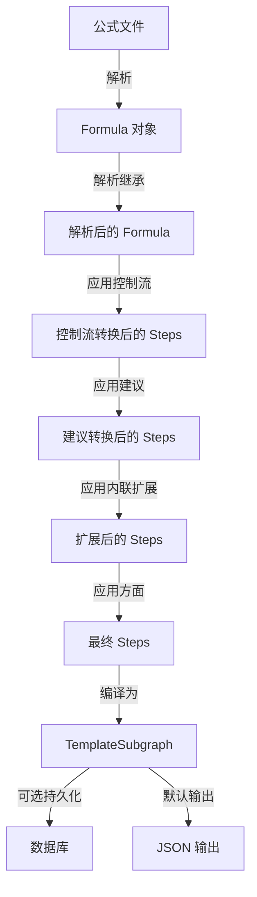

# cook_commands 模块技术深度解析

## 概述

`cook_commands` 模块是 Beads 系统中将公式（formula）模板编译为可执行工作流原型（proto）的核心组件。它负责解析、转换和实例化工作流模板，是连接高级工作流定义与实际 Issue 创建的桥梁。

## 问题空间

在项目管理和工作流自动化中，我们经常需要重复使用相似的工作流模式。手动创建这些工作流不仅繁琐，而且容易出错。直接在数据库中存储模板会导致：

1. **模板污染**：数据库中充满了一次性使用的模板
2. **版本控制困难**：模板变更难以追踪和回滚
3. **灵活性不足**：硬编码的模板难以适应不同场景
4. **依赖关系复杂**：手动维护 Issue 之间的依赖关系容易出错

`cook_commands` 模块通过将工作流定义为可解析的公式模板，并在需要时动态编译为 Issue 层次结构，优雅地解决了这些问题。

## 心智模型

可以将 `cook_commands` 模块想象成一个**编译器**：

- **源代码**：公式文件（`.formula.json`）
- **编译器**：`cook_commands` 模块
- **中间表示**：解析和转换后的公式结构
- **目标代码**：Issue 层次结构（可以是内存中的或持久化到数据库的）

这个编译过程包含多个阶段：解析、继承解析、控制流应用、建议应用、扩展应用等，最终生成一个完整的 Issue 依赖图。

## 架构



### 核心组件

#### cookFlags
命令行标志结构，存储所有用户输入的配置选项：
- `dryRun`：预览模式，不实际创建任何内容
- `persist`：持久化模式，将 proto 写入数据库
- `force`：强制替换已存在的 proto
- `searchPaths`：公式搜索路径
- `prefix`：proto ID 前缀
- `inputVars`：变量替换映射
- `runtimeMode`：运行时模式标志
- `formulaPath`：公式文件路径

#### cookResult
烹饪结果结构，用于 JSON 输出：
- `ProtoID`：生成的 proto ID
- `Formula`：使用的公式名称
- `Created`：创建的 Issue 数量
- `Variables`：使用的变量列表
- `BondPoints`：连接点列表

#### cookFormulaResult
公式烹饪结果，内部使用：
- `ProtoID`：生成的 proto ID
- `Created`：创建的 Issue 数量

## 核心流程

### 1. 命令行解析与验证
`parseCookFlags` 函数负责解析和验证命令行参数，确定烹饪模式（编译时/运行时）并收集变量输入。

### 2. 公式加载与解析
`loadAndResolveFormula` 函数是核心的公式处理流水线：
1. 尝试从公式注册表加载公式，失败则作为文件路径解析
2. 解析继承关系
3. 应用控制流操作符（循环、分支、门）
4. 应用建议转换
5. 应用内联步骤扩展
6. 应用扩展操作符
7. 应用方面

### 3. 烹饪模式选择
根据标志选择不同的输出方式：
- **dry-run**：显示预览
- **ephemeral**（默认）：输出 JSON
- **persist**：写入数据库

### 4. 子图生成
`cookFormulaToSubgraph` 函数将解析后的公式转换为内存中的 `TemplateSubgraph`，包含：
- 根 Issue（Epic 类型）
- 所有步骤 Issue
- 依赖关系
- Issue 映射

### 5. 持久化（可选）
`cookFormula` 函数在数据库事务中创建所有 Issue、标签和依赖关系，确保原子性。

## 关键设计决策

### 1. 编译时 vs 运行时模式
**决策**：支持两种烹饪模式
- **编译时模式**：保留变量占位符，用于规划和建模
- **运行时模式**：替换所有变量，用于最终验证和执行

**原因**：
- 编译时模式允许在不确定具体值的情况下预览工作流结构
- 运行时模式提供完整的变量替换，确保最终输出的准确性
- 这种分离符合"规划-执行"的工作流生命周期

### 2. 默认短暂性（Ephemeral by Default）
**决策**：默认情况下不持久化 proto 到数据库，而是输出 JSON

**原因**：
- 减少数据库污染：大多数 proto 是一次性使用的
- 提高灵活性：JSON 输出可以被管道、保存或进一步处理
- 简化版本控制：公式文件可以在 Git 中版本控制，而不是 proto

### 3. 统一的步骤收集
**决策**：使用 `collectSteps` 函数同时支持数据库持久化和内存子图生成

**原因**：
- 避免代码重复：两种路径使用相同的核心逻辑
- 确保一致性：内存和持久化的 proto 结构完全相同
- 简化测试：可以在内存中测试烹饪逻辑而不需要数据库

### 4. 事务性持久化
**决策**：在单个数据库事务中创建所有 Issue、标签和依赖关系

**原因**：
- 原子性：要么全部创建成功，要么全部失败
- 避免部分状态：防止创建了 Issue 但没有依赖关系的情况
- 简化错误处理：事务失败时自动回滚

## 数据流程

### 主要调用链

```
cookCmd.Run
  └─> parseCookFlags
  └─> loadAndResolveFormula
        ├─> formula.NewParser
        ├─> parser.LoadByName / parser.ParseFile
        ├─> parser.Resolve
        ├─> formula.ApplyControlFlow
        ├─> formula.ApplyAdvice
        ├─> formula.ApplyInlineExpansions
        ├─> formula.ApplyExpansions
        └─> formula.ApplyAdvice (for aspects)
  └─> formula.ExtractVariables
  └─> 分支选择
        ├─> outputCookDryRun
        ├─> outputCookEphemeral
        │     └─> substituteFormulaVars (runtime mode)
        │     └─> outputJSON
        └─> persistCookFormula
              ├─> store.GetIssue
              ├─> deleteProtoSubgraph (if needed)
              └─> cookFormula
                    └─> transact
                          ├─> tx.CreateIssues
                          ├─> tx.AddLabel
                          └─> tx.AddDependency
```

### 依赖关系

**被调用者**：
- `formula` 包：公式解析、转换和操作
- `storage` 包：数据库访问和事务
- `types` 包：核心领域类型
- `ui` 包：用户界面渲染

**调用者**：
- 主 CLI 命令处理器
- 其他需要动态生成工作流的命令（如 `pour`、`wisp`）

## 使用示例

### 基本用法

```bash
# 编译时模式：保留变量占位符
bd cook mol-feature.formula.json

# 运行时模式：替换变量
bd cook mol-feature --var name=auth

# 预览模式
bd cook mol-feature --dry-run

# 持久化到数据库
bd cook mol-release.formula.json --persist

# 强制替换已存在的 proto
bd cook mol-release.formula.json --persist --force
```

### 程序化使用

```go
// 加载并解析公式
resolved, err := loadAndResolveFormula("mol-feature", searchPaths)
if err != nil {
    return err
}

// 转换为内存子图
subgraph, err := cookFormulaToSubgraph(resolved, "mol-feature")
if err != nil {
    return err
}

// 使用子图
for _, issue := range subgraph.Issues {
    fmt.Printf("Issue: %s\n", issue.Title)
}
```

## 边缘情况与注意事项

### 1. 变量验证
在运行时模式下，所有必需的变量都必须有值。如果缺少变量，命令会失败并显示明确的错误消息。

### 2. 公式继承
公式可以通过 `extends` 字段继承其他公式。继承解析是递归的，循环继承会被检测并报告为错误。

### 3. 依赖解析
步骤之间的依赖关系通过步骤 ID 引用。如果引用的步骤不存在，依赖会被静默跳过（但会在验证阶段被捕获）。

### 4. 门问题
带有 `Gate` 字段的步骤会自动创建一个门 Issue，该门 Issue 会阻塞原始步骤。门 Issue 的 ID 格式为 `{parentID}.gate-{step.ID}`。

### 5. 扩展公式
类型为 `expansion` 的公式将内容存储在 `Template` 字段中，而不是 `Steps` 字段中。烹饪过程会自动将模板物化为步骤。

## 扩展点

### 1. 自定义步骤转换
可以通过修改 `loadAndResolveFormula` 函数中的转换流水线来添加自定义的步骤转换逻辑。

### 2. 变量替换策略
`substituteFormulaVars` 函数实现了基本的变量替换。可以通过提供自定义的替换函数来支持更复杂的变量替换策略。

### 3. 输出格式
当前支持 JSON 输出和数据库持久化。可以通过添加新的输出来处理函数来支持其他格式（如 YAML、GraphQL 等）。

## 相关模块

- [Formula Engine](formula_engine.md)：公式解析和转换
- [Storage Interfaces](storage_interfaces.md)：数据库访问
- [Core Domain Types](core_domain_types.md)：核心领域类型
- [Molecules](molecules.md)：分子操作（使用烹饪的 proto）

## 总结

`cook_commands` 模块是 Beads 系统中连接高级工作流定义与实际 Issue 创建的关键组件。它通过将公式模板编译为 Issue 层次结构，提供了灵活、可重复使用的工作流自动化能力。其设计决策强调了灵活性、一致性和原子性，使其成为系统中可靠且可扩展的部分。
