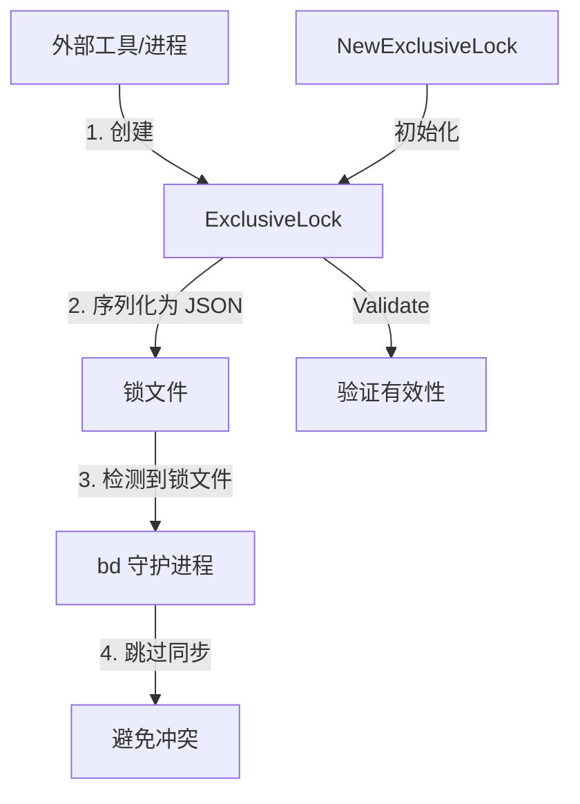

# exclusive_lock_structure 模块技术深度解析

## 1. 问题与动机

在分布式系统和多进程协作环境中，对共享资源的独占访问控制是一个经典挑战。`exclusive_lock_structure` 模块正是为了解决 beads 数据库的并发访问问题而设计的。

### 问题背景
想象这样一个场景：多个工具或进程可能同时需要操作同一个 beads 数据库——可能是一个自动化执行器（`vc-executor`）在运行任务，同时 bd 守护进程也在尝试同步数据。如果没有协调机制，两个进程同时修改数据库可能导致数据竞争、状态不一致甚至数据损坏。

### 解决方案的核心洞察
这个模块没有实现复杂的分布式锁算法，而是采用了一种简单而有效的文件锁约定：通过在文件系统中创建一个具有特定格式的锁文件，来声明对数据库的独占所有权。当锁文件存在时，bd 守护进程会自动跳过该数据库的同步周期，从而避免冲突。

## 2. 核心抽象与心智模型

### 核心数据结构：ExclusiveLock

`ExclusiveLock` 结构体是这个模块的核心，它不仅仅是一个数据容器，更是一个**所有权声明**。

```go
type ExclusiveLock struct {
    Holder    string    // 锁持有者名称（如 "vc-executor"）
    PID       int       // 进程 ID
    Hostname  string    // 运行进程的主机名
    StartedAt time.Time // 锁获取时间
    Version   string    // 锁持有者版本
}
```

### 心智模型：会议室预订系统

你可以把 `ExclusiveLock` 想象成一个会议室预订系统：
- **数据库** 是会议室
- **锁文件** 是挂在会议室门上的预订牌
- **ExclusiveLock 结构体** 是预订牌上的信息：谁预订的、哪个团队、什么时候开始的、预计使用多久

当你看到预订牌时，你就知道会议室正在被使用，以及是谁在使用。如果预订牌上的人已经离开很久了（进程不存在），你可以合理地认为这个预订已经失效。

## 3. 架构与数据流程

虽然这个模块相对简单，但它在整个系统中扮演着重要的协调角色。



### 典型使用流程

1. **锁的创建**：外部工具调用 `NewExclusiveLock()` 创建锁实例
2. **验证**：调用 `Validate()` 确保锁数据有效
3. **持久化**：将锁序列化为 JSON 并写入文件系统
4. **检测**：bd 守护进程在同步前检查锁文件是否存在
5. **协调**：如果锁存在且有效，守护进程跳过同步

## 4. 核心组件深度解析

### ExclusiveLock 结构体

**设计意图**：这个结构体的设计体现了"可观测性"和"可调试性"优先的原则。每个字段都有明确的目的：

- **Holder**：标识谁在持有锁，便于问题排查和权限管理
- **PID**：允许检测持有锁的进程是否还在运行
- **Hostname**：在多主机环境中，标识锁是在哪台机器上创建的
- **StartedAt**：可以计算锁的持有时间，帮助检测僵尸锁
- **Version**：记录锁持有者的版本，便于兼容性检查

### NewExclusiveLock() 函数

```go
func NewExclusiveLock(holder, version string) (*ExclusiveLock, error)
```

**设计亮点**：
- **自动采集元数据**：函数内部自动获取主机名和 PID，避免调用者手动提供可能出错的信息
- **时间戳标准化**：使用 `time.Now()` 确保时间记录的一致性
- **错误处理**：将获取主机名的错误正确包装并返回，而不是忽略或 panic

**为什么这样设计？**
如果让调用者提供 PID 和主机名，可能会出现不匹配的情况（比如在创建锁后进程被迁移，或者调用者错误地传递了信息）。自动采集这些信息确保了锁数据的准确性。

### Validate() 方法

```go
func (e *ExclusiveLock) Validate() error
```

**验证逻辑**：
- 确保 `Holder` 不为空（必须知道是谁持有锁）
- 确保 `PID` 为正数（有效的进程 ID）
- 确保 `Hostname` 不为空（必须知道在哪台机器上）
- 确保 `StartedAt` 不是零时间（必须知道锁何时开始）

**设计意图**：这是一个防御性编程的体现。即使锁是通过 `NewExclusiveLock()` 创建的，在反序列化或从其他来源加载后，验证确保数据仍然有效。

### JSON 序列化方法

`MarshalJSON()` 和 `UnmarshalJSON()` 方法通过类型别名技巧实现了标准的 JSON 序列化，同时避免了无限递归。

**为什么需要这些方法？**
虽然看起来只是简单的包装，但它们确保了 `ExclusiveLock` 类型可以正确地参与 JSON 序列化流程，特别是在未来可能需要添加自定义序列化逻辑时，这个结构提供了良好的扩展点。

## 5. 依赖关系与系统集成

### 被依赖关系

这个模块是一个底层基础设施组件，主要被以下类型的组件使用：
- **外部工具集成**：如 `vc-executor` 等需要独占访问数据库的工具
- **存储层**：可能在 [storage_contracts](storage-interfaces-storage-contracts.md) 中用于协调访问
- **守护进程**：bd 守护进程在同步逻辑中检查这个锁

### 依赖关系

这个模块的依赖非常简单：
- 标准库：`encoding/json`、`fmt`、`os`、`time`

这种极简的依赖设计是有意为之的——锁机制应该是可靠的、不依赖复杂外部组件的基础设施。

## 6. 设计权衡与决策

### 设计决策 1：文件锁 vs 进程内锁

**选择**：使用文件锁而非进程内锁

**原因**：
- **跨进程协调**：需要协调不同进程甚至不同主机的访问
- **持久化**：锁的状态需要在进程崩溃后仍然存在，以便检测和清理
- **简单性**：文件系统是一个可靠的、普遍可用的共享介质

**权衡**：
- ✅ 优点：简单、可靠、易于观察和调试
- ❌ 缺点：需要处理文件系统的边缘情况（如权限问题、网络文件系统的一致性问题）

### 设计决策 2：协作式锁而非强制锁

**选择**：这是一个协作式（advisory）锁，而非强制（mandatory）锁

**原因**：
- **灵活性**：允许紧急情况下的手动干预
- **错误隔离**：一个组件的死锁不会完全阻塞整个系统
- **UNIX 哲学**：遵循"提供机制，而非策略"的设计原则

**权衡**：
- ✅ 优点：系统更有弹性，管理员可以手动清理僵尸锁
- ❌ 缺点：依赖所有参与者都遵守锁协议， buggy 的组件可能会绕过锁

### 设计决策 3：丰富的元数据 vs 最小化结构

**选择**：包含丰富的诊断元数据

**原因**：
- **可观测性**：在调试问题时，知道"谁、在哪、什么时候"持有锁是无价的
- **僵尸锁检测**：PID 和时间戳可以用来检测锁是否已经失效
- **审计追踪**：版本信息有助于兼容性检查和问题追踪

**权衡**：
- ✅ 优点：大大提高了可调试性和可维护性
- ❌ 缺点：序列化和存储的开销略微增加（但完全可以忽略）

## 7. 使用指南与最佳实践

### 基本使用模式

```go
// 1. 创建锁
lock, err := types.NewExclusiveLock("vc-executor", "1.2.3")
if err != nil {
    // 处理错误
}

// 2. 验证锁
if err := lock.Validate(); err != nil {
    // 处理错误
}

// 3. 写入锁文件
data, err := json.Marshal(lock)
if err != nil {
    // 处理错误
}
if err := os.WriteFile(".beads-lock", data, 0644); err != nil {
    // 处理错误
}

// 4. 工作...

// 5. 释放锁
if err := os.Remove(".beads-lock"); err != nil {
    // 处理错误
}
```

### 最佳实践

1. **使用 defer 释放锁**：确保即使发生 panic 也能释放锁
2. **检查锁的有效性**：在读取锁文件后，验证其内容
3. **处理僵尸锁**：在获取锁前，检查现有锁是否仍然有效（进程是否存在）
4. **提供清理机制**：允许管理员手动强制释放锁

### 锁文件位置约定

虽然这个模块不强制规定锁文件的位置，但通常约定是：
- 在 beads 数据库的根目录下
- 文件名通常是 `.beads-lock`

## 8. 边缘情况与注意事项

### 僵尸锁问题

**场景**：持有锁的进程崩溃，没有清理锁文件

**解决方案**：
- 检查 `PID` 是否还在运行
- 检查 `Hostname` 是否与当前机器匹配
- 考虑 `StartedAt` 时间，判断锁是否已经过老
- 提供手动清理机制（如 CLI 命令）

### 网络文件系统的一致性

**场景**：数据库在 NFS 或其他网络文件系统上，锁文件的可见性可能有延迟

**注意事项**：
- 网络文件系统可能不会立即传播文件创建/删除
- 在写入锁文件后，考虑短暂休眠再检查文件是否存在
- 读取锁文件后，验证内容是否正确

### 权限问题

**场景**：不同用户运行的进程可能无法读取或写入锁文件

**注意事项**：
- 确保锁文件的权限设置合理（通常 0644）
- 考虑所有可能访问数据库的用户的权限
- 在错误消息中明确说明权限问题

### 时间同步问题

**场景**：多主机环境中，机器时间不同步

**注意事项**：
- `StartedAt` 主要用于相对时间计算，不是绝对时间
- 不要过度依赖时间戳来做关键决策
- 优先使用 PID 和进程存在性检查

## 9. 总结

`exclusive_lock_structure` 模块展示了一个看似简单但设计精良的基础设施组件。它通过丰富的元数据、自动采集信息、以及协作式的设计哲学，在简单性和功能性之间找到了很好的平衡。

这个模块的设计体现了几个重要原则：
1. **可观测性优先**：记录足够的诊断信息，便于问题排查
2. **防御性编程**：验证输入，即使是自己创建的数据
3. **机制与策略分离**：提供锁结构，不强制锁的使用方式
4. **简单性原则**：依赖最基础的设施（文件系统、标准库）

对于新加入团队的开发者，理解这个模块不仅仅是理解一个数据结构，更是理解系统中组件间如何通过简单的约定进行协作的范例。
