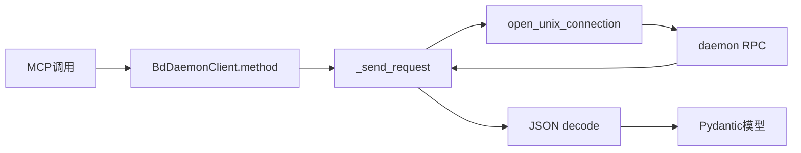

# daemon_transport_client 深度解析

`daemon_transport_client`（`BdDaemonClient`）是 MCP Integration 模块里的“高性能通道”实现：它不通过反复拉起 `bd` 子进程，而是通过 Unix socket 对常驻 `bd daemon` 发送 RPC 请求。直观理解：`BdCliClient` 像每次都打电话到客服总机，`BdDaemonClient` 像接入了专线坐席，省掉反复建连和进程启动成本。

## 模块职责与问题背景

这个组件主要解决两类问题：

1. **频繁读写操作的调用开销**：`list/ready/show/stats` 这类高频操作若每次都走 CLI 子进程，开销可观。
2. **统一语义接口下的 transport 切换**：上层依赖 `BdClientBase`，但底层可以选 daemon 通道，避免业务层感知协议差异。

它并不追求 100% 命令覆盖；低频运维命令暂时留在 CLI 路径，这是一种明确的性能优先策略。

## 心智模型

把 `BdDaemonClient` 看成一个“RPC 适配器”：

- 输入：Pydantic 参数模型（如 `ListIssuesParams`）
- 中间：`operation + args + cwd (+ actor)` 的请求信封
- 输出：`Issue` / `Stats` / `BlockedIssue` 等模型

也就是说，它的核心价值不在业务逻辑，而在**协议翻译 + 连接鲁棒性**。

## 关键数据流

关键路径：

1. 方法级参数映射（例如 `ready()` 把 `parent_id`、`labels_any` 等映射到 `args`）。
2. `_send_request()` 统一发送 JSONL 请求并等待单行 JSON 响应。
3. 检查 `success/error/data` 信封语义，失败抛 `DaemonError`。
4. 成功后将 `data` 反序列化并构造模型对象。

## 非显式但重要的设计点

- `BdDaemonClient` 继承 `BdClientBase`，因此与 `BdCliClient` 共享统一能力接口。
- `BdDaemonClient` 在 `claim()` 中失败后回退 `BdCliClient.claim()`，保证 `--claim` 的原子语义。
- `reopen`、`inspect_migration`、`get_schema_info`、`repair_deps`、`detect_pollution`、`validate` 当前直接 `NotImplementedError`，说明 daemon 协议尚未覆盖该能力矩阵。

## 设计权衡

1. **性能 vs 完整性**：优先实现高频命令 RPC，低频运维命令暂缓。
2. **健壮性 vs 简洁**：`_find_socket_path()` 做本地目录向上查找，再查 `~/.beads/bd.sock`，提升可用性但增加路径逻辑复杂度。
3. **一致性 vs 现实兼容**：响应 `data` 既可能是 dict/list，也可能是 JSON 字符串，因此各方法都要做 `json.loads(...) if isinstance(data, str)` 的兼容分支。

## 新贡献者注意事项

1. 不要假设 daemon 一定返回结构化对象；字符串 JSON 响应是已支持路径。
2. 不要把 `NotImplementedError` 静默吞掉；这会掩盖能力缺口。
3. `timeout` 同时作用于连接与读取；若扩展长耗时 RPC，需评估是否细分超时策略。
4. `cleanup()` 当前是 no-op（每次请求短连接），若未来引入持久连接，需要同步修改生命周期管理。

## 相关模块

- 主文档：[MCP Integration](MCP Integration.md)
- CLI 通道：[cli_transport_client](cli_transport_client.md)
- 数据契约：[mcp_models_and_data_contracts](mcp_models_and_data_contracts.md)
- 配置入口：[mcp_runtime_config](mcp_runtime_config.md)
