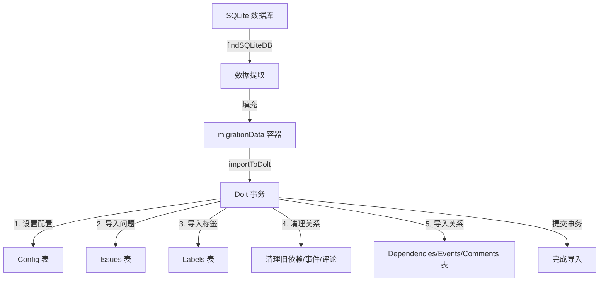

# data_import 模块技术深度解析

## 1. 问题域：为什么需要这个模块？

在理解 `data_import` 模块的设计之前，我们首先需要明确它解决的核心问题。想象一个场景：你有一个使用旧版 SQLite 存储的 Beads 数据库，现在需要将其迁移到新的 Dolt 存储后端。这不仅仅是简单的"复制粘贴"数据，而是涉及：

- **数据格式转换**：从 SQLite 的表结构映射到 Dolt 的表结构
- **时间戳兼容性**：处理不同格式的时间字符串
- **JSON 规范化**：确保元数据字段是有效的 JSON
- **幂等性保证**：即使多次运行导入，结果也应该一致
- **关系数据一致性**：确保问题、标签、依赖关系、事件和评论之间的关联正确

如果没有这个模块，你将不得不手动编写 SQL 脚本，处理各种边缘情况，并且很难保证迁移的可靠性。`data_import` 模块提供了一个结构化、可重复、安全的方式来完成这个迁移过程。

## 2. 核心抽象与心智模型

### 2.1 核心概念

`data_import` 模块的设计围绕几个关键抽象展开：

1. **`migrationData`**：作为"数据容器"，持有从源数据库提取的所有数据
2. **数据规范化层**：处理时间戳、JSON 元数据等格式转换
3. **事务性导入**：确保整个导入过程要么全部成功，要么全部回滚
4. **幂等性机制**：通过先删除再插入的方式保证可重复运行

你可以把 `migrationData` 想象成一个"数据搬运箱"，它在源数据库和目标数据库之间搬运数据，同时在搬运过程中对数据进行清洗和整理。

### 2.2 类比

想象你正在搬家：
- **源数据库** 是你的旧房子
- **目标数据库** 是你的新房子
- **`migrationData`** 是搬家卡车
- **导入过程** 是把东西从卡车上卸下来，并放到新房子的正确位置
- **数据规范化** 是在搬家过程中修复或整理损坏的物品

这个类比很好地体现了模块的设计意图：安全、可靠、完整地将数据从一个系统迁移到另一个系统。

## 3. 架构与数据流

### 3.1 架构概览



### 3.2 数据流向

让我们追踪一个典型的导入流程：

1. **定位源数据库**：`findSQLiteDB` 函数在 beads 目录中查找 SQLite 数据库文件
2. **数据提取**：从 SQLite 数据库中读取所有数据并填充到 `migrationData` 结构中
3. **事务开始**：创建一个 Dolt 事务，确保整个导入过程的原子性
4. **配置设置**：首先导入所有配置值
5. **问题导入**：
   - 跳过重复 ID 的问题
   - 计算内容哈希（如果缺失）
   - 规范化元数据
   - 使用 `INSERT ... ON DUPLICATE KEY UPDATE` 确保幂等性
6. **标签处理**：先删除问题的旧标签，再插入新标签
7. **关系清理**：删除所有旧的依赖关系、事件和评论
8. **关系导入**：导入依赖关系、事件和评论
9. **事务提交**：如果一切顺利，提交事务

## 4. 核心组件深度解析

### 4.1 migrationData 结构

```go
type migrationData struct {
    issues      []*types.Issue
    labelsMap   map[string][]string
    depsMap     map[string][]*types.Dependency
    eventsMap   map[string][]*types.Event
    commentsMap map[string][]*types.Comment
    config      map[string]string
    prefix      string
    issueCount  int
}
```

**设计意图**：
- 这个结构作为"数据中间层"，将源数据和目标导入逻辑解耦
- 使用 map 结构存储关联数据，便于快速查找
- `prefix` 字段支持在导入时添加前缀，避免 ID 冲突

### 4.2 findSQLiteDB 函数

```go
func findSQLiteDB(beadsDir string) string
```

**设计意图**：
- 首先检查常见的数据库文件名（`beads.db`, `issues.db`），提高常见场景的效率
- 然后扫描整个目录，处理不常见的命名情况
- 排除包含"backup"的文件，避免意外导入备份数据

### 4.3 importToDolt 函数

这是模块的核心函数，让我们深入分析其设计：

```go
func importToDolt(ctx context.Context, store *dolt.DoltStore, data *migrationData) (int, int, error)
```

**关键设计决策**：

1. **配置优先**：首先导入配置值，确保后续操作在正确的配置上下文中进行
2. **事务包裹**：整个导入过程在一个事务中完成，保证原子性
3. **重复检测**：使用 `seenIDs` map 跳过重复 ID 的问题
4. **内容哈希计算**：如果缺失，自动计算内容哈希，确保数据完整性
5. **元数据规范化**：将空或 nil 的元数据转换为有效的 JSON "{}"
6. **标签处理策略**：先删除再插入，确保标签列表与源数据完全一致
7. **关系清理**：在导入新的关系数据前，先清理旧数据，保证一致性
8. **防御性编程**：使用 `ON DUPLICATE KEY UPDATE` 作为额外的安全措施

## 5. 设计权衡与决策

### 5.1 先删除再插入 vs 增量更新

**选择**：先删除再插入

**原因**：
- 确保目标数据库与源数据完全一致
- 简化了逻辑，不需要比较哪些数据需要更新、哪些需要删除
- 对于迁移场景，源数据是权威的，目标应该完全反映源的状态

**权衡**：
- 优点：简单、可靠、一致性高
- 缺点：可能比增量更新稍慢，但对于迁移场景这是可接受的

### 5.2 事务粒度

**选择**：整个导入在一个事务中完成

**原因**：
- 保证原子性：要么全部成功，要么全部回滚
- 避免部分导入导致的不一致状态
- 简化错误处理

**权衡**：
- 优点：数据一致性有保证
- 缺点：对于非常大的数据库，可能会持有事务锁较长时间

### 5.3 幂等性保证

**选择**：使用 `ON DUPLICATE KEY UPDATE` 和先删除再插入的组合

**原因**：
- 允许导入过程可以安全地多次运行
- 处理中断后重试的场景
- 提供防御性编程，防止意外的数据重复

**权衡**：
- 优点：健壮性高，容错性好
- 缺点：代码稍复杂，可能有轻微的性能开销

## 6. 关键依赖与接口

### 6.1 依赖关系

`data_import` 模块依赖以下核心组件：

1. **`internal/storage/dolt`**：提供 Dolt 存储后端的访问接口
   - 使用 `dolt.DoltStore` 进行数据存储操作
   - 直接使用底层数据库连接进行事务操作

2. **`internal/types`**：定义核心数据结构
   - `types.Issue`：问题数据结构
   - `types.Dependency`：依赖关系数据结构
   - `types.Event`：事件数据结构
   - `types.Comment`：评论数据结构

3. **`internal/ui`**：提供用户界面渲染功能
   - 使用 `ui.RenderPass` 和 `ui.RenderWarn` 显示状态信息

### 6.2 隐含契约

模块假设：
- 源数据库的 schema 与代码中预期的结构一致
- 目标 Dolt 数据库已经初始化并具有正确的表结构
- 问题 ID 在导入范围内是唯一的

## 7. 使用指南与常见模式

### 7.1 基本使用流程

虽然 `data_import` 模块主要是内部使用的，但理解其使用流程对于维护和扩展很有帮助：

1. 准备源数据库
2. 调用数据提取逻辑填充 `migrationData`
3. 调用 `importToDolt` 进行导入
4. 处理返回的导入统计信息和错误

### 7.2 扩展点

如果你需要扩展这个模块，考虑以下几点：

1. **支持新的源数据库类型**：可以抽象出一个数据提取接口，支持多种源数据库
2. **添加数据转换钩子**：允许在导入过程中对数据进行自定义转换
3. **支持增量导入**：对于大型数据库，可以添加只导入变更数据的选项

## 8. 边缘情况与陷阱

### 8.1 常见陷阱

1. **时间戳格式问题**：
   - 模块尝试多种时间格式，但可能仍有未覆盖的格式
   - 如果时间戳解析失败，会静默返回 nil

2. **JSON 元数据处理**：
   - 无效的 JSON 会被包装成字符串，然后重新序列化为 JSON
   - 这可能导致元数据结构与预期不同

3. **空值处理**：
   - 空字符串和 0 值会被转换为 SQL NULL
   - 这在某些情况下可能不是预期的行为

4. **事务大小**：
   - 对于非常大的数据库，单个事务可能会导致性能问题或超时
   - 考虑分批导入，但要注意保持数据一致性

### 8.2 调试技巧

- 启用详细日志输出，查看导入进度
- 如果导入失败，检查数据库的错误日志
- 对于数据一致性问题，可以比较源数据库和目标数据库的计数

## 9. 总结

`data_import` 模块是一个专门设计用于将数据从旧版 SQLite 数据库迁移到新 Dolt 存储后端的工具。它的设计重点在于：

- **可靠性**：通过事务和幂等性机制保证数据一致性
- **完整性**：处理所有相关数据，包括问题、标签、依赖关系、事件和评论
- **灵活性**：适应不同的时间格式和 JSON 元数据格式
- **用户友好**：提供进度反馈和警告信息

这个模块体现了"防御性编程"的设计哲学，通过多层安全措施确保迁移过程的可靠性和数据的完整性。
