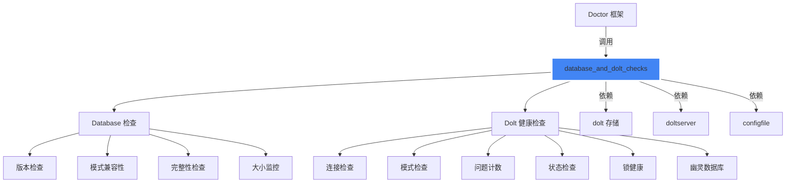

# Database and Dolt Checks 模块技术深度分析

## 概述

`database_and_dolt_checks` 模块是 Beads 系统中诊断框架的核心组成部分，专门负责验证和诊断数据库（特别是 Dolt 存储后端）的健康状态。想象一下，这个模块就像是一位经验丰富的数据库医生，通过一系列精心设计的检查，从版本兼容性到锁健康状态，全方位地诊断系统的存储层是否正常工作。

### 核心问题解决

在分布式版本控制的问题跟踪系统中，数据库的健康状态直接影响整个系统的可靠性。这个模块解决的核心问题包括：

1. **版本兼容性验证**：确保 CLI 版本与数据库模式版本一致，防止新旧数据格式不兼容
2. **模式完整性检查**：验证所有必需的表和列是否存在，避免运行时查询失败
3. **Dolt 服务器连通性**：确认 Dolt SQL 服务器可访问，特别是在服务器模式下
4. **锁健康状态**：检测可能导致数据库访问阻塞的锁争用问题
5. **数据库大小监控**：在数据库积累大量已关闭问题时提供性能警告
6. **幽灵数据库检测**：识别可能导致 INFORMATION_SCHEMA 查询崩溃的多余数据库条目

## 架构设计



### 核心组件角色

这个模块分为两个主要检查领域：

1. **数据库基础检查**（`database.go`）：
   - `CheckDatabaseVersion`：验证数据库版本与 CLI 版本兼容性
   - `CheckSchemaCompatibility`：确保核心表和视图存在且可查询
   - `CheckDatabaseIntegrity`：运行基本查询以验证数据库可读性
   - `CheckDatabaseSize`：监控已关闭问题数量，提供性能警告

2. **Dolt 特定检查**（`dolt.go`）：
   - `RunDoltHealthChecks`：协调所有 Dolt 健康检查，复用连接
   - `CheckDoltConnection`：验证与 Dolt SQL 服务器的连通性
   - `CheckDoltSchema`：检查 Dolt 数据库中必需的表是否存在
   - `CheckDoltStatus`：报告未提交的更改
   - `CheckLockHealth`：检测锁争用和 stale 锁文件
   - `checkPhantomDatabases`：识别可能导致查询崩溃的多余数据库条目

### 关键设计模式

**1. 连接复用模式**：
`RunDoltHealthChecks` 和 `RunDoltHealthChecksWithLock` 函数使用单个共享连接执行所有 Dolt 检查，避免了多次建立连接的开销。这通过 `doltConn` 结构体封装连接资源，并将其传递给各个 `*WithDB` 辅助函数实现。

**2. 防御性检查模式**：
所有检查函数都包含早期返回逻辑，当检测到非 Dolt 后端时，会返回适当的 "N/A" 结果而不是错误。这确保了诊断框架在不同存储后端配置下都能优雅运行。

**3. 锁检查前置模式**：
`RunDoltHealthChecksWithLock` 允许调用者预先计算锁健康状态，这避免了在 doctor 自身打开嵌入式 Dolt 数据库后，由于 noms LOCK 文件导致的误报（GH#1981）。

## 组件深度解析

### localConfig 结构体

`localConfig` 是一个轻量级的 YAML 配置解析结构，专门用于检测 `no-db` 和 `prefer-dolt` 配置项。

```go
type localConfig struct {
    SyncBranch string `yaml:"sync-branch"`
    NoDb       bool   `yaml:"no-db"`
    PreferDolt bool   `yaml:"prefer-dolt"`
}
```

**设计意图**：这个结构体体现了"最小解析"原则——它只定义了检测数据库模式所需的字段，而不是解析整个配置文件。这避免了配置格式变更对诊断检查的影响，提高了稳定性。

### doltConn 结构体

`doltConn` 封装了 Dolt 数据库连接和相关配置，是连接复用模式的核心：

```go
type doltConn struct {
    db   *sql.DB
    cfg  *configfile.Config
    port int
}
```

**关键特性**：
- 持有 `*sql.DB` 连接池
- 保存配置引用以获取服务器详细信息
- 存储已解析的端口（来自 `doltserver.DefaultConfig`，而非过时的 `cfg.GetDoltServerPort()`）
- 提供 `Close()` 方法确保资源释放

### CheckDatabaseVersion 函数

这个函数是系统版本兼容性的守护者。它的工作流程体现了分层验证的设计思想：

1. 首先确定后端类型和 beads 目录
2. 验证 Dolt 数据库目录存在
3. 以只读模式打开数据库（避免修改状态）
4. 读取 `bd_version` 元数据
5. 与 CLI 版本进行比较

**设计权衡**：函数在版本不匹配时返回警告而非错误，这是一个有意的设计决策——允许系统在版本略有差异的情况下继续运行，同时提醒用户升级。

### CheckDatabaseSize 函数

这个函数体现了"安全至上"的设计理念：

```go
// DESIGN NOTE: This check intentionally has NO auto-fix. Unlike other doctor
// checks that fix configuration or sync issues, pruning is destructive and
// irreversible. The user must make an explicit decision to delete their
// closed issue history. We only provide guidance, never action.
```

**关键设计决策**：
- 阈值可配置（`doctor.suggest_pruning_issue_count`）
- 默认值 5000 是一个经验法则
- 阈值为 0 时禁用检查
- **绝对不提供自动修复**——因为数据删除是不可逆的

### RunDoltHealthChecks 函数

这是 Dolt 健康检查的协调器，它的设计体现了资源效率和错误处理的最佳实践：

1. 首先检查后端类型，非 Dolt 后端返回 N/A 结果
2. 尝试建立连接，连接失败时返回错误并包含锁检查
3. 成功建立连接后，复用该连接执行所有检查
4. 确保连接通过 defer 关闭

**变体**：`RunDoltHealthChecksWithLock` 允许传入预先计算的锁检查结果，这是为了避免 doctor 自身创建的锁文件导致误报。

### CheckLockHealth 函数

这个函数展示了对底层实现细节的深刻理解：

```go
// Dolt's noms chunk store creates a LOCK file on open and releases the
// flock on close, but never deletes the file. We probe the flock to
// distinguish an actively held lock (real contention) from a stale
// file left by a previous process (harmless).
```

**检查内容**：
1. 探测 noms LOCK 文件是否被其他进程持有
2. 检查咨询锁（advisory lock）状态
3. 区分活跃锁争用和 stale 文件

**关键洞察**：函数不只是检查文件是否存在，而是尝试获取非阻塞锁，这样可以区分真正的锁争用和无害的遗留文件。

### checkPhantomDatabases 函数

这个函数解决了一个微妙但严重的问题（GH#2051）：

```go
// Complementary to checkStaleDatabases in server.go, which targets
// test/polecat leftovers with different prefixes.
```

**问题背景**：命名约定变更（`beads_*` 前缀或 `*_beads` 后缀）可能导致 INFORMATION_SCHEMA 查询崩溃。

**检测逻辑**：
- 跳过系统数据库和配置的数据库
- 标记符合 beads 命名约定但不是当前配置的数据库
- 建议重启 Dolt 服务器来清除这些条目

## 依赖分析

### 输入依赖

这个模块依赖几个关键组件：

1. **`internal/storage/dolt`**：
   - 用于打开 Dolt 存储并执行基本操作
   - `dolt.NewFromConfigWithOptions` 是创建只读存储实例的主要方法
   - `dolt.GetBackendFromConfig` 提供一致的后端检测

2. **`internal/configfile`**：
   - 加载和访问配置文件
   - 定义后端类型常量（`BackendDolt`）
   - 提供 Dolt 服务器连接参数的默认值

3. **`internal/doltserver`**：
   - 提供 `DefaultConfig` 用于正确的端口解析
   - 这比已弃用的 `cfg.GetDoltServerPort()` 更可靠

4. **`internal/lockfile`**：
   - 用于锁健康检查中的文件锁操作
   - `FlockExclusiveNonBlocking` 和 `FlockUnlock` 是关键函数

### 输出契约

模块的主要输出是 `DoctorCheck` 结构体，它包含：
- `Name`：检查名称
- `Status`：状态（`StatusOK`、`StatusWarning`、`StatusError`）
- `Message`：用户友好的消息
- `Detail`：技术细节
- `Fix`：修复建议（可选）
- `Category`：检查类别（`CategoryCore`、`CategoryData`、`CategoryRuntime`）

### 调用者

这个模块主要被 [CLI Doctor Commands](cli_doctor_commands.md) 模块调用，作为 `bd doctor` 命令的一部分执行。

## 设计决策与权衡

### 1. 只读连接优先

**决策**：大多数检查使用 `&dolt.Config{ReadOnly: true}` 打开数据库。

**理由**：
- 诊断检查不应修改系统状态
- 只读模式避免了不必要的锁争用
- 减少了意外修改数据的风险

### 2. 连接复用 vs 独立连接

**决策**：`RunDoltHealthChecks` 使用单个连接执行所有检查，而独立函数（如 `CheckDoltConnection`）各自建立连接。

**权衡**：
- 复用连接：效率高，但需要更复杂的协调代码
- 独立连接：简单，但在运行多个检查时效率低

**设计**：提供两种模式——协调的批量检查（高效）和独立的单点检查（简单）。

### 3. 警告 vs 错误

**决策**：许多问题（如版本不匹配、未提交更改）返回警告而非错误。

**理由**：
- 保持系统可运行性，即使存在一些非关键问题
- 区分"系统无法使用"的错误和"需要注意"的警告
- 给用户修复问题的机会，而不是完全阻止操作

### 4. 无自动修复的检查

**决策**：`CheckDatabaseSize` 明确不提供自动修复。

**理由**：
- 数据删除是不可逆的操作
- 用户必须做出明确的决策
- 工具应该提供指导，而不是自动执行破坏性操作

### 5. 端口解析策略

**决策**：使用 `doltserver.DefaultConfig(beadsDir).Port` 而非 `cfg.GetDoltServerPort()`。

**理由**：
- `cfg.GetDoltServerPort()` 已弃用，会回退到 3307
- 独立模式下端口是从项目路径哈希派生的
- `doltserver.DefaultConfig` 正确处理环境变量 > 配置 > Gas Town > 派生端口的优先级

## 使用指南

### 基本使用

对于大多数情况，应该使用 `RunDoltHealthChecks` 来获取完整的 Dolt 健康状态：

```go
checks := doctor.RunDoltHealthChecks(path)
for _, check := range checks {
    fmt.Printf("%s: %s\n", check.Name, check.Message)
}
```

### 高级用法：预先运行锁检查

为避免误报，可以先运行锁检查，然后传递结果：

```go
lockCheck := doctor.CheckLockHealth(path)
checks := doctor.RunDoltHealthChecksWithLock(path, lockCheck)
```

### 独立运行特定检查

如果只需要运行特定检查，可以使用独立函数：

```go
versionCheck := doctor.CheckDatabaseVersion(path, cliVersion)
schemaCheck := doctor.CheckSchemaCompatibility(path)
```

### 配置选项

- **`doctor.suggest_pruning_issue_count`**：设置触发大数据库警告的已关闭问题阈值（默认 5000，0 禁用）

## 边缘情况与注意事项

### 1. SQLite 后端处理

所有检查都能优雅处理 SQLite 后端，返回 "N/A" 结果而非错误。这确保了诊断框架在不同配置下都能正常工作。

### 2. 锁检查的时机

**注意**：`CheckLockHealth` 应该在打开任何嵌入式 Dolt 数据库之前运行，否则 doctor 自身创建的锁文件会导致误报。这就是为什么 `RunDoltHealthChecksWithLock` 存在的原因。

### 3. Wisp 表过滤

`isWispTable` 函数会从 `dolt_status` 检查中排除 "wisps" 表和 "wisp_" 前缀的表，因为这些是临时表，预期会有未提交的更改。

### 4. 端口解析差异

**陷阱**：不要使用已弃用的 `cfg.GetDoltServerPort()`，它会在独立模式下返回错误的端口。始终使用 `doltserver.DefaultConfig(beadsDir).Port`。

### 5. 数据库版本缺失

如果数据库缺少版本元数据，系统会返回警告而不是错误。这允许在版本元数据损坏的情况下继续运行，同时提醒用户修复。

## 总结

`database_and_dolt_checks` 模块是一个精心设计的诊断组件，它平衡了全面性和安全性。通过使用连接复用、防御性检查、前置锁验证等模式，它能够可靠地诊断数据库健康状态，同时避免了常见的陷阱（如误报、状态修改、资源泄漏）。

这个模块的设计体现了几个关键原则：
1. **诊断工具不应改变系统状态**（只读连接、无破坏性自动修复）
2. **优雅处理不同配置**（SQLite/Dolt 后端、有/无服务器）
3. **区分真正的问题和无害的遗留物**（锁检查中的 flock 探测）
4. **提供可操作的反馈**（每个检查都有修复建议）

对于新贡献者，理解这个模块的关键是认识到它不是简单的"检查清单"，而是一个考虑了各种边缘情况、性能影响和用户安全的复杂系统。
