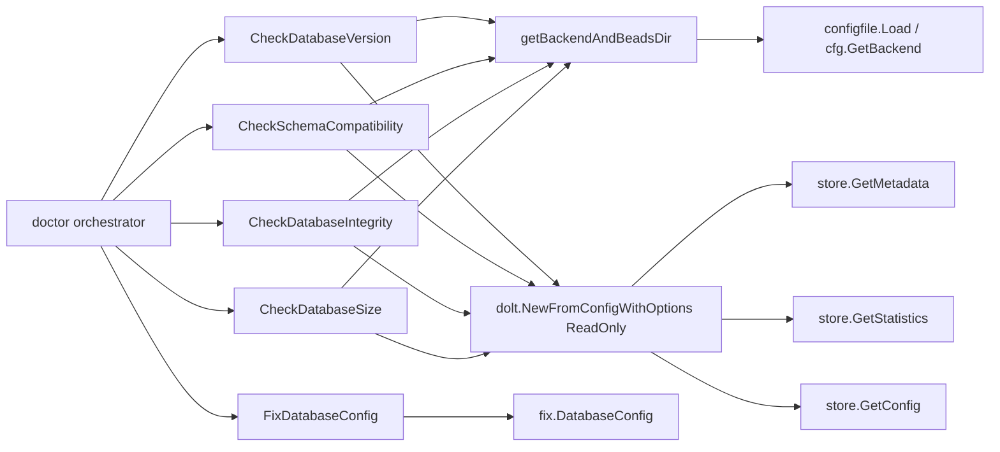

# database_state_checks

`database_state_checks` 模块是 `bd doctor` 里专门负责“数据库体检”的一组检查逻辑。它的价值不在于做复杂算法，而在于把“数据库是否存在、是否可读、版本是否匹配、模式是否还能跑核心查询、体量是否开始影响性能”这些高频且容易被忽略的健康问题，统一收敛成可执行的诊断结果。可以把它想象成汽车年检里的“底盘快检工位”：不是去深度拆发动机，而是先用一套便宜、稳定、低风险的信号，快速判断你现在能不能安全上路。

朴素方案通常是“命令报错了再说”。这在单机场景还勉强可接受，但在团队协作和版本演进里会失效：同一个问题可能在不同命令路径以不同报错形式出现，开发者无法快速定位是“版本漂移”“数据库损坏”还是“本地没初始化”。本模块的设计洞察是：把数据库健康问题前置为显式检查，并且给出一致的 `DoctorCheck` 结构化输出，让修复路径从“猜测”变成“指导”。

---

## 架构角色与数据流



从架构上看，这个模块是 `CLI Doctor Commands` 体系中的“数据库诊断适配层”：上游接收 doctor 命令调度，下游调用存储后端（主要是 Dolt）暴露的只读能力，然后把结果翻译成 `DoctorCheck`。它不直接参与业务读写，也不承担迁移执行；它的边界职责是**判断状态 + 提供建议**。

关键数据流是统一的：每个检查先通过 `getBackendAndBeadsDir` 解析真实 `.beads` 目录并识别后端，然后根据后端分支执行。对于非 Dolt 后端，直接返回 `sqliteBackendWarning(...)`；对于 Dolt 后端，通常先检查 `.beads/dolt` 是否存在，再以 `dolt.NewFromConfigWithOptions(..., ReadOnly: true)` 打开只读 store，最后执行一到两个最小查询（`GetMetadata`/`GetStatistics`/`GetConfig`）来判断维度健康度。

这个“先后端分流，再最小读探针”的模式，正是它的核心心智模型。

---

## 心智模型：把它当成“分层探针”，不是“全量校验器”

理解这段代码最有效的方法，是把每个检查当成一个由浅入深的探针链路：

第一层探针问“你是不是我支持的后端”；第二层问“数据库目录在不在”；第三层问“store 能不能只读打开”；第四层问“核心元数据和统计查询还能不能工作”；最后再根据场景做额外策略判断（例如版本匹配、closed issue 数量阈值）。

这种设计像急诊分诊：先排除最明显的风险，再进入下一步，而不是一上来做昂贵的全面体检。好处是快、稳定、可解释；代价是它不承诺发现所有深层损坏，只覆盖“能显著影响 CLI 可用性”的关键健康信号。

---

## 组件深潜

## `type localConfig struct`

`localConfig` 只包含 `sync-branch`、`no-db`、`prefer-dolt` 三个 YAML 字段，其中本模块实际使用的是 `NoDb`。这个结构体存在的目的不是承载完整配置，而是给 `isNoDbModeConfigured` 提供一个最小、强语义的解析目标，避免用字符串匹配去判断 `no-db`。

这种“最小投影结构”比全文 map 解析更稳：它天然忽略无关键，也避免注释/嵌套键导致的误判。

## `CheckDatabaseVersion(path string, cliVersion string) DoctorCheck`

这是“版本一致性探针”。它按以下顺序判断：

1. `getBackendAndBeadsDir` 获取后端与目录。
2. 如果后端非 Dolt，返回 `sqliteBackendWarning("Database")`。
3. 检查 `.beads/dolt` 是否存在；不存在直接 `StatusError`，建议 `bd init`。
4. 只读打开 Dolt store；打开失败返回 `StatusError`。
5. 读取 `bd_version` 元数据；读取失败 `StatusError`。
6. 若 `bd_version` 为空，返回 `StatusWarning`（元数据缺失）。
7. 若 `dbVersion != cliVersion`，返回 `StatusWarning`（版本漂移）。
8. 否则 `StatusOK`。

设计上最值得注意的是：版本不一致是 `warning` 而不是 `error`。这表明团队把它视为“可运行但有风险”的状态，而不是硬阻断条件。这样做兼顾了可用性和正确性：用户不会被强制卡死，但会收到升级指引。

## `CheckSchemaCompatibility(path string) DoctorCheck`

这是“模式可用性探针”。它并不逐表逐列枚举 schema，而是调用一次 `store.GetStatistics(ctx)` 作为核心查询代理。如果这个查询失败，就推断 schema 不完整或不兼容。

这是一个典型的工程化取舍：用高信号、低维护成本的“行为测试”替代脆弱的“结构白名单校验”。后者虽然更细粒度，但随着迁移演进很容易过时并制造假阳性。

特别要注意其 N/A 语义：如果 `.beads/dolt` 不存在，它返回 `StatusOK` + `N/A (no database)`，而不是错误。这与 `CheckDatabaseVersion` 的严格性不同，体现了检查目标差异：schema 兼容性只在数据库存在时才有意义。

## `CheckDatabaseIntegrity(path string) DoctorCheck`

这是“可读性探针”。它执行两步最小查询：

- `store.GetMetadata(ctx, "bd_version")`
- `store.GetStatistics(ctx)`

只要这两步都成功，就给出 `Basic query check passed`。它不尝试深度完整性校验（如全表扫描、一致性图遍历），而是验证“系统关键路径是否还活着”。

从测试 `database_test.go` 可以看到语义约束：没有数据库时这项检查应是 `ok` + `N/A (no database)`。也就是说它衡量的是“已有数据库是否可基本读取”，不是“仓库是否完成初始化”。

## `CheckDatabaseSize(path string) DoctorCheck`

这是“容量风险探针”，专门关注 closed issues 过多导致的潜在性能退化。流程如下：

1. 后端分流，非 Dolt 返回 SQLite warning。
2. 没有 `dolt/` 目录则 N/A。
3. 只读打开 store 失败时也返回 N/A（这里选择不把“打不开”升级为错误）。
4. 读取配置键 `doctor.suggest_pruning_issue_count`，默认阈值 5000。
5. 配置可解析为 `0` 时禁用检查。
6. 读取 `GetStatistics`，比较 `stats.ClosedIssues` 与阈值。
7. 超阈值给 `StatusWarning`，并建议用户显式执行 `bd cleanup --older-than 90`。

该函数注释里写明了关键设计原则：**无自动修复**。因为 pruning 是不可逆删除，doctor 只给建议，不代替用户决策。这是一个明显的“安全优先”决策。

## `FixDatabaseConfig(path string) error`

这个函数本身只是委托到 `fix.DatabaseConfig(path)`，说明本模块把“检查”与“修复实现”隔离在 `cmd/bd/doctor/fix` 子包。这样能避免检查逻辑掺杂大量写操作细节。

根据 `fix/database_config.go`，`DatabaseConfig` 会加载 `.beads` 下配置，检测 `cfg.Database` 与磁盘实际 `.db` 文件名是否不一致，必要时更新并保存。虽然当前 `database_state_checks` 主体偏 Dolt，但这个 fix 仍处理 legacy/混合状态的配置偏差。

## `sqliteBackendWarning(checkName string) DoctorCheck`

这是一个小而关键的规范化函数：把所有“检测到 SQLite 后端”的结果统一成同样的 warning 文案和迁移建议（`bd migrate --to-dolt`）。

价值在于一致性：用户在不同检查项看到的是同一迁移叙事，不会因为文案分叉而困惑。

## `isNoDbModeConfigured(beadsDir string) bool`

该函数读取 `config.yaml` 并反序列化到 `localConfig`，返回 `cfg.NoDb`。它是一个纯辅助函数，当前文件中的导出检查并未直接调用它。它反映了模块对“配置驱动模式差异”已有预留，但在给定代码片段里尚未进入主流程。

由于它对读文件和 YAML 解析错误都返回 `false`，语义上是“保守默认”：宁可判定未开启 no-db，也不因配置损坏中断 doctor。

---

## 依赖与调用关系分析

在已给出的代码范围内，这个模块的下游依赖是明确的：

- `getBackendAndBeadsDir`（来自 `cmd/bd/doctor/backend.go`）：负责 `.beads` 目录解析与后端识别。
- `internal/configfile`：提供 `BackendDolt` 常量与配置加载/后端判断链路。
- `internal/storage/dolt`：通过 `NewFromConfigWithOptions` 获取只读 store，并读取 `GetMetadata`、`GetStatistics`、`GetConfig`。
- `cmd/bd/doctor/fix.DatabaseConfig`：承接配置修复动作。

上游方面，这些函数按命名和模块归属属于 `CLI Doctor Commands` 的检查集合，由 doctor 命令调度层收集为 `DoctorCheck` 列表（具体调度代码未在本次提供片段中，因此这里不臆测具体函数名和顺序）。

数据契约层面，这个模块输出统一 `DoctorCheck`：

- `Status` 使用 `StatusOK / StatusWarning / StatusError` 常量。
- `Message` 承载摘要语义。
- `Detail` 可选提供上下文（常见为 `Storage: Dolt` + 原始错误）。
- `Fix` 可选提供下一步动作。

这种契约让调用方可以统一渲染文本、JSON 或未来 UI，而无需理解每个检查的内部细节。

---

## 设计决策与权衡

本模块最核心的取舍是“轻量探针优先”而不是“全量一致性验证”。例如 schema 检查只跑 `GetStatistics`，integrity 只跑 metadata + statistics。这样做牺牲了覆盖深度，但换来三个优势：执行快、对演进友好、报错可解释。

第二个取舍是“默认只读打开数据库”。所有主检查都用 `dolt.Config{ReadOnly: true}`。这明显偏向安全性和诊断幂等性：doctor 不该因为体检本身引入状态变化。

第三个取舍是同为“数据库缺失”时不同检查返回不同严重度。`CheckDatabaseVersion` 视其为 `error`（因为版本检查目标隐含“你应该有一个可用 DB”）；而 `SchemaCompatibility`/`Integrity`/`Size` 多返回 `N/A` 的 `ok`。这不是不一致，而是语义分层：是否“必须存在 DB”取决于检查意图。

第四个取舍体现在 `CheckDatabaseSize` 的降级策略：无法打开数据库或无法统计时直接 `ok` + N/A，而不是 error。这更偏向减少噪音与误报，代价是可能掩盖部分真实问题。结合其“仅信息提示”定位，这是合理的。

---

## 使用方式与示例

在 doctor 聚合逻辑里，这些函数一般按独立检查调用并收集结果：

```go
checks := []DoctorCheck{
    CheckDatabaseVersion(path, cliVersion),
    CheckSchemaCompatibility(path),
    CheckDatabaseIntegrity(path),
    CheckDatabaseSize(path),
}
```

如果用户请求修复数据库配置偏差，可调用：

```go
if err := FixDatabaseConfig(path); err != nil {
    // 向调用方返回修复失败原因
}
```

`CheckDatabaseSize` 的行为可通过配置键调节：

- `doctor.suggest_pruning_issue_count` 未设置：默认 `5000`
- 配置为 `0`：禁用该检查
- 配置为正整数：以该值为 warning 阈值

---

## 边界条件与新贡献者注意事项

最容易误解的一点是：并非所有“打不开数据库”的场景都应返回 error。你需要先判断该检查是“硬健康条件”还是“信息性建议”。当前模块里这两类都存在，修改时要保持语义一致。

第二个坑是后端兼容分支。虽然测试里出现“SQLite backend no longer exists”这类注释（例如 `dolt_test.go`），但本模块仍保留了 `sqliteBackendWarning` 路径。新改动不要轻易删除这条分支，除非全仓策略已明确移除并同步清理调用方预期。

第三个坑是配置解析容错。`CheckDatabaseSize` 用 `fmt.Sscanf` 解析阈值，解析失败会回退默认值 `5000`。如果你改成更严格策略，可能把“坏配置”从 warning silently-fallback 变成硬错误，用户体验会明显变化。

第四个坑是 `isNoDbModeConfigured` 当前未在导出检查流程里使用。不要假设它已生效；如果你要引入 no-db 语义，请在调用链显式接入，并补测试覆盖。

第五个坑是 fix 的职责边界。`FixDatabaseConfig` 只做配置矫正，不做数据库重建。像 `rm -rf .beads/dolt && bd init` 这种破坏性恢复仍通过 `Fix` 文案指导用户手动执行，而不是自动化执行。

---

## 相关模块参考

- `DoctorCheck` 契约与状态常量：[`doctor_contracts_and_taxonomy`](doctor_contracts_and_taxonomy.md)
- Dolt 连接与服务健康检查（同属 doctor，但关注 server mode）：[`dolt_connectivity_and_runtime_health`](dolt_connectivity_and_runtime_health.md)（若该文档存在于当前文档集）
- 迁移相关检查与校验：[`migration_readiness_and_completion`](migration_readiness_and_completion.md)
- 自动修复实现集合：查看 `cmd/bd/doctor/fix/*` 对应文档（如已有拆分文档）

如果你要扩展数据库检查，建议先确认你做的是“状态探针”还是“修复动作”：前者应留在本模块并保持只读/低侵入，后者应放到 `fix` 子包并保持显式触发。
