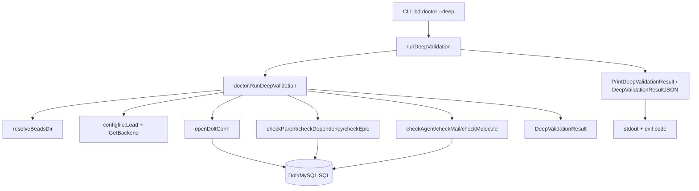

# deep_graph_validation

`deep_graph_validation` 模块的核心价值，是在“表面可用”的数据库之上，再做一层“图语义层面的体检”。很多系统只检查“能连上库、表在、SQL 能跑”，但这不足以保证 issue graph 真的健康：依赖可能悬空、epic 可能该关未关、agent 元数据可能悄悄漂移。这个模块就是 `bd doctor --deep` 的引擎，它把数据库当成一个依赖图来审计，目标不是功能可用，而是**结构可信**。

## 这个模块解决了什么问题？

想象你在维护一张城市地铁图。普通健康检查只会告诉你“站点文件存在、查询 API 可调用”；深度校验则会问：“这条线连接的站是否真实存在？有没有孤立换乘点？是不是有整条支线其实已经完成但仍标记为施工中？”

`RunDeepValidation(path string)` 解决的就是这个层面的问题。它专门检查 `issues`、`dependencies`、`labels` 等表之间的**跨表一致性**与**业务语义一致性**。如果只用 naive 方案（例如仅跑 `SELECT COUNT(*)` 或只验证 schema），会漏掉大量“不会立刻报错，但会在后续操作中积累为数据债务”的问题。

更关键的是：模块不是盲目“严格失败”。它把检查分成 `StatusOK` / `StatusWarning` / `StatusError`，并且对不同语义采取不同严重级别（例如 epic completeness 是 warning，不阻断整体）。这体现了一个实用主义设计：医生报告优先帮助团队决策，而不是把一切异常都等同于宕机。

## 心智模型：它如何“思考”

把这个模块想成一个“分诊台（triage desk）+ 专科会诊”的组合：

- `RunDeepValidation` 是分诊台：负责路径解析、后端判别、连接数据库、组织各专科检查、汇总总分。
- 每个 `checkXxxIntegrity` 是专科：只负责一种语义不变量。
- `DeepValidationResult` 是总报告：既保留分项字段（便于程序消费），也保留 `AllChecks`（便于统一展示/遍历）。

这种模型的好处是：新增一个检查项时，通常只需要增加一个专科函数并接入 orchestrator，不需要重写整条流程。

## 架构与数据流



入口在 `cmd/bd/doctor.go`：当 `--deep` 打开时，调用 `runDeepValidation`（位于 `cmd/bd/doctor_health.go`）。`runDeepValidation` 再调用 `doctor.RunDeepValidation` 执行核心逻辑，并根据 `jsonOutput` 决定走 `PrintDeepValidationResult` 还是 `DeepValidationResultJSON`。

`RunDeepValidation` 先做三层“前置门禁”：

1. `resolveBeadsDir(filepath.Join(path, ".beads"))`：先跟随 redirect，避免在错误目录上做诊断。
2. `configfile.Load` + `cfg.GetBackend()`：确定 backend；非 Dolt 直接给出 warning 并早退。
3. 检查 `dolt/` 目录与 `openDoltConn`：无库或无法连接也早退，但会产出明确 `DoctorCheck`。

通过门禁后，它才会执行六个深度检查函数，并将每个返回的 `DoctorCheck` append 到 `AllChecks`，同时更新 `OverallOK`。

## 组件深挖

### `DeepValidationResult`

这个结构体同时服务两类消费者：

- 机器消费者：通过 `parent_consistency`、`dependency_integrity` 等固定字段稳定取值。
- 人类/UI 消费者：通过 `all_checks` 做统一遍历展示。

这个“双轨输出”是刻意设计。仅有切片会让 JSON 使用方依赖名字匹配；仅有固定字段会让打印层写很多重复逻辑。两者并存提高了易用性，但代价是字段有冗余（同一个检查在分项字段和 `AllChecks` 各有一份）。

### `RunDeepValidation(path string) DeepValidationResult`

这是模块的 orchestrator。它不试图“智能修复”，只负责**发现并分级**。一个非显而易见但重要的设计选择是：

- 对环境/连接类问题，倾向返回单条检查并早退（避免后续噪声）。
- 对检查执行错误（如某条 SQL 失败），各子检查通常返回 `StatusWarning`，而不是让整个流程 panic。

这使得命令在“部分信息可得”时仍能给出诊断结果，符合 doctor 命令的运维属性。

### `checkParentConsistency(db *sql.DB) DoctorCheck`

只看 `d.type = 'parent-child'`，并验证 `issue_id`、`depends_on_id` 两端都存在于 `issues`。本质是“层级边完整性检查”。

注意它用了 `LIMIT 10`，并在输出中只展示最多 3 个样例。也就是说它更像“抽样证据 + 快速报警”，不是全量审计报表。这是性能与可读性的折中。

### `checkDependencyIntegrity(db *sql.DB) DoctorCheck`

这是更通用版本，不限 `parent-child` 类型。与前者配合形成“专项 + 全量类型”双保险：前者强调层级结构语义，后者覆盖所有依赖关系。

当发现问题时给出修复建议 `bd repair-deps`，体现它与修复命令之间的契约：deep check 报告问题，修复流程由别处负责。

### `checkEpicCompleteness(db *sql.DB) DoctorCheck`

这个检查不是“数据坏了”，而是“流程可推进”：找出 `issue_type = 'epic'` 且未关闭、但所有子项已关闭的 epic。状态是 `StatusWarning`，并且不会拉低 `OverallOK`。

这体现了模块把“结构错误”和“运营建议”分层处理。它把 doctor 从纯技术体检扩展到了 workflow hygiene。

### `agentBeadInfo` 与 `checkAgentBeadIntegrity(db *sql.DB)`

`agentBeadInfo` 是读取 agent issue 元数据的临时承载结构。校验流程先探测 `issues.notes` 列是否存在（`INFORMATION_SCHEMA.COLUMNS`），再尝试 `JSON_EXTRACT` 读取 `role_bead`/`agent_state`/`role_type`。

关键约束来自 `types.AgentState.IsValid()`：`agent_state` 必须落在系统认可状态集合内。这里的依赖是强语义依赖：如果 `internal/types` 扩展或收缩状态枚举，这里的判定会立即受影响。

它还有一个有意的“兼容退化路径”：JSON 提取失败时，降级到不提取 JSON 的查询；再失败则返回“无 agent beads”。这保证不同数据库能力或迁移中间态下命令仍可运行。

### `checkMailThreadIntegrity(db *sql.DB)`

先探测 `dependencies.thread_id` 列，再检查 thread_id 是否指向现有 issue。它把问题定为 warning 而非 error，说明团队把邮件线程关联视为增强元数据，而非核心图结构的硬约束。

### `moleculeInfo` 与 `checkMoleculeIntegrity(db *sql.DB)`

`moleculeInfo` 当前只实用到 `ID` 和 `Title`，`ChildCount` 在该文件中未被消费。检查逻辑先识别 molecule（`issue_type='molecule'` 或 label 为 `beads:template`），再逐个查询是否有缺失子节点。

这里选择了“每个 molecule 单独 `QueryRow`”的实现，代码直观但在大规模分子数量下会形成 N+1 查询开销。当前显然优先了可维护性与语义清晰度。

### `PrintDeepValidationResult` 与 `DeepValidationResultJSON`

前者面向人类终端，后者面向机器管道。`PrintDeepValidationResult` 使用状态图标、detail 与 fix 分层输出，保证可读性；`DeepValidationResultJSON` 使用 `json.MarshalIndent` 提供稳定结构，便于 CI 或外部工具消费。

## 依赖关系分析

从“它调用谁”来看：

- 调用 `resolveBeadsDir`（来自 doctor 包内，实际委托 `beads.FollowRedirect`）确保目标目录正确。
- 调用 `configfile.Load` / `Config.GetBackend` 判断 backend。
- 调用 `openDoltConn`（位于 `cmd/bd/doctor/dolt.go`）建立 Dolt SQL 连接。
- 调用 `types.AgentState.IsValid` 做 agent 状态合法性校验。
- 深度依赖底层表结构：`issues`、`dependencies`、`labels`，并依赖 `INFORMATION_SCHEMA.COLUMNS` 可访问性。

从“谁调用它”来看：

- `runDeepValidation`（`cmd/bd/doctor_health.go`）是直接调用方。
- `doctorCmd`（`cmd/bd/doctor.go`）在 `--deep` 分支调用 `runDeepValidation`。

调用方契约很清晰：

- 只要 `OverallOK == false`，CLI 会 `os.Exit(1)`。
- `AllChecks` 需要可打印且可 JSON 序列化。

因此，若你修改状态分级策略，会直接影响 CLI 退出码与自动化流水线行为。

## 关键设计取舍

这个模块整体上选择了“诊断优先、修复解耦”。它不直接改库，只给可执行修复建议（例如 `bd repair-deps`、`bd close`）。好处是安全、可审计；代价是用户需要二次操作。

在正确性与性能之间，当前偏向“有上限的快速探测”：

- 多个查询都有 `LIMIT`。
- molecule 校验采用逐条查询。
- 计数查询失败时采用 best-effort（默认 0）。

这意味着它是医生门诊，不是离线审计引擎。对超大库，它能快速给出信号，但不保证报告完整性统计。

在耦合方面，它与 Dolt/MySQL 方言耦合较深（`INFORMATION_SCHEMA`、`JSON_EXTRACT`、`?` 占位符混用在 Dolt 的 MySQL 兼容层上）。这种耦合换来的是实现简单、无需额外抽象层；代价是跨后端可移植性较弱。所以代码在非 Dolt 路径直接早退 warning，而不是强行抽象一套多后端 SQL。

## 使用方式与常见模式

CLI 方式：

```bash
bd doctor --deep
bd doctor --deep --json
```

在 Go 内部调用：

```go
result := doctor.RunDeepValidation(path)
if !result.OverallOK {
    // fail fast in automation
}
```

输出方式二选一：

```go
doctor.PrintDeepValidationResult(result)
b, err := doctor.DeepValidationResultJSON(result)
```

扩展一个新深度检查的典型步骤是：新增 `checkXxx(db *sql.DB) DoctorCheck`，在 `RunDeepValidation` 中执行并 append 到 `AllChecks`，再决定它是否影响 `OverallOK`。

## 新贡献者最该注意的坑

第一，`warning` 与 `error` 的语义边界非常重要。比如 `Epic Completeness` 是 warning 且不影响 `OverallOK`；如果你把它改为 error，会改变 CLI 退出码语义，可能影响 CI。

第二，很多结果是“样例而非全量”。`Found %d ...` 的数字经常受 `LIMIT` 限制（例如 dependency 检查 limit 10）。不要把它当成全库准确计数。

第三，schema 兼容路径是“软失败”策略。`checkAgentBeadIntegrity` 与 `checkMailThreadIntegrity` 在缺列或探测失败时返回 N/A/OK，而非失败。这是为了兼容不同 schema 代际；你在重构时若改成硬失败，会让老库或迁移中状态频繁告警。

第四，`RunDeepValidation` 在 backend 非 Dolt 时会返回 warning 但通常保持 `OverallOK` 初值 `true`。也就是说“无法做 deep check”不等于“系统故障”。这是产品层决策，不是遗漏。

第五，`moleculeInfo.ChildCount` 在当前实现未使用。如果你计划利用它，先确认是否需要在 SQL 中填充并在报告中暴露，避免引入“看似有字段、实际无语义”的新混淆。

## 参考阅读

- [CLI Doctor Commands](CLI Doctor Commands.md)
- [doctor_command_entry_orchestration](doctor_command_entry_orchestration.md)
- [validate_check_focus_pipeline](validate_check_focus_pipeline.md)
- [Dolt Storage Backend](Dolt Storage Backend.md)
- [Core Domain Types](Core Domain Types.md)
