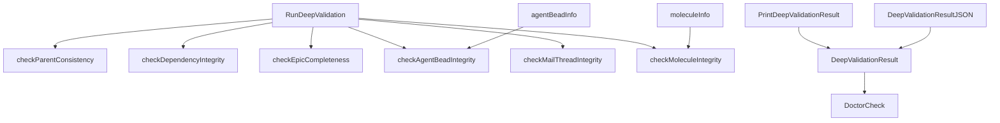

# Deep Validation 模块深度技术解析

## 概述

**Deep Validation** 模块是 Beads 系统中负责对问题图（issue graph）进行深度完整性检查的诊断工具。它不仅仅验证表面级别的数据一致性，而是深入到问题之间的关系网络、依赖结构、epic 完整性、agent bead 元数据、邮件线程引用以及分子结构等多个维度进行全面检查。

想象一下，这个模块就像是一个经验丰富的建筑检查员，不仅检查房屋的外观，还要深入地基、管道系统、电路网络和结构支撑等各个层面，确保整个建筑的完整性和安全性。

## 架构设计

### 核心组件关系图



### 架构层次

Deep Validation 模块采用分层设计，从外到内依次为：

1. **入口层**：`RunDeepValidation` 作为主入口，协调整个验证流程
2. **检查层**：多个专用的检查函数，每个负责特定领域的验证
3. **数据层**：辅助结构体用于收集和组织验证过程中的数据
4. **输出层**：结果格式化和展示函数

## 核心组件详解

### DeepValidationResult 结构体

**设计意图**：作为所有深度验证检查结果的容器，提供统一的结果收集和汇总机制。

```go
type DeepValidationResult struct {
    ParentConsistency   DoctorCheck   // 父子关系一致性检查
    DependencyIntegrity DoctorCheck   // 依赖完整性检查
    EpicCompleteness    DoctorCheck   // Epic 完整性检查
    AgentBeadIntegrity  DoctorCheck   // Agent Bead 完整性检查
    MailThreadIntegrity DoctorCheck   // 邮件线程完整性检查
    MoleculeIntegrity   DoctorCheck   // 分子结构完整性检查
    AllChecks           []DoctorCheck // 所有检查的完整列表
    TotalIssues         int           // 扫描的问题总数
    TotalDependencies   int           // 扫描的依赖总数
    OverallOK           bool          // 整体是否通过
}
```

**设计亮点**：
- 每个检查都有专门的字段，便于类型安全的访问
- `AllChecks` 切片提供统一的迭代接口
- `TotalIssues` 和 `TotalDependencies` 提供进度上下文
- `OverallOK` 提供快速的整体状态判断

### RunDeepValidation 函数

**核心职责**：协调整个深度验证流程，从环境准备到各个检查的执行。

**执行流程**：

1. **环境准备**：
   - 解析 beads 目录路径
   - 检测后端类型（仅支持 Dolt）
   - 验证数据库存在性
   - 建立数据库连接

2. **统计收集**：
   - 获取问题总数
   - 获取依赖总数

3. **检查执行**：
   - 依次执行所有深度检查
   - 收集每个检查的结果
   - 更新整体状态

**设计决策**：
- **尽力而为的统计**：使用 `_ = db.QueryRow(...)` 忽略错误，因为零值对于诊断显示是安全的
- **提前返回策略**：在后端不支持或数据库不存在时快速返回，避免不必要的操作
- **模块化检查**：每个检查独立执行，一个失败不影响其他检查

### 检查函数详解

#### checkParentConsistency

**验证目标**：确保所有父子关系依赖都指向存在的问题。

**检查逻辑**：
```sql
SELECT d.issue_id, d.depends_on_id
FROM dependencies d
WHERE d.type = 'parent-child'
  AND (
    NOT EXISTS (SELECT 1 FROM issues WHERE id = d.issue_id)
    OR NOT EXISTS (SELECT 1 FROM issues WHERE id = d.depends_on_id)
  )
LIMIT 10
```

**设计亮点**：
- 使用 `NOT EXISTS` 子查询高效检测孤儿依赖
- 限制返回 10 条结果，避免在大型数据库中产生过多输出
- 提供示例而非完整列表，平衡信息量和性能

#### checkDependencyIntegrity

**验证目标**：确保所有类型的依赖都指向存在的问题。

**与 checkParentConsistency 的区别**：
- 不限制依赖类型（检查所有类型）
- 收集依赖类型信息用于更详细的错误报告

**设计决策**：
- 复用相似的查询模式，但针对不同的验证目标进行调整
- 提供不同的修复建议（`bd repair-deps` vs `bd doctor --fix`）

#### checkEpicCompleteness

**验证目标**：找出可以关闭的 epic（所有子问题都已关闭但 epic 仍然打开）。

**检查逻辑**：
```sql
SELECT e.id, e.title,
       COUNT(c.id) as total_children,
       SUM(CASE WHEN c.status = 'closed' THEN 1 ELSE 0 END) as closed_children
FROM issues e
JOIN dependencies d ON d.depends_on_id = e.id AND d.type = 'parent-child'
JOIN issues c ON c.id = d.issue_id
WHERE e.issue_type = 'epic'
  AND e.status != 'closed'
GROUP BY e.id
HAVING total_children > 0 AND total_children = closed_children
LIMIT 20
```

**设计亮点**：
- 使用聚合查询高效计算完成率
- `HAVING` 子句筛选完全完成的 epic
- **仅作为警告**：不影响整体 OK 状态，因为这是信息性的而非错误

#### checkAgentBeadIntegrity

**验证目标**：验证 agent bead 是否具有必需的字段和有效的状态值。

**特殊处理**：
- 首先检查 `notes` 列是否存在（schema 兼容性检查）
- 使用 JSON 提取函数从 `notes` 字段中解析 agent 元数据
- 如果 JSON 提取失败，回退到简单查询

**验证内容**：
- 从 `notes` JSON 中提取 `role_bead`、`agent_state`、`role_type`
- 验证 `agent_state` 是否为有效的 `types.AgentState` 值

**设计决策**：
- **防御性编程**：处理 schema 变化和数据格式不一致的情况
- **类型安全验证**：使用 `types.AgentState.IsValid()` 进行验证，而不是硬编码字符串

#### checkMailThreadIntegrity

**验证目标**：验证邮件 `thread_id` 引用是否指向存在的问题。

**检查逻辑**：
- 首先检查 `thread_id` 列是否存在
- 查找引用不存在问题的 `thread_id`
- 统计每个孤儿线程的引用数量

**设计亮点**：
- **按线程聚合**：显示每个孤儿线程的引用数量，帮助评估影响范围
- **警告级别**：将此问题标记为警告而非错误，因为这通常不会阻止系统运行

#### checkMoleculeIntegrity

**验证目标**：验证分子（molecule）结构的完整性。

**分子识别**：
```sql
SELECT DISTINCT i.id, i.title
FROM issues i
LEFT JOIN labels l ON l.issue_id = i.id
WHERE (i.issue_type = 'molecule' OR l.label = 'beads:template')
LIMIT 100
```

**验证内容**：
- 对每个分子，检查其所有子问题是否存在
- 统计缺失的子问题数量

**设计决策**：
- **双重识别机制**：既识别 `issue_type='molecule'`，也识别带有 `beads:template` 标签的问题
- **逐个验证**：虽然可能较慢，但能提供精确的每个分子的状态

### 辅助数据结构

#### agentBeadInfo

```go
type agentBeadInfo struct {
    ID         string
    Title      string
    RoleBead   string
    AgentState string
    RoleType   string
}
```

**设计意图**：在内存中组织 agent bead 的相关信息，便于验证逻辑处理。

#### moleculeInfo

```go
type moleculeInfo struct {
    ID         string
    Title      string
    ChildCount int
}
```

**设计意图**：收集分子的基本信息，用于结构完整性验证。

### 输出函数

#### PrintDeepValidationResult

**职责**：将验证结果以人类可读的格式打印到控制台。

**设计亮点**：
- 使用 Unicode 图标（✓、!、✗）提供直观的视觉反馈
- 分层显示信息：主消息 → 详情 → 修复建议
- 提供总体总结，便于快速了解状态

#### DeepValidationResultJSON

**职责**：将验证结果序列化为 JSON 格式，便于机器处理和集成。

**设计决策**：
- 使用 `json.MarshalIndent` 生成格式化的 JSON，便于人类阅读和调试
- 返回错误而非静默失败，遵循 Go 的错误处理惯例

## 数据流分析

### 完整验证流程

```
用户调用 RunDeepValidation(path)
        ↓
    解析路径 → resolveBeadsDir
        ↓
    检测后端类型 → configfile.Load
        ↓
    验证数据库存在性
        ↓
    建立 Dolt 连接 → openDoltConn
        ↓
    收集统计信息 (问题数、依赖数)
        ↓
    ┌─────────────────────────────────────┐
    │  执行各个检查函数：                  │
    │  1. checkParentConsistency          │
    │  2. checkDependencyIntegrity        │
    │  3. checkEpicCompleteness           │
    │  4. checkAgentBeadIntegrity         │
    │  5. checkMailThreadIntegrity        │
    │  6. checkMoleculeIntegrity          │
    └─────────────────────────────────────┘
        ↓
    组装 DeepValidationResult
        ↓
    (可选) PrintDeepValidationResult 或 DeepValidationResultJSON
```

### 数据契约

#### 输入契约

- **路径参数**：需要指向包含 `.beads` 目录的仓库根目录
- **数据库要求**：必须是 Dolt 后端，且 `dolt` 目录存在
- **Schema 兼容性**：处理不同版本的 schema（检查列是否存在）

#### 输出契约

- **DeepValidationResult**：保证所有字段都有合理的默认值
- **DoctorCheck**：每个检查都包含名称、状态、消息，可能包含详情和修复建议
- **JSON 输出**：完整的结构化数据，可用于自动化工具

## 设计决策与权衡

### 1. 仅支持 Dolt 后端

**决策**：Deep Validation 仅在 Dolt 后端上运行，对 SQLite 后端显示警告。

**原因**：
- 深度验证需要复杂的 SQL 查询（JSON 提取、聚合、子查询）
- Dolt 提供了更丰富的 SQL 功能和更好的性能
- 鼓励用户迁移到 Dolt 后端以获得完整功能

**权衡**：
- ✅ 简化开发，只需针对一个后端优化
- ✅ 推动用户采用更强大的后端
- ❌ 限制了 SQLite 用户的诊断能力

### 2. 尽力而为的错误处理

**决策**：在统计收集和某些查询中使用 `_ = ...` 忽略错误。

**原因**：
- 诊断工具应该尽可能提供信息，即使某些部分失败
- 零值对于诊断显示是安全的默认值
- 避免因小问题导致整个验证流程失败

**权衡**：
- ✅ 提高了工具的鲁棒性
- ✅ 即使部分失败也能提供部分结果
- ❌ 可能隐藏某些问题，导致用户不了解完整情况

### 3. 结果限制（LIMIT 子句）

**决策**：在所有查询中使用 LIMIT 子句限制返回的结果数量。

**原因**：
- 防止在大型数据库中生成过多输出
- 示例对于诊断通常已经足够
- 提高查询性能，减少内存使用

**权衡**：
- ✅ 提高性能，减少资源使用
- ✅ 避免信息过载
- ❌ 可能不显示所有问题，用户可能不知道问题的全部规模

### 4. 检查独立性

**决策**：每个检查函数独立执行，一个失败不影响其他检查。

**原因**：
- 提供最完整的诊断信息，即使某些检查失败
- 不同类型的问题可能相互独立
- 用户可以看到所有问题，而不仅仅是第一个遇到的问题

**权衡**：
- ✅ 提供最全面的诊断
- ✅ 一个领域的问题不影响其他领域的检查
- ❌ 可能执行更多的查询，在大型数据库上较慢

### 5. Epic 完整性作为警告

**决策**：Epic 完整性检查仅产生警告，不影响整体 OK 状态。

**原因**：
- 这是信息性的，不是数据完整性问题
- 用户可能有合理的理由保持 epic 打开
- 避免因业务策略问题标记为错误

**权衡**：
- ✅ 不会因业务决策错误地标记系统为失败
- ✅ 仍提供有用的信息
- ❌ 用户可能忽略这个警告，错过优化机会

## 使用指南

### 基本用法

```go
// 运行深度验证
result := doctor.RunDeepValidation("/path/to/repo")

// 打印结果
doctor.PrintDeepValidationResult(result)

// 或获取 JSON 格式
jsonBytes, err := doctor.DeepValidationResultJSON(result)
```

### 命令行使用

```bash
# 运行深度验证
bd doctor --deep

# 仅运行深度验证并获取 JSON 输出
bd doctor --deep --json
```

### 修复建议对应关系

| 检查 | 修复命令 |
|------|---------|
| Parent Consistency | `bd doctor --fix` |
| Dependency Integrity | `bd repair-deps` |
| Epic Completeness | `bd close <epic-id>` |
| Agent Bead Integrity | 手动更新 agent beads |
| Mail Thread Integrity | 手动清除 orphaned thread_id |
| Molecule Integrity | `bd repair-deps` |

## 扩展与定制

### 添加新的检查

要添加新的深度检查，遵循以下模式：

1. **定义检查函数**：
```go
func checkMyCustomIntegrity(db *sql.DB) DoctorCheck {
    check := DoctorCheck{
        Name:     "My Custom Integrity",
        Category: CategoryMetadata,
    }
    
    // 实现检查逻辑...
    
    return check
}
```

2. **在 RunDeepValidation 中集成**：
```go
result.MyCustomIntegrity = checkMyCustomIntegrity(db)
result.AllChecks = append(result.AllChecks, result.MyCustomIntegrity)
if result.MyCustomIntegrity.Status == StatusError {
    result.OverallOK = false
}
```

3. **在 DeepValidationResult 中添加字段**：
```go
type DeepValidationResult struct {
    // ... 现有字段 ...
    MyCustomIntegrity DoctorCheck `json:"my_custom_integrity"`
    // ...
}
```

## 边缘情况与注意事项

### 1. 大型数据库性能

**问题**：在包含数万问题和依赖的大型数据库上，深度验证可能会很慢。

**缓解措施**：
- 所有查询都使用 LIMIT 子句
- 可以考虑在后台异步运行
- 未来可能添加增量验证选项

### 2. Schema 版本兼容性

**问题**：随着系统演进，数据库 schema 可能会变化。

**已实现的防御措施**：
- 检查列是否存在（如 `notes`、`thread_id`）
- 提供回退查询策略
- 使用 `COALESCE` 处理可能的 NULL 值

### 3. 部分结果的解释

**问题**：当某些检查失败或被跳过时，用户可能误解整体状态。

**建议**：
- 始终查看完整的输出，而不仅仅是 `OverallOK`
- 注意标记为 "N/A" 的检查，它们可能表示 schema 不支持
- 在大型数据库上，LIMIT 子句可能意味着不是所有问题都被列出

### 4. JSON 字段的脆弱性

**问题**：Agent bead 元数据存储在 JSON 字段中，格式可能不一致。

**已实现的防御措施**：
- 使用 `COALESCE` 和默认值处理缺失字段
- 回退到不使用 JSON 提取的查询
- 验证解析出的值，而不是假设它们有效

## 与其他模块的关系

### 依赖关系

- **[Diagnostic Core](diagnostic_core.md)**：使用 `DoctorCheck` 和相关类型
- **[Configfile](metadata_json_config.md)**：用于检测后端类型
- **[Core Domain Types](Core Domain Types.md)**：使用 `types.AgentState` 进行验证
- **[Dolt Storage Backend](Dolt Storage Backend.md)**：通过 `openDoltConn` 建立连接

### 被依赖关系

- **[CLI Doctor Commands](CLI Doctor Commands.md)**：命令行界面调用此模块
- **[Validation CLI Integration](validation_cli_integration.md)**：可能使用 JSON 输出进行集成

## 总结

Deep Validation 模块是 Beads 系统中一个精心设计的诊断工具，它通过多层检查确保问题图的完整性和一致性。它的设计体现了几个重要原则：

1. **防御性编程**：处理各种边缘情况和 schema 变化
2. **模块化设计**：每个检查独立，易于扩展和维护
3. **用户体验优先**：提供清晰的反馈和可操作的修复建议
4. **性能考虑**：通过 LIMIT 子句和尽力而为的策略平衡功能和性能

作为系统的"健康检查员"，它不仅帮助发现问题，还通过提供清晰的修复指导帮助解决问题，是维护 Beads 仓库健康的重要工具。
