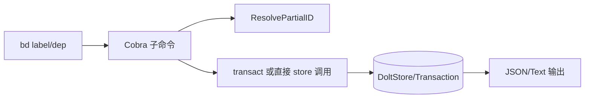

# dependency_and_label_operations 模块深潜

这个子模块覆盖两类高频且高风险操作：`label` 管理和 `dep` 依赖管理。它的核心价值不是"提供命令"，而是把**图结构正确性**和**批量操作一致性**变成默认行为。简单说：标签像 issue 的索引，依赖像 issue 的电路图，这个模块负责保证你在改索引和改电路时尽量不把系统弄短路。

## 问题空间与设计动机

在项目管理和问题跟踪系统中，标签和依赖关系是两个核心概念：

- **标签**：用于分类、筛选和组织问题，是一种灵活的元数据机制
- **依赖关系**：定义问题之间的先后顺序和阻塞关系，是工作流编排的基础

没有这个模块，用户可能会：
1. 直接操作数据库，破坏数据一致性
2. 创建循环依赖导致整个工作流瘫痪
3. 意外修改具有特殊语义的系统标签
4. 无法直观地理解复杂的依赖关系网络

这个模块通过提供安全、直观的 CLI 界面，解决了这些问题。

## 架构与数据流



`label` 的典型路径是：解析多个 issue ID → 解析 label → 批量事务执行（`AddLabel`/`RemoveLabel`）→ 统一反馈。

`dep` 的典型路径是：解析 `fromID` / `toID`（支持 partial ID）→ 依赖语义校验（类型、child→parent 反模式、external ref）→ 写入依赖 → 追加 cycle warning。

## 核心组件与设计意图

### `labelInfo`

`labelInfo` 是 `label list-all --json` 的输出结构（`label` + `count`）。它让“全库标签统计”有稳定机器契约，适合脚本和报表。

关键实现点：

- `processBatchLabelOperation(...)` 把多 issue 的 add/remove 包在单事务里，保证原子性；
- `label add` 对 `provides:` 前缀做保留命名空间保护，防止用户误用跨项目能力标签；
- `label list-all` 会先 `SearchIssues` 再逐 issue `GetLabels` 统计（这里是逐条读取，不是批量接口）。

### `treeRenderer`

`treeRenderer` 是 `dep tree` 的渲染状态机，负责在终端画出稳定、可读的树结构（连接线、重复节点标记、根节点 READY/BLOCKED 提示）。

它保存了：

- `seen`：防止菱形依赖重复展开；
- `activeConnectors`：控制每层 `│ ├ └` 连接符；
- `maxDepth` / `direction`：限制输出规模与方向语义；
- `rootBlocked`：根节点是否被 open/in_progress 子依赖阻塞。

## 关键机制

### 标签批量操作：一致性优先

`label add/remove` 都通过 `processBatchLabelOperation` 进入 `transact(...)`。这代表一次命令内多个 issue 的标签修改要么全成功，要么整体失败，避免“半成功半失败”导致团队误判。

### 依赖添加：语义保护优先

`dep add` 与 `dep --blocks` 路径都有几层保护：

1. partial ID 解析（`utils.ResolvePartialID`）；
2. child→parent 死锁反模式检测（`isChildOf`）；
3. external ref 格式校验（`validateExternalRef`）；
4. 依赖类型有效性依赖 `types.DependencyType` 语义。

并且写入后调用 `warnIfCyclesExist(store)`，即便不阻断写入，也会即时提醒“你刚刚可能把图变坏了”。

### 依赖查看：支持跨 rig 读取

`dep list` 在 down 方向会额外调用 `resolveExternalDependencies(...)`：

- 先读原始依赖记录找 `external:`；
- 再通过 routing 找目标 beads 目录；
- 打开目标 store 读取 issue 元数据并拼回 `IssueWithDependencyMetadata`。

这使依赖视图不局限本地仓库，而是能显示跨项目阻塞关系。

## 设计取舍

1. **正确性 vs 性能**：`dep` 多处选择“多查几次也要语义准确”（如 cycle 检查、external 解析、某些逐条读取）。
2. **可读性 vs 严格性**：cycle 检测默认是 warning，不强制失败；便于日常迭代，但可能让坏图延迟修复。
3. **易用性 vs 约束**：支持 `--blocked-by`/`--depends-on`/位置参数多种输入，提升可用性，但命令解析复杂度上升。

## 新贡献者注意事项

- `isChildOf` 相关逻辑非常关键，改错会引入“层级 + 依赖”双重死锁。
- `dep tree` 的 `direction=both` 目前是合并展示策略，不是完整双向图布局引擎。
- `label list-all` 目前按 issue 逐条查 label，若将来数据量增大可考虑批量 API 优化。
- external dependency 解析依赖 routing 配置；缺配置时会静默跳过部分外部节点。

## 使用模式与常见场景

### 标签管理模式

**批量标记相关问题**：
```bash
bd label add bd-abc bd-def bd-ghi "critical"
```
这会在单个事务中为三个问题添加 "critical" 标签，确保一致性。

**标签统计和审计**：
```bash
bd label list-all
```
提供数据库中所有标签的使用统计，帮助保持标签体系的整洁。

### 依赖管理模式

**创建阻塞依赖**：
```bash
bd dep bd-abc --blocks bd-def
```
或等价地：
```bash
bd dep add bd-def bd-abc
```

**可视化依赖关系**：
```bash
bd dep tree bd-abc --direction=both --format=mermaid
```
生成双向依赖图的 Mermaid 格式，可直接插入文档。

**检测循环依赖**：
```bash
bd dep cycles
```
定期运行此命令可以及早发现并修复循环依赖问题。

### 外部依赖模式

**跨项目依赖**：
```bash
bd dep add bd-abc external:other-project:capability-x
```
创建对另一个项目中特定功能的依赖，这种依赖会在该功能"发布"时自动解析。

## 错误处理与恢复

### 常见错误

1. **部分 ID 解析失败**：
   - 错误信息：`Error resolving xxx: multiple matches found`
   - 解决：使用更完整的 ID 或唯一的前缀

2. **保留标签冲突**：
   - 错误信息：`'provides:' labels are reserved for cross-project capabilities`
   - 解决：使用 `bd ship` 命令而非直接手动添加

3. **子-父依赖禁止**：
   - 错误信息：`cannot add dependency: xxx is already a child of yyy`
   - 解决：理解层级依赖已隐式存在，不需要显式添加

### 数据一致性保障

所有写操作都在事务中执行，这意味着：
- 如果操作中途失败，不会留下部分更改
- 可以安全地重试整个操作
- 系统始终保持一致状态

## 性能考虑

1. **`label list-all` 的扩展性**：
   - 当前实现逐个获取每个问题的标签
   - 对于大型数据库，考虑添加批量获取标签的接口

2. **依赖树深度**：
   - 默认限制为 50 层以防止性能问题
   - 可以通过 `--max-depth` 调整，但要小心性能影响

3. **循环检测**：
   - 在大型图上可能较慢
   - 考虑在后台运行而非每次添加依赖时都检测

## 扩展与自定义点

虽然这个模块主要是 CLI 界面层，但有几个设计为可扩展的点：

1. **新的依赖类型**：在 `types.DependencyType` 中添加新类型后，它们会自动在此模块中可用
2. **额外的输出格式**：`dep tree` 支持 `--format` 标志，可以添加新格式
3. **自定义标签验证**：可以添加钩子来验证特定命名空间的标签格式

## 关联模块

- [Core Domain Types](Core Domain Types.md)：定义了本模块使用的核心数据结构
- [Storage Interfaces](Storage Interfaces.md)：提供了本模块依赖的事务和存储抽象
- [Dolt Storage Backend](Dolt Storage Backend.md)：实现了实际的数据持久化
- [Routing](Routing.md)：用于解析跨项目的外部依赖
- [UI Utilities](UI Utilities.md)：提供了美化输出的功能
