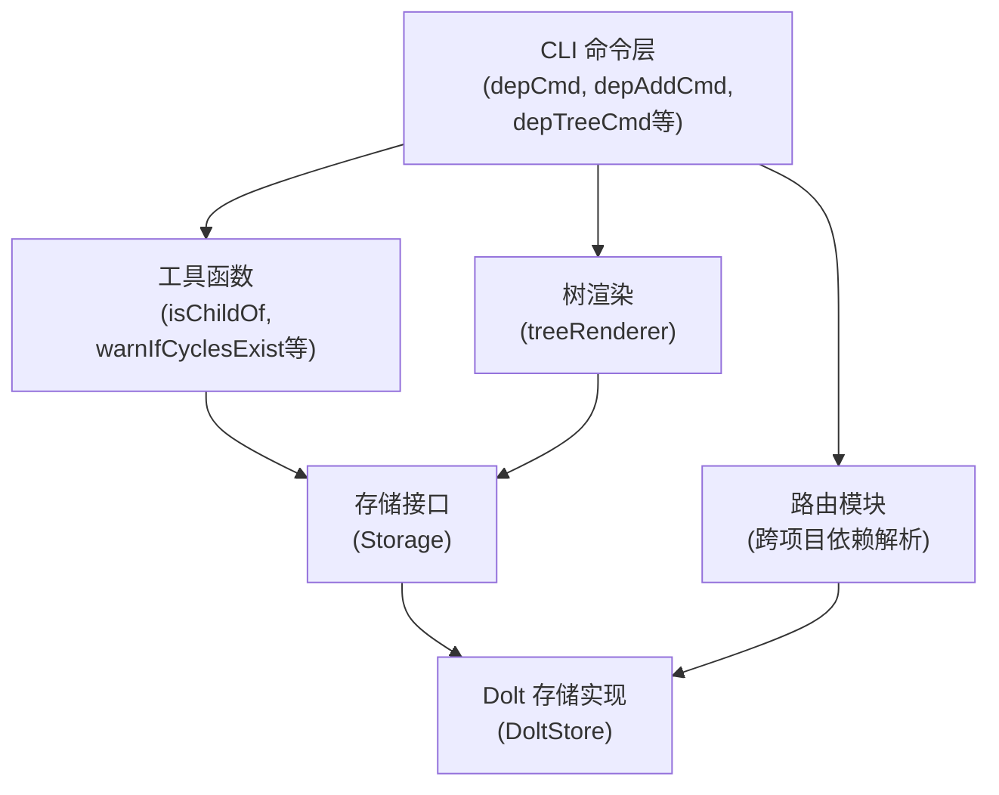
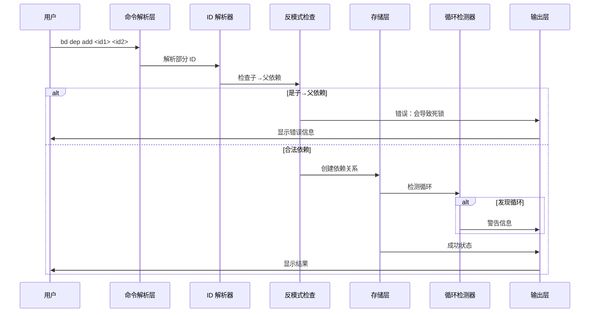
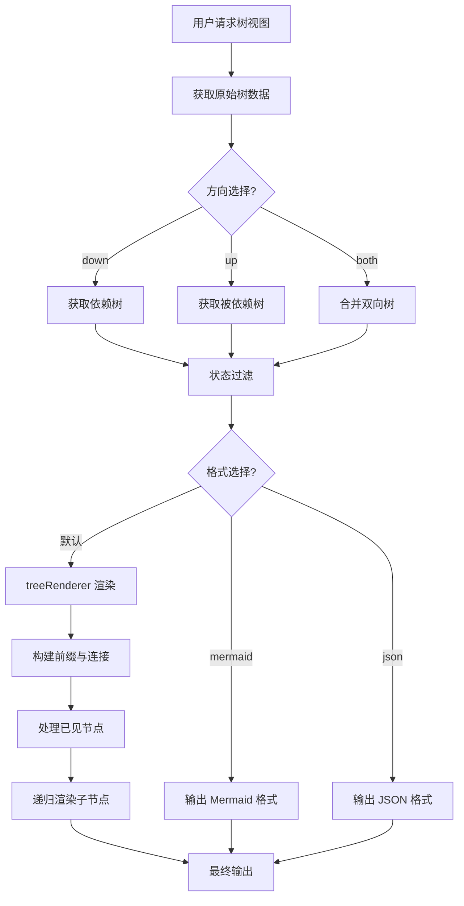

# 依赖管理模块 (dependency_management) 深度技术解析

## 1. 模块概述

依赖管理模块是 Beads CLI 中负责处理问题之间依赖关系的核心组件。它提供了一套完整的工具集，用于创建、查询、可视化和验证问题间的依赖关系。

### 解决的核心问题

在复杂的项目管理中，问题之间存在着各种依赖关系——一个问题可能阻塞另一个问题，或者一个问题需要跟踪另一个问题的进度。如果没有专门的依赖管理机制，团队很容易陷入：

- **死锁**：问题 A 依赖问题 B，问题 B 又依赖问题 A
- **重复劳动**：子问题已经通过层级关系隐含依赖父问题，但又被显式添加依赖
- **跨项目协作困难**：无法表示不同仓库间的问题依赖
- **可视化缺失**：难以直观理解复杂的依赖关系网络

## 2. 核心概念与设计思想

### 2.1 依赖模型

该模块构建在以下核心抽象之上：

1. **Dependency**：表示两个问题之间的依赖边
   - `IssueID`：依赖方（被阻塞者）
   - `DependsOnID`：被依赖方（阻塞者）
   - `Type`：依赖类型（blocks、tracks、related 等）

2. **TreeNode**：用于构建依赖树的节点，包含问题信息和树结构元数据
   - 继承自 `Issue`
   - `Depth`：在树中的深度
   - `ParentID`：父节点 ID
   - `Truncated`：是否被截断

3. **IssueWithDependencyMetadata**：带依赖类型信息的问题
   - 继承自 `Issue`
   - `DependencyType`：关联的依赖类型

### 2.2 树形结构可视化

模块使用 `treeRenderer` 结构体来渲染美观的依赖树，其核心思想是：
- 使用 `seen` 映射来避免重复显示（处理菱形依赖）
- 使用 `activeConnectors` 数组在每个深度级别跟踪连接状态
- 通过递归方式遍历树并应用适当的框线连接字符（├──、└──、│）

## 3. 数据流程

### 3.1 整体架构



### 3.2 添加依赖的流程



### 3.3 树可视化流程



**关键步骤解析**：

1. **ID 解析**：使用 `utils.ResolvePartialID` 解析部分 ID，支持跨路由解析
2. **反模式检查**：使用 `isChildOf` 函数检查是否是子→父依赖（会导致死锁）
3. **循环检测**：添加依赖后调用 `warnIfCyclesExist` 检测可能的循环

### 3.2 树可视化流程

```
获取树数据 → 过滤状态 → 格式选择 → 渲染输出
```

1. **获取树数据**：调用 `store.GetDependencyTree` 获取原始树结构
2. **双向树合并**：对于 "both" 方向，合并依赖树和被依赖树
3. **状态过滤**：如果指定了状态过滤器，使用 `filterTreeByStatus` 过滤
4. **渲染**：使用 `treeRenderer` 递归渲染树结构

## 4. 核心组件详解

### 4.1 treeRenderer 结构体

`treeRenderer` 是负责美观渲染依赖树的核心组件，设计精巧：

```go
type treeRenderer struct {
    seen             map[string]bool      // 已显示节点跟踪
    activeConnectors []bool               // 深度级别连接状态
    maxDepth         int                  // 最大深度
    direction        string               // 遍历方向
    rootBlocked      bool                 // 根节点是否被阻塞
}
```

**设计意图**：
- `seen` 映射处理菱形依赖（一个节点通过多条路径可达）
- `activeConnectors` 数组在每个深度级别跟踪是否有更多兄弟节点，用于正确绘制垂直线
- `rootBlocked` 用于在根节点上显示 [BLOCKED] 或 [READY] 指示器

**渲染逻辑**：
```go
func (r *treeRenderer) renderNode(node *types.TreeNode, children map[string][]*types.TreeNode, depth int, isLast bool)
```

此方法递归渲染节点，构建前缀字符串，应用适当的连接字符，并处理已见过的节点。

### 4.2 关键辅助函数

#### isChildOf

```go
func isChildOf(childID, parentID string) bool
```

**设计意图**：防止子问题→父问题的依赖反模式。这种模式会创建死锁：子问题无法开始（因为父问题未完成），父问题无法关闭（因为子问题未完成）。

**实现细节**：使用 `types.ParseHierarchicalID` 解析层级 ID，并检查直接父级匹配或前缀匹配（处理祖先关系）。

#### warnIfCyclesExist

```go
func warnIfCyclesExist(s *dolt.DoltStore)
```

**设计意图**：在添加依赖后立即警告用户可能的循环。循环依赖会使问题从 "就绪工作" 列表中消失，造成混乱。

#### filterTreeByStatus

```go
func filterTreeByStatus(tree []*types.TreeNode, status types.Status) []*types.TreeNode
```

**设计意图**：按状态过滤树，但保留完整的父链以维持树结构。这是通过两阶段方法实现的：
1. 识别匹配节点
2. 保留匹配节点及其所有祖先

## 5. 外部依赖处理

### 5.1 外部引用格式

模块支持跨项目依赖，使用格式 `external:<project>:<capability>`。这种设计允许在不同仓库的问题之间建立依赖关系。

### 5.2 解析流程

```go
func resolveExternalDependencies(ctx context.Context, depStore *dolt.DoltStore, issueID string, typeFilter string) []*types.IssueWithDependencyMetadata
```

**解析步骤**：
1. 获取原始依赖记录
2. 过滤出外部引用
3. 解析外部引用格式
4. 使用 `routing.ResolveBeadsDirForRig` 找到目标项目的 beads 目录
5. 打开目标存储并获取问题信息
6. 转换为 `IssueWithDependencyMetadata` 格式

## 6. 设计权衡与决策

### 6.1 子→父依赖的禁止

**选择**：显式禁止子问题依赖父问题
**理由**：
- 子问题已通过层级关系隐含依赖父问题完成
- 添加显式依赖会创建死锁
- 简化用户心智模型，避免常见错误

**替代方案**：可以允许但发出警告，但团队选择了严格禁止以确保一致性。

### 6.2 树渲染中的节点去重

**选择**：默认情况下，对已见过的节点显示 "(shown above)"
**理由**：
- 防止大型树中的无限循环
- 避免重复信息造成视觉混乱
- 保持树的线性可扫描性

**替代方案**：提供 `--show-all-paths` 标志来显示所有路径，为需要完整信息的用户提供灵活性。

### 6.3 外部依赖的懒解析

**选择**：外部依赖在查询时解析，而不是在存储时
**理由**：
- 外部项目的状态会变化，存储时解析会过时
- 避免跨存储的事务复杂性
- 允许外部项目配置在运行时变化

## 7. 使用示例与模式

### 7.1 添加依赖

```bash
# 使用 --blocks 标志（直观）
bd dep bd-xyz --blocks bd-abc

# 使用 add 命令（明确）
bd dep add bd-abc bd-xyz

# 使用标志语法
bd dep add bd-abc --blocked-by bd-xyz

# 添加跨项目依赖
bd dep add gt-xyz external:beads:mol-run-assignee
```

### 7.2 查看依赖关系

```bash
# 查看依赖树
bd dep tree gt-0iqq

# 查看被依赖树（什么阻塞了这个问题）
bd dep tree gt-0iqq --direction=up

# 查看双向图
bd dep tree gt-0iqq --direction=both

# 过滤状态
bd dep tree gt-0iqq --status=open

# 导出 Mermaid 格式
bd dep tree gt-0iqq --format=mermaid
```

## 8. 陷阱与注意事项

### 8.1 循环依赖

**问题**：循环依赖会导致问题从就绪工作列表中消失
**缓解**：
- 模块会在添加依赖后自动检测并警告
- 使用 `bd dep cycles` 命令进行详细分析
- 及时修复循环依赖

### 8.2 层级 ID 与依赖

**问题**：子问题依赖父问题会被禁止
**解决方案**：
- 理解层级关系已隐含依赖
- 如需跨层级依赖，重新考虑问题结构
- 或调整问题层级以避免需要这种依赖

### 8.3 外部依赖的配置

**问题**：外部依赖需要正确配置路由
**解决方案**：
- 确保 `external_projects` 配置正确
- 验证目标项目的 beads 目录可访问
- 使用详细模式（`-v`）诊断解析问题

## 9. 与其他模块的关系

- **[Storage](storage.md)**：依赖管理模块的底层数据存储，提供依赖的 CRUD 操作
- **[Routing](routing.md)**：用于解析跨项目依赖和跨路由的 issue ID
- **[UI](ui.md)**：提供状态颜色和格式化功能
- **[Types](types.md)**：定义核心数据结构如 `Dependency`、`TreeNode` 等

## 10. 总结

依赖管理模块是 Beads 系统中连接各个问题的纽带，它通过精心设计的 API、智能的反模式检测、美观的可视化以及对跨项目依赖的支持，解决了复杂项目管理中的关键挑战。其核心价值在于：

1. **防止常见错误**：主动禁止会导致死锁的依赖模式
2. **提供清晰可视化**：通过树形结构和不同方向的视图帮助理解依赖关系
3. **支持现代协作**：跨项目依赖功能打破了仓库边界
4. **灵活性与安全性平衡**：在提供强大功能的同时，通过检测和警告保护用户

这种设计体现了 "使其正确，使其快速，使其美观" 的工程原则，为项目管理提供了坚实的依赖基础。
