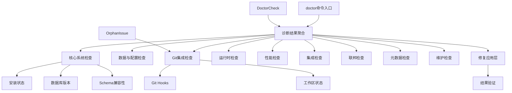

# diagnostic_core 模块技术深度文档

## 模块概述

`diagnostic_core` 模块是 beads 系统的健康检查和诊断中心，类似于汽车的 OBD-II 诊断系统。它负责检测系统安装、数据库完整性、配置一致性、Git 集成状态以及各种运行时问题，并提供自动修复建议。

### 解决的核心问题

在一个复杂的项目管理工具中，系统状态可能会因为多种原因出现不一致：
- 版本升级导致的数据库 schema 不匹配
- Git hooks 配置错误
- 数据迁移失败或中断
- 遗留文件和临时文件积累
- 依赖关系图中的循环或孤立节点
- 外部集成（如 Claude、GitLab、Jira）的配置问题

`diagnostic_core` 模块的存在就是为了系统性地发现这些问题，并在可能的情况下自动修复它们，而不是让用户在遇到问题时逐个排查。

## 架构概览



这个架构的设计体现了几个关键原则：

1. **检查与修复分离**：诊断逻辑和修复逻辑是分开的，先进行全面诊断，再根据结果决定修复策略
2. **分类管理**：检查被组织成不同的类别（核心系统、Git 集成等），便于用户理解和定位问题
3. **可组合性**：可以运行全部检查，也可以选择性地运行特定检查
4. **渐进式验证**：修复后会重新运行诊断来验证修复效果

## 核心组件详解

### DoctorCheck 结构

`DoctorCheck` 是诊断系统的基本单元，它封装了单个检查的所有信息：

```go
type DoctorCheck struct {
    Name     string `json:"name"`
    Status   string `json:"status"` // StatusOK, StatusWarning, 或 StatusError
    Message  string `json:"message"`
    Detail   string `json:"detail,omitempty"`
    Fix      string `json:"fix,omitempty"`
    Category string `json:"category,omitempty"` // 用于输出分组
}
```

这个结构的设计有几个值得注意的地方：

- **状态三分法**：使用 OK/Warning/Error 而不是简单的 pass/fail，这样可以区分"必须修复"和"建议修复"的问题
- **修复建议内嵌**：`Fix` 字段直接包含了如何修复问题的说明，用户不需要额外查找文档
- **分类信息**：`Category` 字段让输出更有条理，用户可以快速定位到相关的问题组

### 诊断流程

从代码中可以看到，诊断流程遵循一个清晰的模式：

1. **路径解析**：确定要检查的项目路径（支持显式参数、BEADS_DIR 环境变量或当前目录）
2. **模式路由**：根据命令行标志决定是运行完整诊断、特定检查、性能分析还是迁移验证
3. **检查执行**：按类别顺序执行各项检查
4. **结果聚合**：将所有检查结果收集到 `doctorResult` 结构中
5. **修复与验证**：如果请求了修复，应用修复后重新诊断以验证效果

这种设计的一个关键优势是**可扩展性**：添加新的检查只需要实现一个返回 `DoctorCheck` 的函数，并在 `runDiagnostics` 中调用它即可。

## 设计权衡分析

### 1. 检查顺序的设计

在 `runDiagnostics` 函数中，检查是按照特定顺序执行的：
```go
// 检查 1: 安装状态
// 检查 Git Hooks
// 如果没有 .beads/，跳过剩余检查
// 检查 1a: 新鲜克隆检测
// ... 更多检查
```

**选择**：早期检查基本安装状态，失败则跳过后续检查
**权衡**：
- ✅ 避免在基础设置错误时出现级联错误
- ✅ 给用户提供清晰的问题优先级
- ❌ 可能会遗漏一些即使基础设置有问题也能检测到的问题

### 2. 修复策略的选择

代码提供了多种修复模式：
- `--fix`：自动修复
- `--fix --yes`：无确认自动修复
- `--fix -i`：逐个确认修复
- `--dry-run`：预览修复

**选择**：提供从完全自动到完全手动的修复选项范围
**权衡**：
- ✅ 适应不同用户的风险偏好
- ✅ 允许谨慎的用户在应用修复前审查
- ❌ 增加了命令行界面的复杂度
- ❌ 需要维护多种修复路径的代码

### 3. 锁处理的特殊考量

在 `releaseDiagnosticLocks` 函数中，有一段专门处理 Dolt 锁文件的代码：

```go
// 释放诊断阶段可能留下的过时 noms LOCK 文件
func releaseDiagnosticLocks(path string) {
    // ... 查找并删除 LOCK 文件
}
```

**选择**：在修复前显式释放诊断阶段获得的锁
**权衡**：
- ✅ 避免同一进程内的锁竞争导致的修复失败
- ❌ 可能会掩盖真正的锁问题（如果另一个进程确实持有锁）
- ⚖️ 这是一个实用主义的选择，在大多数情况下利大于弊

## 数据流分析

让我们追踪一个典型的诊断流程：

1. **输入**：用户运行 `bd doctor --fix`
2. **路径解析**：确定检查目录
3. **检查执行**：
   - 检查 `.beads/` 目录是否存在
   - 检查数据库版本和 schema
   - 检查 Git hooks 配置
   - 检查依赖关系图的完整性
   - ... 等等
4. **结果聚合**：所有 `DoctorCheck` 结果被收集到 `doctorResult` 中
5. **修复应用**：对有 `Fix` 字段且状态非 OK 的检查应用修复
6. **验证**：重新运行诊断以确认修复生效
7. **输出**：以人类可读或 JSON 格式呈现结果

这个流程的一个关键特性是**修复后的验证步骤**，它确保了修复不会引入新的问题。

## 子模块概览

`diagnostic_core` 模块包含以下子模块：

- **[diagnostic_core](diagnostic_core.md)**：核心诊断框架和数据结构
- **[database_and_dolt_checks](database_and_dolt_checks.md)**：数据库和 Dolt 相关检查
- **[server_and_migration](server_and_migration.md)**：服务器和迁移相关检查
- **[deep_validation](deep_validation.md)**：深度数据验证
- **[maintenance_and_fix](maintenance_and_fix.md)**：维护和修复功能
- **[artifacts_and_performance](artifacts_and_performance.md)**：遗留文件和性能检查
- **[validation_cli_integration](validation_cli_integration.md)**：验证 CLI 集成

每个子模块都有详细的文档，点击链接查看更多信息。

## 与其他模块的交互

`diagnostic_core` 模块与系统的其他部分有广泛的交互：

- **[Storage Interfaces](storage_interfaces.md)**：用于检查数据库完整性和 schema 兼容性
- **[Dolt Storage Backend](dolt_storage_backend.md)**：用于 Dolt 特定的健康检查
- **[Configuration](configuration.md)**：用于验证配置一致性
- **[Beads Repository Context](beads_repository_context.md)**：用于仓库发现和路径处理
- **[GitLab Integration](gitlab_integration.md) / [Jira Integration](jira_integration.md) / [Linear Integration](linear_integration.md)**：用于检查集成状态

## 使用指南和注意事项

### 典型使用场景

1. **初始健康检查**：
   ```bash
   bd doctor
   ```
   这是加入项目后应该运行的第一个命令，它会告诉你系统是否处于健康状态。

2. **自动修复问题**：
   ```bash
   bd doctor --fix
   ```
   当你看到警告或错误时，可以尝试自动修复。

3. **性能诊断**：
   ```bash
   bd doctor --perf
   ```
   如果你觉得系统运行缓慢，可以使用这个命令来分析性能瓶颈。

4. **迁移验证**：
   ```bash
   bd doctor --migration=pre  # 迁移前
   bd doctor --migration=post # 迁移后
   ```
   在进行数据库迁移前后使用，确保迁移成功。

### 常见陷阱和注意事项

1. **锁文件问题**：
   - 如果在诊断过程中中断，可能会留下锁文件
   - 下次运行时可能会误报"锁被其他进程持有"
   - 模块会自动处理这种情况，但了解这一点有助于诊断奇怪的锁错误

2. **子→父依赖**：
   - 检查子→父依赖需要 `--fix-child-parent` 标志
   - 这是一个选择加入的修复，因为它会修改依赖关系图结构

3. **新鲜克隆检测**：
   - 该检查在其他检查之前运行，因为新鲜克隆的状态可能会误导其他检查
   - 如果你刚克隆了仓库，看到一些警告是正常的

4. **Gastown 模式**：
   - 多工作区模式对重复问题有更高的容忍度
   - 如果你在使用 Gastown，一些在普通模式下会被标记为警告的情况可能是正常的

## 总结

`diagnostic_core` 模块是 beads 系统的"健康卫士"，它通过系统化的检查和自动修复能力，确保系统始终处于良好的运行状态。它的设计体现了实用主义原则：在理论完美性和实际可用性之间做出了明智的权衡，提供了灵活而强大的诊断能力。

对于新加入团队的开发者来说，理解这个模块的工作原理将帮助你快速诊断和解决可能遇到的大多数系统问题。
