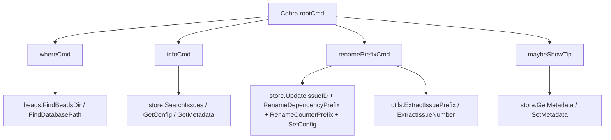

# diagnostics_and_discovery 模块深度解析

`diagnostics_and_discovery` 这组命令（`bd where`、`bd info`、`bd rename-prefix`、提示系统 `tips`）本质上是在做一件事：让系统“知道自己在哪、现在是什么状态、如何安全地自我修复、以及如何把下一步行动提示给用户”。如果没有它，CLI 会像一个只会执行指令但没有环境感知的机器人：能跑命令，却很容易在重定向目录、前缀漂移、配置混乱或用户认知落差时把人带沟里。这个模块存在的价值，不是增加功能点，而是降低“系统可见性盲区”和“运维误操作成本”。

---

## 1. 这个模块解决了什么问题？（先讲问题空间）

在一个支持重定向 `.beads`、多工作区（worktree）、Dolt 后端、自动提交和跨版本演进的 CLI 系统里，最难的问题之一不是“写入数据”，而是“确认你正对着正确的数据写”。`diagnostics_and_discovery` 就是针对这个风险面设计的。

想象你在一个大型机房排障。你先要回答四个问题：

第一，**我连的是哪台机器**（`bd where`）。
第二，**机器当前状态是什么**（`bd info`）。
第三，**命名规则是否已经漂移并需要批量修复**（`bd rename-prefix`）。
第四，**系统是否应在恰当时机给出操作建议**（`tips`）。

一个天真的实现会把这些能力散落在各个命令里：每个命令各自判断目录、各自猜 prefix、各自输出健康信息。这样短期快，长期会出现三类问题：

- 认知不一致：同一仓库，不同命令告诉你不同“当前数据库路径”；
- 修复不一致：前缀变更只改 ID，不改文本引用或依赖计数器，留下隐性坏数据；
- 反馈不一致：提示信息无节制弹出，或者在 `--json` 模式污染机器输出。

本模块把这些横切问题集中处理，背后的设计意图是：**把“可发现性（discovery）”和“可诊断性（diagnostics）”提升为一等能力，而不是附属打印逻辑。**

---

## 2. 心智模型：把它看成“控制塔 + 体检台 + 温和引导器”

你可以用一个机场比喻理解这个模块：

- `where` 像**塔台雷达**，回答“当前航班到底在哪条跑道（真实 `.beads` 目录）”；
- `info` 像**机务体检台**，输出数据库路径、issue 数、配置与 schema 视图，并提供版本变化说明；
- `rename-prefix` 像**机队编号更换系统**，不仅改机身编号（Issue ID），还要同步航线图中的编号引用（文本字段、依赖、计数器）；
- `tips` 像**副驾驶提醒系统**，在不打扰自动化输出的前提下，用条件+频率+概率机制推送下一步建议。

这四者共同构成了一个“运行时可观察与纠偏层”。它不是核心业务 CRUD，但它决定了业务命令在复杂环境里的可靠可用性。

---

## 3. 架构与数据流



从代码能看到，这个模块在架构上是一个**CLI 编排层（orchestrator）**：它本身不实现底层存储算法，而是把环境探测、规则校验、批量变更和提示策略编排成可用命令。

`where` 的关键流是：先通过 `beads.FindBeadsDir()` 找“最终生效”的目录，再通过 `findOriginalBeadsDir()` 反查“是否经历 redirect”，再补充 `beads.FindDatabasePath()` 与 prefix（优先 `store.GetConfig("issue_prefix")`，否则回退 `detectPrefixFromDir`，目前该函数返回空）。这意味着它的输出是一种“解释型定位结果”，不只是路径字符串。

`info` 的关键流是：读取 `dbPath` 的绝对路径后，尽可能从 `store` 补充 issue 数、配置、schema 元数据。`--schema` 会额外读取 `bd_version`，并用 `SearchIssues` 推导 sample IDs 与 `extractPrefix` 检测前缀。`--whats-new` 则走静态 `versionChanges` 数据，不依赖数据库。

`rename-prefix` 的关键流最重：先做运行约束（只读模式、worktree 禁写、store 可用、prefix 合法），再扫描全量 issue 检测前缀集合。单前缀场景走 `renamePrefixInDB`；多前缀场景要求 `--repair`，走 `repairPrefixes`，使用 `generateRepairHashID` 生成冲突可控的新 ID，并批量重写文本引用、依赖前缀、计数器前缀和配置前缀。

`tips` 的流是典型策略引擎：`maybeShowTip` 做入口守卫（`--json`/`--quiet`），`selectNextTip` 用条件、频率和优先级筛候选，再做概率抽样；命中后 `recordTipShown` 把展示时间记到 metadata（或在 auto-commit 模式下延迟写入，由后置流程提交）。

---

## 4. 组件深潜（设计意图 + 机制）

各子模块的详细技术文档可在此查看：
- [位置发现子系统](where_discovery.md) - `where` 命令与 `WhereResult` 详解
- [信息诊断子系统](info_diagnostics.md) - `info` 命令与 `VersionChange` 详解
- [前缀管理子系统](prefix_management.md) - `rename-prefix` 命令与 `issueSort` 详解
- [智能提示子系统](tip_system.md) - `Tip` 结构与提示策略详解

### 4.1 `cmd.bd.where.WhereResult` 与 `where` 命令

`WhereResult` 不是简单 DTO，它表达了定位语义的四层信息：`Path`（真实生效目录）、`RedirectedFrom`（入口目录）、`Prefix`（命名上下文）、`DatabasePath`（底层存储位置）。设计上它让定位结果可被机器消费（JSON）也可被人直接阅读。

`findOriginalBeadsDir()` 的价值在于“解释重定向链”。`FindBeadsDir()` 只告诉你终点，而这个函数尝试告诉你起点，尤其在 `BEADS_DIR` 或目录上行扫描存在 `.beads/redirect` 时非常关键。这里有个非显式但重要的选择：它先做 `filepath.EvalSymlinks` 和 `utils.CanonicalizePath`，避免符号链接导致“看起来不同、其实同一路径”的误判。

`detectPrefixFromDir(_ string) string` 当前是空实现（直接返回 `""`）。这说明模块已经预留了“无 store 场景下的前缀探测回退点”，但尚未落地。新贡献者应把它视为明确扩展点，而不是死代码。

### 4.2 `info` 命令、`extractPrefix`、`VersionChange`、`showWhatsNew`

`info` 命令承担“静态 + 动态”双视角诊断：静态来自路径与版本变更清单，动态来自 store 查询结果。一个关键设计是大量 **best-effort** 读取：比如 `SearchIssues` 或 `GetAllConfig` 失败不会立即中止整条信息输出。这符合诊断命令的目标：优先给用户“尽可能多的上下文”，而非因为局部读取失败就彻底失明。

`extractPrefix(issueID string)` 的实现体现了现实数据兼容性：优先按“最后一个连字符 + 数字尾缀”解析（支持 `beads-vscode-1`），失败后回退“第一个连字符”策略。这是一种“先高置信规则，后宽容回退”的解析思路。

`VersionChange` 和 `versionChanges` 是显式的版本知识库，`showWhatsNew()` 则提供人机双格式输出。它不查询 git，也不推导 changelog，而是采用内建清单，换来输出稳定性和低依赖。

### 4.3 `rename-prefix` 命令与 `issueSort`

`rename-prefix` 是本模块最“手术刀”式的能力。它的目标不是改一个配置键，而是维持 ID、文本引用、依赖图、计数器、配置之间的一致性。

`validatePrefix` 采用正则 + 连字符位置校验，核心约束是必须以小写字母开头，仅含小写字母/数字/`-`。注意：帮助文本中提到“最大 8 字符、必须以连字符结尾”等规则，但函数本身并未执行这些约束，实际行为以代码为准。这是一个需要文档/实现对齐的风险点。

`detectPrefixes` + `issueSort` + `repairPrefixes` 组成“多前缀修复路径”。`issueSort` 让修复顺序按 `(prefix, number)` 稳定，便于 dry-run 预览和可重放性。`repairPrefixes` 会把“目标前缀之外”的 issue 统一重编码为哈希 ID，并在文本字段里按 `renameMap` 做替换，避免只改主键不改内容引用。

`renamePrefixInDB` 则是“单前缀改名路径”，采用顺序更新 issue，再统一改依赖前缀、计数器前缀和 config。函数注释明确指出当前是“逐 issue 事务”，中途失败可能产生混合状态；这不是疏漏，而是已被作者显式承认的技术债，并给出理想方向：存储层提供单一原子 `RenamePrefix()`。

`generateRepairHashID` 用 `sha256` 前 4 字节（8 hex）+ nonce 重试（最多 100 次）来规避批内冲突。这个选择在可读性和冲突概率间做了平衡：ID 足够短，且在修复场景下能快速生成并去重。

### 4.4 `tips` 子系统与 `Tip` 结构

`Tip` 结构把“是否该提示”拆成五个维度：`Condition`、`Frequency`、`Priority`、`Probability`、`Message`。这不是简单 if/else，而是一个轻量策略模型。

`maybeShowTip` 体现了两个边界意识：不污染机器输出（`jsonOutput`）和安静模式（`quietFlag`）。`selectNextTip` 先过滤，再按优先级排序，再概率抽签；高优先级先抽，等价于“紧急提醒先排队”。

`getLastShown` / `recordTipShown` 使用 metadata 持久化展示时间。值得注意的是 `recordTipShown` 对 auto-commit 的特殊处理：若自动提交开启，它不立刻写 metadata，而是标记 `commandDidWriteTipMetadata` 与 `commandTipIDsShown`，由后置流程单独提交，避免把“提示元数据写入”混入业务命令提交。这是很典型的“把噪声变更与业务变更隔离”的设计。

`InjectTip` / `RemoveTip` 提供运行时可扩展注册表，配合 `tipsMutex` 做线程安全访问。内建 `initDefaultTips()` 注册了 `claude_setup` 与 `sync_conflict` 两类提示；但 `syncConflictCondition()` 当前恒为 `false`，说明该能力接口保留着，状态源已被移除。

---

## 5. 依赖关系分析（它调用谁、谁调用它、契约是什么）

这个模块由 `init()` 把命令注册到 `rootCmd`，因此上游调用者是 Cobra 命令分发框架（经 `main()` 的 `rootCmd.Execute()` 触发）。它不是被业务层函数主动调用，而是用户命令驱动的入口模块。

下游依赖主要分四类：

1. 仓库定位能力：`beads.FindBeadsDir()`、`beads.FindDatabasePath()`，背后桥接到 [Beads Repository Context](beads_repository_context.md) 的目录与重定向解析能力。`where` 对这层依赖很强，若重定向规则变更，`RedirectedFrom` 推断逻辑可能失真。
2. 存储查询与变更：`store.SearchIssues`、`GetConfig`、`GetAllConfig`、`GetMetadata`、`SetMetadata`、`UpdateIssueID`、`RenameDependencyPrefix`、`RenameCounterPrefix`、`SetConfig`，对应 [Dolt Storage Backend](dolt_storage_backend.md) / [Storage Interfaces](storage_interfaces.md) 的契约面。
3. Git 环境判断：`git.IsWorktree()`、`git.GetMainRepoRoot()`（在 `rename-prefix` 中用于阻止 worktree 执行高风险写操作），关联 [Beads Repository Context](beads_repository_context.md) 的工作区语义。
4. 工具函数与 UI：`utils.ExtractIssuePrefix`、`utils.ExtractIssueNumber`、`utils.CanonicalizePath` 与 `ui.Render*`，用于解析稳定性和交互反馈。

数据契约上，这个模块假定 issue ID 符合“prefix-后缀”形态，并且文本字段中可能出现可替换的 issue 引用。若未来 ID 语法改变（例如不再使用 `-` 分隔），`extractPrefix`、`detectPrefixes`、正则替换逻辑都会连锁失效。

---

## 6. 关键设计取舍与背后理由

最明显的取舍在 `renamePrefixInDB`：当前选择“实现简单、渐进上线”的逐条更新，而不是一次性原子大事务。优点是落地快、改动面小；代价是中途中断会留下半迁移状态。代码注释已明确这一点，说明团队是有意识地接受短期风险以换取功能可用。

第二个取舍在 `info`：偏向“诊断韧性”而非“严格失败”。很多读取失败只是不显示某些字段，不会整个命令报错。这对线上排障更友好，但也可能掩盖局部故障，需要结合 `bd doctor` 等更严格检查。

第三个取舍在 `tips`：引入概率和频率，牺牲确定性换取“长期不打扰”。如果每次都弹提示，用户很快免疫；如果完全不提示，学习成本又上升。该模块采用了一个折中策略引擎。

第四个取舍在 `where`：既输出最终路径，也尝试还原重定向来源。这增加了逻辑复杂度，但显著提升了“为什么是这个目录”的可解释性，尤其在多 clone / worktree 场景中价值很高。

---

## 7. 使用方式与典型例子

日常定位数据库：

```bash
bd where
bd where --json
```

诊断数据库内容与 schema：

```bash
bd info
bd info --schema
bd info --whats-new
bd info --json
```

安全预演前缀迁移：

```bash
bd rename-prefix kw- --dry-run
```

修复多前缀污染：

```bash
bd rename-prefix mtg- --repair --dry-run
bd rename-prefix mtg- --repair
```

动态注入提示（代码侧）：

```go
InjectTip(
    "upgrade_hint",
    "Run 'bd info --whats-new' after upgrade",
    80,
    24*time.Hour,
    0.5,
    func() bool { return true },
)
```

---

## 8. 新贡献者最该注意的边界与坑

首先，`detectPrefixFromDir` 目前未实现，任何依赖它的“无 store 前缀探测”都不会生效；如果你在 `where` 输出里期待 prefix，通常要依赖 `store.GetConfig("issue_prefix")`。

其次，`rename-prefix` 的帮助文案与 `validatePrefix` 校验规则并不完全一致（例如长度与尾部连字符约束）。改行为前先统一“文案/校验/测试”的真相来源，否则会产生用户认知债。

再次，`renamePrefixInDB` 存在部分提交风险。若你在此处做增强，优先考虑把批量改名下沉到存储层单事务 API，而不是在 CLI 层继续堆补偿逻辑。

另外，`tips` 涉及全局状态（`tips`、`tipRand`、`commandTipIDsShown` 等）与并发访问，新增逻辑必须遵守 mutex 边界；同时要确保不会破坏 `--json` 的输出纯净性。

最后，`syncConflictCondition()` 当前恒 `false`。如果要恢复该提示，请先定义可靠状态源；不要直接改为基于脆弱文件探测，否则会造成误报。

---

## 9. 与其它模块的关系参考

### 子模块导航
- [位置发现子系统](where_discovery.md) - 深入了解 `bd where` 命令的实现细节
- [信息诊断子系统](info_diagnostics.md) - `bd info` 命令的完整技术文档
- [前缀管理子系统](prefix_management.md) - `bd rename-prefix` 命令的工作原理
- [智能提示子系统](tip_system.md) - 提示系统的策略设计与实现

### 相关模块
- 仓库/重定向定位能力来自 [Beads Repository Context](beads_repository_context.md)。
- 存储读写契约与 Dolt 实现细节见 [Storage Interfaces](storage_interfaces.md) 与 [Dolt Storage Backend](dolt_storage_backend.md)。
- 更系统化健康检查与修复策略见 [CLI Doctor Commands](cli_doctor_commands.md)。
- 与路由相关的跨仓库定位可参考 [Routing](routing.md)。

这几个文档建议配合阅读：`diagnostics_and_discovery` 负责“命令侧可见性与纠偏入口”，而真正的数据语义与持久化保证在这些下游模块里。
