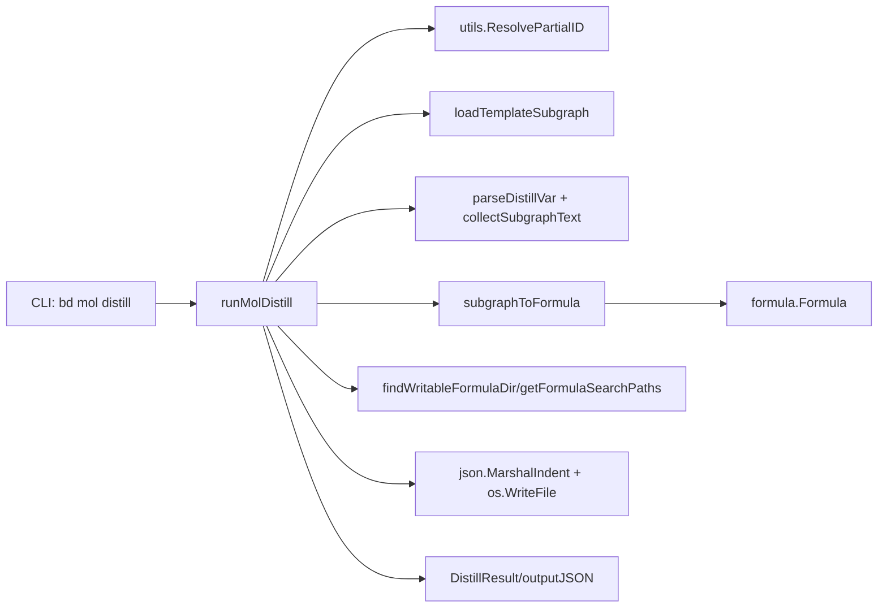

# distill_reverse_template_extraction

`distill_reverse_template_extraction`（对应 `bd mol distill`）解决的是一个非常实际的团队知识沉淀问题：很多高质量工作流最初并不是“先写模板再执行”，而是先在一个真实 epic 里长出来。这个模块的价值，就是把“已经跑通的一次性项目结构”反向提炼成可复用 formula。你可以把它想象成把一盘已经做好的菜，逆向拆解成标准菜谱：不仅保留步骤顺序和依赖，还把具体食材替换成可参数化变量，方便下一次复刻。

直接的朴素做法（比如手工复制 issue 文本）问题很大：容易漏依赖、漏子任务层级、漏优先级和标签，还很难做参数化。这个模块的设计洞察是：把“现有 epic 子图”当作结构化输入，做一次受约束的图到模板转换，而不是自由文本导出。

## 架构角色与数据流

从架构定位上，它是 CLI 层中的一个**反向模板提取器（reverse extractor）**，在职责上更像 transformer + orchestrator：前半段拉取并验证数据，后半段做结构转换并落盘。



主链路是：`runMolDistill` 先解析输入与 flag，然后通过 `utils.ResolvePartialID` 定位 epic，再通过 `loadTemplateSubgraph` 拉出完整子图（root issue、所有后代、子图内依赖）。接着可选地处理 `--var`，把用户给的“变量/具体值”映射变成替换规则，之后调用 `subgraphToFormula` 进行核心转换，生成 `*formula.Formula`。最后选择输出路径并写入 `<name>.formula.json`，同时输出 `DistillResult`（JSON 或人类可读）。

这个模块对外的入口就是命令注册：`init()` 里 `molCmd.AddCommand(molDistillCmd)`，所以调用方是 `mol` 命令聚合层（见 [CLI Molecule Commands](CLI Molecule Commands.md) 与 [molecule_composition_and_extraction](molecule_composition_and_extraction.md)）。

## 心智模型：把“项目子图”压成“可执行配方”

理解这段代码最有效的模型是三层映射：

第一层是**图抽取**：`TemplateSubgraph` 是真实项目拓扑的快照，包含 issue 节点和 dependency 边。

第二层是**语义投影**：`subgraphToFormula` 把节点投影成 `formula.Step`，把边投影成 `depends_on`，并把 root epic 的描述投影为 formula 描述。

第三层是**参数化抽象**：`replacements` 把具体文本替换成 `{{var}}`，同时生成 `formula.VarDef`，把“这次项目里的常量”提升成“下次实例化的输入”。

所以它不是“导出 JSON”，而是“结构保真 + 语义降维 + 参数提升”的组合过程。

## 核心组件深潜

## `runMolDistill(cmd *cobra.Command, args []string)`

这是总编排函数。它先检查 `store`，因为 distill 依赖数据库读取；没有连接直接 `FatalError("no database connection")`。然后解析 `--var`、`--dry-run`、`--output`。

ID 解析使用 `utils.ResolvePartialID`，意味着调用方可以给短 ID。解析失败立即终止，这里选择的是“强一致失败策略”而不是降级猜测，避免从错误 epic 提取错误模板。

加载子图使用 `loadTemplateSubgraph`，这一步是关键契约：distill 假设拿到的是一个“闭包子图”（至少节点齐全、子图内依赖可枚举）。如果上游改了这个函数的过滤策略，distill 的输出结构会直接改变。

formula 命名有两种模式：显式参数优先；否则从 root 标题经 `sanitizeFormulaName` 派生。这里的设计偏向易用性，减少命令输入负担。

变量处理里有个很实用的“容错 UX”选择：`parseDistillVar` 支持 `variable=value` 和 `value=variable` 两种写法，并通过是否出现在文本中自动判别。这样做牺牲了一点确定性，换来了 CLI 交互上的容错性。

输出路径决策是：显式 `--output` > 自动探测可写公式目录（`findWritableFormulaDir`）。自动探测失败给带 hint 的错误，降低首次使用门槛。

最后写文件并组装 `DistillResult`。若 `--json`，走 `outputJSON`；否则给人类可读输出并直接提示下一步 `bd mol pour` 命令，形成闭环。

## `subgraphToFormula(subgraph *TemplateSubgraph, name string, replacements map[string]string) *formula.Formula`

这是转换内核。可以把它看成一个“小型编译器前端”：输入是 issue 子图，输出是 workflow formula AST（`formula.Formula`）。

内部步骤很清晰：先定义 `applyReplacements`，对文本做 `strings.ReplaceAll`；再构建 `idToStepID`，把 issue ID 映射到 step ID（来自 `sanitizeFormulaName(issue.Title)`，空则回退 issue ID）；再构建 `depsByIssue`。

随后遍历 issues 生成 step，特意跳过 root（root 升格为 formula 本体，不变成 step）。字段映射中保留了 `Title/Description/Type/Priority/Labels/DependsOn`，并显式过滤内部标签（`template` 与 `mol:` 前缀标签），避免把运行时/系统语义污染模板语义。

依赖转换时也跳过“依赖 root”的边，因为 root 已经不是 step。最后根据 replacements 生成 `Vars`，统一标记为 `Required: true`，并填默认描述。返回时固定 `Version: 1`、`Type: formula.TypeWorkflow`。

这个实现选择了“最小可用字段集”而不是全量 issue 字段迁移。它更稳、更容易维护，但意味着某些 issue 字段不会被带入 formula。

## `parseDistillVar(varFlag, searchableText string) (findText, varName string, err error)`

这个函数体现了典型的 CLI 容错设计。它先按第一个 `=` 分割，然后基于 `strings.Contains` 判断左右哪边是“已存在于文本中的具体值”。

如果只命中右侧，视为 `variable=value`；只命中左侧，视为 `value=variable`；两边都命中时偏向 `variable=value`（更常见输入习惯）；都不命中则报错。

这个策略不是完全精确的解析器，而是“启发式猜测器”。它的价值是减少用户心智负担；代价是遇到高重名文本时可能猜错。

## `collectSubgraphText(subgraph *MoleculeSubgraph) string`

作用是给变量检测提供语料。它拼接每个 issue 的 `Title/Description/Design/AcceptanceCriteria/Notes`，形成一个大文本池供 `parseDistillVar` 进行包含判断。

值得注意的是，变量替换真正应用只发生在 `Title/Description`（在 `subgraphToFormula` 里），所以这里的“搜索字段集合”比“替换字段集合”更宽。这会提升“能识别到值”的概率，但也会带来“识别到了却不一定会被替换”的心理落差。

## `sanitizeFormulaName(title string) string`

这是标准化函数：非 `[a-zA-Z0-9-]` 字符替换为 `-`，合并多连字符，trim 首尾，空结果回退 `untitled`。它用于自动命名和 step ID 生成，核心目的是保持输出在文件名和引用场景中的稳定性。

## `findWritableFormulaDir(formulaName string) string`

它是一个小型“路径探针”。先拿 `getFormulaSearchPaths()`（项目目录、用户目录、可选 `GT_ROOT` 目录），逐个 `MkdirAll` 后创建 `.write-test` 检查可写性，首个成功目录即返回完整输出路径。

这段逻辑本质是在做“环境适配”，把部署环境差异吸收在边界层，避免核心转换逻辑被 I/O 细节污染。

## `DistillResult`

`DistillResult` 是 distill 命令的结果契约：`FormulaName`、`FormulaPath`、`Steps`、`Variables`。它既用于 `--json` 输出，也定义了人类输出要点。这个结构很轻量，强调“操作结果”而不是“调试细节”。

## 依赖与契约分析

该模块下游依赖可分三类。第一类是数据加载：`utils.ResolvePartialID` 与 `loadTemplateSubgraph`，它们决定 distill 能否拿到正确且完整的输入图。第二类是公式模型：`internal/formula` 的 `Formula`、`Step`、`VarDef`、`FormulaExt`、`TypeWorkflow`，它们定义输出 schema。第三类是 CLI 基础设施：`FatalError/FatalErrorWithHint`、`outputJSON`、`ui.RenderPass`、Cobra flag 系统。

上游调用方非常明确：`molDistillCmd` 在 `init()` 中通过 `molCmd.AddCommand(molDistillCmd)` 接入命令树。也就是说，它不是被业务服务反复调用的库函数，而是 CLI 入口路径上的一次性 orchestrator。

数据契约最关键的是 `TemplateSubgraph`：

- `Root` 必须存在且属于 `Issues`。
- `Dependencies` 里应仅包含可解析的 issue ID 关系。
- `Issues` 中 issue 的 `Title` 不能全部为空（否则 step ID 质量会下降）。

如果这些契约被破坏，distill 的输出要么不可用，要么语义失真。

## 设计取舍与非显而易见选择

这里最明显的取舍是**易用性优先于形式严格性**。例如变量 flag 双语法自动识别、自动选择可写目录、自动从标题推导名称，这些都减少了命令使用摩擦。

另一个取舍是**结构保真优先于字段完备**。它保留 DAG 和关键执行字段，但不尝试覆盖 issue 的所有文本域和元数据。这让 distill 稳定、可预期，但也意味着它不是无损导出器。

还有一个关键取舍是**同步顺序执行**。整个流程是线性、阻塞式的：解析 → 读取 → 转换 → 写入。没有并发优化，因为典型输入规模（单 epic 子图）通常更受 I/O 和用户交互延迟支配。这个选择简化了错误处理和可读性。

## 使用方式与示例

最常见使用：

```bash
bd mol distill bd-o5xe my-workflow
```

带变量提升：

```bash
bd mol distill bd-abc release-workflow --var feature_name=auth-refactor
# 或反向写法（同样支持）
bd mol distill bd-abc release-workflow --var auth-refactor=feature_name
```

预览不落盘：

```bash
bd mol distill bd-abc release-workflow --dry-run --var branch=feature-auth
```

指定输出目录：

```bash
bd mol distill bd-abc release-workflow --output ./tmp/formulas
```

## 新贡献者要特别注意的坑

第一，`replacements` 与 `getVarNames` 都基于 map 迭代，Go 的 map 顺序不稳定。这会导致变量显示顺序不稳定，且当替换值互相重叠时，替换结果可能受迭代顺序影响。

第二，`parseDistillVar` 使用的是 `strings.Contains` 子串匹配，不是词边界或 AST 级别匹配。短字符串很容易误命中，尤其在两边都命中时会按默认策略偏向 spawn-style。

第三，step ID 来自标题清洗，没有全局去重逻辑。不同 issue 标题若清洗后相同，可能产出重复 step ID，影响 `depends_on` 引用清晰度。

第四，当前写文件是直接 `os.WriteFile`，没有“已存在保护”或交互确认，会覆盖同名 formula。

第五，`--output` 下的 formula 名不会再次 sanitize；若传入包含路径分隔符的名字，会影响最终落盘路径结构。这个行为是否期望需要团队约定。

## 扩展建议

如果你要增强这个模块，优先考虑三类改进：其一是替换引擎升级（按词边界、按字段、按优先级）；其二是 step ID 去重策略（例如冲突后追加序号）；其三是输出安全策略（`--force` 覆盖开关或默认防覆盖）。这些改动都不会破坏主流程心智模型，但会显著提升可预测性。

## 参考

- [CLI Molecule Commands](CLI Molecule Commands.md)
- [molecule_composition_and_extraction](molecule_composition_and_extraction.md)
- [bond_polymorphic_orchestration](bond_polymorphic_orchestration.md)
- [CLI Formula Commands](CLI Formula Commands.md)
- [formula_schema_and_composition](formula_schema_and_composition.md)
- [formula_loading_and_resolution](formula_loading_and_resolution.md)
- [issue_domain_model](issue_domain_model.md)
