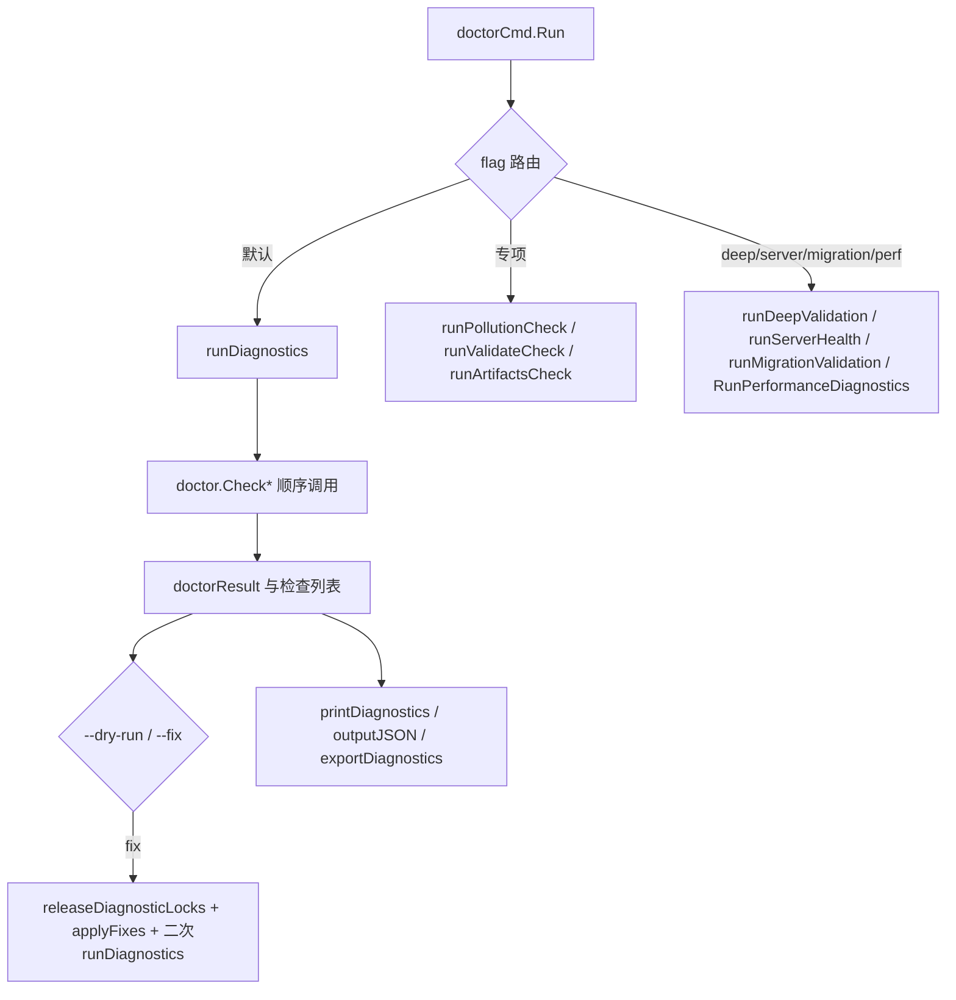

# doctor_command_entry_orchestration

`doctor_command_entry_orchestration` 是 `bd doctor` 的“总调度台”。直白说，它不负责发明每一项健康检查，而是负责把几十个分散的检查点组织成一个可执行流程：先决定跑哪条诊断路径、再收敛成统一结果、必要时执行修复并复检、最后按人类/机器友好的格式输出并给出退出码。这个模块存在的价值在于“编排正确性”——如果只把检查函数简单串起来，很容易出现自干扰（比如锁检查假阳性）、修复后无验证、输出契约不一致等问题。

## 问题空间：为什么需要专门的编排层

在 beads 里，`doctor` 不是单一子系统的自检，而是跨 `.beads` 目录、数据库后端（尤其 Dolt）、Git hooks、迁移状态、文档集成、运行时锁与并发建议的一次全景检查。朴素方案通常是“调用若干 `Check*` 然后打印”，但会马上遇到三个现实问题。

第一，检查之间有前后依赖，顺序错了会制造假问题。源码里最典型的是 `CheckLockHealth` 必须在任何可能打开 embedded Dolt 的检查之前执行，否则 doctor 自己创建的 noms lock 会被后续检查误判成“其他进程持锁”。

第二，同一套检查结果要同时服务三类消费者：终端用户、CI/自动化脚本、历史归档。没有统一结果模型就会出现“终端好看但 JSON 不稳定”或“机读齐全但人读难懂”的割裂。

第三，修复动作必须闭环。`--fix` 不是命令成功就算好，而是修复后重新诊断确认状态真的恢复。这个闭环本身也需要编排层来保证。

因此，这个模块的核心设计洞察是：**把 doctor 看成一个工作流系统，而不是检查函数集合**。

## 心智模型：像“医院分诊台 + 复查中心”

理解这个模块最有效的方式，是把它想成医院流程。`doctorCmd.Run` 是分诊台，先看你挂哪一科（`--perf`、`--check`、`--deep`、`--server`、`--migration` 或默认全量）。`runDiagnostics` 是综合门诊，按固定顺序把所有检查做完并形成一份病例（`doctorResult`）。`--fix` 像手术，做完必须复查（再次 `runDiagnostics`）。最后输出层相当于病历系统：门诊打印（`printDiagnostics`）、结构化电子病历（`--json`）、导出档案（`--output`）。

抽象上，模块只维护两个核心数据结构：`doctorCheck`（单条检查结论）和 `doctorResult`（一次运行的聚合结果）。这两个结构足够“薄”，却承载了编排、输出和自动化契约。

## 架构与数据流



主路径的数据流是：命令入口解析目标路径后，根据 flag 选择执行分支。默认分支进入 `runDiagnostics(path)`，后者连续调用 `doctor` 包中的 `Check*` 函数，把每条 `doctor.DoctorCheck` 通过 `convertDoctorCheck` 或 `convertWithCategory` 转为本模块的 `doctorCheck` 并追加到 `result.Checks`。与此同时，编排层根据状态更新 `result.OverallOK`。当执行 `--fix` 时，流程会先清理诊断可能遗留的 Dolt 锁、执行修复、再次清理并复跑诊断，确保最终状态可信。输出阶段再根据 `--json`/`--output` 走不同渲染路径，并在失败时通过 `os.Exit(1)` 暴露给外层自动化。

## 组件深潜

### `doctorCheck`

`doctorCheck` 是单项检查的统一协议，字段包括 `Name`、`Status`、`Message`、`Detail`、`Fix`、`Category`。设计上它刻意保持轻量：核心判定用前三个字段，`Detail` 与 `Fix` 负责人类可操作信息，`Category` 负责输出分组。这个结构的价值不在表达复杂领域模型，而在跨检查项的一致消费能力。

### `doctorResult`

`doctorResult` 表示一次诊断会话，承载目标路径、检查列表、总体是否通过、CLI 版本，以及可选的时间戳和平台信息。这里的关键是 `OverallOK`：它不是简单“有 warning 就失败”，而是在编排时按检查语义做策略判断（有些 warning 只提示，有些 warning/error 会拉低总状态）。

### `doctorCmd.Run`

这是模块入口，也是最大编排函数。它先确定检查路径，优先级为“显式参数 > `BEADS_DIR` 的父目录 > 当前目录”。随后按 flag 做短路路由：`--perf`、`--check-health`、`--check`、`--deep`、`--server`、`--migration` 都会提前返回，避免不必要的全量检查。默认路径执行 `runDiagnostics`，并在 `--dry-run` 或 `--fix` 模式下进入修复流程。输出阶段统一处理 JSON、人类可读打印、文件导出与失败退出码。

这里一个不明显但重要的设计选择是：入口把“业务检查逻辑”尽量下沉到 `doctor` 包，把“流程控制和生命周期”留在本文件。这让检查内容可扩展，而入口行为保持稳定。

### `runDiagnostics(path string) doctorResult`

这是全量诊断的核心编排器。它负责初始化结果对象、自动探测 `doctorGastown`、执行安装检查、提前执行锁健康检查、做版本跟踪与自动迁移触发，然后按固定顺序调用大量 `doctor.Check*`。每次追加检查后，按规则更新 `OverallOK`。

几个关键机制体现了“为什么这样写”：

1. 安装检查前置并可早退：`.beads` 不存在时，继续跑后续检查只会产生噪声，因此直接返回。
2. 锁检查前置：规避 doctor 自身产生的 lock 假阳性。
3. 针对 `bd doctor <path>` 的环境隔离：函数临时设置 `BEADS_DIR` 到目标路径并恢复原值，避免误触调用者当前仓库状态。
4. 分类输出一致性：大部分检查通过 `convertWithCategory` 强制分组，保障后续 `printDiagnostics` 体验和排序稳定。

### `runInitDiagnostics(path string) doctorResult`

这是“初始化后快速验收”的精简编排，只跑安装、数据库版本、schema、权限、Dolt 连接与 schema 等必需项。它刻意跳过 Git/federation 等新仓库暂时无法满足的检查，体现了场景化编排而非“一刀切全量”。

### `releaseDiagnosticLocks(path string)`

此函数用于清理诊断阶段可能遗留的 Dolt noms `LOCK` 文件。它先定位 `.beads`（含 `beads.FollowRedirect`），读取配置，确认后端是 `configfile.BackendDolt` 才继续。然后扫描 Dolt 路径下各目录并尝试删除 `.dolt/noms/LOCK`。

这里的取舍很现实：它只做“尽力清理”（大量 `return` 和忽略删除错误），目标是降低后续修复阶段被锁阻塞的概率，而不是在清理失败时中断主流程。

### `convertDoctorCheck` / `convertWithCategory`

这两个函数看似简单，但承担了模块边界隔离。编排层对外暴露自己的 `doctorCheck` 结构，不直接传播 `doctor.DoctorCheck`，避免入口代码被下游包的结构演化直接牵动。`convertWithCategory` 还支持在编排层统一覆盖分类。

### `exportDiagnostics(result, outputPath)`

负责把 `doctorResult` 以缩进 JSON 写入用户指定路径。它使用 `os.Create` 和 `json.Encoder`，错误统一包裹后上抛。这个函数让“导出”和“终端打印”解耦，便于自动化归档。

### `printDiagnostics(result)` 与 `printAllChecks(...)`

输出层主打“先摘要、后分组、再细节”。`printDiagnostics` 先统计通过/警告/错误数量，再按 `Category` 聚合；非 verbose 模式只展示问题项，verbose 模式通过 `printAllChecks` 展示全量。分类顺序依赖 `doctor.CategoryOrder`，同类内错误优先于警告。`Fix` 支持多行展示，降低用户复制执行成本。

### `runMigrationValidation(path, phase)`

该函数是迁移场景的专用入口，`phase` 仅允许 `pre` 或 `post`。它分别调用 `doctor.CheckMigrationReadiness` / `doctor.CheckMigrationCompletion`，并在 JSON 模式输出 `check + validation + cli_version + timestamp`。如果 `validation.Ready` 为假则退出码为 1，方便流水线直接把它当 gate。

## 依赖关系分析

从“它调用谁”看，本模块是典型 orchestrator，重依赖以下边界：

它最核心地调用 [CLI Doctor Commands](CLI Doctor Commands.md) 里的 `doctor` 子包检查函数（例如 `doctor.CheckInstallation`、`doctor.CheckSchemaCompatibility`、`doctor.RunDoltHealthChecksWithLock`、`doctor.CheckMigrationReadiness` 等），本身不重复实现检查细节。

它调用 [Beads Repository Context](Beads Repository Context.md) 对应的 `beads.FollowRedirect` 来解析重定向目录，保证诊断路径指向真实数据目录。

它调用 [Configuration](Configuration.md) 的 `configfile.Load`、`cfg.GetBackend()`、`cfg.DatabasePath(...)` 来判断是否需要执行 Dolt 锁清理。

它调用 UI 渲染工具（`internal/ui`）输出状态图标、分类标题和样式化文本，保证 CLI 输出一致。

它还依赖 Cobra 命令框架（`*cobra.Command`）承接命令入口与 flag 生命周期。

从“谁调用它”看，源码片段显示 `doctorCmd` 是一个 Cobra 子命令对象，由 CLI 命令树调度执行。当前给定代码未展示父命令注册位置，因此无法在本文精确列出上游函数名；可以确定的是，上游对它的契约是“接受路径与 flags，输出终端/JSON，并通过退出码表达整体健康状态”。

数据契约方面，编排层与下游检查函数之间使用 `doctor.DoctorCheck`；编排层对外输出 `doctorCheck` 与 `doctorResult`（JSON 标签固定），这意味着一旦字段改名会影响 `--json` 与 `--output` 的兼容性。

## 关键设计取舍

这个模块在多个维度做了偏向“稳态正确性”的选择。首先是顺序执行而非并发执行，牺牲了部分耗时，换取检查间因果可控。其次是统一薄契约而非富领域返回值，牺牲局部表达力，换取全流程一致输出。再次是修复后强制复检，牺牲执行时间，换取修复可信度。

还有一个隐性取舍是全局状态与便捷性之间的平衡。像 `doctorGastown` 会在运行中被自动探测并可能修改，这是实现简洁但有全局副作用的做法；在并发或复用场景里要特别小心。

## 使用方式与示例

最常见是直接执行：

```bash
bd doctor
```

对特定仓库执行并导出结构化结果：

```bash
bd doctor /path/to/repo --json --output diagnostics.json
```

修复并自动复检：

```bash
bd doctor --fix --yes
```

迁移前自动化 gate：

```bash
bd doctor --migration=pre --json
# Ready=false 时进程退出码为 1
```

`--dry-run` 可以先看修复计划而不落盘：

```bash
bd doctor --dry-run
```

## 新贡献者应重点注意的坑

首先注意状态判定语义。`statusWarning` 不一定影响 `OverallOK`，但某些 warning 在编排层会被视为失败条件；新增检查时必须明确“只是提示”还是“阻断问题”，否则会改变 CI 行为。

其次注意检查顺序是有语义的，特别是 lock 相关逻辑。不要随意把会打开 Dolt 的检查移动到 `CheckLockHealth` 之前。

第三，`runDiagnostics` 会临时改写 `BEADS_DIR` 并恢复。新增逻辑如果在这个窗口读取环境变量，要理解其作用域，避免把目标仓库和当前仓库状态混淆。

第四，`releaseDiagnosticLocks` 只对 Dolt 后端生效，而且是 best-effort。不要假设它能提供强一致锁恢复。

第五，JSON 输出是外部契约。改 `doctorCheck` / `doctorResult` 字段名或含义，等价于变更 API，需要考虑兼容和版本策略。

## 扩展建议（如何新增一个检查并接入）

新增检查的推荐路径是：先在 `doctor` 子包提供新的 `Check*` 返回 `doctor.DoctorCheck`；再在 `runDiagnostics` 选择合适位置调用，并通过 `convertWithCategory` 归类；最后明确其是否影响 `OverallOK`。如果该检查存在可修复动作，还应考虑 `--fix`/`--dry-run` 路径是否需要接入，并保证修复后复检可以覆盖到该项。

## 参考文档

- [CLI Doctor Commands](CLI Doctor Commands.md)
- [doctor_contracts_and_taxonomy](doctor_contracts_and_taxonomy.md)
- [database_state_checks](database_state_checks.md)
- [dolt_connectivity_and_runtime_health](dolt_connectivity_and_runtime_health.md)
- [migration_readiness_and_completion](migration_readiness_and_completion.md)
- [maintenance_detection_and_auto_cleanup](maintenance_detection_and_auto_cleanup.md)
- [Configuration](Configuration.md)
- [Beads Repository Context](Beads Repository Context.md)
