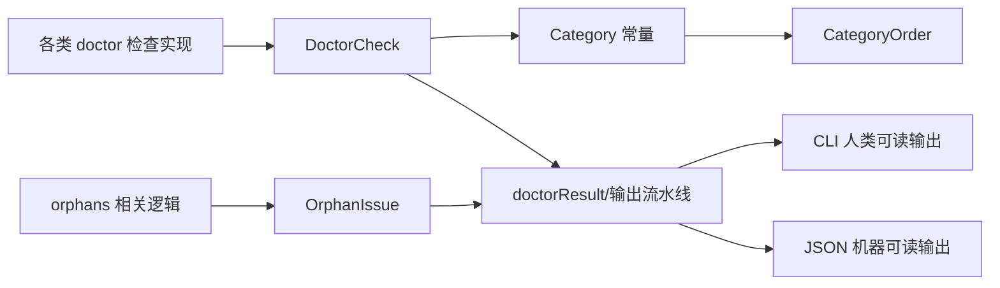

# doctor_contracts_and_taxonomy

`doctor_contracts_and_taxonomy` 这个模块看起来很小，但它在 `bd doctor` 体系里扮演的是“诊断语言规范层”的角色：它不做检查逻辑本身，而是定义**检查结果如何被表达、分组和解释**。你可以把它想象成医院里的“检验报告模板与分诊标签系统”——真正做血检和影像的是别的科室，但如果没有统一的报告字段、严重级别和科室分类，医生和病人都无法快速理解结果，更无法做自动化处理。

朴素做法是每个检查点各自返回随意的字符串，CLI 直接打印。但那样会立刻出现三个问题：结果不可聚合、输出不可排序、JSON 消费方不可依赖。这个模块存在的核心价值，就是把 `doctor` 相关输出收敛成稳定契约（contract）+ 稳定分类法（taxonomy），让检查实现和展示层解耦。

---

## 架构角色与数据流



从架构上看，这个模块是一个轻量“边界类型层”（boundary types layer）：

它向上服务于 `CLI Doctor Commands` 的命令入口与输出拼装（见 [CLI Doctor Commands](CLI Doctor Commands.md)），给调用方一个稳定的数据结构 `DoctorCheck`；它向横向场景服务于 orphan 诊断相关能力，通过 `OrphanIssue` 在 `bd doctor` 与 `bd orphans` 间复用同一语义模型（见 [CLI Orphan & Duplicate Commands](CLI Orphan & Duplicate Commands.md)）。它几乎不向下依赖复杂模块——这是有意设计：契约层越“干净”，越不容易因为底层存储、集成后端变化而频繁抖动。

关键流向可以概括为：

1. 各检查逻辑产出一个个 `DoctorCheck`。
2. 每个检查通过 `Status`（`ok`/`warning`/`error`）表达严重度，通过 `Category` 归档到统一分组。
3. 展示或序列化阶段使用 `CategoryOrder` 保持稳定输出顺序，避免每次运行顺序漂移。
4. 在 orphan 场景中，`OrphanIssue` 作为共享结构跨命令传递，避免两套近似但不一致的数据定义。

---

## 心智模型：它不是“业务逻辑”，而是“诊断协议”

理解这个模块最好的方式，是把它当成一个小型协议定义文件。

`DoctorCheck` 是“报文格式”；`Status*` 常量是“严重级别枚举”；`Category*` + `CategoryOrder` 是“分类字典和展示排序策略”；`OrphanIssue` 是“跨命令共享载荷”。

也就是说，这里主要解决的是**语义一致性**，不是算法复杂性。复杂检查会持续增加，但只要都说同一种“语言”，调用链上游（检查实现）和下游（CLI 输出、JSON 消费、未来 UI）都能持续协作。

---

## 组件深潜

## `StatusOK` / `StatusWarning` / `StatusError`

这三个常量把检查结果压缩为三段严重度。看似简单，实际是一个重要取舍：

它放弃了更细粒度（如 info/critical/fatal）的表达力，换来跨检查点、跨后端、跨输出渠道的一致可比性。对于 `doctor` 这种“系统体检”命令，使用者核心问题通常是“是否健康、是否可继续工作、是否需要立即处理”，三态往往足够。

隐含契约是：调用方应只写入这三种字面值之一（`"ok"` / `"warning"` / `"error"`）。因为字段类型是 `string` 而非强类型枚举，编译器不会替你兜底，团队纪律和代码评审就变得关键。

## `CategoryCore` ~ `CategoryFederation` 等分类常量

这组常量定义了诊断结果的“主题维度”，例如 `Core System`、`Data & Config`、`Git Integration`、`Performance` 等。它的设计目的不是为了让检查逻辑更易写，而是为了让**输出更易读、问题更易定位**。

没有分类时，几十条检查会变成长列表；有分类后，用户可以像读目录一样快速跳到关心领域。对于运维场景，这相当于把“告警流”变成“按系统边界组织的告警面板”。

## `CategoryOrder`

`CategoryOrder` 是一个显式的展示顺序数组。这个设计解决的是“可预测性”问题：

如果按 map/遍历自然顺序输出，类别顺序会不稳定，用户很难建立阅读肌肉记忆，自动化快照测试也容易抖动。显式顺序牺牲了一点维护成本（新增分类时需同步更新），换来一致的用户体验与更稳定的测试基线。

注意这也是一个隐含约束：新增 `Category*` 常量时，若忘记加入 `CategoryOrder`，新类别可能在输出层出现位置异常或被遗漏（取决于调用代码策略，当前模块本身不做校验）。

## `type DoctorCheck struct`

`DoctorCheck` 是这个模块最核心的数据契约，字段含义如下：

- `Name string`: 检查项名称，面向人类识别。
- `Status string`: 严重度，注释明确应使用 `StatusOK`/`StatusWarning`/`StatusError`。
- `Message string`: 结果摘要，通常是一句话结论。
- `Detail string \`json:"detail,omitempty"\``: 可选细节；为空时不出现在 JSON。
- `Fix string \`json:"fix,omitempty"\``: 可选修复建议；为空时不出现在 JSON。
- `Category string \`json:"category,omitempty"\``: 可选分类标签，用于分组展示。

设计意图非常明确：把“结论（Message）”与“操作建议（Fix）”拆开，让调用方既可做纯观测输出，也可做行动导向输出。`omitempty` 的使用也说明作者希望 JSON 输出保持紧凑，避免大量空字段噪音。

一个典型构造示例：

```go
check := DoctorCheck{
    Name:     "Dolt Connection",
    Status:   StatusWarning,
    Message:  "Dolt server is reachable but response latency is high",
    Detail:   "p95 latency exceeds baseline",
    Fix:      "Check local Dolt process load and disk I/O",
    Category: CategoryPerformance,
}
```

## `type OrphanIssue struct`

`OrphanIssue` 表示“在提交中被引用但仍处于 open 状态的问题项”，字段包括：

- `IssueID`
- `Title`
- `Status`
- `LatestCommit`
- `LatestCommitMessage`

代码注释直接给出关键设计信息：它被 `bd orphans` 与 `bd doctor` 共享。这是一个典型的“跨命令语义去重”动作：与其在两个命令里各定义一份类似结构并长期漂移，不如在契约层合并，确保同一概念在系统里只有一种表示。

---

## 依赖关系与契约边界

基于给定模块树，这个模块位于 `CLI Doctor Commands` 的 `doctor_contracts_and_taxonomy` 子模块，属于命令层的公共类型定义。

从“谁调用它”角度，它主要被 `doctor` 命令输出相关路径消费（见 [CLI Doctor Commands](CLI Doctor Commands.md) 中 `command_entry_and_output_pipeline`），并与 orphan 相关命令语义对齐（见 [CLI Orphan & Duplicate Commands](CLI Orphan & Duplicate Commands.md)）。

从“它调用谁”角度，这个文件不调用其他模块中的函数，也不依赖外部服务；它只依赖 Go 基础类型和 struct tag 机制。这种低依赖特性是契约模块应有的形态：

- 好处：稳定、易复用、迁移成本低。
- 代价：约束力偏软（例如 `Status`/`Category` 不是强枚举），需要上层自觉遵守。

数据契约层面，有两个重要隐式协议：

1. `Status` 字段应使用定义好的状态常量。
2. `Category` 字段应优先使用定义好的分类常量，并与 `CategoryOrder` 协同。

一旦上游绕过常量硬编码任意字符串，下游分组/排序和一致性就会退化。

---

## 设计取舍与背后理由

这个模块最值得注意的不是“写了什么”，而是“故意没写什么”。

它没有提供构造函数、验证函数或方法；全部使用公开 struct + 常量。这是一个偏向简洁和低摩擦的选择：任何检查实现都能零成本构造结果对象，开发速度快，跨包使用自然。

代价是类型安全较弱。比如 `DoctorCheck.Status` 不是自定义类型，理论上可填任意字符串。更严格的替代方案包括：

- 用自定义 `type Status string` + 常量，甚至配套 `Validate()`；
- 提供 `NewDoctorCheck(...)` 在构造时做字段校验。

当前实现显然选择了“轻协议、重约定”。在 CLI 工具上下文里，这通常是合理的：诊断检查扩展频繁，工程师更看重增量开发速度与可读性，而不是强约束框架。

另一个取舍是分类顺序的显式维护。它引入手动同步成本，但换来稳定输出。这非常契合命令行产品：用户对输出顺序有认知预期，变动会显著影响可用性。

---

## 使用方式与扩展示例

新增一个 `doctor` 检查时，实践上应遵循以下模式：

```go
result := DoctorCheck{
    Name:     "Metadata Schema",
    Status:   StatusError,
    Message:  "metadata.json schema mismatch",
    Detail:   "field 'owner' has invalid type",
    Fix:      "Run migration or update schema config",
    Category: CategoryMetadata,
}
```

如果你引入了新的诊断领域（例如安全性），请同步完成两件事：

1. 新增对应 `Category*` 常量；
2. 在 `CategoryOrder` 中插入期望位置。

否则下游展示的一致性会受影响。

对于 orphan 相关输出，优先复用 `OrphanIssue`，不要在命令包里再复制一份“几乎一样”的结构体。这能避免后续字段语义分叉。

---

## 新贡献者最容易踩的坑

第一，`Status` 和 `Category` 都是字符串字段，不会被编译器限制。拼写错误（如 `warn`）不会在编译期暴露，却会在运行时悄悄破坏分组和展示逻辑。

第二，`CategoryOrder` 不是自动从常量推导，新增分类后忘记更新顺序会导致输出体验不稳定。把这一步写进 PR checklist 很有必要。

第三，`Detail`/`Fix`/`Category` 带 `omitempty`。这对 JSON 消费方意味着“字段可能不存在”，而不是“字段存在但为空字符串”。如果你在外部工具里做反序列化，必须按可选字段处理。

第四，`OrphanIssue` 目前没有 JSON tag。如果你打算把它直接用于外部 API，请先确认序列化字段名策略是否满足兼容要求。

---

## 相关模块参考

- 总体命令上下文与聚合关系：[`CLI Doctor Commands`](CLI Doctor Commands.md)
- orphan 语义相关命令域：[`CLI Orphan & Duplicate Commands`](CLI Orphan & Duplicate Commands.md)
- 若需理解健康检查结果最终如何呈现，可继续阅读 doctor 命令入口与输出流水线相关文档（同目录下 doctor 子模块文档）。
