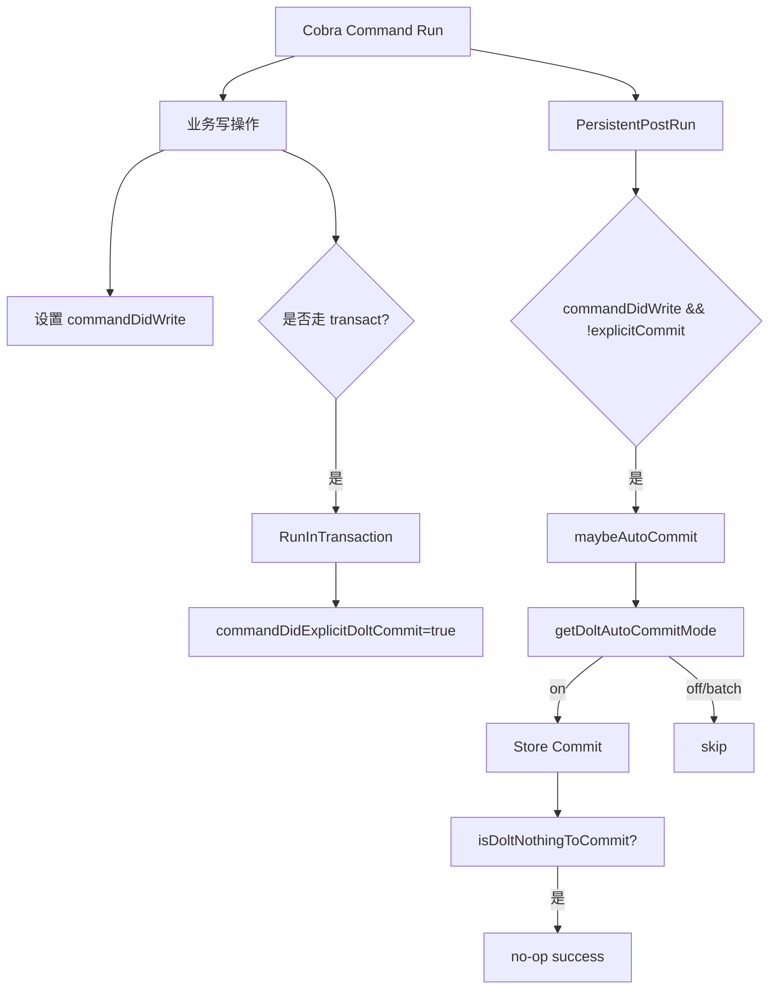

# dolt_autocommit_policy 深度解析

`dolt_autocommit_policy` 模块的核心价值，不是“帮你自动执行一次 commit”这么简单。它真正解决的是 **CLI 写操作生命周期和 Dolt 版本化语义之间的协调问题**：一次 `bd create`、`bd update` 这类命令，可能会写数据、可能已经在事务里显式提交、也可能处于批处理模式不该马上提交。如果没有统一策略，结果通常是“要么漏提交流水线不完整，要么重复提交把历史弄脏”。这个模块就像一位“交通警察”，在命令结束点判断：现在该不该 commit、用什么消息 commit、遇到“nothing to commit”该不该当错误。

---

## 1. 这个模块要解决什么问题？

在 Beads CLI 场景里，写操作和 Dolt commit 并不是一一对应的。一个朴素方案是“每次写完都立刻 `st.Commit(...)`”，但会立刻撞上几个现实问题。

第一，**有些命令已经通过事务路径完成了显式提交**。例如通过 `RunInTransaction` 执行的路径，本身就会产生 `DOLT_COMMIT`。如果你在命令末尾再来一次 auto-commit，就会出现重复提交尝试，轻则产生 no-op，重则引入噪声或报错处理复杂化。

第二，**批处理模式需要跨命令积累工作集**。`batch` 模式的目标是减少碎片提交，把多个写操作合并成逻辑边界提交（例如 `bd dolt commit` 或同步边界），这与“每条命令都提交”天然冲突。

第三，**不同版本 / 路径的 Dolt 错误文案不完全稳定**。同样是无变更，可能出现 `nothing to commit` 或 `no changes ... commit`。如果机械地把这类错误上抛，会把“正常空操作”误判为失败。

第四，**commit message 需要稳定可读且可检索**。自动提交消息不是无关紧要的字符串，它直接影响后续审计、排障和历史浏览体验。模块里专门做了消息归一化（命令名、actor、issue id 去重排序截断）。

所以，这个模块存在的根本原因是：**把“是否提交、何时提交、如何命名、什么算错误”从分散的命令实现中抽离出来，形成一致策略层**。

---

## 2. 心智模型：把它当成“命令收尾阶段的提交策略器”

一个好记的类比：想象机场的离港流程。命令主体逻辑是“登机口处理”（写数据）；而 `dolt_autocommit_policy` 是“最后安检口”——它不关心你在前面做了什么业务细节，只关心在离港前是否满足起飞条件：

- 当前策略模式是什么（`off | on | batch`）
- 当前命令是否已显式 commit
- 当前 store 是否可用
- 这次 commit 的消息是否可生成
- 返回错误是不是“nothing to commit”这类可忽略情况

这个模块的抽象很小，但边界清晰：

- `doltAutoCommitParams`：提交时的上下文载荷（命令名、相关 issue、消息覆盖）
- `maybeAutoCommit(...)`：策略决策 + 提交执行
- `transact(...)`：事务包装器，负责“显式提交标记”
- `getDoltAutoCommitMode()`：模式解析与校验（来自全局配置/flag）
- `formatDoltAutoCommitMessage(...)`：消息归一化器
- `isDoltNothingToCommit(...)`：错误语义归类器

---

## 3. 架构与数据流



在当前代码里，主入口是 `main.go` 的 `PersistentPostRun`。它在命令成功收尾时检查 `commandDidWrite` 与 `commandDidExplicitDoltCommit`。只有“发生写入且尚未显式提交”时，才调用 `maybeAutoCommit(rootCtx, doltAutoCommitParams{Command: cmd.Name()})`。

`maybeAutoCommit` 首先调用 `getDoltAutoCommitMode()` 解析策略。如果不是 `doltAutoCommitOn`，直接返回；这就是 `batch` 延迟提交和 `off` 禁用提交的统一出口。若模式是 `on`，再通过 `getStore()` 拿到活动 `*dolt.DoltStore`，生成/选择 commit message，最后调用 `st.Commit(ctx, msg)`。提交失败时，通过 `isDoltNothingToCommit(err)` 把“无变更”归类为 no-op，其它错误才上抛。

另一路关键数据流是“显式事务提交路径”。`transact(ctx, s, commitMsg, fn)` 封装了 `s.RunInTransaction(...)`，成功后设置 `commandDidExplicitDoltCommit = true`。这个标志会让 `PersistentPostRun` 跳过 `maybeAutoCommit`，避免重复提交。

最后，`main.go` 里还有一个与 batch 语义强相关的关闭路径：`setupGracefulShutdown()` 在收到 `SIGTERM/SIGHUP` 时触发 `flushBatchCommitOnShutdown()`，后者会在 `doltAutoCommitBatch` 模式下调用 `st.CommitPending(ctx, getActor())`，尽可能把工作集里的累计变更落成提交，避免优雅退出时丢失“尚未显式 commit 的 batch 写入”。

---

## 4. 核心组件深挖

## `doltAutoCommitParams`

这个 struct 很小，但是策略模块对外契约的核心：

```go
type doltAutoCommitParams struct {
    Command string
    IssueIDs []string
    MessageOverride string
}
```

设计意图是把“提交语义上下文”从函数参数爆炸里收拢起来。`Command` 用于默认消息；`IssueIDs` 用于增强可追踪性；`MessageOverride` 为上层场景（如 tip metadata）保留强制消息控制权。这个模型偏“最小必需字段”，不是通用审计事件模型，体现了该模块“只负责提交策略，不负责完整审计”的边界选择。

## `maybeAutoCommit(ctx, p)`

这是策略引擎入口。内部步骤是固定管线：

1. 读取并校验模式：`getDoltAutoCommitMode()`
2. 仅 `on` 模式继续；`off/batch` 直接返回
3. `getStore()` 为空时返回（防御性 no-op）
4. 计算 commit message（优先 `MessageOverride`）
5. 调 `st.Commit(ctx, msg)`
6. 把“nothing/no changes to commit”当成功 no-op

重点不是算法复杂，而是“语义守卫顺序”合理：先策略、再资源、再执行、再错误归类。这样既避免不必要调用，也让错误边界可预测。

## `transact(ctx, s, commitMsg, fn)`

`transact` 的价值在注释里已经说得很直接：它是 `RunInTransaction` 的语义包装层。成功事务后设置 `commandDidExplicitDoltCommit`，告诉命令收尾逻辑“本命令已完成 Dolt 提交，不要再 auto-commit”。

这属于典型的“side-channel 协议”：通过共享状态位连接“执行阶段”和“后处理阶段”。优点是落地成本低，不强制改造每个命令返回结构；代价是贡献者必须记住：**直接调用 `store.RunInTransaction` 会绕开这条协议**。

## `getDoltAutoCommitMode()`（位于 `dolt_autocommit_config.go`）

它把全局字符串 `doltAutoCommit` 归一化为受限枚举：`off`、`on`、`batch`。非法值直接报错：

```go
fmt.Errorf("invalid --dolt-auto-commit=%q (valid: off, on, batch)", doltAutoCommit)
```

这个函数是“配置可信边界”。`main.go` 在 `PersistentPreRun` 早期调用它做 fail-fast 校验，保证后续命令执行阶段不再处理“未知模式”分支。

## `formatDoltAutoCommitMessage(cmd, actor, issueIDs)`

它做了几件关键归一化：

- 空 `cmd` 回退为 `write`
- 空 `actor` 回退为 `unknown`
- `issueIDs` trim、去空、去重
- 排序（`slices.Sort`）保证确定性
- 最多保留 5 个 ID，避免提交消息失控膨胀

这让自动提交消息同时满足“可读、可比对、可测试”。测试文件 `dolt_autocommit_test.go` 明确验证了去重排序和截断行为。

## `isDoltNothingToCommit(err)`

这个函数本质是跨版本兼容层。它用字符串匹配吸收 Dolt 文案差异，把 `nothing to commit` 与 `no changes`+`commit` 归类为可忽略。它并不完美（依赖文案），但在缺乏更稳定 machine-readable 错误码时，这是务实折中。

---

## 5. 依赖关系分析（调用它 / 它调用谁）

从已给代码可确认的调用关系如下。

`dolt_autocommit_policy` 直接依赖：

- `getDoltAutoCommitMode()`（配置解析）
- `getStore()`、`getActor()`（运行时上下文访问器，见 [CLI Command Context](CLI Command Context.md)）
- `(*dolt.DoltStore).Commit`、`(*dolt.DoltStore).RunInTransaction`（见 [Dolt Storage Backend](Dolt Storage Backend.md)）
- `storage.Transaction`（事务回调契约，见 [Storage Interfaces](Storage Interfaces.md)）

明确调用该模块（从代码片段可见）：

- `main.go` 的 `PersistentPostRun` 调 `maybeAutoCommit(...)`
- `main.go` 的 tip metadata 提交路径再次复用 `maybeAutoCommit(...)`
- 命令处理代码应通过 `transact(...)` 替代直接 `RunInTransaction`（这是显式注释约束）

相关但在模块外的耦合点：

- `commandDidWrite` / `commandDidExplicitDoltCommit` 全局状态位决定是否触发策略
- `setupGracefulShutdown` / `flushBatchCommitOnShutdown` 负责 batch 模式信号收尾提交

如果上游改动这些状态位生命周期（例如不再在 `PersistentPreRun` reset），auto-commit 触发语义会立即偏移。这个模块与命令生命周期（Cobra pre/post run）是**强耦合**的。

> 说明：当前提供的组件代码里没有完整 machine-readable `depended_by` 列表；以上“谁调用它”依据可见源代码路径确认。

---

## 6. 关键设计取舍

这个模块有几处很典型的工程取舍。

第一是 **简单状态位协议 vs 强类型执行结果**。现在用 `commandDidWrite` / `commandDidExplicitDoltCommit` 协调阶段，接入简单、迁移成本低；代价是隐式契约多，容易被新代码绕开。若改成每个命令返回 `CommandOutcome{DidWrite, DidCommit}` 会更强类型，但要大规模重构 Cobra 执行链。

第二是 **字符串错误归类 vs 错误码分层**。`isDoltNothingToCommit` 通过文本匹配处理兼容性，短期稳妥；长期看，若 Dolt API 提供结构化错误码，会更健壮且更少误判。

第三是 **即时提交(on) vs 吞吐优化(batch)**。`on` 最大化每条命令的持久化确定性，适合审计敏感场景；`batch` 减少提交噪声、提升操作流畅度，但引入“工作集暂存”窗口，需要额外关闭信号 flush 来兜底。

第四是 **提交消息信息量 vs 可读性上限**。ID 截断到 5 个是明显的人机折中：保留线索但避免 message 爆炸。

---

## 7. 使用方式与示例

常见 CLI 用法：

```bash
# 每次写命令后自动提交
bd --dolt-auto-commit on create "Fix parser bug"

# 批处理模式：命令只写工作集，不立即提交
bd --dolt-auto-commit batch create "Task A"
bd --dolt-auto-commit batch update bd-123 --status in_progress
bd --dolt-auto-commit batch dolt commit

# 关闭自动提交
bd --dolt-auto-commit off update bd-123 --priority 1
```

代码层（命令实现）建议：

```go
err := transact(ctx, st, "bd: sync transaction", func(tx storage.Transaction) error {
    // ... write operations through tx
    return nil
})
if err != nil {
    return err
}
```

如果你需要定制提交消息，可传 `MessageOverride` 给 `maybeAutoCommit`。当前 `main.go` 的 tip metadata 路径就是这样做的：先构造 tip 专用 message，再调用 `maybeAutoCommit`。

---

## 8. 新贡献者最该注意的坑

最容易踩的坑是：在命令代码里直接 `store.RunInTransaction`，却没走 `transact(...)`。这样 `commandDidExplicitDoltCommit` 不会被置位，`PersistentPostRun` 可能再触发一次 auto-commit。

第二个坑是误解 `batch`：它不是“禁用提交”，而是“延迟提交”。变更仍在 Dolt working set，直到显式 `bd dolt commit` 或进程优雅关闭触发 `CommitPending` flush。

第三个坑是把 `nothing to commit` 当错误。策略模块已经把它当 no-op；如果你在上层重复处理，很可能制造双重分支逻辑。

第四个坑是提交消息可预测性。`formatDoltAutoCommitMessage` 有排序和截断逻辑，测试依赖这种确定性。修改格式时要同步更新单测，并评估对历史检索脚本的影响。

第五个坑是全局状态生命周期。`commandDidWrite` 等标志在 `PersistentPreRun` 重置；如果引入绕过 Cobra 生命周期的新执行入口（例如某些嵌入式调用），要显式考虑这些标志是否正确初始化和收尾。

---

## 9. 相关模块参考

- [CLI Worktree & Dolt Commands](CLI Worktree & Dolt Commands.md)
- [Dolt Storage Backend](Dolt Storage Backend.md)
- [Storage Interfaces](Storage Interfaces.md)
- [CLI Command Context](CLI Command Context.md)
- [Configuration](Configuration.md)

这些文档分别覆盖命令层入口、Dolt store 能力、事务契约、运行时上下文访问器与配置解析机制；`dolt_autocommit_policy` 正是站在这些模块交叉点上的策略层。
