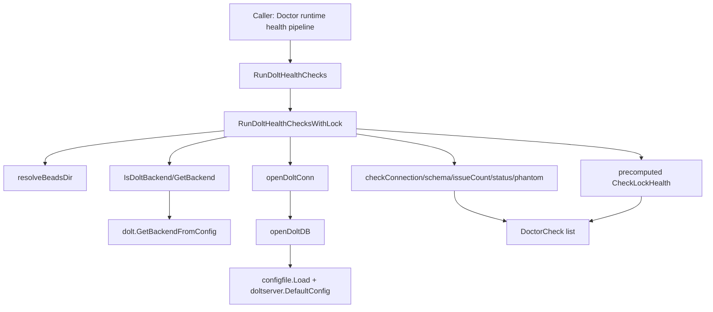

# dolt_connection_and_core_checks 深度解析

`dolt_connection_and_core_checks`（核心实现在 `cmd/bd/doctor/dolt.go`）本质上是 `bd doctor` 里的“Dolt 体检前台”：它把“能不能连上 Dolt”“库结构是不是完整”“当前工作集是否干净”“有没有锁争用”“是否存在会触发崩溃的 phantom database”这些高频、基础、彼此关联的检查，打包成一条可复用的诊断流水线。它存在的关键原因不是“多做几个 SQL 查询”，而是避免朴素实现里常见的三类问题：重复建连导致的噪音与性能浪费、检查顺序不当导致的假阳性（尤其锁检查）、以及配置来源不一致导致的连错端口。

---

## 1. 它解决了什么问题（先讲问题空间）

如果用最直接的方式做健康检查，通常会发生：每个 check 各自 `sql.Open` 一次、各自读取配置、各自决定端口，然后独立返回结果。这样看似简单，但在这个项目里会踩坑。第一，Dolt server 模式下端口解析有历史兼容逻辑，错误地走旧 fallback（例如 `3307`）会把检查结果变成“误报不可达”。第二，某些检查（尤其 lock 相关）对执行时机很敏感，晚于数据库打开时执行会把 doctor 自己创建/持有的痕迹误判为外部问题。第三，状态检查中有“本来就不该算脏数据”的表（wisp ephemeral 表），不做过滤会持续报警，形成无法消除的告警噪声。

这个模块就是为了解决上述“诊断系统自身制造噪声”的问题：它不是单纯验证数据库，而是在验证数据库的同时，尽量避免验证过程污染验证结果。

---

## 2. 心智模型：把它当成“单窗口分诊台”

可以把这个模块想象成医院急诊的分诊台。分诊台并不负责所有治疗，但它负责：

1. 先判断是不是该进这个科室（`IsDoltBackend`）。
2. 如果是，再用一条稳定通道做基础生命体征采集（共享 `doltConn`）。
3. 对容易受干扰的检查（锁）允许“提前采样后带入”（`RunDoltHealthChecksWithLock`）。
4. 最终返回统一格式的体检条目（`DoctorCheck`），供上游汇总展示。

在这个模型里，`doltConn` 就是“诊室里的共用检测设备”；`checkXxxWithDB` 系列是“设备上的具体检查项”；`CheckDoltXxx` 则是“单项门诊入口”（便于独立调用和测试），但在完整体检流程里更推荐走聚合入口 `RunDoltHealthChecksWithLock`。

---

## 3. 架构与数据流



从数据路径看，入口通常是 `RunDoltHealthChecks(path)`，它会先执行 `CheckLockHealth(path)`，然后把结果传给 `RunDoltHealthChecksWithLock(path, lockCheck)`。后者先把 `path/.beads` 经过 `resolveBeadsDir` 规范化，再用 `IsDoltBackend` 做后端门控。如果不是 Dolt，会直接返回一组 N/A 的 `DoctorCheck`，保持输出形状稳定。

若是 Dolt 后端，流程进入 `openDoltConn`。它内部通过 `openDoltDB` 完成配置读取、端口解析、DSN 构建、连接池参数设置和 `PingContext` 连通性验证。成功后，单个连接被复用给 `checkConnectionWithDB`、`checkSchemaWithDB`、`checkIssueCountWithDB`、`checkStatusWithDB` 和 `checkPhantomDatabases`。锁健康结果则由外部传入，避免时序污染。

这个设计的关键不是“少写重复代码”，而是把“同一轮诊断共享同一连接语境”作为一致性保证：同一 host/user/database/port、同一时刻状态、同一超时策略。

---

## 4. 组件深潜（按重要性）

### `openDoltDB(beadsDir string) (*sql.DB, *configfile.Config, error)`

这是整个模块最核心的基础设施函数。它先 `configfile.Load(beadsDir)` 读取 metadata 配置，然后初始化默认 host/user/database，并从 `BEADS_DOLT_PASSWORD` 注入密码。最重要的非直观点是端口来源：它**明确使用** `doltserver.DefaultConfig(beadsDir).Port`，而不是旧的 `cfg.GetDoltServerPort()` fallback 路径。注释已经说明历史问题：旧路径会回退到 `3307`，而 standalone 模式端口可能是由项目路径派生出来的。

连接字符串拼好后，它用 `sql.Open("mysql", connStr)` 建立 MySQL 协议连接，并把池参数收紧到低并发（`MaxOpen=2`、`MaxIdle=1`、`ConnMaxLifetime=30s`），符合 doctor 场景“短时探测，不是业务读写”。随后用 5 秒超时做 `PingContext`；失败则关闭连接并返回 `server not reachable`。

副作用层面，它会读取环境变量，可能触发网络连接，并返回可复用连接池对象；调用方必须负责 `Close`。

### `doltConn` 与 `openDoltConn`

`doltConn` 把 `*sql.DB`、`*configfile.Config` 和已解析 `port` 绑在一起。这个轻量封装的意义在于把“检查执行上下文”集中携带，尤其用于 `checkConnectionWithDB` 的详情输出（`Storage: Dolt (server host:port)`）。

`openDoltConn` 只是装配器：调用 `openDoltDB`，再补一次 `doltserver.DefaultConfig(beadsDir).Port`。这看似重复，其实是在保证最终展示端口与连接端口同源，不受配置 fallback 干扰。

### `GetBackend` / `IsDoltBackend`

`GetBackend` 直接委托 `dolt.GetBackendFromConfig(beadsDir)`，注释明确这是为了统一后端识别逻辑。`IsDoltBackend` 再与 `configfile.BackendDolt` 比较。这里的设计点在于：医生模块不再自己维护后端判定细节，减少与存储层配置语义漂移的风险。

### `RunDoltHealthChecks` 与 `RunDoltHealthChecksWithLock`

这是“编排层”。`RunDoltHealthChecks` 是便捷入口；`RunDoltHealthChecksWithLock` 才是真正的主流程。它支持外部预计算 `lockCheck`，这是为了解决 GH#1981：若先打开 embedded Dolt，再做锁检查，可能把 doctor 自己产生的 noms LOCK 误报为 contention。

如果连接失败，它返回 `Dolt Connection` 的 `StatusError`，并附加传入的 `lockCheck`，而不是整轮直接中断为空。这个行为是有意的：即使主连接失败，锁健康仍然可能提供可行动线索。

### `checkConnectionWithDB`

用现有连接再 `PingContext` 一次，成功则返回 `Connected successfully`。它的价值不是重复验证，而是把“连接已建立”标准化为 `DoctorCheck`，并附带可视化细节（server host/port）。

### `checkSchemaWithDB`

它用一组硬编码必需表 `issues/dependencies/config/labels/events` 做最低可用 schema 验证。实现方式是对每表执行 `SELECT COUNT(*) ... LIMIT 1`，失败即判缺失。这个选择偏“实用主义”：不依赖复杂元数据表，跨版本可读性高；代价是语义较粗，不区分“表不存在”与“权限/临时故障”。

### `checkIssueCountWithDB`

执行 `SELECT COUNT(*) FROM issues`，输出规模信号。它不做阈值判断，只提供可观测性。对 doctor 来说这是“心率”，不是诊断结论。

### `isWispTable` 与 `checkStatusWithDB`

`checkStatusWithDB` 查询 `dolt_status`，扫描 `table_name/staged/status`。核心设计在于过滤 `wisps` 和 `wisp_` 前缀表：这些表是 ephemeral，预期可能长期 uncommitted，并且受 `dolt_ignore` 覆盖。如果把它们算进脏集，会形成“永远无法清零”的假警报。

因此，这个检查追求的是“对操作者有意义的脏状态”，而不是“数据库里任何差异都报警”。如果存在变更，返回 `StatusWarning` 并给出 `bd vc commit` 的修复建议。

### `CheckLockHealth`

这是运行时检查里最容易误判、也最精细的一项。它分两段探测：

第一段扫描 `dolt/*/.dolt/noms/LOCK`。Dolt 的行为是：打开时创建 LOCK 文件，关闭时释放 flock，但文件可能保留。因此“文件存在”不等于“锁被占用”。实现通过 `lockfile.FlockExclusiveNonBlocking` 主动探测是否能抢到锁：抢不到才报警，抢到就立刻 `FlockUnlock`。

第二段探测 `.beads/dolt-access.lock`（advisory lock）是否被其他 `bd` 进程持有，逻辑同上。

这个函数的真正设计意图是把“痕迹”和“争用”分开，避免 stale 文件导致误报。

### `checkPhantomDatabases`

它执行 `SHOW DATABASES`，跳过 `information_schema`、`mysql` 和当前配置数据库名，然后标记命名上像 beads 库（`beads_` 前缀或 `_beads` 后缀）的条目为 phantom，返回 warning 并提示重启服务（GH#2051）。

这里的定位很清晰：它不是普适的“脏库检测”，而是针对命名约定变更导致的 catalog 幽灵项。代码注释也指出它与 `server.go` 的 `checkStaleDatabases` 互补，后者关注 test/polecat 残留。

---

## 5. 依赖关系与契约分析

从被调用依赖看，这个模块主要依赖四类能力：配置解析（`configfile.Load`）、Dolt server 端口决议（`doltserver.DefaultConfig`）、后端识别（`dolt.GetBackendFromConfig`）、以及文件锁探测（`lockfile.FlockExclusiveNonBlocking` / `FlockUnlock`）。它还依赖标准库 `database/sql` 和 MySQL driver（`github.com/go-sql-driver/mysql`）做协议层连接。

从上游调用关系看，根据模块树，它位于 **CLI Doctor Commands → dolt_connectivity_and_runtime_health → dolt_connection_and_core_checks**，承担“Dolt 连接与核心健康”子流水线角色。代码中同时保留了单项入口（`CheckDoltConnection`、`CheckDoltSchema`、`CheckDoltIssueCount`、`CheckDoltStatus`、`CheckLockHealth`），说明它既服务于聚合检查，也服务于独立调用/测试。

数据契约上，输入是仓库路径 `path`（函数内部统一转 `path/.beads` 后再 `resolveBeadsDir`），输出统一为 `DoctorCheck` 或 `[]DoctorCheck`。`DoctorCheck` 的稳定字段（`Name/Status/Message/Detail/Fix/Category`）是它与上层展示层的关键边界：上游按这些字段分组、排序、渲染，不应依赖内部 SQL 细节。

---

## 6. 关键设计决策与权衡

这个模块最典型的取舍是“简单独立 vs 协同一致”：它没有让每个 check 完全自治，而是通过 `RunDoltHealthChecksWithLock` 把多项检查绑定在同一连接上下文下，牺牲了一点函数纯粹性，换来更稳定的结果一致性和更低连接开销。

第二个取舍是“严格正确性 vs 诊断可操作性”。例如 `checkSchemaWithDB` 把查询失败统一当作 missing table，并不细分根因；`checkStatusWithDB` 明确忽略 wisp 表；`checkPhantomDatabases` 用命名模式识别 phantom。这些都不是形式化完备判定，但能快速给出对运维/开发者有用的动作建议。

第三个取舍是“向后兼容 vs 新行为统一”。代码仍保留非 Dolt backend 的 N/A 返回路径；但从测试（`dolt_test.go`）注释可见项目已朝 dolt-native 演进，SQLite 路径更多是兼容壳层。这意味着未来如果彻底移除非 Dolt 分支，代码可以更简化，但当前保留它有助于平滑升级与历史仓库容错。

---

## 7. 用法与示例

推荐在需要“完整 Dolt 核心体检”时使用聚合入口：

```go
lockCheck := CheckLockHealth(repoPath) // 可提前执行，避免时序假阳性
checks := RunDoltHealthChecksWithLock(repoPath, lockCheck)
```

如果只是单项诊断，也可直接调用：

```go
connCheck := CheckDoltConnection(repoPath)
schemaCheck := CheckDoltSchema(repoPath)
statusCheck := CheckDoltStatus(repoPath)
```

环境与配置方面，最关键的是端口和密码：密码来自 `BEADS_DOLT_PASSWORD`；端口由 `doltserver.DefaultConfig` 决议（优先 env，再配置，再派生逻辑）。如果你在测试或本地调试中强制端口，务必确认用的是该决议路径认可的变量，而不是只改旧字段。

---

## 8. 新贡献者最该警惕的边界与坑

第一，锁检查顺序非常重要。若先打开某些 embedded Dolt 连接再查锁，很可能把 doctor 自己的活动当作外部争用。需要复用现有模式：先算 `lockCheck`，再进入其他检查，或把 lock 结果显式注入 `RunDoltHealthChecksWithLock`。

第二，不要回退到旧端口获取方式。`openDoltDB` 注释已经给出历史事故背景：`cfg.GetDoltServerPort()` 的 fallback 在 standalone 模式会错。任何新增连接逻辑都应复用 `doltserver.DefaultConfig(beadsDir).Port`。

第三，`dolt_status` 的结果不要机械全量报警。`isWispTable` 过滤是有意设计，不是临时 patch；删除它会让用户看到长期无法修复的“脏状态”，破坏 doctor 的可信度。

第四，`checkSchemaWithDB` 当前把“查询失败”并入“缺表”语义。若你要增强该检查（比如区分权限问题、超时、表不存在），要同时评估上层展示和 fix 文案是否需要分叉，否则会出现“错误原因更准，但建议动作更乱”的体验倒退。

第五，`checkPhantomDatabases` 与 `server.go` 的 `checkStaleDatabases` 是互补关系，不要把两者粗暴合并。它们针对的问题来源、命名模式和修复动作不同。

---

## 9. 参考阅读

为了避免重复，这里只给关联模块入口：

- [CLI Doctor Commands](CLI Doctor Commands.md)
- [command_entry_and_output_pipeline](command_entry_and_output_pipeline.md)
- [Dolt Server](Dolt Server.md)
- [Dolt Storage Backend](Dolt Storage Backend.md)
- [Configuration](Configuration.md)

如果你要改动这个模块，建议先通读 `cmd/bd/doctor/dolt_test.go` 与 `cmd/bd/doctor/dolt_phantom_test.go`，它们基本覆盖了本模块最容易被误改的设计意图（锁误报、server-only 行为、phantom database 识别）。
