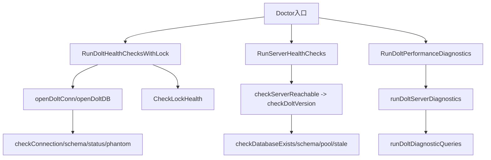

# dolt_connectivity_and_runtime_health 模块深度解析

`dolt_connectivity_and_runtime_health` 是 `bd doctor` 里专门负责 Dolt 运行态诊断的一组能力：它不处理业务功能，而是回答“这个仓库当前是否**能稳定地连上 Dolt、以正确模式运行、并保持可接受性能**”。你可以把它理解为系统的“飞行前检查清单”——不是让飞机飞得更快，而是避免带着隐患起飞。

---

## 1. 为什么这个模块存在（问题空间先行）

在这套系统里，Dolt 既可能以 server 方式运行，也有历史兼容路径；同时配置来源（默认值、metadata、环境变量）和运行态（锁文件、未提交状态、测试残留库）会交织。没有一个专门模块时，常见问题是：

- **连通性误报**：端口解析走错 fallback，实际服务在跑但检查说不可达。
- **检查互相污染**：检查动作本身打开了数据库，反过来制造锁告警假阳性。
- **状态噪音**：把本应忽略的 ephemeral 表（如 `wisps`）当成异常，导致告警永远清不掉。
- **“能连上≠能用”**：只做 ping 看起来健康，但目标不是 Dolt、schema 不兼容、或 server 堆积 stale database。
- **性能定位无证据**：用户体感“慢”，但没有统一可比的采样基线。

这个模块的设计目标不是“多做几个 SQL 查询”，而是把这些高频且容易误判的问题，收敛成一条可复用、可解释、可操作的诊断链路。

---

## 2. 心智模型：三层体检体系（门禁层 / 体征层 / 画像层）

推荐用下面的心智模型理解它：

- **门禁层（Should I run?）**
  - 判断是否 Dolt backend、是否 server mode，避免不适用场景误检。
- **体征层（Is it healthy now?）**
  - 连接、schema、issue 计数、working set、锁争用、phantom/stale database。
- **画像层（Why does it feel slow?）**
  - 连接时延与代表性查询时延（ready/list/show/complex/dolt_log）形成性能轮廓。

可以把它想成医院流程：先分诊挂号（门禁层），再做生命体征（体征层），最后在需要时做专项检查（画像层）。

---

## 3. 架构总览与数据流

### 3.1 主路径解读

1. `RunDoltHealthChecksWithLock`：
   - 先做 backend 门控（`IsDoltBackend`）；
   - Dolt 场景下复用单个 `doltConn`，串行跑连接/表结构/计数/状态/phantom；
   - 锁检查用外部预计算结果注入，避免检查时序污染（对应 GH#1981 注释语义）。

2. `RunServerHealthChecks`：
   - 面向 `bd doctor --server`；
   - 按“可达性 → 服务身份（`dolt_version()`）→ 数据库存在性 → schema 可查询 → pool 观测 → stale database”推进；
   - 关键前置失败时早退，优先输出最接近根因的错误。

3. `RunDoltPerformanceDiagnostics`：
   - 面向性能画像；
   - 先确认 server 在跑，再执行代表性 SQL 探针并记录毫秒级指标；
   - 允许部分探针失败（`-1`/`unknown`）以保留整体报告可用性。

---

## 4. 关键设计决策与权衡

### 决策 A：统一端口决议，拒绝旧 fallback

- 代码显式偏向 `doltserver.DefaultConfig(beadsDir).Port`。
- 原因在注释里非常明确：旧路径 `cfg.GetDoltServerPort()` 会回退 `3307`，在 standalone 模式可能错误。
- **权衡**：牺牲一点“看起来更直接”的配置读取，换来跨运行模式一致性。

### 决策 B：共享连接上下文，而不是每个 check 独立建连

- `checkXxxWithDB` 族函数复用同一 `doltConn`。
- **收益**：减少连接抖动、降低诊断开销、确保同轮检查环境一致。
- **代价**：函数独立性稍弱，但通过保留 `CheckDoltXxx` 单项入口平衡了可测试性。

### 决策 C：锁检查与其他检查解耦（可预计算注入）

- `RunDoltHealthChecksWithLock(path, lockCheck)` 允许先做 `CheckLockHealth`。
- **收益**：避免“doctor 自己触发锁文件后再误报自己”的假阳性。
- **代价**：调用方需要理解检查顺序语义。

### 决策 D：实用主义判定优先于形式完备

- `checkSchemaWithDB` 通过查询关键表判断可用；
- `checkStatusWithDB` 过滤 `wisps/wisp_`；
- `checkPhantomDatabases` 用命名模式识别幽灵库。
- **收益**：输出可行动、噪音低。
- **代价**：某些错误会被归入较粗粒度类别（例如“缺表”可能掺杂权限问题）。

### 决策 E：性能诊断使用“代表性业务探针”，不是严格 benchmark

- 单次采样，覆盖 ready/list/show/complex/dolt_log。
- **收益**：执行快、日常可用、与 CLI 体验相关性高。
- **代价**：不适合作为高严谨性能回归基准（缺少多轮统计与噪音控制）。

---

## 5. 子模块导读（已生成详细文档）

### 5.1 [dolt_connection_and_core_checks](dolt_connection_and_core_checks.md)

核心职责是 Dolt backend 下的基础健康检查编排。重点包括：

- `openDoltDB` / `openDoltConn` 的连接建立与配置收敛；
- `RunDoltHealthChecksWithLock` 的检查顺序控制；
- `CheckLockHealth` 对 noms/advisory 锁“文件存在 vs 锁被持有”的区分；
- `checkStatusWithDB` 对 wisp 表噪音过滤；
- `checkPhantomDatabases` 对 GH#2051 类 catalog 问题预警。

一句话：这是“是否健康”的主干检查线。

### 5.2 [server_mode_health_pipeline](server_mode_health_pipeline.md)

核心职责是 `--server` 场景下的分阶段健康流水线。重点包括：

- `RunServerHealthChecks` 的早退式关卡推进；
- `checkDoltVersion` 用 `dolt_version()` 鉴别目标服务身份；
- `checkDatabaseExists` 的标识符校验 + legacy hyphen 兼容；
- `checkStaleDatabases` 识别 test/polecat 残留库。

一句话：这是“能不能把这台 Dolt server 当生产依赖用”的专科检查线。

### 5.3 [dolt_performance_diagnostics](dolt_performance_diagnostics.md)

核心职责是输出可解释的 Dolt 性能画像。重点包括：

- `RunDoltPerformanceDiagnostics` 的环境收集、server 探测与采样编排；
- `runDoltDiagnosticQueries` 的代表性业务探针；
- `DoltPerfMetrics` 作为统一性能数据契约；
- `CheckDoltPerformance` 的轻量阈值告警路径。

一句话：这是“为什么慢、慢在哪”的定位线。

---

## 6. 跨模块依赖与耦合面

本模块不是孤立存在，主要耦合如下：

- 配置与能力开关：
  - [Configuration](Configuration.md)
  - [metadata_json_config](metadata_json_config.md)
- Dolt server 运行参数（特别是端口决议）：
  - [Dolt Server](Dolt Server.md)
- Dolt 存储后端语义（backend 识别与 server 使用前提）：
  - [Dolt Storage Backend](Dolt Storage Backend.md)
- 上游编排与输出：
  - [CLI Doctor Commands](CLI Doctor Commands.md)
  - [command_entry_and_output_pipeline](command_entry_and_output_pipeline.md)

### 隐式契约（改动前务必确认）

1. `DoctorCheck` 的字段语义是上游 UI/CLI 渲染契约，改字段含义会影响展示与自动化。
2. 端口解析必须与 `doltserver.DefaultConfig` 保持一致，否则不同检查可能“各连各的”。
3. 性能诊断与 server 健康检查对认证的处理目前不完全一致（一个显式读 `BEADS_DOLT_PASSWORD`，另一路径 DSN 固定），改动时要统一策略。

---

## 7. 新贡献者实战注意事项（高频坑）

- **先锁后连**：涉及锁诊断时，优先沿用 `RunDoltHealthChecksWithLock` 模式。
- **不要恢复旧端口 fallback**：这是历史误报根源之一。
- **不要删 wisp 过滤**：那会制造不可清除的“永久脏状态”告警。
- **警惕“0ms”与“未执行”混淆**：性能字段存在 `-1` 与默认值语义差异。
- **不要把 phantom 与 stale database 检查粗暴合并**：二者来源、命名模式、修复动作不同。

---

## 8. 模块定位总结

`dolt_connectivity_and_runtime_health` 的架构角色是 **runtime policy enforcer + diagnostics orchestrator**：

- 它不持有业务规则，却守住了运行可靠性的最低边界；
- 它不替代存储层，却把存储层故障翻译成可执行修复建议；
- 它不做重型性能分析，却提供了足够高信号、可比较的性能快照。

对新加入团队的高级工程师来说，掌握这个模块的关键，不是记住每条 SQL，而是理解它背后的原则：**让诊断结果可信、可解释、可行动，并尽量不被诊断过程自身污染。**
