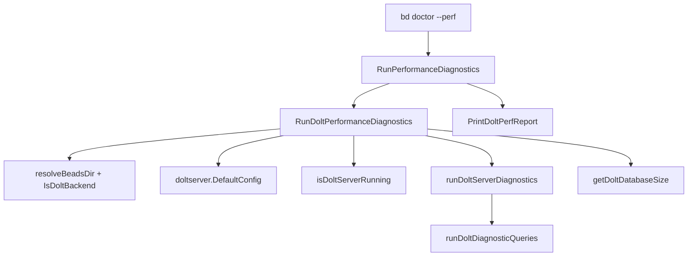

# dolt_performance_diagnostics 深度解析

`dolt_performance_diagnostics`（实现主要在 `cmd/bd/doctor/perf_dolt.go`，入口辅助在 `cmd/bd/doctor/perf.go`）可以把它理解成 `bd doctor` 体系里的“性能急诊分诊台”。它不做全面健康检查，而是专门回答一个现实问题：**“Dolt server 明明能用，但为什么体感慢？”** 朴素做法通常只会测一次连接耗时，或者只看数据库大小；这个模块的设计更像一组“代表性业务探针”——把 `bd ready`、`bd list`、`bd show`、复杂过滤查询和 `dolt_log` 访问都压缩成可复现、可比较的毫秒级指标，快速定位是连接慢、查询慢，还是数据体量和历史垃圾导致的慢。

---

## 架构与数据流



从架构角色看，这个模块是一个**诊断编排器 + 指标采集器**，不是通用查询引擎。`RunDoltPerformanceDiagnostics` 负责把“环境解析、服务可达性、采样执行、结果聚合”串成一个可重复流程；`runDoltDiagnosticQueries` 像探针集合，定义“测什么”；`PrintDoltPerfReport` 和 `assessDoltPerformance` 负责把原始数字翻译成人能直接采取行动的建议。

数据流上有两个最关键的边界。第一是前置门控边界：它先判定后端必须是 Dolt（`IsDoltBackend`），再判定 server 是否运行（`isDoltServerRunning`），避免把不适用场景硬塞进性能报告。第二是“硬失败 vs 软失败”边界：像 `SELECT COUNT(*) FROM issues` 这种核心查询失败会直接返回错误；而 open/closed/dependencies 这些辅助计数失败则写成 `-1`，报告继续生成。这种分层保证报告“尽量可用”，而不是“非黑即白”。

---

## 这个模块解决了什么问题

它解决的不是“数据库是不是坏了”，而是“数据库还在工作，但为什么慢”。在团队协作里，性能问题最难的是主观描述很多、客观证据很少：有人说 `bd ready` 卡，有人说 `bd show` 偶发慢，有人说 server 端口可连但命令仍慢。这个模块用固定查询模板把这些体感问题落成统一指标，等于给不同机器、不同仓库、不同时间点建立可比较的“体检单”。

为什么不用更简单的方案，比如只做 `Ping` + 总数据量？因为那只能回答“网络连接和容量”，回答不了“典型业务路径在哪一段变慢”。`runDoltDiagnosticQueries` 里故意放入了多个语义不同的查询：依赖反查（ready-work 等价）、列表型扫描、单条详情查询、join + group 的复杂查询、Dolt 元信息查询（`dolt_log`）。这个组合对应的是“真实 CLI 操作族”，不是纯数据库 benchmark。

---

## 心智模型：把它当成“标准化压力问诊单”

一个好用的心智模型是：它不是压测框架，而是一份固定题目的问诊单。每次执行都问同一组问题，目的是可比较性而不是覆盖所有极端路径。就像体检不会在现场给你做所有医学实验，但会做一组高信号指标，先把问题定位到“心肺、代谢、影像”哪一类。

在这个模型里，`DoltPerfMetrics` 就是问诊单结果对象，字段可分三层：环境层（`Platform`/`GoVersion`/`DoltVersion`/`ServerStatus`）、规模层（issue 与 dependency 计数、`DatabaseSize`）、时延层（连接与 5 类代表性操作耗时）。`assessDoltPerformance` 则是规则引擎，当前用固定阈值把时延翻译成 warning 和建议。

---

## 组件深潜

### `DoltPerfMetrics`

这个结构体的设计重点是“**既能给人看，也能给程序判定**”。例如时延字段统一用 `int64` 毫秒，失败时用 `-1` 哨兵值；这样 `formatTiming`、`CheckDoltPerformance`、未来 JSON 输出都能复用统一语义。它还保留 `ProfilePath`，把“诊断摘要”与“深入剖析入口（pprof）”连接起来。

### `RunPerformanceDiagnostics(path string)`

这是 `--perf` 模式的命令入口。它做三件事：检查 `.beads` 是否存在、调用 `RunDoltPerformanceDiagnostics(path, true)`、打印报告。这里有个关键选择：失败直接 `os.Exit(1)`，因为它位于 CLI 命令层，职责是“命令体验一致”，不是可组合库 API。

### `RunDoltPerformanceDiagnostics(path string, enableProfiling bool)`

这是主编排函数，承担绝大多数设计意图。它先通过 `resolveBeadsDir(filepath.Join(path, ".beads"))` 归一化目标目录，再用 `IsDoltBackend` 做硬门控；非 Dolt 会直接报错并提示迁移。之后用 `doltserver.DefaultConfig(beadsDir)` 解析 host/port，这个点很重要：它和 doctor 其他 Dolt 检查保持同一端口决议策略，避免因端口来源不一致导致“检查 A 能连、检查 B 不能连”的伪故障。

接着它会读取 `configfile.Load(beadsDir)` 以确定 `dbName`（默认 `configfile.DefaultDoltDatabase`），再按需开启 CPU profiling。profiling 是“尽力而为”策略：启动失败只打 warning 到 `stderr`，不会中断诊断。

最后流程分两步：先检查 server 是否运行，不运行则返回“部分填充的 metrics + error”；运行则进入 `runDoltServerDiagnostics`，成功后再补 `DatabaseSize`。这意味着调用方即使收到错误，也可能拿到一部分上下文指标（比如平台、server 状态），有利于排障。

### `runDoltServerDiagnostics(metrics *DoltPerfMetrics, host string, port int, dbName string)`

这个函数把“连接建立”和“查询采样”分层。先设置 `Backend="dolt-server"` 与 `ServerMode=true`，然后用 MySQL DSN 建连并记录 `ConnectionTime`。连接池参数固定为 `MaxOpenConns=5`、`MaxIdleConns=2`，目的是避免 perf 诊断本身制造过多并发扰动。

一个值得注意的实现事实是 DSN 写死为 `root:@tcp(...)`，并没有读取 `BEADS_DOLT_PASSWORD`。这和 `server_mode_health_pipeline` 里的连接策略不同，意味着在启用鉴权的环境中，这里更容易失败；当前代码通过错误返回把问题暴露给上层。

### `runDoltDiagnosticQueries(ctx context.Context, db *sql.DB, metrics *DoltPerfMetrics)`

这是探针核心。它先抓基础计数，再抓 Dolt 版本，然后测 5 类操作时延。设计上有两种失败处理：

- `issues` 总数查询失败：直接返回错误，说明核心表不可用，继续测意义不大。
- 其他计数和部分操作失败：标记 `-1` 或 `unknown`，继续生成报告，保证“尽量有数据”。

查询选择体现了业务映射意图：

- `ReadyWorkTime`：对应 `bd ready` 风格的“未被未关闭依赖阻塞”筛选。
- `ListOpenTime`：对应列表型读取。
- `ShowIssueTime`：对应单 issue 详情（先取一个 id，再 `SELECT *`）。
- `ComplexQueryTime`：`LEFT JOIN labels + GROUP BY` 的复杂过滤。
- `CommitLogTime`：Dolt 特有元数据面访问。

### `measureQueryTime(ctx, db, query)`

它的关键点是“查询后 drain rows”。很多开发会只测 `QueryContext` 返回时间，但那可能只覆盖到结果集句柄创建，不包含完整扫描成本。这里显式迭代 `rows.Next()`，把网络传输与结果解码成本也纳入计时，更接近用户真实等待时间。

### `isDoltServerRunning(host, port)`

它是一个 2 秒 TCP 级别的快速探针。设计意图是先用最便宜的方式判定“端口是否有人监听”，再决定是否值得进入 SQL 层诊断。它不验证协议身份，只验证连通性。

### `getDoltDatabaseSize(doltDir)`

它通过 `filepath.WalkDir` 递归累计文件大小，并格式化成人类可读单位。实现上对遍历中的局部错误是“跳过继续”，这是典型诊断工具策略：宁可给近似值，也不因个别文件不可读而整份报告失败。

### `PrintDoltPerfReport(metrics)` / `assessDoltPerformance(metrics)` / `formatTiming(ms)`

输出层分两段：先打印事实，再给判断。`formatTiming` 统一把 `-1` 显示为 `failed`；`assessDoltPerformance` 用固定阈值（`ReadyWorkTime > 200`、`ComplexQueryTime > 500`）生成 warning，并在 closed issue 规模很大时追加 `bd cleanup` 建议。这是“规则驱动解释层”，方便团队后续统一调整阈值策略。

### `CheckDoltPerformance(path string) DoctorCheck`

这是 quick-check 入口，返回 `DoctorCheck`，可被 doctor 总框架消费。它调用 `RunDoltPerformanceDiagnostics(path, false)`，只抽取两项阈值（连接 >1000ms、ready-work >500ms）判断 warning。这里是“轻量门禁”风格，不追求完整报告。

需要注意：它在 warning 的 `Fix` 中提示 `Run 'bd doctor perf-dolt' for detailed analysis`，而命令入口代码里可见的性能 flag 是 `--perf`。这两个文案目前存在潜在不一致，新贡献者改动时应统一体验。

---

## 依赖分析：它调用谁、谁调用它

从已验证代码看，`dolt_performance_diagnostics` 主要依赖以下模块与契约：

- [Configuration](Configuration.md)：通过 `configfile.Load` 与 `configfile.DefaultDoltDatabase` 决定数据库名。
- [Dolt Server](Dolt Server.md)：通过 `doltserver.DefaultConfig` 解析 host/port。
- [dolt_connection_and_core_checks](dolt_connection_and_core_checks.md)：复用 `resolveBeadsDir` 与 `IsDoltBackend` 这类 doctor 内部基础能力。
- 标准库与 driver：`database/sql` + `github.com/go-sql-driver/mysql`，以及 `runtime/pprof`（在 `perf.go`）用于 CPU profile。

上游调用链最明确的是 CLI：`cmd/bd/doctor.go` 在 `--perf` 分支调用 `doctor.RunPerformanceDiagnostics(absPath)`，随后由它进入 `RunDoltPerformanceDiagnostics`。另外，`CheckDoltPerformance` 提供了 `DoctorCheck` 形态的可组合入口；在你接手当前代码时，若要确认它在主 `runDiagnostics` 中是否已启用，建议直接检索调用点再决定是否扩展。

数据契约方面，模块对下游（SQL）假设了这些表/对象存在：`issues`、`dependencies`、`labels`、`dolt_log`，以及函数 `dolt_version()`；任何 schema 变化都会直接影响指标可用性（表现为 `-1`、`unknown` 或错误返回）。

---

## 设计决策与取舍

这个模块最核心的取舍是“可行动诊断优先于基准精确性”。它没有做多轮 warmup、分位数统计、隔离噪音采样；而是单次采样、快速返回。优点是命令足够快、可日常使用；代价是结果受瞬时负载影响更大，不适合作为严格性能回归基准。

第二个取舍是“部分失败继续”。除了核心计数失败会中断，多数子查询失败都不会让整份报告失效。这提高了在生产脏环境下的可观测性，但也要求读者理解 `-1` 并不等于 0，而是“该项无数据”。

第三个取舍是“server-only”。`ServerMode` 注释明确该模块面向 server 路径，不覆盖 embedded/local 直连。这样简化了实现并与 Dolt 路线一致，但意味着某些非 server 性能问题不会在这里被诊断。

第四个取舍是“轻量连接前探测 + SQL 验证双层”。先 `net.DialTimeout`，再 `PingContext` 与查询。这样错误定位更清晰，但也引入了一点重复探测成本。

---

## 使用方式与示例

最直接的用户路径是：

```bash
bd doctor --perf
```

它会执行完整采样、生成控制台报告，并默认尝试保存 CPU profile（文件名形如 `beads-dolt-perf-YYYY-MM-DD-HHMMSS.prof`）。查看 flamegraph：

```bash
go tool pprof -http=:8080 beads-dolt-perf-2026-01-01-120000.prof
```

在代码中（例如扩展 doctor 子命令）可以直接复用：

```go
metrics, err := doctor.RunDoltPerformanceDiagnostics(path, false)
if err != nil {
    // err 可能携带 server 未启动、连接失败等信息
}
doctor.PrintDoltPerfReport(metrics)
```

如果只想要 doctor 风格的一条摘要检查，可使用：

```go
check := doctor.CheckDoltPerformance(path)
// check.Status: ok / warning
```

---

## 边界条件与新贡献者注意点

最容易踩坑的是把它当“精确 benchmark”。当前实现是单次采样，没有重试和统计学稳态控制；用于定位瓶颈方向很合适，用于做严格 SLA 断言则偏粗糙。

第二个坑是误读 `ShowIssueTime`。当 `issues` 表为空时，代码不会赋值失败标记，`ShowIssueTime` 可能保留默认值 `0`。这个 `0ms` 在语义上更接近“未执行”，不是“极快”。如果你要做自动化判定，建议先判断是否有可测样本。

第三个坑是注释与实现的小偏差。代码注释写“get a random one first”，但实际是 `SELECT id FROM issues LIMIT 1`，不是随机。这在数据分布不均时可能让测量偏向热点/冷点之一。

第四个坑是认证场景。`runDoltServerDiagnostics` DSN 当前不带密码来源；如果你的环境启用了鉴权，可能直接在连接阶段失败。扩展时需要和 [server_mode_health_pipeline](server_mode_health_pipeline.md) 的认证策略保持一致。

第五个坑是 quick check 提示文案。`CheckDoltPerformance` 的 Fix 建议是 `bd doctor perf-dolt`，而命令入口文档展示的是 `--perf`。调整任一侧时要同步，避免误导用户。

---

## 参考阅读

- [CLI Doctor Commands](CLI Doctor Commands.md)
- [dolt_connection_and_core_checks](dolt_connection_and_core_checks.md)
- [server_mode_health_pipeline](server_mode_health_pipeline.md)
- [Dolt Server](Dolt Server.md)
- [Configuration](Configuration.md)
