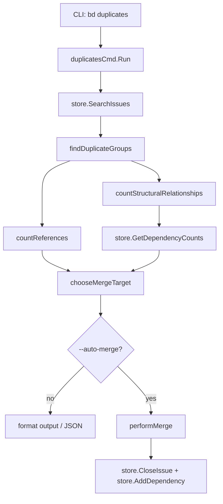

# exact_duplicate_detection_and_merge

`exact_duplicate_detection_and_merge`（对应 `cmd/bd/duplicates.go`）解决的是一个很“工程现实”的问题：同一件事被重复建了多条 issue，信息分散、依赖分叉、统计失真，最后团队会在“看起来很多任务”里浪费协调成本。这个模块不是做“语义相似”推断，而是做**严格内容相同**的聚类，然后给出“该保留哪条、其余如何并入”的可执行建议，必要时还可以自动落库。你可以把它想象成仓库盘点：先把完全同款货物堆在一起，再决定哪一箱作为主箱，其他箱子贴上“同款并入”标签。

## 它解决的核心问题（Why）

如果用最朴素的方法，重复检测可能只是“标题相同就算重复”。这在真实数据里会很快失效：标题常常很短、很模板化，真正区分上下文的信息在 `Description`、`Design`、`AcceptanceCriteria`。相反，如果只看长文本，又会漏掉很多仅有标题、但其实就是重复提交的任务。因此当前实现采用了一个明确且可解释的定义：`title + description + design + acceptanceCriteria + status` 全部一致，才归入同一重复组。

但“找出重复”只是第一步，更难的是“**保留哪一条**”。如果选错主 issue，可能会把已有依赖关系、下游引用、上下文历史都放进被关闭的分支里，后续查询与追踪会更困难。所以该模块进一步做了目标选择评分：优先保留结构关系更丰富的 issue（依赖与被依赖更多），其次看文本里被引用次数，最后用 ID 字典序作为稳定平局规则。这是一个偏向“保留图结构中心节点”的策略，而不是“随机挑一条”。

## 心智模型（How it thinks）

理解这个模块，建议把它当成一个三阶段流水线：

第一阶段是**分桶**。`findDuplicateGroups` 用 `contentKey` 把 issue 按关键字段分组，只保留桶里元素数大于 1 的组。这个阶段不做任何修改，只做识别。

第二阶段是**评分选主**。模块会汇总两类信号：`countReferences` 扫文本里的 issue ID 提及次数；`countStructuralRelationships` 通过 `store.GetDependencyCounts` 一次性拿到每个候选 issue 的依赖/被依赖数量。`chooseMergeTarget` 再按优先级比较，选出每组“主 issue”。

第三阶段是**输出或执行**。默认只输出建议；`--auto-merge` 才执行 `performMerge`：逐条关闭源 issue，并新增 `related` 依赖指向目标 issue。`--dry-run` 会走同样决策流程但不写库。

一个很实用的类比是“城市道路并线”：重复 issue 是多条并行小路，目标 issue 是主干道。评分逻辑就是在找“已经接了最多道路、最不该被拆掉”的那条。

## 架构与数据流



从调用关系看，这个模块在 CLI 架构里扮演的是**命令级 orchestrator + 轻量决策器**。它本身不持久化状态，不维护缓存，也不做复杂领域建模；它依赖全局 `store`（`*dolt.DoltStore`，实现 `Storage` 接口）完成读写，依赖 Cobra 命令生命周期接入主程序。

端到端路径如下：`duplicatesCmd.Run` 先调用 `store.SearchIssues(ctx, "", types.IssueFilter{})` 拉全量 issue，然后在内存中过滤掉 `StatusClosed`，对剩余 open issue 做重复分组。若有重复组，再基于**全量 issue**计算文本引用计数，并仅对重复组内 ID 做批量依赖计数。每组选出目标后，若是只读模式（默认）则输出建议；若是自动合并模式则调用 `performMerge` 写库。

## 组件深潜

### `type contentKey`

`contentKey` 是分组键，字段包括 `title`、`description`、`design`、`acceptanceCriteria`、`status`。设计意图很直接：把“什么叫完全重复”写成可序列化、可比较的结构体键，让 Go map 直接承担聚类功能。

这里的非显然点是 `status`：键里包含状态，理论上允许“open 只和 open 比、closed 只和 closed 比”。但命令入口在分组前已经把 closed 过滤掉了，所以当前实际运行只比较 open issue，`status` 字段更像“保留策略余量”。

### `func findDuplicateGroups(issues []*types.Issue) [][]*types.Issue`

该函数是纯函数式的内存转换：输入 issue 列表，输出重复组列表。内部先构造 `map[contentKey][]*types.Issue`，再筛出长度大于 1 的桶。

设计上它选择“显式字段拼键”，而不是使用 `Issue.ContentHash`。好处是逻辑透明、与存储层 hash 实现解耦；代价是没有做规范化（大小写、空白、Markdown 格式差异都会导致不匹配）。

### `type issueScore`

`issueScore` 保存保留目标决策所需的结构信号：`dependentCount`、`dependsOnCount`、`textRefs`。虽然 `textRefs` 字段定义在结构体里，但当前实现里文本引用是单独通过 `refCounts map[string]int` 传递，`issueScore.textRefs` 实际未参与读写。

这透露出一个演进痕迹：模块从“文本引用优先”演进到“结构连接优先”后，数据承载分成了两路。

### `func countReferences(issues []*types.Issue) map[string]int`

此函数扫描 `Description`、`Design`、`AcceptanceCriteria`、`Notes` 四个文本字段，用正则 `\b[a-zA-Z][-a-zA-Z0-9]*-\d+\b` 抓取形如 `bd-123` 的 ID 并计数。

它的价值在于补齐“软连接”信号：即便没有显式 dependency edge，被很多文本提及的 issue 通常更“中心”。但它不校验提及 ID 是否真实存在，也不排除自引用，因此是启发式而非强一致信号。

### `func countStructuralRelationships(groups [][]*types.Issue) map[string]*issueScore`

该函数只针对重复候选集合提取 ID，调用 `store.GetDependencyCounts(ctx, issueIDs)` 批量拿到 `DependencyCount`/`DependentCount`，再回填到 `issueScore`。

这是一个典型“性能优先但失败可降级”的实现：它避免逐条查询（N+1），但如果批量查询失败，不中断流程，而是返回零值分数，让后续回退到文本引用 + ID 平局规则。换句话说，结构分不是硬依赖，检测结果可用性优先于最优准确性。

### `func chooseMergeTarget(...) *types.Issue`

这是核心决策器，比较顺序非常明确：

1. `weight = dependentCount + dependsOnCount`（结构连接总量）
2. `textRefs`（文本被提及次数）
3. `issue.ID` 字典序（稳定性 tie-breaker）

这组优先级体现了当前模块的设计价值观：先保护图结构完整性，再考虑文本生态，最后保证 deterministic 输出。尤其第一条，意味着“有任何结构连接的 issue”会优先于空壳 issue，这对依赖图连续性很关键。

### `func formatDuplicateGroupsJSON(...) []map[string]interface{}`

它把内部决策结果投影成 JSON 友好结构，包含每组 issue 的引用数、依赖数、权重、是否目标、建议动作字符串等。

这里的角色是“协议适配层”：不改变业务结论，只组织机器可消费输出，方便外部自动化（CI、脚本、MCP 客户端）直接使用。

### `func performMerge(targetID string, sourceIDs []string) map[string]interface{}`

执行逻辑是顺序式、逐源 issue 处理：先 `store.CloseIssue(ctx, sourceID, reason, actor, "")`，再 `store.AddDependency(ctx, dep, actor)`，其中依赖类型固定为 `types.DependencyType("related")`。

这个顺序的意图是先完成语义状态变更（标记重复并关闭），再补关系边。但它没有事务包裹，所以可能出现“已关闭但未成功加边”的部分成功状态。函数会把这类失败记录到 `errors` 返回，属于显式暴露而非自动回滚策略。

## 依赖分析：它调用谁，谁调用它

在“谁调用它”这一侧，入口是 Cobra 命令注册：`init()` 里 `rootCmd.AddCommand(duplicatesCmd)`，因此它由 CLI 路由层触发。主程序还在 `readOnlyCommands` 把 `duplicates` 标记为只读命令；这与 `--auto-merge` 的写操作形成一组策略配合：默认读，显式开关才写，并且写前由 `CheckReadonly("duplicates --auto-merge")` 做防护。

在“它调用谁”这一侧，核心依赖全部来自 `Storage` 合约：读取走 `SearchIssues`、`GetDependencyCounts`，写入走 `CloseIssue`、`AddDependency`。这意味着该模块对底层存储实现（Dolt 或其他实现）保持接口级耦合，而非实现级耦合。

它还依赖 `internal.types` 的数据契约：输入是 `types.Issue`（需要 `Title/Description/Design/AcceptanceCriteria/Status/Notes/Priority/ID`），依赖边写入使用 `types.Dependency`（`IssueID`, `DependsOnID`, `Type`）。如果这些字段语义发生变化（例如 ID 格式不再匹配当前正则，或状态体系重构），本模块行为会直接受影响。

## 设计取舍与非显然决策

这个模块在多个维度上都做了“工程化折中”。首先，它选择 exact match 而非 semantic match，牺牲召回率换取可解释性与低误报，适合自动合并这种高风险动作。其次，选主策略把结构连接放在第一优先级，这在“保图不保文本”上是明确偏置：它更在意依赖图连续性而非描述层面的引用热度。

另外，`countStructuralRelationships` 失败时降级、不阻断主流程，体现了“可用性优先”。而 `performMerge` 不使用事务，体现了“实现简单 + 错误可见”优先于“强原子一致”。在 CLI 工具语境里，这通常是可接受的，但要求调用者关注返回的 `errors`。

## 使用方式与示例

最常见的工作流是先审查、再执行：

```bash
# 仅检测并输出建议
bd duplicates

# JSON 输出，便于脚本处理
bd duplicates --json

# 预演自动合并（不写库）
bd duplicates --auto-merge --dry-run

# 执行自动合并
bd duplicates --auto-merge
```

如果你只想复用算法，不直接执行命令，核心函数链路是：

```go
allIssues, _ := store.SearchIssues(ctx, "", types.IssueFilter{})

openIssues := make([]*types.Issue, 0, len(allIssues))
for _, issue := range allIssues {
    if issue.Status != types.StatusClosed {
        openIssues = append(openIssues, issue)
    }
}

groups := findDuplicateGroups(openIssues)
refCounts := countReferences(allIssues)
structural := countStructuralRelationships(groups)

for _, g := range groups {
    target := chooseMergeTarget(g, refCounts, structural)
    _ = target
}
```

## 新贡献者要特别注意的坑

第一个坑是“文档描述与实际行为的细微偏差”。命令说明提到 open/closed 各自分组，但实现先过滤 closed，所以当前不会报告 closed duplicate group。第二个坑是“严格字符串匹配”：任何空白、大小写、格式差异都会让重复检测失效。第三个坑是“顺序写入非事务”：`performMerge` 可能产生部分成功状态，需要后续修复或重试。

还要注意输出稳定性。`findDuplicateGroups` 基于 map 迭代，group 顺序天然不稳定；如果你在测试或外部自动化里依赖顺序，需要显式排序。最后，文本引用正则依赖 `prefix-number` 格式，若未来 ID 规范变化，这里会静默退化。

## 与其他模块的关系（参考）

本模块是“精确重复检测 + 合并建议/执行”，与“语义近似重复检测”是互补关系，不应混淆。建议同时阅读：

- [semantic_duplicate_detection](semantic_duplicate_detection.md)
- [orphan_detection_command](orphan_detection_command.md)
- [Storage Interfaces](Storage Interfaces.md)
- [Core Domain Types](Core Domain Types.md)
- [dependency_and_label_operations](dependency_and_label_operations.md)
