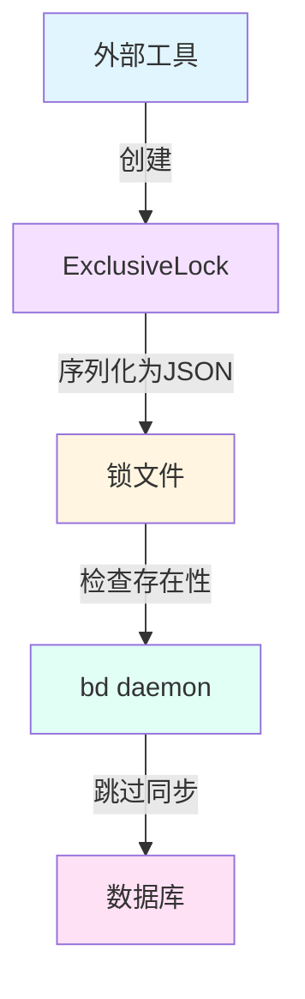

# exclusive_lock_structure 模块技术深度文档

## 1. 什么问题，为什么解决？

在一个分布式或多进程环境中，多个工具可能需要同时访问同一个 beads 数据库。想象一下这样的场景：一个版本控制执行器（vc-executor）正在处理数据库事务，而 bd daemon 同时也在尝试同步该数据库。如果没有协调机制，这可能导致数据竞争、状态不一致，甚至数据损坏。

这就是 `ExclusiveLock` 存在的原因。它是一个轻量级的协调机制，允许外部工具声明对 beads 数据库的**独占管理权**。当锁存在时，bd daemon 会在其同步周期中跳过该数据库，从而避免并发访问冲突。

### 为什么不使用更复杂的锁机制？
你可能会问：为什么不使用数据库级别的锁、文件锁 API，或者分布式锁服务？答案在于**简单性和可见性**。
- **简单性**：使用 JSON 文件作为锁载体，无需额外的基础设施或复杂的同步原语
- **可见性**：任何人都可以读取锁文件，了解哪个进程、在哪个主机上、何时持有锁
- **可调试性**：锁文件包含丰富的元数据，便于问题诊断和审计

## 2. 心理模型：数据库的"正在使用"标志

把 `ExclusiveLock` 想象成数据库门口的一个**"请勿打扰"牌子**。当一个工具进入数据库工作时，它挂起这个牌子，上面写着：
- 谁在使用（holder）
- 哪个进程（PID）
- 在哪个机器上（hostname）
- 什么时候开始的（started_at）
- 工具版本（version）

bd daemon 就像一个礼貌的访客，看到这个牌子就会主动离开，稍后再来。

核心抽象很简单：**锁的存在 = 数据库正在被独占使用**。

## 3. 架构与数据流程



### 数据流程说明

1. **锁的创建流程**：
   - 外部工具调用 `NewExclusiveLock(holder, version)` 创建锁实例
   - 构造函数自动收集当前进程的 PID、主机名和时间戳
   - 工具将锁序列化为 JSON 并写入特定位置的锁文件

2. **锁的消费流程**：
   - bd daemon 在同步周期开始前检查锁文件是否存在
   - 如果存在，daemon 跳过该数据库的同步
   - （可选）daemon 可以读取锁内容以了解谁在持有锁

3. **锁的释放流程**：
   - 外部工具完成工作后删除锁文件
   - bd daemon 在下一个同步周期中恢复对数据库的处理

## 4. 核心组件深度解析

### ExclusiveLock 结构体

**设计意图**：这是一个纯数据结构，包含了识别锁持有者所需的所有元数据。它设计为 JSON 友好的，因为锁通常以文件形式存储在文件系统中。

**字段详解**：
- `Holder`：锁持有者的名称（如 "vc-executor"），用于标识是哪个系统或工具持有锁
- `PID`：持有锁的进程 ID，允许检查进程是否仍然存活
- `Hostname`：进程运行的主机名，在分布式环境中至关重要
- `StartedAt`：锁获取的时间戳，用于检测可能的死锁或过期锁
- `Version`：锁持有者的版本，便于兼容性检查和问题诊断

### NewExclusiveLock 函数

**设计意图**：工厂函数，封装了创建有效锁所需的所有系统调用。

**内部机制**：
1. 调用 `os.Hostname()` 获取当前主机名
2. 调用 `os.Getpid()` 获取当前进程 ID
3. 使用 `time.Now()` 记录开始时间
4. 组装所有信息并返回锁实例

**为什么这样设计？**
- 集中式创建确保所有锁都有一致的字段集
- 错误处理封装在工厂函数中，调用者无需处理底层系统调用错误
- 允许未来扩展（如添加默认字段、验证等）而不改变调用者代码

### Validate 方法

**设计意图**：防御性编程，确保锁数据的完整性。

**验证规则**：
- `Holder` 不能为空
- `PID` 必须为正数
- `Hostname` 不能为空
- `StartedAt` 不能是零值

**为什么需要这个？**
- 防止损坏的锁文件被错误地解释为有效锁
- 在反序列化后确保数据完整性
- 为锁的生产者和消费者提供共同的契约

### JSON 序列化/反序列化

**设计意图**：使用类型别名技巧避免递归调用，同时保持默认的 JSON 序列化行为。

**实现细节**：
```go
type Alias ExclusiveLock
return json.Marshal((*Alias)(e))
```

**为什么这样做？**
- 如果直接实现 `MarshalJSON` 而不使用别名，会导致无限递归
- 这种模式让我们可以在将来添加自定义序列化逻辑，同时保持向后兼容性
- 对于当前实现，它实际上与默认行为相同，但为未来扩展留了口子

## 5. 依赖分析

### 上游依赖
- `os` 包：用于获取主机名和进程 ID
- `time` 包：用于记录锁获取时间
- `encoding/json` 包：用于序列化和反序列化

### 下游消费者
从模块树来看，`exclusive_lock_structure` 属于 `provider_and_lock_contracts` 的子模块，很可能被以下组件使用：
- **bd daemon**：检查锁文件以决定是否跳过数据库同步
- **外部工具**：如版本控制执行器、迁移工具等，需要独占访问数据库
- **CLI 命令**：可能提供锁管理功能

### 数据契约
该模块定义了一个清晰的 JSON 格式契约，所有生产者和消费者都必须遵守。这种基于文件的契约使得不同语言编写的工具都可以参与锁机制。

## 6. 设计权衡与决策

### 1. 基于文件 vs 内存锁
**选择**：基于文件的锁
**理由**：
- 跨进程可见性，即使不同的进程甚至不同的工具也能看到锁
- 持久性，即使进程崩溃，锁文件仍然存在（虽然这也可能成为问题）
- 简单性，无需复杂的 IPC 机制

**权衡**：
- 需要额外的文件系统操作
- 存在死锁风险（如果进程崩溃而没有清理锁）
- 需要外部机制处理过期锁

### 2. 丰富元数据 vs 最小化锁
**选择**：包含丰富的元数据
**理由**：
- 可观测性：能够知道谁持有锁、在哪里、何时开始
- 可调试性：当出现问题时，有足够的信息进行诊断
- 灵活性：元数据可以支持未来的功能（如自动清理过期锁）

**权衡**：
- 锁文件更大（但仍然很小）
- 序列化/反序列化稍复杂（但通过类型别名技巧简化）

### 3. 简单验证 vs 全面验证
**选择**：简单但关键的验证
**理由**：
- 只验证那些如果无效会导致严重问题的字段
- 不做过度约束，保持灵活性
- 性能考虑（虽然验证成本很低）

**权衡**：
- 可能接受一些"奇怪但有效"的值
- 不会捕获所有可能的错误情况

## 7. 使用指南与最佳实践

### 基本使用模式

```go
// 1. 创建锁
lock, err := types.NewExclusiveLock("my-tool", "v1.0.0")
if err != nil {
    log.Fatalf("Failed to create lock: %v", err)
}

// 2. 验证锁
if err := lock.Validate(); err != nil {
    log.Fatalf("Invalid lock: %v", err)
}

// 3. 写入锁文件（实际使用时需要确定正确的路径）
lockData, _ := json.Marshal(lock)
os.WriteFile("/path/to/database/.lock", lockData, 0644)

// 4. 完成工作后清理锁
defer os.Remove("/path/to/database/.lock")

// 5. 使用数据库...
```

### 最佳实践

1. **始终使用 defer 清理锁**：防止异常情况下锁泄漏
2. **验证锁**：创建后和反序列化后都应该验证
3. **包含有意义的 holder 名称**：应该能清楚地识别是什么系统或工具
4. **考虑实现锁过期机制**：基于 `StartedAt` 字段处理可能的死锁
5. **使用原子文件操作**：写入锁文件时应该使用临时文件+重命名的方式，避免部分写入

### 常见陷阱

1. **忘记清理锁**：这是最常见的问题，会导致数据库被永久"锁定"
2. **不检查锁是否存在**：直接创建锁而不检查是否已有锁存在
3. **忽略验证错误**：验证失败时仍然继续使用锁
4. **在网络文件系统上使用**：NFS 等网络文件系统可能有延迟，影响锁的可靠性

## 8. 边缘情况与注意事项

### 僵尸锁
**情况**：持有锁的进程崩溃，但锁文件仍然存在
**影响**：数据库看起来被永远锁定
**缓解**：
- 实现基于 `StartedAt` 的过期检测
- 提供手动清理锁的工具
- 考虑使用 PID 检查进程是否仍然存活（但仅限于同一主机）

### 多主机环境
**情况**：锁在一台主机上创建，但在另一台主机上检查
**影响**：PID 检查失效，因为 PID 在不同主机上是独立的
**缓解**：
- 始终检查 `Hostname` 字段
- 不要跨主机使用 PID 验证进程存在性

### 时钟偏差
**情况**：不同主机的系统时间不一致
**影响**：基于 `StartedAt` 的过期判断可能出错
**缓解**：
- 使用相对时间判断（如"锁存在超过 X 小时"）而非绝对时间
- 谨慎处理时间相关逻辑

### 锁文件损坏
**情况**：锁文件存在但内容无效或损坏
**影响**：可能导致解析错误或错误的锁状态
**缓解**：
- 始终验证锁的有效性
- 考虑损坏的锁文件等同于没有锁（需要根据具体场景决定）

## 9. 总结

`ExclusiveLock` 是一个看似简单但设计精心的组件，它解决了 beads 数据库的独占访问问题。通过使用基于文件的 JSON 锁，它在简单性、可见性和跨进程协作之间取得了良好的平衡。

它的核心价值不在于技术复杂性，而在于定义了一个清晰的协调契约，让多个工具可以安全地共享数据库资源。当你需要在工具之间协调数据库访问时，这个模块提供了一个经过深思熟虑的基础。

---

*相关模块*：
- [provider_and_lock_contracts](provider_and_lock_contracts.md)：包含本模块的父模块
