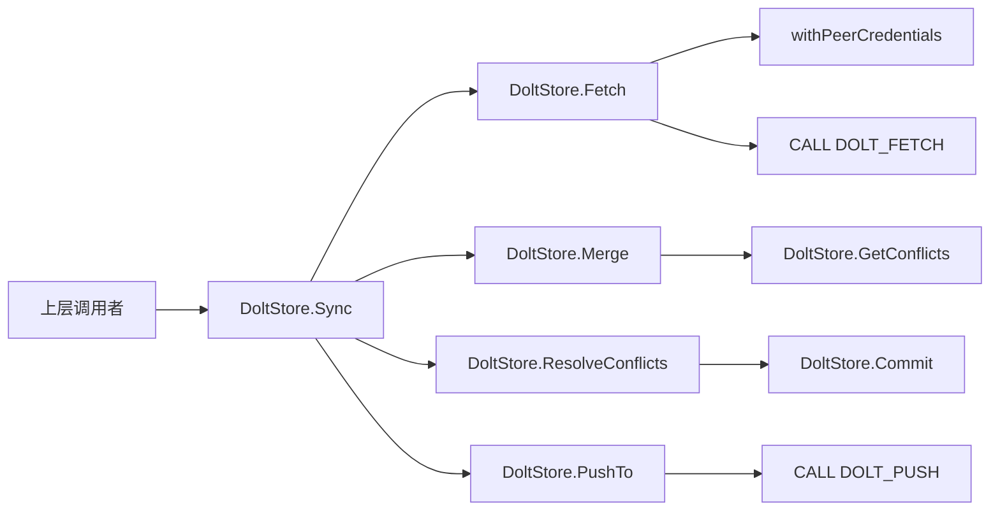

# federation_sync 模块深度解析

`federation_sync` 这层做的事情，可以把它理解成“Dolt 存储的跨节点同步调度器”。单机里改 issue 很简单，但一旦多个 `peer`（代码里的远端仓库）都在改同一份数据，问题马上变成：什么时候拉取、怎么合并、冲突如何处理、失败时哪些是致命错误、哪些只是告警。这个模块存在的核心意义，不是再包一层 `DOLT_*` 命令，而是把这些分布式协作中的“流程决策”固化成一条可复用、可观测、可部分失败的同步路径。

## 架构角色与数据流

从架构位置看，这个模块属于 `DoltStore` 的 federation 能力扩展：它自己不定义新的存储后端，而是在已有 `DoltStore` 之上编排远端同步操作。它既调用底层 Dolt SQL 过程（`DOLT_FETCH` / `DOLT_PULL` / `DOLT_PUSH` / `DOLT_REMOTE`），也复用 store 内部的版本控制方法（`Merge`、`GetConflicts`、`ResolveConflicts`、`Commit`、`GetCurrentCommit`）。



这条链路里的关键思路是“先拉取引用，再本地合并，再尝试回推”。它不是直接 `PullFrom` 完事，而是把同步过程拆成更细粒度步骤，目的是在冲突处理、错误分级和结果回传上拿到更强控制力。`SyncResult` 就是这条编排链路的“飞行记录仪”：记录每个阶段是否完成、冲突是否自动解决、哪个错误是致命的、哪个是非致命的。

## 它要解决的具体问题（为什么不能用朴素方案）

朴素方案通常是“一条 `pull` + 一条 `push`”。问题在于：

第一，`pull` 把“获取远端引用”和“合并”绑在一起，错误语义不够清晰。你很难知道失败到底是网络、权限、远端状态，还是业务冲突。当前实现里 `Sync` 先 `Fetch` 再 `Merge`，把网络/认证问题和合并问题拆开处理。

第二，冲突在分布式协作里是常态而非异常。`Sync` 支持传入 `strategy`（`ours|theirs`）进行自动冲突解决；如果不传策略，则明确返回“需要人工处理”。这是一种有意的产品语义：默认偏保守，自动化要显式授权。

第三，推送失败不一定应该回滚整个同步。代码把 `PushTo` 失败记录到 `PushError`，而不是把整个 `Sync` 标成 hard failure。原因很现实：很多拓扑里节点只允许拉取不允许回推，或者权限在不同方向不同。模块通过“部分成功”语义提升可用性。

## 心智模型：把它当成“同步事务编排器”

可把 `Sync` 想成机场转机流程：

- `Fetch` 像“把对方行李拉到中转区”（拿到远端 refs）
- `Merge` 像“安检对齐”（尝试把双方历史拼到一起）
- `ResolveConflicts + Commit` 像“冲突安检人工裁决后盖章”
- `PushTo` 像“把合并后的结果送回对方航站楼”

每一步都可能失败，但失败等级不同。这个模块最重要的设计不是调用了哪些 API，而是定义了这套失败分层和状态外显方式。

## 关键组件深挖

### `DoltStore.Sync(ctx, peer, strategy) (*SyncResult, error)`

这是模块主入口，负责完整双向同步编排。

它按固定顺序执行：

1. 调用 `Fetch` 获取远端更新；失败即终止，并把错误挂到 `result.Error`。
2. 通过 `GetCurrentCommit` 记录合并前 commit（best effort）。
3. 调用 `Merge` 合并 `peer/branch`。
4. 若返回冲突：
   - `strategy == ""`：立即返回，需要人工处理。
   - 否则遍历冲突，按 `c.Field` 调 `ResolveConflicts`，随后 `Commit` 冲突解决结果。
5. 再次 `GetCurrentCommit`，若 hash 变化则把 `PulledCommits` 置为 `1`（简化计数）。
6. 调 `PushTo` 尝试回推；失败仅记录到 `PushError`。
7. best effort 调 `setLastSyncTime` 写入 metadata。

返回值上有个非直觉点：`error` 与 `SyncResult.Error` 在致命失败场景下会一致，但 `PushError` 是非致命，可能出现 `err == nil` 但 `result.PushError != nil`。调用方必须同时检查两者。

副作用方面，`Sync` 会触发远端网络操作、本地 merge/commit、metadata 写入。它不是纯查询 API。

### `SyncResult`

`SyncResult` 是同步状态 contract，字段设计体现了“阶段性可观测”的意图：

- `Fetched/Merged/Pushed`：流程阶段是否完成。
- `Conflicts` 与 `ConflictsResolved`：冲突列表与是否自动解决。
- `Error`：致命错误（中断流程）。
- `PushError`：非致命回推失败。
- `StartTime/EndTime`：生命周期边界，便于调度层做耗时统计。

`PushedCommits` 字段目前在该实现里未填充，说明结果模型为未来扩展留了位置，但当前精度是“方向性状态优先，精确计数其次”。

### `DoltStore.Fetch(ctx, peer) error`

只做 refs 获取，不做 merge，调用 `CALL DOLT_FETCH(?)`。它包在 `withPeerCredentials` 中执行，意味着凭证注入与清理由统一封装处理，调用者不用每次手工管理认证上下文。

### `DoltStore.PullFrom(ctx, peer) ([]storage.Conflict, error)`

这是“便捷模式”接口：直接 `DOLT_PULL`（拉取+合并）。如果 SQL 调用报错，会尝试 `GetConflicts` 判断是否属于 merge conflict；若是则返回冲突列表而不报 hard error。这个模式适合调用方想要“简短路径”，但其可控性低于 `Sync` 的分步编排。

### `DoltStore.PushTo(ctx, peer) error`

调用 `CALL DOLT_PUSH(?, ?)`，使用当前 `s.branch`。同样经 `withPeerCredentials` 包裹。语义简单：只管推，不做状态判断。

### `DoltStore.SyncStatus(ctx, peer) (*storage.SyncStatus, error)`

它返回一个“可降级状态视图”。本质上做三件事：

- 通过 `dolt_log` 对比计算 `LocalAhead/LocalBehind`。
- 通过 `GetConflicts` 判断 `HasConflicts`。
- 从 metadata 读取 `LastSync`。

其中 ahead/behind 查询失败时不会整体失败，而是写成 `-1/-1`。这反映出一个很务实的决策：状态接口优先“尽量返回可用信息”，而不是因为远端分支尚未 fetch 就完全不可用。

### `DoltStore.ListRemotes(ctx)` / `RemoveRemote(ctx, name)`

前者查询 `dolt_remotes` 并映射到 `[]storage.RemoteInfo`，后者执行 `CALL DOLT_REMOTE('remove', ?)`。它们提供 federation 的运维面接口，让调用层可枚举与清理远端配置。

### `getLastSyncTime` / `setLastSyncTime`

这对内部方法把“最近同步时间”放在 `metadata` 表里，key 采用 `last_sync_<peer>` 约定。解析失败或缺失时返回 `time.Time{}`。注意这只是 advisory 信息；`Sync` 里对写入错误是忽略处理（best effort）。

## 依赖关系与契约

这个模块向下依赖两类能力：

一类是 Dolt SQL 过程和系统表：`DOLT_FETCH`、`DOLT_PULL`、`DOLT_PUSH`、`DOLT_REMOTE`、`dolt_log`、`dolt_remotes`。这让它和 Dolt 能力强绑定，换后端几乎不可复用。

另一类是 `DoltStore` 内部方法：`Merge`、`Commit`、`GetConflicts`、`ResolveConflicts`、`GetCurrentCommit`、`withPeerCredentials`、`execContext`、`queryContext`。其中 `Merge` 的行为约定非常关键：发生冲突时返回 `([]Conflict, nil)`，而不是直接 error，这正是 `Sync` 能做策略分流的前提。

向上它输出的核心契约是：

- `storage.SyncStatus`：给调度/UI 一个统一状态视图。
- `storage.RemoteInfo`：远端列表展示与管理。
- `storage.Conflict`：冲突字段级信息，供自动/人工决策。
- `SyncResult`：编排执行轨迹。

如果上游调用者只看 `error` 不看 `SyncResult`，就会漏掉非致命失败与阶段状态；这是最常见集成错误之一。

## 设计取舍与原因

最明显的取舍是“流程可控性优先于最短路径”。`Sync` 没有直接走 `PullFrom`，而是 `Fetch + Merge + (Resolve)+Push`。这样代码更长，但换来更清晰的异常分类、更明确的冲突策略插入点。

第二个取舍是“可用性优先于强一致状态”。例如：

- `SyncStatus` 计算 ahead/behind 失败时回传 `-1` 而非报错。
- `setLastSyncTime` 失败被忽略。
- `PushTo` 失败不使 `Sync` 整体失败。

这些都在牺牲部分“严格成功定义”，换取真实分布式环境下更稳健的行为。

第三个取舍是“简单统计优先于精确统计”。`PulledCommits` 当前只在 commit hash 变化时置 `1`，并未计算真实 commit 数量。这简化实现和查询成本，但如果上层用它做精细报表会有偏差。

## 使用方式与示例

典型完整同步：

```go
ctx := context.Background()
result, err := store.Sync(ctx, "town-beta", "ours")
if err != nil {
    // 致命失败（fetch/merge/resolve/commit 等）
    return err
}

if result.PushError != nil {
    // 非致命：本地已完成合并，但回推失败
    log.Printf("sync succeeded locally, but push failed: %v", result.PushError)
}
```

查询同步状态：

```go
status, err := store.SyncStatus(ctx, "town-beta")
if err != nil {
    return err
}
if status.LocalAhead == -1 || status.LocalBehind == -1 {
    // 通常表示远端分支尚未 fetch 到本地引用
}
```

只拉不推（便捷路径）：

```go
conflicts, err := store.PullFrom(ctx, "town-beta")
if err != nil {
    return err
}
if len(conflicts) > 0 {
    // 需要后续 ResolveConflicts / Commit
}
```

## 新贡献者最需要注意的坑

第一个坑是错误分层。`Sync` 的失败信息分散在 `error`、`result.Error`、`result.PushError`。写调用代码时要明确区分“流程中断”与“部分成功”。

第二个坑是冲突策略字段。`Sync` 在自动解决时按 `Conflict.Field` 调 `ResolveConflicts`。如果下游冲突模型变更（例如字段为空或语义变化），这一段会直接受影响。

第三个坑是状态值的“未知语义”。`SyncStatus` 的 `-1` 不是负债务，而是 unknown sentinel。UI/调度层必须特殊处理，不能拿它做普通数值比较。

第四个坑是 metadata 键规范。`last_sync_<peer>` 是约定式 key，peer 命名如果包含特殊字符，可能影响可读性和运维排查（当前代码未做规范化）。

第五个坑是分支耦合。`PushTo` 和 `SyncStatus` 都依赖 `s.branch`。如果调用场景里 branch 可变或不是默认分支，需要先确认 `DoltStore` 当前 branch 配置。

## 与其他模块的关系（参考）

本模块是 Dolt 后端同步能力的一部分，更多存储契约请看 [Storage Interfaces](storage_interfaces.md)，Dolt 基础能力可参考 [store_core](store_core.md)，事务行为见 [transaction_layer](transaction_layer.md)，冲突与历史分析见 [history_and_conflicts](history_and_conflicts.md)。

如果你要扩展跨系统同步（如 GitLab/Jira/Linear），可进一步对照 [Tracker Integration Framework](tracker_integration_framework.md) 的同步抽象，再决定是在 tracker 层做语义转换，还是在 Dolt federation 层增强策略编排。
