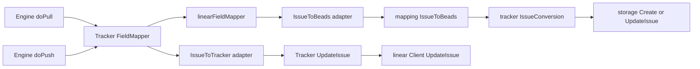

# field_mapper_adapter（`internal.linear.fieldmapper.linearFieldMapper`）技术深潜

`field_mapper_adapter` 的存在，本质上是为了把“Linear 世界的字段语义”翻译成“Beads 世界的统一语义”，反过来也一样。你可以把它想象成机场里的“同声传译员”：它不负责安排行程（那是同步引擎 `Engine` 的工作），也不负责和航空公司系统对接（那是 `linear.Tracker` / `Client` 的工作），它只负责确保双方说的是同一种“业务语言”。如果没有这一层，`Engine` 就不得不理解每个外部系统的字段细节（`State` 结构、优先级枚举、标签推断类型等），系统会迅速变成高耦合、难扩展的“多方言泥潭”。

## 这个模块解决了什么问题？

问题空间不是“字段重命名”这么简单，而是**语义对齐**。Beads 的核心模型（`types.Issue`）和 Linear 的模型（`linear.Issue`）并不一一同构：

- 优先级编码不同（Linear `0-4` 与 Beads `0-4` 语义并不一致）；
- 状态系统不同（Linear 依赖 `State.Type/Name`，Beads 是 `types.Status`）；
- 类型系统不同（Beads `IssueType` 需要从 Linear 标签推断）；
- 依赖关系表达不同（Linear `relations` + `parent` 需要变成 Beads 依赖边）；
- 同步框架接口使用通用 `interface{}`，但具体 tracker 需要强类型转换。

`linearFieldMapper` 解决的是：在 `tracker.FieldMapper` 这个统一插件契约下，把上述差异局部化，且支持配置化映射（通过 `MappingConfig`）。这让 `tracker.Engine` 可以继续做“通用同步编排”，不用知道 Linear 的内部对象结构。

## 心智模型：一个“窄腰适配层”

可以把它理解为一个 **Hexagonal Architecture 的适配器腰部**：

- 上层（`tracker.Engine`）只认 `FieldMapper` 接口；
- 下层（`linear` 类型与映射函数）只认 Linear/Beads 领域细节；
- `linearFieldMapper` 把两者接起来，并把不可信的 `interface{}` 输入做类型门控。

这层“窄腰”有两个关键特征：

1. **接口统一，语义专有**：方法名统一（`PriorityToBeads`、`IssueToTracker`），实现逻辑完全 Linear 专属。
2. **失败降级而非硬失败**：类型断言失败时通常返回安全默认值（如 `StatusOpen`、`TypeTask`、优先级 `2`），避免同步过程因单字段异常中断。

## 架构与数据流



在 pull 路径中，`Engine.doPull()` 会先拿到 `TrackerIssue`，然后调用 `mapper.IssueToBeads()`。`linearFieldMapper.IssueToBeads()` 首先要求 `TrackerIssue.Raw` 必须是 `*linear.Issue`，然后委托 `mapping.go` 里的 `IssueToBeads(li, config)` 完整转换，再把 `linear.DependencyInfo` 重打包成框架层的 `tracker.DependencyInfo`，最终交给 `Engine` 写入存储并在后续创建依赖。

在 push 路径中，`Engine.doPush()`/`Tracker.UpdateIssue()` 会用 `IssueToTracker()` 生成更新字段 map。这个 map 是线性系统 API 的 payload 片段（当前包括 `title`、`description`、`priority`），再由 `Tracker.UpdateIssue()` 追加状态相关字段（`stateId`），最终通过 `Client.UpdateIssue()` 发往 Linear。

## 组件深潜：`linearFieldMapper` 各方法的设计意图

`linearFieldMapper` 结构本身只有一个字段：`config *MappingConfig`。这意味着它是**无状态、配置驱动**的转换器，线程安全成本低，也便于在 `Tracker.FieldMapper()` 中按需构造。

### `PriorityToBeads(trackerPriority interface{}) int`

它先做 `trackerPriority.(int)` 断言，再调用 `PriorityToBeads(p, m.config)`。这里的关键设计不是“类型转换”，而是**把 tracker 接口层的不确定输入收束到 Linear 的期望类型**。断言失败返回 `2`（中等优先级），体现“保守降级”策略：在未知输入下避免过高/过低优先级造成工作流偏移。

### `PriorityToTracker(beadsPriority int) interface{}`

直接走 `PriorityToLinear(beadsPriority, m.config)`。返回 `interface{}` 是框架接口约束；Linear 侧实际返回 `int`。这种设计牺牲了编译期类型信息，但换来多 tracker 的统一插件面。

### `StatusToBeads(trackerState interface{}) types.Status`

只接受 `*State`，断言失败返回 `types.StatusOpen`。真正映射逻辑在 `StateToBeadsStatus(state, config)`：先按 `State.Type`，再按 `State.Name`，兼容自定义工作流状态名。这是典型“优先标准字段，兼容用户定制”的策略。

### `StatusToTracker(beadsStatus types.Status) interface{}`

返回 `StatusToLinearStateType(beadsStatus)` 的字符串（如 `unstarted` / `started` / `completed`）。注意这不是最终 `stateId`，而是“状态类型意图”。`Tracker.findStateID()` 再根据团队实际状态列表解析到具体 ID。

### `TypeToBeads(trackerType interface{}) types.IssueType`

断言为 `*Labels` 后调用 `LabelToIssueType(labels, config)`，否则默认 `types.TypeTask`。这说明 Linear 没有直接的一等 `IssueType` 字段时，系统采用“标签推断类型”。这很灵活，但也意味着类型正确性依赖标签治理质量。

### `TypeToTracker(beadsType types.IssueType) interface{}`

当前仅返回 `string(beadsType)`。从现有代码看，这个值并未在 `IssueToTracker()` 中用于构造 Linear 更新 payload，说明“Beads 类型 -> Linear 类型”并不是强映射路径，更多是契约完整性需要。

### `IssueToBeads(ti *tracker.TrackerIssue) *tracker.IssueConversion`

这是最关键方法，做了三层保护：

1. `ti.Raw` 必须是 `*Issue`，否则 `nil`；
2. `IssueToBeads(li, m.config)` 返回空则 `nil`；
3. `conv.Issue` 必须是 `*types.Issue`，否则 `nil`。

随后它把 `conv.Dependencies` 从 `linear.DependencyInfo{FromLinearID, ToLinearID}` 转成 `tracker.DependencyInfo{FromExternalID, ToExternalID}`。这个“重封装”是边界清晰化：引擎层只处理“外部 ID”，不关心这个外部是 Linear 还是别的系统。

### `IssueToTracker(issue *types.Issue) map[string]interface{}`

目前只生成：

```go
map[string]interface{}{
    "title": issue.Title,
    "description": issue.Description,
    "priority": PriorityToLinear(issue.Priority, m.config),
}
```

设计上它刻意保持最小字段集合，把“状态解析”等需要远端上下文的逻辑放到 `Tracker.UpdateIssue()`（通过 `findStateID()`）处理，避免 mapper 依赖网络/客户端状态。

## 依赖分析：它调用什么、谁调用它、契约是什么

从已给源码可确认的调用关系看：

`linearFieldMapper` 向下依赖 `mapping.go` 的纯转换函数：`PriorityToBeads`、`PriorityToLinear`、`StateToBeadsStatus`、`StatusToLinearStateType`、`LabelToIssueType`、`IssueToBeads`。这是一种“对象适配器 + 函数库”组合：对象层实现接口，函数层承载业务映射规则。

向上，`internal/linear/tracker.go` 中 `Tracker.FieldMapper()` 返回 `&linearFieldMapper{config: t.config}`。再往上，`tracker.Engine.doPull()`、`doPush()`、`reimportIssue()` 都通过 `IssueTracker.FieldMapper()` 间接调用它（`IssueToBeads` / `IssueToTracker`）。因此它的架构角色是**同步引擎中的字段语义网关**。

数据契约方面有几个隐含前提：

- `TrackerIssue.Raw` 在 Linear 适配器路径上应是 `*linear.Issue`；
- `MappingConfig` 非空且 map 已初始化（由 `LoadMappingConfig` / `DefaultMappingConfig` 保证）；
- `mapping.IssueToBeads` 返回的 `IssueConversion.Issue` 需可断言为 `*types.Issue`；
- dependency 的 external ID 能被后续 `Engine.createDependencies()` 解析到本地 issue（否则依赖边会被跳过）。

## 关键设计取舍

第一，代码选择了**接口统一性优先于类型安全**。`FieldMapper` 使用 `interface{}` 提供跨 tracker 的通用 API，代价是每个实现要显式断言并处理失败路径。`linearFieldMapper` 通过默认值与 `nil` 返回来控制风险，而不是 panic 或返回 error，这更适合批量同步场景。

第二，它采用**配置驱动映射优先于硬编码规则**。真正映射规则大多在 `MappingConfig` 中可覆盖（优先级、状态、标签类型、关系类型）。这增加了灵活性，但也引入运行时配置正确性风险：错误配置会“合法地”产生错误语义。

第三，`IssueToTracker` 采取**最小写集**策略。它不试图覆盖所有 Linear 字段，只写最核心可稳定 round-trip 的字段。优点是行为可预期、破坏面小；缺点是功能上不“全量双向映射”，一些字段需要在 `Tracker` 层或其他 hook 扩展。

第四，错误处理偏向**可继续同步**。如类型不匹配时返回 `nil`/默认值，使引擎在单条 issue 异常时继续处理其他条目。这偏向可用性与吞吐，而不是强一致失败。

## 使用方式与示例

通常你不会直接 new `linearFieldMapper`，而是通过 `Tracker`：

```go
mapper := tracker.FieldMapper() // returns *linearFieldMapper
conv := mapper.IssueToBeads(extIssue)
updates := mapper.IssueToTracker(localIssue)
```

配置通过 `LoadMappingConfig()` 注入到 `Tracker`，`FieldMapper()` 每次返回绑定该配置的 mapper。比如你可以通过配置覆盖默认状态映射，让自定义 workflow 名称仍映射到 `types.Status`。

在扩展时，建议把“纯映射规则”放在 `mapping.go`，仅在 `fieldmapper.go` 做接口适配与类型门控；这样可复用、易测、也更符合当前分层。

## 新贡献者最该注意的坑

最容易踩的是 `TrackerIssue.Raw`。`IssueToBeads()` 强依赖它是 `*linear.Issue`，如果上游构造 `TrackerIssue` 时未正确填充 `Raw`，转换会静默返回 `nil`，最终在 `Engine.doPull()` 里被当作 skipped。排查时要先看 `linearToTrackerIssue()` 是否仍设置了 `Raw: li`。

第二个坑是默认值掩盖问题。类型断言失败时会回落到 `StatusOpen`、`TypeTask`、priority `2`。这不会报错，但会造成“看似成功同步、实际语义漂移”。如果你在调试映射异常，建议增加日志或临时断言以识别降级路径。

第三个坑是“状态类型 vs 状态 ID”的分层。`StatusToTracker()` 返回的是 state type 字符串，不是 API 所需 `stateId`。真正写入时在 `Tracker.UpdateIssue()` 里通过 `findStateID()` 解析；不要把这段逻辑塞回 mapper，否则会打破 mapper 的纯转换定位。

第四个坑是依赖方向语义。Linear `blocks` / `blockedBy` 在 `mapping.IssueToBeads` 中有方向翻转逻辑；`field_mapper_adapter` 只做字段重打包，不再修正方向。若依赖关系异常，先查 `mapping.go` 中关系转换。

## 参考阅读

- [tracker_plugin_contracts](tracker_plugin_contracts.md)：`IssueTracker` / `FieldMapper` 契约定义
- [sync_orchestration_engine](sync_orchestration_engine.md)：`Engine` 如何在 pull/push 阶段调用 mapper
- [mapping_config_and_conversion](mapping_config_and_conversion.md)：`MappingConfig` 与核心转换函数
- [linear_tracker_adapter_layer](linear_tracker_adapter_layer.md)：Linear `Tracker` 如何装配 mapper 与 client
- [linear_mapping_and_field_translation](linear_mapping_and_field_translation.md)：Linear 映射层的整体文档
