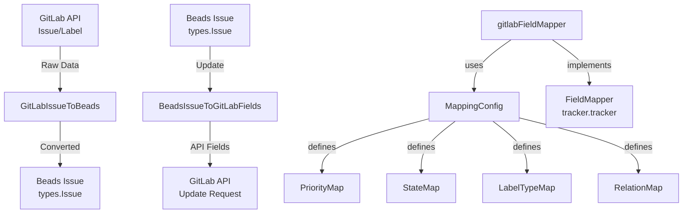

# field_mapping 模块深度解析

## 1. 模块概述

**field_mapping 模块** 是 GitLab 集成与系统内部域模型之间的翻译层，负责处理两种不同数据模型的双向转换。它存在的核心原因是：GitLab 的问题跟踪系统和 Beads 内部模型对问题属性的表示方式截然不同——GitLab 使用标签驱动的方案（如 `priority::high`、`type::bug`），而 Beads 使用结构化字段；GitLab 的状态只有简单的 "opened"/"closed"，而 Beads 有更丰富的状态机（open/in_progress/blocked/deferred/closed）。

这个模块本质上是一个**适配器**，通过可配置的映射规则解决了两个系统之间的语义不匹配问题。

## 2. 架构设计



### 核心组件角色

1. **gitlabFieldMapper**：实现 `tracker.FieldMapper` 接口，作为转换的协调器
2. **MappingConfig**：配置容器，定义 GitLab 和 Beads 之间所有字段的映射规则
3. **转换函数**：
   - `GitLabIssueToBeads`：从 GitLab 数据模型转换到 Beads 域模型
   - `BeadsIssueToGitLabFields`：从 Beads 域模型构建 GitLab API 字段

### 数据流向

**拉取同步（GitLab → Beads）**：
GitLab Issue → `GitLabIssueToBeads` → 解析标签提取状态/优先级/类型 → 构建 `types.Issue` → 返回 `IssueConversion`

**推送同步（Beads → GitLab）**：
Beads Issue → `BeadsIssueToGitLabFields` → 将结构化字段转换为标签 → 构建 GitLab API 更新字段映射

## 3. 核心组件详解

### gitlabFieldMapper

**设计意图**：实现 `tracker.FieldMapper` 接口，封装所有 GitLab 特定的转换逻辑，使集成框架能以统一方式处理不同跟踪器。

**核心方法**：
- `PriorityToBeads/PriorityToTracker`：处理优先级的双向转换
- `StatusToBeads/StatusToTracker`：处理状态的双向转换  
- `TypeToBeads/TypeToTracker`：处理问题类型的双向转换
- `IssueToBeads/IssueToTracker`：完整问题对象的双向转换

**设计亮点**：
- 所有转换通过 `MappingConfig` 配置，而非硬编码，提高了灵活性
- 提供合理的默认值（如优先级默认返回 2 = medium，状态默认返回 open），确保转换的健壮性

### MappingConfig

**设计意图**：将映射规则与转换逻辑分离，使系统可以适应不同的 GitLab 标签约定。

**核心映射表**：
- `PriorityMap`：GitLab 优先级标签值 → Beads 优先级（0-4）
- `StateMap`：GitLab 状态 → Beads 状态
- `LabelTypeMap`：GitLab 类型标签值 → Beads 问题类型
- `RelationMap`：GitLab 链接类型 → Beads 依赖关系类型

**重要设计决策**：
- `DefaultMappingConfig()` 返回配置的副本，避免外部修改影响默认行为
- 默认配置使用来自 `types.go` 的常量作为单一真实源，保证一致性

### GitLabIssueToBeads

**功能**：将 GitLab Issue 转换为 Beads Issue，是拉取同步的核心。

**转换逻辑**：
1. **优先级提取**：检查标签是否有 `priority::` 前缀，在 `PriorityMap` 中查找对应值
2. **状态确定**：GitLab 的 "closed" 状态优先；否则检查 `status::` 标签；最后回退到 `StateMap`
3. **类型识别**：检查 `type::` 前缀标签或裸标签（如 "bug"）
4. **其他字段**：权重转换为预估时间（1 weight = 60 分钟），GitLab 用户映射到 Beads 经办人
5. **标签过滤**：过滤掉已处理的作用域标签（priority/status/type），保留普通标签

### BeadsIssueToGitLabFields

**功能**：将 Beads Issue 转换为 GitLab API 更新字段，是推送同步的核心。

**构建逻辑**：
1. **标签构建**：
   - 类型 → `type::${type}`
   - 优先级 → `priority::${label}`
   - 状态（除 open/closed）→ `status::${status}`
   - 普通标签原样保留
2. **权重计算**：预估时间转换为权重（60 分钟 = 1 weight）
3. **状态事件**：closed 状态设置 `state_event: "close"`

## 4. 依赖分析

### 被依赖模块

- **[tracker](tracker_integration_framework.md)**：`gitlabFieldMapper` 实现了 `tracker.FieldMapper` 接口
- **[types](core_domain_types.md)**：使用 `types.Issue`、`types.Status`、`types.IssueType` 等核心域类型
- **[gitlab.types](gitlab_integration.md)**：处理 GitLab 特定的数据类型如 `Issue`、`IssueLink`

### 调用关系

```
[GitLab 集成] → gitlabFieldMapper 
                 ↓
            MappingConfig
                 ↓
            [核心域类型]
```

### 契约依赖

该模块假设：
- GitLab 使用作用域标签（`::` 分隔符）表示优先级、状态和类型
- GitLab 的权重单位是小时，Beads 的预估时间单位是分钟
- 外部系统不会修改 `DefaultMappingConfig()` 返回的配置（通过返回副本保证）

## 5. 设计决策与权衡

### 决策 1：标签驱动 vs 原生字段

**选择**：使用 GitLab 标签（如 `priority::high`）而非自定义字段

**原因**：
- GitLab 自定义字段需要高级版订阅，标签是通用功能
- 标签更灵活，可在不修改 schema 的情况下演变
- 标签在 GitLab UI 中更直观可见

**权衡**：
- ✅ 优点：兼容性好、灵活性高、无需额外配置
- ❌ 缺点：标签命名约定必须严格遵守，误操作会破坏同步

### 决策 2：配置化映射 vs 硬编码

**选择**：使用 `MappingConfig` 配置映射规则

**原因**：
- 不同团队可能有不同的标签约定
- 允许渐进式迁移（先支持常用标签，再扩展）
- 便于测试（可注入自定义配置）

**权衡**：
- ✅ 优点：灵活性高、可测试性好、适应不同场景
- ❌ 缺点：增加了配置复杂度，需要维护默认配置

### 决策 3：状态转换的优先级

**选择**：GitLab 的 "closed" 状态优先于所有状态标签

**原因**：
- 在 GitLab 中，closed 是最明确的状态信号
- 避免 "closed 但标签显示 in_progress" 的矛盾情况
- 符合用户直觉：关闭的问题就是关闭的，不管其他标签

**权衡**：
- ✅ 优点：状态清晰、避免矛盾、符合直觉
- ❌ 缺点：无法通过标签表示 "已关闭但阻塞" 等复合状态

### 决策 4：标签解析的双重检查

**选择**：同时支持作用域标签（`type::bug`）和裸标签（`bug`）

**原因**：
- 适应不同团队的标签使用习惯
- 渐进式采用：团队可以先使用裸标签，再迁移到作用域标签
- 提高容错性

**权衡**：
- ✅ 优点：兼容性好、容错性高、适应不同习惯
- ❌ 缺点：可能产生歧义（如果同时存在 `type::bug` 和裸标签 `feature`）

## 6. 使用指南与最佳实践

### 基本使用

```go
// 使用默认配置
config := gitlab.DefaultMappingConfig()
mapper := &gitlab.gitlabFieldMapper{config: config}

// GitLab → Beads
conversion := mapper.IssueToBeads(trackerIssue)

// Beads → GitLab
fields := mapper.IssueToTracker(beadsIssue)
```

### 自定义映射配置

```go
config := &gitlab.MappingConfig{
    PriorityMap: map[string]int{
        "urgent": 0,
        "important": 1,
        "normal": 2,
        "low": 3,
    },
    StateMap: map[string]string{
        "opened": "open",
        "closed": "closed",
        "locked": "deferred",
    },
    LabelTypeMap: map[string]string{
        "defect": "bug",
        "story": "feature",
        "chore": "task",
    },
}
```

### 常见模式

1. **标签约定**：团队应统一使用作用域标签格式：`priority::*`、`status::*`、`type::*`
2. **状态管理**：只使用标签表示 open、in_progress、blocked、deferred，closed 状态通过 GitLab 原生状态表示
3. **优先级范围**：Beads 使用 0-4 的优先级，确保映射覆盖所有需要的级别

## 7. 边缘情况与注意事项

### 已知限制

1. **优先级丢失**：如果 GitLab Issue 没有匹配的优先级标签，默认返回 2（medium），可能导致优先级信息丢失
2. **状态标签限制**：只有 in_progress、blocked、deferred 会作为标签同步到 GitLab，其他状态通过 state_event 处理
3. **权重舍入**：预估时间转换为权重时使用整数除法，可能导致精度损失
4. **依赖关系转换**：IssueLinks 的转换依赖于源/目标 IID 的正确识别，复杂关系可能处理不当

### 常见陷阱

1. **标签命名错误**：`priority:high`（单冒号）而不是 `priority::high`（双冒号）会导致无法识别
2. **修改默认配置**：直接修改 `DefaultMappingConfig()` 返回的配置不会生效，因为返回的是副本
3. **状态矛盾**：同时设置 closed 状态和 status::in_progress 标签会导致状态混乱
4. **类型标签冲突**：同时存在 `type::bug` 和裸标签 `feature` 会导致类型解析不确定

### 操作建议

1. **验证标签格式**：在同步前验证 GitLab 标签格式是否符合约定
2. **状态一致性检查**：确保 closed 状态的 Issue 没有 in_progress/blocked 等状态标签
3. **配置隔离**：每个仓库使用独立的 MappingConfig，避免相互影响
4. **日志记录**：记录转换过程中的映射决策，便于调试同步问题

## 8. 参考资料

- [Tracker Integration Framework](tracker_integration_framework.md) - 了解 FieldMapper 接口在整体集成框架中的位置
- [GitLab Integration](gitlab_integration.md) - 了解 GitLab 集成的完整架构
- [Core Domain Types](core_domain_types.md) - 深入了解 Beads 内部域模型
