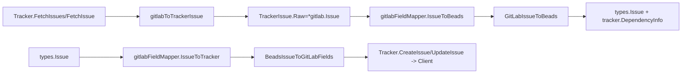

# field_mapping_layer（`internal.gitlab.fieldmapper.gitlabFieldMapper` + `internal.gitlab.mapping.MappingConfig`）技术深潜

`field_mapping_layer` 的核心价值，是把 GitLab 这套“以 label 和状态字符串表达语义”的世界，翻译成 beads 内部稳定的领域模型（`types.Issue`、`types.Status`、`types.IssueType`、优先级 0-4）。你可以把它想成一个“海关申报转换台”：外部系统递进来的字段格式千差万别，但内部系统只接收统一格式。没有这层，最常见的后果是同步逻辑里到处散落 `if state == "opened"`、`if label has prefix priority::` 这类平台特化分支，最后每新增一个 tracker 都要复制一遍同步主流程。

## 架构定位与数据流



这张图反映了它的真实架构角色：它不是“存储层”也不是“同步编排层”，而是 **语义转换层（transformer）**。上游是 [tracker_adapter](tracker_adapter.md)（`Tracker` 实现 `IssueTracker`），下游是 GitLab API 的字段约定（label scope、state_event、weight 等）。

拉取（pull）路径里，`Tracker` 先把 API 响应变成 `tracker.TrackerIssue`，并把原始对象塞到 `TrackerIssue.Raw`。随后 `gitlabFieldMapper.IssueToBeads` 再做“完整语义落地”：调用 `GitLabIssueToBeads` 生成 `*types.Issue`，并把 GitLab 依赖结构再包装成通用 `tracker.DependencyInfo`。推送（push）路径反过来，`IssueToTracker` 把 `*types.Issue` 编码成 GitLab 更新字段 map，再交给 `CreateIssue` / `UpdateIssue`。

## 心智模型：两层翻译，快路径+全量路径

理解这个模块最有效的模型是“**两层翻译器**”。第一层是标量字段翻译（优先级/状态/类型），由 `PriorityToBeads`、`StatusToBeads`、`TypeToBeads` 等方法提供，适合轻量场景。第二层是整单翻译（整条 issue），由 `IssueToBeads` 与 `IssueToTracker` 执行，负责处理字段组合规则、默认值、单位换算和标签重建。

这类似同声传译和文档翻译的关系：同声传译追求快、局部；文档翻译追求完整、上下文一致。`field_mapping_layer` 同时提供这两种能力，是为了兼容 tracker 框架中不同粒度的调用点。

## 组件深挖

### `MappingConfig`

`MappingConfig` 是策略容器，包含四张 map：`PriorityMap`、`StateMap`、`LabelTypeMap`、`RelationMap`。设计意图是把“映射策略”与“转换算法”解耦：算法固定，策略可替换。

`DefaultMappingConfig()` 的一个关键细节是 **拷贝** `PriorityMapping` 和 `typeMapping`，不是直接引用。这样调用方即便修改返回的配置，也不会污染全局默认常量，避免跨测试或跨实例的隐式共享状态问题。这是一个偏正确性的选择。

### `gitlabFieldMapper`

`gitlabFieldMapper` 实现 `tracker.FieldMapper`，本身非常薄，只持有 `config *MappingConfig`。它像一个门面（facade）：把接口要求的动作转发到 `mapping.go` 的纯函数，并补齐跨包类型适配。

`IssueToBeads(ti *tracker.TrackerIssue)` 的隐含契约最重要：它要求 `ti.Raw` 必须是 `*Issue`，否则直接返回 `nil`。这把类型安全从编译期推到了运行期，但也换来了 `TrackerIssue` 跨平台统一结构的灵活性。

### `PriorityToBeads` / `PriorityToTracker`

`PriorityToBeads` 接收 `interface{}`，只处理 `string`，并查 `config.PriorityMap`；失败默认 `2`（medium）。这里体现的是“容错优先”：宁可降级到中优先级，也不抛错阻塞同步。

`PriorityToTracker` 做反向查找：遍历 map 找到等值优先级并返回 label，找不到返回 `"medium"`。代价是 map 反查是 O(n)，且当多个 label 映射到同一数值时，返回值受 Go map 迭代顺序影响，具有不确定性。

### `StatusToBeads` / `StatusToTracker`

`StatusToBeads` 先查 `config.StateMap`，查不到再用 GitLab 特例：`opened/reopened -> open`，`closed -> closed`，最终默认 `types.StatusOpen`。这套优先级顺序把“配置可定制”和“平台兜底语义”叠在一起，减少错误配置造成的灾难性后果。

`StatusToTracker` 则明显简化：只有 `types.StatusClosed` 映射到 `"closed"`，其余全部 `"opened"`。也就是说，`in_progress/blocked/deferred` 不走 state，而在 `BeadsIssueToGitLabFields` 中通过 `status::*` 标签表达。

### `TypeToBeads` / `TypeToTracker`

`TypeToBeads` 从字符串读 `config.LabelTypeMap`，默认 `types.TypeTask`。`TypeToTracker` 直接 `return string(beadsType)`，不加 `type::` 前缀。这个方法更像“标量层”接口满足项；真正 push 字段时，`IssueToTracker` 走的是 `BeadsIssueToGitLabFields`，在那里才生成 `type::...` 标签。

### `GitLabIssueToBeads`

`GitLabIssueToBeads(gl *Issue, config *MappingConfig)` 是 pull 的核心函数。它不仅做字段拷贝，还编码了若干业务约束：

- `SourceSystem` 固定格式 `gitlab:<projectID>:<IID>`，确保可追溯来源。
- 类型/优先级/状态都从 labels+state 推导，而不是依赖 GitLab 的单一字段。
- `Weight` 被解释为小时，并换算成 `EstimatedMinutes`（`*60`）。
- `Labels` 只保留非 scoped labels（剔除 `priority::`、`status::`、`type::`）。

函数返回 `*IssueConversion`，但当前实现 `Dependencies` 为空切片。这意味着依赖关系导入是另一路逻辑（`issueLinksToDependencies`）负责，二者解耦。

### `BeadsIssueToGitLabFields`

这是 push 的核心编码器，输出 `map[string]interface{}`，用于 GitLab 更新 API。它会：

- 必填输出 `title`、`description`。
- 重建 labels：`type::`、`priority::`、可选 `status::`，再拼接现有非 scoped labels。
- 将 `EstimatedMinutes` 反算到 `weight`（除以 60，整数截断）。
- 对 closed 状态写 `state_event = "close"`。

注意它接收了 `config`，但优先级标签转换调用的是硬编码 `priorityToLabel`，并未使用 `config.PriorityMap` 做反向映射。这是当前实现里最值得警惕的不对称点。

### `priorityFromLabels` / `statusFromLabelsAndState` / `typeFromLabels`

这三个函数是“解析规则引擎”。它们共同模式是：遍历 labels，先识别 scoped 前缀（依赖 `parseLabelPrefix`），再做归一化匹配，最后走默认值。

`statusFromLabelsAndState` 的关键设计是“`closed` 状态优先级最高”。即便 label 标了 `status::in_progress`，只要 state 是 closed，最终仍返回 closed。这是在同步语义上偏向“系统真实终态”，而不是“标签描述态”。

### `issueLinksToDependencies`

该函数把 `IssueLink` 转成 `DependencyInfo`，并根据 `sourceIID` 解析方向。它支持 `RelationMap` 自定义映射，未知 link type 默认 `related`。

一个细节是：即使 target/source 缺失导致 `toIID` 为 0，也仍会 append 一条依赖记录。测试覆盖了这个行为，说明这是有意的“弱校验”策略，留给后续流程决定是否丢弃。

### `filterNonScopedLabels`

这个函数看起来简单，但它承担了“防止双写”的职责：如果不在 pull 时剔除 scoped labels，push 时又会重建一遍 `type::/priority::/status::`，最终出现重复或语义冲突标签。

## 依赖关系与契约边界

这个模块直接依赖 `internal.tracker` 的 `FieldMapper`、`TrackerIssue`、`IssueConversion` 契约，以及 `internal.types` 的 `Issue`/`Status`/`IssueType`。它还依赖 GitLab 本地类型（`Issue`、`IssueLink`）和 `parseLabelPrefix`、`PriorityMapping`、`StatusMapping`、`typeMapping` 这些共享映射常量/工具。

从调用关系看，最直接调用者是 `internal.gitlab.tracker.Tracker`：`FieldMapper()` 返回 `gitlabFieldMapper`，`CreateIssue` 与 `UpdateIssue` 调 `BeadsIssueToGitLabFields`。这意味着 `field_mapping_layer` 与 `tracker_adapter` 是“同包强协作”关系，而不是可独立部署组件。

它对上游有几个硬契约：`IssueToBeads` 需要 `TrackerIssue.Raw` 为 `*Issue`；`tracker` 层要接受 `IssueToBeads` 返回 `nil` 的失败信号；push 层要接受 `map[string]interface{}` 的松散类型载荷。如果这些契约变动（例如 `Raw` 不再透传原始对象），这里会第一时间失效。

## 设计取舍与为什么这样做

这个实现总体上选择了“默认值驱动的鲁棒性”而不是“严格失败”。几乎所有转换失败都有兜底：priority 默认 medium，type 默认 task，status 默认 open，未知 relation 默认 related。这样做非常适合同步系统：宁可把个别字段降级，也不让整条数据阻塞。

代价也很明确：你可能悄悄吞掉了配置错误或数据异常。比如优先级 label 拼错，不会报错，只会落成 2。系统可用性高，但可诊断性弱。

另一个取舍是“配置可扩展”与“编码简洁”的拉扯。`MappingConfig` 让映射可定制，但部分路径（`priorityToLabel`）仍是硬编码，导致双向映射不完全对称。这通常是迭代式实现留下的折中：先把主路径打通，再逐步把硬编码收敛进配置。

## 使用与扩展示例

在运行时，外部通常不直接 new `gitlabFieldMapper`，而是通过 `Tracker.FieldMapper()` 拿到 `tracker.FieldMapper` 接口。典型调用形态如下：

```go
// 在 gitlab Tracker 内部路径（或测试中）
mapper := (&gitlabFieldMapper{config: DefaultMappingConfig()})

conv := mapper.IssueToBeads(&tracker.TrackerIssue{Raw: glIssue})
fields := mapper.IssueToTracker(conv.Issue)
```

如果你要扩展映射策略，优先改 `MappingConfig` 并确保 `DefaultMappingConfig` 仍从共享常量拷贝默认值；其次补 `mapping_test.go` 的表驱动测试，覆盖默认值和异常输入。

## 新贡献者高频坑点

第一，`IssueToBeads` 返回 `nil` 并不一定是远端数据为空，也可能是 `Raw` 类型不匹配。排查时先看 `tracker.go` 里的 `gitlabToTrackerIssue` 是否保持了 `Raw: gl`。

第二，状态语义分两条通道：`closed/opened` 通过 state；`in_progress/blocked/deferred` 通过标签。只改其中一条，很容易造成“看起来映射成功但 UI 状态不对”。

第三，`EstimatedMinutes` 与 `weight` 是整数换算，`59` 分钟会变成 `0` weight（不会发送或语义丢失）。如果你引入更细粒度估算，要先决定是否接受这个精度损失。

第四，`PriorityToBeads` 不会对输入做 `strings.ToLower`，而 `priorityFromLabels` 会。也就是说不同入口对大小写容忍度不同，容易出现“同一值在不同路径行为不一致”。

第五，`issueLinksToDependencies` 可能产生 `ToGitLabIID == 0` 的记录；如果后续流程假设 ID 总是正数，会触发隐性 bug。

## 参考阅读

- Tracker 侧整体适配器职责： [tracker_adapter](tracker_adapter.md)
- 插件接口与同步框架契约： [tracker_plugin_contracts](tracker_plugin_contracts.md)
- GitLab API 数据类型： [client_and_api_types](client_and_api_types.md)
- 同步与转换结果类型： [sync_and_conversion_types](sync_and_conversion_types.md)
