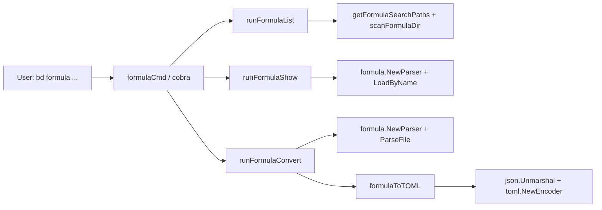

# formula_catalog_commands 深度解析

`formula_catalog_commands`（实现位于 `cmd/bd/formula.go`）是 `bd` CLI 在“公式目录层（catalog layer）”上的入口：它不负责执行公式（那是 cook/run 阶段的事），而是解决一个更前置但很关键的问题——**在多层搜索路径、混合格式（JSON/TOML）、可能重名覆盖（shadowing）的现实环境里，让用户可靠地“发现、查看、迁移”公式**。如果没有这一层，用户只能手动翻目录、猜优先级、自己解析结构，最后在配方体系变大后迅速失控。

## 架构角色与数据流



这个模块的架构定位很像“图书馆前台 + 编目台”：

- `list` 是**编目总览**：跨多个目录收集公式、处理重名遮蔽、按类型聚合展示。
- `show` 是**单本深读**：通过 parser 做标准加载，再把关键信息（变量、步骤树、compose、advice、pointcuts）可读化输出。
- `convert` 是**馆藏格式迁移**：把历史 JSON 迁到 TOML，并尽量保留可读性。

它是一个典型的 CLI orchestration 层：自己不做复杂领域推理，而是把“路径策略、容错策略、显示策略、格式转换策略”串成可用命令。

## 这个模块要解决的核心问题（Why）

### 1) 多来源公式的发现与优先级冲突
公式可能存在于：项目目录、用户目录、`GT_ROOT` 编排目录。真实团队里这三层经常重名（比如同名 workflow 在项目层覆盖用户层默认模板）。朴素做法是“递归搜所有文件然后全列出来”，但那会让用户看到多个同名结果，不知道最终生效的是哪个。

本模块的设计选择是：

- 明确优先级顺序（project > user > orchestrator）
- `list` 时用 `seen` map 做“**first hit wins**”
- 被后续路径遮蔽的同名公式直接跳过

这让 `list` 输出对用户来说等价于“当前执行上下文下真正可用的有效目录视图”。

### 2) 人类可读的结构化查看
公式结构本身很复杂（vars、steps、nested children、compose、advice、pointcuts）。直接打印原始 JSON/TOML 对排障不友好，尤其步骤树和依赖关系。

本模块用 `printFormulaStepsTree` 做树形输出，并把 `depends_on` / `needs` / `waits_for` 直接嵌入行尾，属于“读者视角”的展示，而不是“存储视角”的展示。

### 3) 兼容历史 JSON，同时推动 TOML
`convert` 命令背后的动机是迁移 ergonomics：TOML 更适合人工维护（多行字符串、diff、注释友好）。如果只说“支持两种格式”而不提供迁移工具，历史债务永远不会清。

## 心智模型（Mental Model）

建议把这个模块理解成“三段式管道”：

1. **Resolve catalog scope**：先确定在哪里找（`getFormulaSearchPaths`）。
2. **Load/inspect formula objects**：通过 `formula.NewParser` + `ParseFile`/`LoadByName` 得到统一 `*formula.Formula`。
3. **Render or transform**：要么用于显示（`list/show`），要么用于跨格式转换（`convert`）。

类比：它像容器镜像工具里的 `images / inspect / save`。不是运行时调度器，而是“让资产可见、可查、可迁移”的控制面。

## 关键组件深潜

### `formulaCmd` / `formulaListCmd` / `formulaShowCmd` / `formulaConvertCmd`
这四个 `cobra.Command` 组合定义了子命令树。`init()` 中通过 `formulaCmd.AddCommand(...)` 组织，并最终 `rootCmd.AddCommand(formulaCmd)` 注册到全局 CLI。

设计意图很清晰：把公式相关命令聚在同一个命名空间，避免散落在各命令文件中导致 discoverability 差。

---

### `FormulaListEntry`
```go
type FormulaListEntry struct {
    Name        string `json:"name"`
    Type        string `json:"type"`
    Description string `json:"description"`
    Source      string `json:"source"`
    Steps       int    `json:"steps"`
    Vars        int    `json:"vars"`
}
```

这是 `list --json` 的输出契约，不直接暴露完整 `formula.Formula`，而是暴露“目录视图最关心的信息”。这是一个**刻意降维**：

- 优点：稳定、轻量、易读。
- 代价：调用方拿不到 compose/advice 等深层字段，需要转到 `show`。

---

### `runFormulaList`
主流程：

1. 读取 `--type` 过滤器。
2. 通过 `getFormulaSearchPaths()` 获取有序目录。
3. 逐目录 `scanFormulaDir(dir)`。
4. 用 `seen[f.Formula]` 做遮蔽去重（前者胜出）。
5. 构造 `FormulaListEntry`（描述截断、递归计步数、变量计数）。
6. 排序后按 `jsonOutput` 分支输出。
7. 纯文本模式按类型分组显示（workflow / expansion / aspect）。

非显式但重要的策略：`scanFormulaDir` 失败会 `continue`，也就是“**目录级 soft-fail**”。这让命令在部分目录不存在时仍可工作，符合 CLI 对多环境运行的鲁棒性预期。

---

### `runFormulaShow`
`show` 走的是 parser 的“按名加载”路径：

- `parser := formula.NewParser()` 使用默认搜索路径。
- `parser.LoadByName(name)` 负责在路径中查找（parser 里是 TOML 优先，再 JSON fallback）。

加载成功后，模块做的是“结构化呈现”：

- 元信息（type/description/source）
- `Extends`
- `Vars`（排序后输出，附 required/default/enum/pattern）
- `Steps` 与 `Template`（树状）
- `Advice`
- `Compose`（bond points / expand / map / aspects）
- `Pointcuts`

这里的设计取向是**可观测性优先**：虽然字段很多，但都被“按概念分块打印”，便于定位问题发生在哪一层。

---

### `getFormulaSearchPaths`
按顺序生成路径：

1. `cwd/.beads/formulas`
2. `home/.beads/formulas`
3. `$GT_ROOT/.beads/formulas`（若设置）

这是整个模块最核心的隐式契约之一：后续 `list` 遮蔽逻辑、`findFormulaJSON` 搜索、`convert --all` 扫描都依赖此顺序。

---

### `scanFormulaDir`
目录扫描器，负责：

- 过滤目录项，仅处理文件
- 扩展名仅接受 `formula.FormulaExtTOML` 和 `formula.FormulaExtJSON`
- 调用 `parser.ParseFile(path)` 解析
- 解析失败即跳过（invalid formula 不中断全局列表）

这是典型“best-effort inventory”策略：列目录时宁可少报坏文件，也不让整个命令失败。

---

### `runFormulaConvert` 与 `convertAllFormulas`
`convert` 支持三种模式：

- 单个名字（按搜索路径找 `name.formula.json`）
- 直接路径（以 `.formula.json` 结尾）
- `--all` 批量转换

关键行为：

- 已是 `.formula.toml` 直接报错
- 批量模式下若目标 TOML 已存在则跳过
- 可选 `--stdout`（仅打印不落盘）
- 可选 `--delete`（成功后删 JSON）

批量模式统计 `converted/errors` 并最终汇总，便于自动化脚本消费。

---

### `formulaToTOML`
这是转换链路的核心函数：

1. 要求 `f.Source` 存在（否则无法回读原始 JSON）
2. 读原 JSON 文件
3. `json.Unmarshal` 到 `map[string]interface{}`
4. `fixIntegerFields` 修复 JSON number→`float64` 问题
5. `toml.NewEncoder(...).Encode(raw)`
6. `convertToMultiLineStrings` 做可读性后处理

为什么不直接对 `*formula.Formula` 编 TOML？

因为注释里明确：`Formula struct` 可能丢失原始结构中的某些排列/表现形式；回读 raw map 再编码更接近“结构保真迁移”。

---

### `fixIntegerFields`
只对已知整数字段（`version`, `priority`, `count`, `max`）做 `float64 -> int64` 转换。它是“保守白名单”策略：

- 好处：避免误把本该浮点的字段硬转整型。
- 代价：新整数字段若未加入白名单，会以浮点样式编码到 TOML。

---

### `convertToMultiLineStrings`
它是后处理而不是语义转换：逐行查找包含 `\\n` 的 `description = "..."`，改写为 TOML 多行字符串。

它故意很窄：**只处理 `description` 键**。这意味着实现简单、风险小，但也限制了通用性。

---

### 其他辅助函数

- `countSteps`：递归统计步骤总数（含 children）。
- `truncateDescription`：只取首行并限长，服务于列表可读性。
- `getTypeIcon`：类型→图标映射。
- `printFormulaStepsTree`：树状打印步骤与依赖信息。
- `findFormulaJSON`：按搜索路径找 JSON 文件。

## 依赖关系与数据契约

该模块向下主要依赖：

- [formula_loading_and_resolution](formula_loading_and_resolution.md)：`formula.NewParser`、`ParseFile`、`LoadByName`、扩展名常量。
- [formula_schema_and_composition](formula_schema_and_composition.md)：`Formula`、`Step`、`VarDef`、`ComposeRules`、`AdviceRule`、`Pointcut` 等结构字段契约。
- `internal/ui`：`ui.RenderAccent/RenderWarn/RenderPass/RenderFail`（终端渲染）。
- `cobra`：命令与 flag 基础设施。

向上被调用关系（在本文件可见范围）主要是：

- `init()` 将 `formulaCmd` 挂到 `rootCmd`，因此由 CLI 根命令分发进入本模块。

数据流契约最重要的是 `formula.Formula` 的字段语义。例如：

- `Formula.Type` 必须可字符串化用于分组与过滤。
- `Step.Children` 必须是树形结构，`countSteps/printFormulaStepsTree` 递归依赖它。
- `Source` 在转换路径中必须指向可读文件。

## 关键设计权衡

### 容错 vs 严格性
`list` 和目录扫描大量采用 `continue`（目录不可达、文件解析失败即跳过）。这偏向“工具可用性优先”。代价是：坏公式可能被静默忽略，用户不一定意识到目录里有损坏文件。

### 简单性 vs 可扩展性（转换后处理）
`convertToMultiLineStrings` 使用轻量字符串规则而不是完整 TOML AST 重写。实现成本低，但对复杂字符串场景的鲁棒性有限。

### 一致性 vs 重复实现
`getFormulaSearchPaths` 与 parser 的默认路径逻辑（`defaultSearchPaths`）语义一致但实现分离。优点是本模块可独立使用路径策略；缺点是后续若策略变更，存在双处维护风险。

### 可读输出 vs 完整输出
`list` 输出是摘要，`show` 输出是人工审查视图。两者都不是机器稳定 API（除了 `--json` 的结构体字段）。这很适合 CLI 交互，但做深度自动化时应优先用 JSON 输出或直接用 parser 层。

## 使用方式与示例

常见命令：

```bash
bd formula list
bd formula list --json
bd formula list --type workflow

bd formula show shiny
bd formula show security-audit --json

bd formula convert shiny
bd formula convert ./my.formula.json --stdout
bd formula convert --all --delete
```

`--json` 适合脚本集成；默认文本输出适合人工巡检。

## 新贡献者最该注意的 gotchas

第一，`runFormulaConvert` 的转换链路依赖 `f.Source` 回读原文件，因此不是“任意 Formula 对象都可转 TOML”的通用函数；它本质是“**从磁盘 JSON 迁移**”工具。

第二，`fixIntegerFields` 是硬编码白名单。你若在 schema 新增整数字段，记得同步这里，否则 TOML 数字类型可能不理想。

第三，`convertToMultiLineStrings` 只处理 `description`，且按行模式匹配。若未来要支持更多多行字段，建议引入更结构化的 TOML 重写方案，而不是继续堆字符串规则。

第四，`scanFormulaDir` 和 `convertAllFormulas` 都是 best-effort，会吞掉部分错误并继续。这对终端用户友好，但对 CI 场景可能不够“fail fast”；如果要用于严格流水线，建议增加严格模式 flag。

第五，`printFormulaStepsTree` 仅展示 `DependsOn/Needs/WaitsFor`，并不验证依赖合法性。合法性保障应在公式解析/校验层完成，不应误以为 `show` 已做完整校验。

## 参考阅读

- [formula_loading_and_resolution](formula_loading_and_resolution.md)
- [formula_schema_and_composition](formula_schema_and_composition.md)
- [cook_command_pipeline](cook_command_pipeline.md)
- [Formula Engine](Formula Engine.md)
