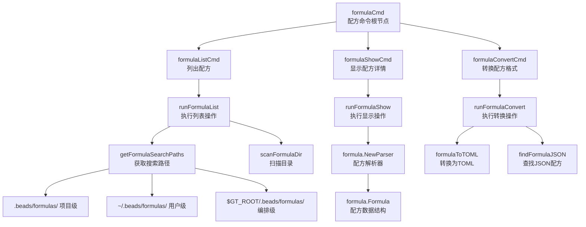

# formula_commands 模块技术深度解析

## 1. 模块概述

`formula_commands` 模块是 Beads 系统中管理工作流配方（formula）的命令行界面层。它为用户提供了一套直观的命令来浏览、查看和转换配方文件，这些配方是分子模板（molecule templates）的源头定义。

**核心问题**：用户需要一种简单的方式来发现、检查和管理存储在不同位置的配方文件，而不必直接处理文件系统路径或复杂的内部数据结构。

**解决思路**：通过提供统一的命令行界面，将底层的配方解析逻辑与用户交互分离，实现"一次定义，多处使用"的配方管理模式。

## 2. 架构设计

### 2.1 架构图



### 2.2 核心组件角色

- **formulaCmd**：作为所有配方操作的父命令，定义了统一的命令分组和帮助文档。
- **formulaListCmd**：负责列出所有可用的配方，支持按类型过滤，并处理不同搜索路径的优先级。
- **formulaShowCmd**：显示特定配方的详细信息，包括元数据、变量、步骤、组合规则等。
- **formulaConvertCmd**：将JSON格式的配方转换为TOML格式，提供更好的可读性。
- **FormulaListEntry**：用于列表输出的中间数据结构，包含配方的基本信息。

## 3. 数据流程

### 3.1 配方列表流程 (`bd formula list`)

1. **初始化**：解析命令行参数，获取类型过滤器。
2. **获取搜索路径**：按优先级顺序获取三个搜索路径（项目级 > 用户级 > 编排级）。
3. **扫描目录**：对每个搜索路径调用 `scanFormulaDir`，解析目录中的配方文件。
4. **去重与过滤**：优先保留第一个出现的配方（处理同名配方的阴影问题），并应用类型过滤器。
5. **排序与输出**：按名称排序后，根据输出格式（JSON或人类可读）显示结果。

### 3.2 配方详情流程 (`bd formula show`)

1. **参数解析**：获取要显示的配方名称。
2. **创建解析器**：使用默认搜索路径创建 `formula.Parser`。
3. **加载配方**：通过名称加载配方，处理可能的错误。
4. **格式化输出**：根据配方类型（workflow/expansion/aspect）以树状结构显示：
   - 元数据（名称、类型、描述）
   - 变量定义（默认值、约束）
   - 步骤树（含依赖关系）
   - 组合规则（继承、扩展、映射）
   - 连接点（Bond Points）
   - 切入点（Pointcuts）

### 3.3 格式转换流程 (`bd formula convert`)

1. **参数解析**：确定是转换单个文件还是所有文件。
2. **文件定位**：通过名称搜索或直接路径找到JSON配方文件。
3. **解析与转换**：
   - 使用 `formula.Parser` 解析JSON文件
   - 通过 `formulaToTOML` 函数转换为TOML格式
   - 后处理：将转义的换行符转换为多行字符串
4. **输出**：根据选项输出到文件或标准输出，可选择删除原文件。

## 4. 核心组件深入解析

### 4.1 FormulaListEntry 结构体

```go
type FormulaListEntry struct {
    Name        string `json:"name"`
    Type        string `json:"type"`
    Description string `json:"description"`
    Source      string `json:"source"`
    Steps       int    `json:"steps"`
    Vars        int    `json:"vars"`
}
```

**设计意图**：这是一个专门为列表输出设计的简化数据结构。它不是直接使用完整的 `formula.Formula`，而是提取了用户在浏览配方时最关心的关键字段，实现了"视图模型"与"领域模型"的分离。

**关键特性**：
- `Steps` 字段通过 `countSteps` 函数递归计算，包含所有子步骤
- `Description` 通过 `truncateDescription` 函数截断到合适长度，保持列表整洁
- `Source` 字段显示配方的来源路径，帮助用户理解配方的优先级

### 4.2 搜索路径管理 (`getFormulaSearchPaths`)

**设计意图**：实现分层的配方配置系统，允许在不同级别（项目、用户、系统）定义配方，并通过优先级机制解决冲突。

**优先级顺序**：
1. 项目级：当前目录下的 `.beads/formulas/`（最高优先级）
2. 用户级：用户主目录下的 `.beads/formulas/`
3. 编排级：`$GT_ROOT` 环境变量指定的目录下的 `.beads/formulas/`（最低优先级）

**设计权衡**：
- **优点**：支持团队共享配方的同时允许个人定制
- **缺点**：同名配方的阴影效应可能导致混淆，因此 `formulaListEntry` 包含 `Source` 字段来明确来源

### 4.3 递归步骤计数 (`countSteps`)

```go
func countSteps(steps []*formula.Step) int {
    count := len(steps)
    for _, s := range steps {
        count += countSteps(s.Children)
    }
    return count
}
```

**设计意图**：提供一个简单的指标来表示配方的复杂度。步骤的嵌套结构反映了工作流的层次，递归计数能够准确反映这一点。

**使用场景**：
- 在列表视图中显示步骤数，帮助用户快速评估配方的大小
- 在显示配方详情时，给出步骤总数的概览

### 4.4 树状步骤打印 (`printFormulaStepsTree`)

**设计意图**：以直观的树状结构展示步骤的层次关系和依赖，这对于理解复杂的工作流配方至关重要。

**视觉设计**：
- 使用 `├──` 和 `└──` 表示同级步骤的最后一个节点
- 依赖关系通过 `[depends: ..., needs: ..., waits_for: ...]` 格式显示
- 子步骤通过增加缩进表示，使用 `│  ` 表示垂直连接线

**设计权衡**：
- 选择这种ASCII树格式而不是图形化界面，是为了保持在命令行环境中的可用性
- 完整显示所有依赖信息可能会让输出变得冗长，但对于理解工作流的执行顺序是必要的

### 4.5 JSON到TOML转换 (`formulaToTOML`)

**设计意图**：将JSON格式的配方转换为更人类友好的TOML格式，提高可读性和可维护性。

**技术实现**：
1. 重新读取原始JSON文件（而不是使用已解析的结构）以保留原始结构和顺序
2. 使用中间的 `map[string]interface{}` 结构进行转换
3. `fixIntegerFields` 函数修复JSON反序列化时所有数字变成float64的问题
4. `convertToMultiLineStrings` 后处理将转义的换行符转换为TOML的多行字符串语法

**设计权衡**：
- 重新读取原始文件而不是使用已解析的结构，确保了格式转换的准确性，但增加了I/O操作
- 只对 `description` 字段进行多行字符串转换，是一种平衡的选择，避免了过度转换带来的问题

## 5. 设计决策与权衡

### 5.1 搜索路径的优先级设计

**决策**：采用项目级 > 用户级 > 编排级的优先级顺序。

**原因**：
- 项目级配方应该具有最高优先级，因为它们最具体，与当前工作直接相关
- 用户级配方允许个人偏好和常用配方的持久化
- 编排级配方提供了团队或组织级别的共享配方

**替代方案**：
- 可以使用更复杂的合并策略，而不是简单的阴影，但这会增加用户的理解负担
- 可以允许用户通过命令行参数调整优先级，但这会增加接口的复杂性

### 5.2 配方列表的去重策略

**决策**：使用 `seen` 映射跟踪已处理的配方名称，只保留第一个出现的配方。

**原因**：
- 简单直接，符合用户对"优先级"的直觉理解
- 避免了同名配方导致的混淆

**替代方案**：
- 可以显示所有同名配方并标记其来源，但这会使列表变得冗长
- 可以在发现同名配方时发出警告，但这可能会在正常使用场景中产生过多噪音

### 5.3 格式转换中的重新读取策略

**决策**：在 `formulaToTOML` 中重新读取原始JSON文件，而不是使用已解析的 `formula.Formula` 结构。

**原因**：
- 保留了原始JSON中的字段顺序和结构
- 避免了 `formula.Formula` 结构可能丢失的信息
- 确保了转换的准确性

**权衡**：
- 增加了一次文件读取操作，但对于转换操作来说，这不是性能关键点
- 依赖于 `Source` 字段的正确性，如果该字段丢失或不正确，转换将失败

### 5.4 输出格式的双轨制

**决策**：同时支持人类可读的文本输出和机器可读的JSON输出。

**原因**：
- 文本输出适合交互式使用，提供直观的信息呈现
- JSON输出适合脚本和自动化工具，便于与其他系统集成

**实现方式**：
- 通过全局的 `jsonOutput` 标志控制输出格式
- 在每个命令的最后检查该标志，选择相应的输出方式

## 6. 依赖关系分析

### 6.1 模块依赖

`formula_commands` 模块主要依赖以下内部模块：

- **[formula](formula_parser.md)**：核心的配方解析和数据结构
  - `formula.NewParser()`：创建配方解析器
  - `formula.Formula`：配方数据结构
  - `formula.Step`：配方步骤结构
  - `formula.FormulaExtTOML` / `formula.FormulaExtJSON`：文件扩展名常量

- **[ui](ui_utilities.md)**：用户界面辅助函数
  - `ui.RenderAccent()`：渲染强调文本
  - `ui.RenderWarn()`：渲染警告文本
  - `ui.RenderPass()`：渲染成功文本
  - `ui.RenderFail()`：渲染失败文本

### 6.2 被依赖关系

目前没有其他模块直接依赖 `formula_commands`，因为它是一个命令行界面层，主要被用户直接调用。

### 6.3 数据契约

**输入契约**：
- 配方文件必须是有效的JSON或TOML格式
- 配方文件必须使用 `.formula.json` 或 `.formula.toml` 扩展名
- 配方结构必须符合 `formula.Formula` 的定义

**输出契约**：
- `list` 命令输出按名称排序的配方列表
- `show` 命令以结构化的方式显示配方的所有信息
- `convert` 命令生成等效的TOML格式文件

## 7. 使用指南与最佳实践

### 7.1 常见使用模式

**列出所有配方**：
```bash
bd formula list
```

**按类型过滤**：
```bash
bd formula list --type workflow
```

**查看配方详情**：
```bash
bd formula show my-workflow
```

**转换单个配方**：
```bash
bd formula convert my-workflow --delete
```

**批量转换所有配方**：
```bash
bd formula convert --all
```

### 7.2 配方组织最佳实践

1. **项目特定配方**：放在项目目录的 `.beads/formulas/` 中
2. **个人常用配方**：放在 `~/.beads/formulas/` 中
3. **团队共享配方**：通过 `$GT_ROOT` 环境变量管理
4. **优先使用TOML格式**：利用其更好的可读性和多行字符串支持
5. **命名约定**：使用简短、描述性的名称，避免使用特殊字符

### 7.3 调试技巧

- 如果配方没有出现在列表中，使用 `bd formula list` 查看搜索路径
- 如果配方加载失败，检查文件扩展名是否正确
- 使用 `--json` 标志获取机器可读的输出，便于调试和脚本处理

## 8. 边缘情况与注意事项

### 8.1 同名配方的阴影效应

**问题**：当多个搜索路径中存在同名配方时，只有优先级最高的那个会被显示和使用。

**缓解**：
- `formulaListEntry` 包含 `Source` 字段，显示配方的来源路径
- 在 `list` 命令的输出中，每个配方条目都包含来源信息

### 8.2 无效配方文件

**问题**：目录中可能存在格式错误的配方文件。

**处理方式**：
- `scanFormulaDir` 函数在解析失败时会跳过该文件，而不是中止整个操作
- 这确保了一个坏文件不会影响其他配方的显示

### 8.3 格式转换中的数据丢失风险

**问题**：在JSON到TOML的转换过程中，可能存在信息丢失的风险。

**缓解**：
- 默认情况下保留原始JSON文件
- 只在用户明确指定 `--delete` 标志时才删除原文件
- 转换过程中尽可能保留原始结构和顺序

### 8.4 多行字符串的处理

**问题**：JSON中的换行符需要转义，这降低了可读性。

**处理方式**：
- `convertToMultiLineStrings` 函数专门处理 `description` 字段，将其转换为TOML的多行字符串格式
- 这种选择性处理避免了过度转换可能带来的问题

## 9. 未来可能的改进方向

1. **配方编辑功能**：添加 `edit` 命令，允许直接编辑配方文件
2. **配方验证**：添加 `validate` 命令，检查配方的语法和语义正确性
3. **配方搜索**：添加 `search` 命令，支持按名称、描述或内容搜索配方
4. **配方模板**：添加 `init` 命令，创建新的配方模板
5. **更丰富的过滤选项**：支持按步骤数、变量数等元数据过滤配方列表
6. **配方依赖可视化**：显示配方之间的继承和依赖关系图

## 10. 总结

`formula_commands` 模块是 Beads 系统中连接用户与配方引擎的桥梁。它通过简洁的命令行界面，将复杂的配方管理操作变得直观易用。

该模块的设计体现了几个关键原则：
- **分层配置**：通过多级搜索路径支持不同级别的配方管理
- **优先级明确**：同名配方的处理规则简单直观
- **格式友好**：支持并推荐使用更人类友好的TOML格式
- **容错设计**：单个无效文件不会影响整体功能

作为命令行界面层，它成功地将底层的配方解析逻辑与用户交互分离，为用户提供了一个专注于"使用"而非"实现"的接口。
