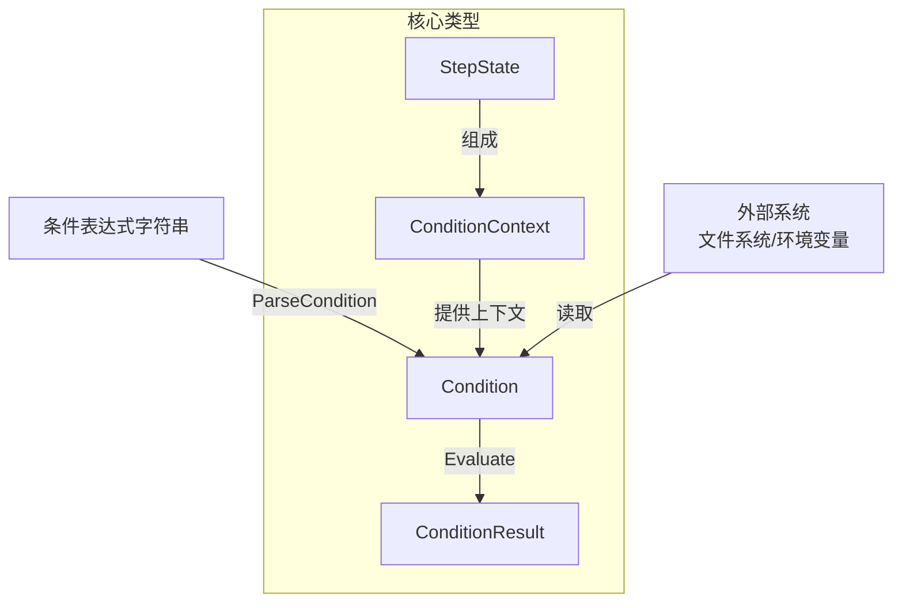

# formula_condition 模块深度解析

## 核心问题与设计动机

在构建工作流和任务编排系统时，我们经常需要根据某些条件来决定下一步该做什么——比如"只有当审核步骤完成且批准通过时，才能进行部署"，或者"当所有子任务都完成时，再继续执行"。

**naive 方案的问题**：
- 如果直接在代码中硬编码条件判断，工作流的灵活性会极差
- 如果允许执行任意代码作为条件，会引入严重的安全风险
- 如果条件表达式太复杂，普通用户难以理解和编写

**设计洞察**：我们需要一种**受限但表达力足够**的声明式条件语言，它能够：
1. 安全地访问步骤状态和输出
2. 支持简单的聚合操作（所有、任一、计数）
3. 与外部环境（文件、环境变量）交互
4. 保持可判定性和可预测性

这就是 `formula_condition` 模块存在的意义——它为 [Formula 引擎](formula_types.md) 提供了一个安全、易用的条件评估系统。

## 心智模型：条件检查器

把 `formula_condition` 想象成一个**专门的安检门**：

- **安检人员** = `Condition` 解析器和评估器
- **乘客** = 工作流执行上下文（步骤状态、变量、环境）
- **安检规则** = 条件表达式
- **安检结果** = `ConditionResult`（是否通过 + 原因说明）

这个安检门只检查预先定义好的几类东西（步骤状态、输出、文件存在、环境变量），不会让乘客做任何危险的事情（比如执行任意代码）。

## 架构概览



### 组件职责

1. **`Condition`**：条件的结构化表示，包含解析后的条件信息
2. **`ConditionContext`**：评估条件所需的上下文环境（步骤状态、当前步骤、变量）
3. **`StepState`**：单个步骤的运行时状态（ID、状态、输出、子步骤）
4. **`ConditionResult`**：条件评估结果（是否满足 + 原因）

### 数据流向

1. **解析阶段**：`ParseCondition()` 将字符串表达式解析为结构化的 `Condition` 对象
2. **评估阶段**：`Condition.Evaluate()` 接收 `ConditionContext`，根据条件类型调用相应的评估方法
3. **结果返回**：返回 `ConditionResult`，包含布尔结果和人类可读的原因

## 核心组件深度解析

### Condition：结构化条件表示

`Condition` 结构体是条件表达式的抽象语法树（AST）的简化形式。它根据条件类型存储不同的字段：

```go
type Condition struct {
    Raw  string          // 原始条件字符串
    Type ConditionType   // 条件类型：field, aggregate, external
    
    // 字段条件专用
    StepRef  string      // 步骤引用
    Field    string      // 字段路径
    Operator Operator    // 比较运算符
    Value    string      // 期望值
    
    // 聚合条件专用
    AggregateFunc string  // 聚合函数：all, any, count
    AggregateOver string  // 聚合范围：children, descendants, steps
    
    // 外部条件专用
    ExternalType string   // 外部类型：file.exists, env
    ExternalArg  string   // 外部参数
}
```

**设计决策**：使用单一结构体而非接口继承
- **选择**：所有条件类型共用一个结构体，通过 `Type` 字段区分
- **原因**：简化实现，避免接口类型断言的复杂性；条件类型数量有限且相对固定
- **权衡**：结构体可能有些字段在某些条件类型下不会使用，但这种冗余是可接受的

### ConditionContext：评估上下文

`ConditionContext` 提供了评估条件所需的所有环境信息：

```go
type ConditionContext struct {
    Steps       map[string]*StepState  // 所有步骤的状态
    CurrentStep string                  // 当前被门控的步骤
    Vars        map[string]string       // 公式变量
}
```

**关键设计点**：
- `Steps` 是一个映射，允许通过步骤 ID 快速查找
- `CurrentStep` 支持相对引用（如 `step.status` 表示当前步骤的状态）
- `Vars` 支持变量替换，主要用于文件路径

### StepState：步骤状态

`StepState` 捕获了步骤在运行时的所有相关信息：

```go
type StepState struct {
    ID       string                 // 步骤标识符
    Status   string                 // 步骤状态：pending, in_progress, complete, failed
    Output   map[string]interface{} // 结构化输出
    Children []*StepState           // 子步骤状态
}
```

**Output 设计**：
- 使用点分隔路径访问嵌套值（如 `output.approved`）
- 通过 `getNestedValue()` 函数递归查找
- 这种设计允许步骤输出任意结构化数据，同时保持条件访问的简单性

### 条件类型详解

#### 1. 字段条件 (ConditionTypeField)

**用途**：检查单个步骤的状态或输出

**示例**：
- `step.status == 'complete'` - 当前步骤是否完成
- `review.output.approved == true` - 审核步骤的输出是否批准
- `test.output.errors.count == 0` - 测试步骤的错误数是否为 0

**解析逻辑**：
- 使用 `fieldPattern` 正则表达式匹配
- 支持 `step.` 前缀（当前步骤）、`output.` 前缀（当前步骤输出）、或步骤名前缀
- 字段路径通过点分隔

**评估逻辑**：
1. 解析步骤引用，找到对应的 `StepState`
2. 根据字段路径获取实际值（状态或输出）
3. 使用 `compare()` 函数进行比较

#### 2. 聚合条件 (ConditionTypeAggregate)

**用途**：对多个步骤进行聚合检查

**示例**：
- `children(step).all(status == 'complete')` - 当前步骤的所有子步骤是否都完成
- `descendants(build).any(status == 'failed')` - build 步骤的任一后代步骤是否失败
- `steps.complete >= 3` - 至少有 3 个步骤已完成
- `children(test).count(status == 'failed') == 0` - 测试子步骤中失败的数量为 0

**关键设计决策**：空集合的处理
```go
// 对于 "all" 聚合，空集合返回 false
if len(steps) == 0 {
    return &ConditionResult{
        Satisfied: false,
        Reason:    fmt.Sprintf("no %s to evaluate", c.AggregateOver),
    }, nil
}
```

**原因**：避免门控在子步骤创建之前就通过。如果 `all([])` 返回 true，那么在子步骤还没创建时，"所有子步骤完成"这个条件就会意外通过。

**聚合范围**：
- `children` - 直接子步骤
- `descendants` - 所有后代步骤（递归收集）
- `steps` - 所有步骤

#### 3. 外部条件 (ConditionTypeExternal)

**用途**：与外部系统交互

**示例**：
- `file.exists('go.mod')` - 文件是否存在
- `env.CI == 'true'` - 环境变量是否满足条件

**安全考虑**：
- 只允许预定义的外部操作（文件存在检查、环境变量读取）
- 不允许任意文件系统操作或命令执行
- 文件路径支持变量替换（如 `file.exists('{{.WorkDir}}/config.yaml')`）

### 比较机制

`compare()` 函数是条件评估的核心，它处理各种类型的比较：

1. **nil 值处理**：显式处理 nil，避免意外的行为
2. **布尔值**：将 bool 转换为字符串后比较
3. **数字**：尝试解析为 float64 进行数值比较
4. **字符串**：回退到字符串比较

**设计决策**：自动类型转换
- **选择**：尝试将字符串转换为数字进行比较
- **原因**：用户期望 `step.output.score > 80` 能正常工作，即使 score 是以字符串形式存储的
- **权衡**：可能会有意外的类型转换，但这种便利性是值得的

## 依赖关系分析

### 被依赖关系

`formula_condition` 模块主要被 [Formula 引擎](formula_types.md) 使用，特别是：
- `GateRule` - 门控规则，决定步骤是否可以执行
- `LoopSpec` - 循环规范，可能使用条件决定是否继续循环
- 其他需要条件判断的公式组件

### 依赖关系

`formula_condition` 模块的依赖非常精简：
- 标准库：`fmt`, `os`, `regexp`, `strconv`, `strings`
- 没有外部依赖
- 不依赖其他内部模块（除了可能共享一些基础类型）

**设计优势**：这种低耦合设计使得条件评估逻辑可以独立测试和理解。

## 设计决策与权衡

### 1. 受限的表达力 vs 安全性

**决策**：只支持预定义的条件类型，不允许任意代码执行

**原因**：
- 安全性是首要考虑 - 条件表达式可能来自用户输入
- 可预测性 - 受限的语言更容易推理和调试
- 性能 - 简单的解析和评估比通用语言更快

**权衡**：
- 丧失了一些灵活性
- 但对于工作流条件场景，现有表达力已经足够

### 2. 正则表达式解析 vs 完整解析器

**决策**：使用正则表达式进行解析，而不是构建完整的解析器

**原因**：
- 条件语言足够简单，正则表达式可以处理
- 实现更简单，维护成本更低
- 性能更好

**权衡**：
- 错误信息可能不够友好
- 难以支持更复杂的语法（如括号、逻辑组合）
- 但目前的设计已经满足需求

### 3. 空集合的 "all" 聚合返回 false

**决策**：当聚合集合为空时，`all` 函数返回 false

**原因**：
- 避免门控在子步骤创建之前就意外通过
- 在工作流场景中，"所有子步骤完成"通常隐含"至少有一个子步骤"

**权衡**：
- 这与数学上的"空全称量词为真"（vacuous truth）不同
- 但在实际工作流场景中，这种行为更符合预期

### 4. 字符串优先的比较

**决策**：将所有值转换为字符串进行比较，只有在可能时才尝试数值比较

**原因**：
- 步骤输出通常来自 JSON，类型信息可能丢失
- 用户更关心"看起来是否相等"，而不是严格的类型相等
- 简化了实现

**权衡**：
- 可能会有意外的类型转换行为
- 例如，`"10" > "2"` 在字符串比较中是 false，但在数值比较中是 true
- 但通过尝试数值比较作为优先路径，缓解了这个问题

## 使用指南与示例

### 基本用法

```go
// 1. 创建上下文
ctx := &formula.ConditionContext{
    Steps: map[string]*formula.StepState{
        "review": {
            ID:     "review",
            Status: "complete",
            Output: map[string]interface{}{
                "approved": true,
                "comments": "Looks good",
            },
        },
        "test": {
            ID:       "test",
            Status:   "complete",
            Children: []*formula.StepState{
                {ID: "unit", Status: "complete"},
                {ID: "integration", Status: "complete"},
            },
        },
    },
    CurrentStep: "deploy",
    Vars: map[string]string{
        "WorkDir": "/app",
    },
}

// 2. 解析并评估条件
result, err := formula.EvaluateCondition("review.status == 'complete'", ctx)
if err != nil {
    // 处理错误
}

// 3. 使用结果
if result.Satisfied {
    fmt.Println("条件满足:", result.Reason)
} else {
    fmt.Println("条件不满足:", result.Reason)
}
```

### 常见条件模式

#### 步骤状态检查
```go
// 当前步骤完成
"step.status == 'complete'"

// 特定步骤失败
"build.status == 'failed'"
```

#### 输出值检查
```go
// 审核通过
"review.output.approved == true"

// 测试错误数为 0
"test.output.errors.count == 0"

// 分数大于 80
"qa.output.score > 80"
```

#### 聚合条件
```go
// 所有子步骤完成
"children(step).all(status == 'complete')"

// 任一后代步骤失败
"descendants(build).any(status == 'failed')"

// 至少 3 个步骤完成
"steps.complete >= 3"

// 没有失败的子步骤
"children(test).count(status == 'failed') == 0"
```

#### 外部条件
```go
// 文件存在
"file.exists('go.mod')"

// 使用变量的文件路径
"file.exists('{{WorkDir}}/config.yaml')"

// 环境变量检查
"env.CI == 'true'"
```

## 常见陷阱与注意事项

### 1. 空集合的 "all" 聚合

**陷阱**：当没有子步骤时，`children(step).all(status == 'complete')` 返回 false

**场景**：你有一个可选的子步骤，如果子步骤不存在或完成，就继续执行

**解决方法**：考虑使用 `count` 聚合，或者重新设计工作流结构

### 2. 输出路径的 nil 值

**陷阱**：如果步骤输出不存在该路径，`step.output.nonexistent == 'value'` 会比较 nil 和 'value'

**行为**：`nil == ""` 是 true，其他比较都是 false

**建议**：确保步骤输出包含所有可能被条件引用的字段

### 3. 字符串 vs 数值比较

**陷阱**：`step.output.score > 80` 可能不会按预期工作，如果 score 以字符串形式存储且无法解析为数字

**行为**：会回退到字符串比较，`"90" > "80"` 是 true，但 `"100" > "80"` 是 false

**建议**：确保数值输出以数字类型存储，或者使用能够正确解析的格式

### 4. 步骤引用的歧义

**陷阱**：如果有一个步骤名为 "step"，那么 `step.status` 会引用当前步骤，而不是名为 "step" 的步骤

**原因**：`"step"` 是一个特殊关键字，总是指向当前步骤

**建议**：避免将步骤命名为 "step"

### 5. 正则表达式解析的限制

**陷阱**：复杂的条件表达式可能无法正确解析，特别是包含嵌套括号或特殊字符的

**原因**：使用正则表达式解析，而不是完整的语法解析器

**建议**：保持条件简单，如果需要复杂逻辑，考虑拆分成多个条件或在步骤输出中预先计算

## 扩展点与未来可能

虽然当前设计相对固定，但有几个潜在的扩展点：

1. **新的条件类型**：可以添加 `ConditionType` 来支持新的条件类别
2. **新的聚合函数**：可以在 `evaluateAggregate()` 中添加新的 case
3. **新的外部操作**：可以在 `evaluateExternal()` 中添加新的外部检查
4. **逻辑组合**：未来可能支持 `AND`/`OR` 逻辑组合多个条件

## 总结

`formula_condition` 模块是一个精心设计的条件评估系统，它在安全性、表达力和简单性之间取得了很好的平衡。它的核心价值在于：

1. **安全性**：通过受限的语言设计，防止任意代码执行
2. **可用性**：提供直观的语法，满足工作流场景的常见需求
3. **可预测性**：明确的行为规范，特别是在边界情况下
4. **低耦合**：独立的模块设计，易于测试和维护

理解这个模块的关键是把握它的**设计约束**——它不是一个通用的编程语言，而是一个专门为工作流条件设计的受限领域特定语言（DSL）。这种约束正是它的优势所在。
