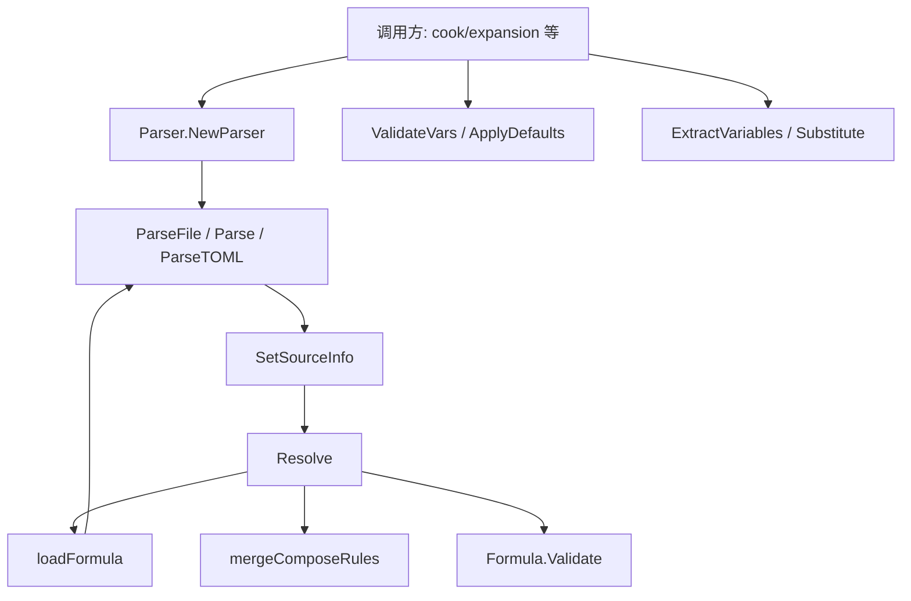

# formula_loading_and_resolution

`formula_loading_and_resolution` 模块的核心价值，可以把它理解成“配方系统的装配车间 + 血缘追踪器”。它不只是把 `.formula.toml` / `.formula.json` 读出来；它要解决的是：**当一个公式会继承多个父公式、带变量约束、还要支持跨文件复用时，如何在运行前得到一份可验证、可追溯、可解释的最终公式**。如果只做朴素的文件反序列化，很快就会遇到：继承环、覆盖规则混乱、变量缺失、来源不明（出错时无法定位）等问题。这个模块的设计重点，就是把“读文件”升级成“受控解析 + 继承归并 + 约束验证 + 溯源标注”的完整流水线。

## 架构角色与数据流



从架构定位看，`Parser` 不是纯工具函数集合，而是一个**有状态的解析编排器（orchestrator）**。它管理三类状态：`cache`（避免重复加载）、`resolvingSet`（检测继承环）、`resolvingChain`（生成可读错误链路）。这使它能在“跨文件、递归继承”的场景下保持确定性。

一次典型流程是：调用方先通过 `NewParser` 构造解析器，然后 `ParseFile` 读入入口公式。`ParseFile` 负责格式判定（TOML 优先、JSON 兼容）、默认值填充（`Version` / `Type`）、并调用 `SetSourceInfo` 给每个 `Step` 打上来源标记。随后进入 `Resolve`：它递归加载 `Extends` 父公式，通过 `mergeComposeRules` 和变量/步骤合并策略得到最终公式，最后执行 `Formula.Validate` 做结构一致性检查。

注意这里有一个关键分层：

- `Parser` 负责“**跨文件与继承语义**”；
- `Formula.Validate` 负责“**结构合法性**”；
- `ValidateVars` / `ApplyDefaults` / `Substitute` 负责“**实例化时变量处理**”。

这三个层次拆开，避免把所有规则塞进一个巨函数，降低耦合。

## 心智模型：把公式当成“类继承 + 模板渲染 + AST 注释”

理解该模块最有效的模型是三层叠加：

第一层像“类继承”：`Formula.Extends` 类似多继承，父公式提供基础 `Vars`、`Steps`、`Compose`，子公式覆盖或追加。`Resolve` 就是“线性化继承并产出最终类定义”。

第二层像“模板渲染”：`{{var}}` 占位符通过 `ExtractVariables`、`ValidateVars`、`ApplyDefaults`、`Substitute` 形成变量生命周期。先识别需求，再校验输入，再应用默认值，最后替换文本。

第三层像“AST 注释/源码映射”：`SetSourceInfo` 给每个 `Step` 记录 `SourceFormula` 和 `SourceLocation`。这相当于编译器里的 source map，帮助后续 cooking 阶段在错误、诊断、审计中追溯“这一步最初来自哪份公式、哪一段路径”。

## 组件深潜

### `Parser`：有状态的加载与解析协调器

`Parser` 的字段设计直接体现了问题域：

- `searchPaths []string`：公式发现顺序（项目级、用户级、`GT_ROOT`）。
- `cache map[string]*Formula`：按绝对路径和公式名双重缓存。
- `resolvingSet map[string]bool` + `resolvingChain []string`：递归继承时做环检测并生成链式错误。

这里的设计意图是：公式系统天然是“图”，而不是“树”。有缓存和环检测才能把图解析稳定化。

### `NewParser(searchPaths ...string) *Parser`

如果不传路径，会使用 `defaultSearchPaths()`。这让调用方在常规 CLI/本地运行中零配置可用，同时保留显式路径注入能力（测试或隔离环境常用）。

非显而易见的一点：`Parser` 注释明确 **NOT thread-safe**。这不是疏漏，而是权衡。内部 `map` 与链路状态不加锁，换来简单实现和低开销；代价是并发时必须“每 goroutine 一个 `Parser`”或外部串行化。

### `ParseFile(path string) (*Formula, error)`

`ParseFile` 不只是读文件，它还承担“入口标准化”职责：

1. 先将 `path` 转为绝对路径并查缓存，避免重复解析。
2. 根据扩展名区分 `ParseTOML` 与 `Parse`（JSON）。
3. 设置 `formula.Source`。
4. 调用 `SetSourceInfo(formula)`。
5. 缓存两份索引：`cache[absPath]` 与 `cache[formula.Formula]`。

双索引缓存是为了兼顾两种访问方式：显式文件加载与按名字继承加载（`extends`）。这点很实用，但也带来一个隐含约束：同名公式若来自不同目录，先加载者会占据名字缓存，后续按名解析可能命中前者。

### `Parse(data []byte)` 与 `ParseTOML(data []byte)`

这两个方法都做“反序列化 + 默认值注入”：

- `Version == 0` 时补成 `1`；
- `Type == ""` 时补成 `TypeWorkflow`。

这是一种“输入宽容、输出收敛”的策略：允许历史/简写配置，但内部处理保持规范化，减轻下游分支复杂度。

### `Resolve(formula *Formula) (*Formula, error)`

这是模块最核心的方法。它的执行思路是“先父后子、递归归并、最终校验”：

- 先用 `resolvingSet` 检测继承环；报错时拼接 `resolvingChain`，错误更具可读性（例如 `a -> b -> c -> a`）。
- 若无 `Extends`，直接 `Validate` 返回。
- 否则构造 `merged`，依次处理每个父公式：`loadFormula` -> `Resolve(parent)` -> 合并。
- 合并完成后应用子公式覆盖，再 `merged.Validate()`。

合并细节体现了明确语义：

- `Vars`：父变量先入，子变量按 key 覆盖（“继承可改写”）。
- `Steps`：父步骤先 append，子步骤后 append（“父模板在前、子扩展在后”）。
- `Compose`：走 `mergeComposeRules`，不同子域有不同策略（见下文）。

这套策略优先保证行为可预测，不追求“万能冲突解决器”。

### `loadFormula(name string) (*Formula, error)` 与 `LoadByName`

`loadFormula` 是按名发现器，搜索顺序为 `searchPaths` × `[.formula.toml, .formula.json]`。TOML 优先，JSON 为兼容兜底。`LoadByName` 只是公开包装，注释说明其面向 expansion operators 使用。

这说明该模块不仅服务“顶层用户手动加载”，也服务“配方内部机制按名字递归拉取依赖公式”。

### `mergeComposeRules(base, overlay *ComposeRules) *ComposeRules`

这是一个很有设计味道的函数：它没有统一冲突策略，而是按字段语义分治。

- `BondPoints`：按 `ID` 覆盖（overlay 同 ID 替换 base）。
- `Hooks` / `Expand` / `Map`：直接追加，不做去重覆盖。

为什么这么做？因为这些子域“身份模型”不同。`BondPoint` 有稳定身份（ID），自然可以覆盖；`Hooks` 等更像规则列表，追加通常比覆盖更安全，不会意外丢父规则。

### 变量相关函数：`ExtractVariables`、`Substitute`、`ValidateVars`、`ApplyDefaults`

`ExtractVariables` 通过正则 `{{name}}` 扫描 `Formula.Description` 与所有 `Step`（含 `Children`）文本字段，返回去重变量名。它更像“需求提取器”，帮助调用方知道公式真正引用了哪些变量。

`Substitute` 做纯文本替换，未提供值的变量保持原样。这是一个偏“保守正确性”的选择：它不擅自抹掉未知占位符，利于后续诊断。

`ValidateVars` 才是强约束入口：检查 required、default、enum、pattern（regex 可编译且匹配）。它会聚合多条错误一次返回，减少“修一个报一个”的反馈循环。

`ApplyDefaults` 返回新 map，不改原输入。这避免调用方因共享 map 产生副作用，是典型的“浅不可变”接口风格。

### 溯源函数：`SetSourceInfo` 与 `setSourceInfoRecursive`

这两个函数给 `Steps` 和 `Template` 都写入来源信息，路径格式如 `steps[2].children[1]` 或 `template[0]`。另外还覆盖了 `loop.body` 路径。对复杂配方（继承、展开、循环）来说，这类元信息是排障效率的分水岭。

## 依赖分析：它调用谁，被谁调用

在当前代码片段中，`formula_loading_and_resolution` 对外部依赖很克制，主要是基础库和 TOML 库：`encoding/json`、`github.com/BurntSushi/toml`、`regexp`、`os`、`filepath` 等。它没有直接耦合存储层、查询层或 tracker 集成层，这让它保持了“纯公式域”边界。

模块内部调用关系非常清晰：`ParseFile` 调 `Parse/ParseTOML`、`SetSourceInfo`；`Resolve` 调 `loadFormula`、递归调 `Resolve`、调 `mergeComposeRules`、最终调 `Formula.Validate`。变量函数彼此松耦合，可按需组合。

关于“谁调用它”，从命名与注释可以确认两类：

- 公式实例化/烹饪路径（如 `bd cook` 相关流程）会消费已解析并 resolved 的 `Formula`；
- expansion operators 会通过 `LoadByName` 按名加载扩展公式（`LoadByName` 注释已明确）。

与之配套的数据契约主要来自 [formula_schema_and_composition](formula_schema_and_composition.md)：`Formula`、`Step`、`ComposeRules`、`VarDef` 的字段语义是本模块所有逻辑的输入前提。

## 关键设计取舍

这个模块最核心的取舍是“简单可解释优先”，体现在多个点：

首先是并发模型。它选择非线程安全状态机式实现，换来低复杂度和更直观的递归解析；代价是并发调用必须自行隔离实例。

其次是缓存模型。它采用“进程内、Parser 级别”缓存，不做跨进程持久化，也不做文件变更侦测。优势是实现轻、命中快；代价是长生命周期进程里若文件被外部修改，需新建 `Parser` 才能强制重新加载。

再次是合并策略。`ComposeRules` 并未引入通用冲突规则 DSL，而是手工编码按域处理。优点是行为明确、出错面小；缺点是新增 compose 子字段时必须显式更新 `mergeComposeRules`，否则会出现“字段静默丢失”的风险。

最后是变量替换策略。`Substitute` 不报错未知变量、而 `ValidateVars` 负责硬校验。这使渲染函数保持纯粹，但要求调用方在正确阶段执行校验，否则可能把未替换占位符带入后续流程。

## 使用方式与示例

一个推荐模式是：**加载 -> resolve -> defaults -> validate -> substitute**。

```go
p := formula.NewParser() // 或注入自定义 search paths

f, err := p.LoadByName("mol-feature")
if err != nil {
    return err
}

f, err = p.Resolve(f)
if err != nil {
    return err
}

input := map[string]string{"component": "auth"}
vals := formula.ApplyDefaults(f, input)

if err := formula.ValidateVars(f, vals); err != nil {
    return err
}

title := formula.Substitute("Implement {{component}}", vals)
_ = title
```

如果你需要构建“变量输入表单”，可先用 `ExtractVariables(f)` 与 `f.Vars` 结合，区分“被引用变量”与“仅定义未使用变量”。

## 新贡献者最该注意的坑

第一，`Resolve` 的循环检测基于 `formula.Formula` 名字，而非文件路径。若出现重名公式，错误链与缓存命中可能不符合你的直觉。团队层面应确保公式名全局唯一。

第二，`ParseFile` 的格式判断依赖后缀：只有 `.formula.toml` 会走 TOML；其余都按 JSON 解析。文件命名不规范时会触发“看似内容正确但解析器走错分支”的问题。

第三，`mergeComposeRules` 目前只合并了 `BondPoints/Hooks/Expand/Map`。而 `ComposeRules` 结构还包含 `Branch`、`Gate`、`Aspects`。在这份代码中它们不会被继承归并，贡献者如果在父子公式里依赖这些字段叠加，需要先补齐合并逻辑。

第四，`SetSourceInfo` 会写入步骤对象本身。如果你在其他流程复用同一 `*Step` 指针并期望其来源保持不变，可能被后续调用覆盖；避免在跨公式场景共享可变步骤对象。

第五，`ValidateVars` 会在 pattern 非法时返回错误（运行时编译 regex）。这意味着变量模式问题可能延后到实例化阶段才暴露，不一定在 `Formula.Validate` 阶段出现。

## 与其他模块的关系（参考）

本模块主要依赖并消费公式结构定义，建议结合以下文档阅读：

- [formula_schema_and_composition](formula_schema_and_composition.md)：`Formula` / `Step` / `ComposeRules` 语义来源
- [condition_evaluation_runtime](condition_evaluation_runtime.md)：`Step.Condition` 在运行时如何求值
- [range_expression_engine](range_expression_engine.md)：`LoopSpec.Range` 的表达式语义
- [cli_formula_commands](cli_formula_commands.md)：CLI 侧如何暴露公式能力

如果你要改 `Resolve` 或 `mergeComposeRules`，务必同步检查这些模块对字段语义的假设，避免“解析层改了，执行层还按旧契约工作”的隐性回归。
