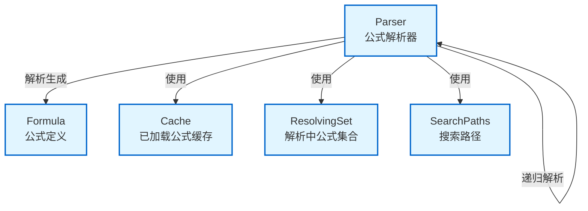

# formula_parser 模块技术深度解析

## 概述

`formula_parser` 模块是 Formula Engine 的核心基础设施，负责加载、解析、继承和验证 Formula 定义。它解决了在复杂工作流自动化场景中，如何通过模块化、可复用、可继承的方式定义工作流模板的问题。

想象一下，如果没有这个模块，每个工作流都需要从头编写，无法复用通用步骤，也无法通过继承来定制化已有工作流。`formula_parser` 就像一个智能的工作流模板引擎，让你可以像搭积木一样组合和扩展工作流定义。

## 核心问题空间

在项目协作和自动化场景中，工作流定义通常面临以下挑战：

1. **复用性**：通用工作流模式（如代码审查、发布流程）需要在多个项目中复用
2. **继承性**：团队希望基于标准工作流进行小范围定制，而不是复制粘贴
3. **模块化**：复杂工作流需要拆分为多个可管理的组件
4. **变量化**：工作流需要支持参数化，以适应不同场景
5. **验证**：工作流定义需要在执行前进行语法和语义验证

`formula_parser` 正是为了解决这些问题而设计的。它提供了一套完整的机制，让 Formula 定义可以像面向对象编程一样被组织和管理。

## 架构设计

### 核心组件关系图



### 数据流向

1. **初始化**：创建 `Parser` 实例，配置搜索路径
2. **加载**：通过 `ParseFile()` 或 `LoadByName()` 从文件系统加载 Formula
3. **解析**：根据文件扩展名选择 JSON 或 TOML 解析器
4. **缓存**：将解析后的 Formula 存入缓存（同时按路径和名称索引）
5. **解析继承**：通过 `Resolve()` 处理 `extends` 关系，递归加载父 Formula
6. **合并**：按顺序合并父 Formula 的变量、步骤和组合规则
7. **验证**：对最终合并的 Formula 进行验证
8. **变量处理**：提取、替换和验证变量

## 核心组件详解

### Parser 结构体

`Parser` 是整个模块的核心，它不仅仅是一个解析器，更是一个 Formula 生命周期管理器。

```go
type Parser struct {
    searchPaths    []string          // 搜索路径（按优先级排序）
    cache          map[string]*Formula // 缓存（键为绝对路径或 Formula 名称）
    resolvingSet   map[string]bool   // 用于循环检测的集合
    resolvingChain []string          // 用于错误消息的解析链
}
```

**设计意图**：
- **搜索路径**：支持多位置查找 Formula，实现项目级、用户级、系统级的分层配置
- **缓存机制**：避免重复解析相同 Formula，提高性能
- **循环检测**：防止 `extends` 关系形成无限递归
- **解析链追踪**：提供友好的错误消息，让用户知道循环发生在哪里

**非线程安全说明**：
注意文档中明确提到 "Parser is NOT thread-safe"。这是一个有意识的设计决策——通过放弃线程安全性来换取简单性和性能。在实际使用中，通常每个 goroutine 会创建自己的 Parser 实例，或者通过外部同步机制来共享。

### 核心方法

#### NewParser - 创建解析器

```go
func NewParser(searchPaths ...string) *Parser
```

**功能**：创建新的 Formula 解析器，配置搜索路径。如果未提供搜索路径，使用默认路径。

**默认搜索路径**（按优先级）：
1. `./.beads/formulas` - 项目级 Formula
2. `~/.beads/formulas` - 用户级 Formula  
3. `$GT_ROOT/.beads/formulas` - 系统级 Formula

**设计决策**：默认路径的选择体现了"本地优先"的原则——项目级配置可以覆盖用户级，用户级可以覆盖系统级。这是 Unix 风格配置系统的常见模式。

#### ParseFile - 从文件解析

```go
func (p *Parser) ParseFile(path string) (*Formula, error)
```

**功能**：从文件路径加载并解析 Formula，自动检测格式（TOML 或 JSON）。

**流程**：
1. 转换为绝对路径
2. 检查缓存
3. 读取文件内容
4. 根据扩展名选择解析器
5. 设置源信息
6. 存入缓存

**格式支持**：
- `.formula.toml` - 优先格式，更易读和维护
- `.formula.json` - 遗留格式，向后兼容

**设计决策**：TOML 作为首选格式是因为它对人类更友好，支持注释，并且在表示复杂嵌套结构时比 JSON 更清晰。保留 JSON 支持是为了向后兼容性。

#### Resolve - 解析继承关系

```go
func (p *Parser) Resolve(formula *Formula) (*Formula, error)
```

**功能**：完全解析 Formula，处理 `extends` 关系和扩展，返回应用所有继承后的新 Formula。

**这是整个模块最复杂的方法**，让我们详细分析：

##### 循环检测机制

```go
if p.resolvingSet[formula.Formula] {
    chain := append(p.resolvingChain, formula.Formula)
    return nil, fmt.Errorf("circular extends detected: %s", 
        strings.Join(chain, " -> "))
}
p.resolvingSet[formula.Formula] = true
p.resolvingChain = append(p.resolvingChain, formula.Formula)
defer func() {
    delete(p.resolvingSet, formula.Formula)
    p.resolvingChain = p.resolvingChain[:len(p.resolvingChain)-1]
}()
```

**设计意图**：使用 `resolvingSet` 跟踪当前正在解析的 Formula，使用 `resolvingChain` 记录解析路径。当检测到循环时，可以给出清晰的错误消息，如 "circular extends detected: A -> B -> C -> A"。

`defer` 语句确保即使发生错误，也能正确清理状态。这是 Go 中处理资源清理的经典模式。

##### 继承合并策略

当 Formula 有 `extends` 时，合并过程遵循以下规则：

1. **变量合并**：父 Formula 的变量被继承，子 Formula 可以覆盖
2. **步骤合并**：父 Formula 的步骤在前，子 Formula 的步骤追加在后
3. **组合规则合并**：
   - BondPoints：按 ID 覆盖，相同 ID 的子 BondPoint 替换父 BondPoint
   - Hooks：子 Hooks 追加到父 Hooks 之后
   - Expand 规则：子规则追加到父规则之后
   - Map 规则：子规则追加到父规则之后

**设计决策**：
- 变量覆盖让子 Formula 可以定制化父 Formula 的行为
- 步骤追加允许子 Formula 在父工作流基础上添加新步骤
- BondPoint 的 ID 覆盖机制允许精细地替换特定的组合点
- 其他规则的追加策略保持了扩展性

#### loadFormula - 按名称加载

```go
func (p *Parser) loadFormula(name string) (*Formula, error)
```

**功能**：在搜索路径中按名称查找 Formula 文件，先尝试 TOML 格式，再回退到 JSON 格式。

**搜索策略**：
```go
extensions := []string{FormulaExtTOML, FormulaExtJSON}
for _, dir := range p.searchPaths {
    for _, ext := range extensions {
        path := filepath.Join(dir, name+ext)
        if _, err := os.Stat(path); err == nil {
            return p.ParseFile(path)
        }
    }
}
```

**设计意图**：双重循环（先路径，后扩展名）确保了优先级的正确性——在高优先级路径中找到的任何格式都优先于低优先级路径。

### 辅助函数

#### ExtractVariables - 提取变量引用

```go
func ExtractVariables(formula *Formula) []string
```

**功能**：查找 Formula 中所有 `{{variable}}` 形式的变量引用。

**实现**：使用正则表达式 `\{\{([a-zA-Z_][a-zA-Z0-9_]*)\}\}` 匹配变量引用，然后去重返回。

**设计决策**：选择 `{{variable}}` 作为变量语法是因为它在许多模板系统中广泛使用（如 Mustache、Handlebars），用户熟悉且不会与常见文本冲突。

#### Substitute - 变量替换

```go
func Substitute(s string, vars map[string]string) string
```

**功能**：将字符串中的 `{{variable}}` 占位符替换为实际值。

**设计意图**：未解析的占位符保持原样，而不是报错或删除。这种"宽松"策略允许部分替换，在调试时很有用。

#### ValidateVars - 变量验证

```go
func ValidateVars(formula *Formula, values map[string]string) error
```

**功能**：验证所有必需变量都已提供，且所有值都满足约束条件。

**验证内容**：
1. 必需变量检查
2. 枚举值约束
3. 正则表达式模式约束

**设计决策**：收集所有错误后一次性返回，而不是遇到第一个错误就停止。这样用户可以一次性修复所有问题，而不是反复尝试。

#### SetSourceInfo - 设置源信息

```go
func SetSourceInfo(formula *Formula)
```

**功能**：为 Formula 中的所有步骤设置 `SourceFormula` 和 `SourceLocation`，用于在烹饪过程中进行源追踪。

**实现**：递归遍历步骤树，为每个步骤设置类似 `steps[0].children[1]` 的位置标识。

**设计意图**：这是一个调试和可观察性特性。当工作流执行出错时，可以精确地指出问题出现在哪个 Formula 的哪个步骤。

## 依赖分析

### 输入依赖

`formula_parser` 模块依赖以下外部组件：

1. **文件系统**：通过 `os` 和 `path/filepath` 包读取 Formula 文件
2. **JSON 解析**：通过 `encoding/json` 解析遗留格式
3. **TOML 解析**：通过 `github.com/BurntSushi/toml` 解析首选格式
4. **正则表达式**：通过 `regexp` 处理变量提取和替换

### 输出依赖

`formula_parser` 模块为以下组件提供服务：

1. **Formula Engine**：使用解析后的 Formula 进行工作流执行
2. **CLI Formula Commands**：通过 `cmd.bd.cook` 和 `cmd.bd.formula` 提供 Formula 管理功能

### 数据契约

模块与外部世界的主要数据契约是 `Formula` 结构体（定义在 [formula_types](formula_types.md) 模块中）。`Parser` 负责：

- 从文件反序列化到 `Formula`
- 填充默认值
- 设置源信息
- 合并继承的 Formula
- 验证 `Formula` 的完整性

## 设计决策与权衡

### 1. 非线程安全 vs 线程安全

**选择**：非线程安全

**原因**：
- 简化实现，避免锁的开销
- 常见使用模式是每个 goroutine 创建自己的 Parser
- 如果需要共享，可以由调用方负责同步

**权衡**：牺牲了一些便利性，换取了性能和简单性。

### 2. TOML 优先 vs JSON 优先

**选择**：TOML 优先，JSON 作为后备

**原因**：
- TOML 更易读，支持注释
- TOML 在表示复杂嵌套结构时更清晰
- JSON 保留用于向后兼容

**权衡**：需要维护两个解析路径，但提高了用户体验。

### 3. 缓存策略：路径和名称双重索引

**选择**：同时按绝对路径和 Formula 名称缓存

**原因**：
- `ParseFile` 使用路径，`loadFormula` 使用名称
- 避免重复解析相同的 Formula

**权衡**：使用更多内存，但提高了性能。

### 4. 继承合并策略：追加 vs 覆盖

**选择**：变量和 BondPoints 覆盖，步骤和其他规则追加

**原因**：
- 变量覆盖：子 Formula 需要定制父 Formula 的行为
- BondPoints 覆盖：需要精细替换特定的组合点
- 步骤追加：子 Formula 通常需要在父工作流基础上添加步骤
- 规则追加：保持扩展性，子 Formula 可以添加新规则而不影响父规则

**权衡**：这是一个经过深思熟虑的平衡，既提供了足够的灵活性，又保持了可预测性。

### 5. 错误处理：快速失败 vs 收集所有错误

**选择**：在变量验证时收集所有错误，其他地方快速失败

**原因**：
- 变量验证：用户希望一次性看到所有问题
- 其他操作：如文件读取、解析错误，通常需要立即处理

**权衡**：不同场景采用不同策略，提供最佳用户体验。

## 使用指南与最佳实践

### 基本使用

```go
// 创建解析器（使用默认搜索路径）
parser := formula.NewParser()

// 从文件加载 Formula
formula, err := parser.ParseFile("./.beads/formulas/my-workflow.formula.toml")
if err != nil {
    log.Fatal(err)
}

// 解析继承关系
resolved, err := parser.Resolve(formula)
if err != nil {
    log.Fatal(err)
}

// 准备变量值
vars := map[string]string{
    "title": "My Issue",
    "assignee": "alice",
}

// 验证变量
if err := formula.ValidateVars(resolved, vars); err != nil {
    log.Fatal(err)
}

// 应用默认值
vars = formula.ApplyDefaults(resolved, vars)
```

### 高级模式

#### 多路径搜索

```go
// 创建带有自定义搜索路径的解析器
parser := formula.NewParser(
    "./my-project/formulas",
    "/shared/formulas",
)
```

#### 按名称加载

```go
// 按名称加载（在搜索路径中查找）
formula, err := parser.LoadByName("release-workflow")
```

### 最佳实践

1. **使用 TOML 格式**：对于新 Formula，优先使用 `.formula.toml` 格式
2. **组织 Formula 继承层次**：将通用功能放在基础 Formula 中，特定定制放在子 Formula 中
3. **明确变量契约**：在 Formula 中清晰定义变量的类型、默认值和约束
4. **避免深层继承**：继承层次过深会使理解困难，一般不超过 3-4 层
5. **使用描述性名称**：Formula 名称应清晰表达其用途

## 边缘情况与陷阱

### 1. 循环继承

**问题**：A extends B，B extends C，C extends A

**表现**：`Resolve()` 返回 "circular extends detected" 错误

**解决方案**：重新设计继承关系，避免循环

### 2. 变量名冲突

**问题**：父 Formula 和子 Formula 定义了同名但用途不同的变量

**表现**：子 Formula 的变量意外覆盖父 Formula 的变量

**解决方案**：使用命名空间约定，如 `parent.var` 和 `child.var`

### 3. 步骤顺序意外

**问题**：子 Formula 的步骤总是追加在父 Formula 之后，无法插入中间

**表现**：无法在父工作流的两个步骤之间插入新步骤

**解决方案**：
- 重新设计父 Formula，使用 BondPoints 作为扩展点
- 或者将父 Formula 拆分为更小的组件，在子 Formula 中重新组合

### 4. 变量未定义但有默认值

**问题**：调用者可能不知道有默认值存在，意外使用默认值

**表现**：工作流行为与预期不符

**解决方案**：在 Formula 文档中清晰说明所有变量及其默认值

### 5. 跨平台路径问题

**问题**：在 Windows 上使用 Unix 风格路径，或反之

**表现**：找不到 Formula 文件

**解决方案**：使用 `path/filepath` 包构建路径，而不是硬编码路径分隔符

## 总结

`formula_parser` 模块是 Formula Engine 的基石，它通过巧妙的设计解决了工作流定义的复用、继承和验证问题。其核心价值在于：

1. **分层搜索路径**：实现项目级、用户级、系统级的 Formula 组织
2. **灵活的继承机制**：通过 `extends` 支持工作流的定制和扩展
3. **智能的合并策略**：针对不同类型的内容采用不同的合并规则
4. **完善的变量系统**：支持变量提取、替换、验证和默认值
5. **友好的错误处理**：提供清晰的错误消息，帮助快速定位问题

虽然它有一些限制（如非线程安全、步骤只能追加），但这些都是在权衡之后做出的有意识决策，使得模块在保持简单性的同时提供了足够的灵活性。

对于新加入团队的开发者，理解这个模块的关键是把握"Formula 即面向对象程序"的心智模型——`extends` 类似于继承，变量类似于属性，步骤类似于方法。一旦建立了这种类比，整个模块的设计就变得非常直观了。

## 参考链接

- [formula_types](formula_types.md) - Formula 数据结构定义
- [formula_condition](formula_condition.md) - 条件评估引擎
- [CLI Formula Commands](cmd-bd-formula.md) - Formula 相关 CLI 命令
