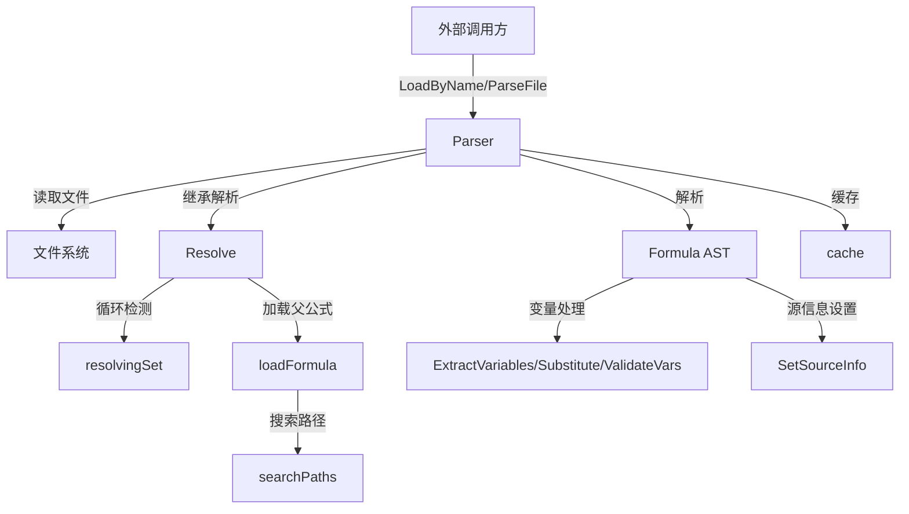

# formula_parser 模块技术深度解析

## 1. 问题空间与模块定位

在构建可组合的工作流系统时，我们面临着一个核心挑战：如何定义可复用、可继承、可扩展的工作流模板？直接硬编码工作流会导致大量重复，而简单的文本模板又缺乏类型安全和组合能力。

**formula_parser** 模块正是为了解决这个问题而设计的。它负责：
- 从文件系统加载公式（工作流模板）
- 处理公式间的继承关系（`extends`）
- 验证公式结构的完整性
- 管理变量替换和验证
- 提供可预测的解析和组合语义

这个模块是整个 Formula Engine 的入口点，它将人类可读的 TOML/JSON 公式文件转换为可执行的内部表示。

## 2. 架构与数据流向

### 2.1 核心组件架构图



### 2.2 数据流向解析

公式解析的完整生命周期如下：

1. **初始化阶段**：创建 `Parser` 实例，设置搜索路径（项目级、用户级、系统级）
2. **加载阶段**：通过 `LoadByName` 或 `ParseFile` 加载公式，先检查缓存
3. **解析阶段**：根据文件扩展名选择 TOML 或 JSON 解析器，设置默认值
4. **解析后处理**：调用 `SetSourceInfo` 为所有步骤添加源追踪信息
5. **解析阶段**：调用 `Resolve` 处理继承关系：
   - 检测循环继承
   - 递归加载并解析父公式
   - 合并变量、步骤和组合规则
   - 验证最终公式
6. **变量处理阶段**：提取变量、替换占位符、验证变量值

## 3. 核心组件深度解析

### 3.1 Parser 结构体

**设计意图**：Parser 是整个模块的中央协调器，负责管理公式加载的完整生命周期。

```go
type Parser struct {
    searchPaths    []string          // 公式搜索路径（按优先级排序）
    cache          map[string]*Formula // 已加载公式的缓存（键：绝对路径或公式名）
    resolvingSet   map[string]bool   // 当前正在解析的公式集合（用于循环检测）
    resolvingChain []string          // 解析链（用于错误消息）
}
```

**关键设计决策**：
- **非线程安全**：Parser 明确标记为非线程安全，这是一个有意的设计选择。它避免了内部同步的开销，同时要求调用者在并发场景下负责同步（或为每个 goroutine 创建独立的 Parser 实例）。
- **双重缓存策略**：缓存同时使用绝对路径和公式名作为键，这既支持直接文件加载，也支持通过名称引用。
- **搜索路径优先级**：按项目级 → 用户级 → 系统级的顺序搜索，这遵循了"越具体越优先"的配置原则。

### 3.2 解析方法族

Parser 提供了三种主要的解析入口：

1. **ParseFile**：从文件路径解析公式
   - 首先将路径转换为绝对路径并检查缓存
   - 根据文件扩展名选择解析器（TOML 优先，JSON 作为后备）
   - 设置源信息并缓存结果

2. **Parse**：从 JSON 字节解析公式
   - 直接反序列化 JSON
   - 设置默认值（Version=1, Type=TypeWorkflow）

3. **ParseTOML**：从 TOML 字节解析公式
   - 与 Parse 类似，但使用 TOML 反序列化
   - **设计洞察**：TOML 被优先支持是因为它更适合人类编写的配置文件，特别是支持注释和更自然的数组/对象语法。

### 3.3 Resolve 方法：继承系统的核心

**设计意图**：Resolve 实现了公式的继承模型，这是公式可组合性的基础。

```go
func (p *Parser) Resolve(formula *Formula) (*Formula, error)
```

**核心逻辑**：
1. **循环检测**：使用 `resolvingSet` 和 `resolvingChain` 检测并报告循环继承
2. **基线情况**：如果公式没有 `extends`，直接验证并返回
3. **继承处理**：
   - 按顺序处理每个父公式
   - 递归解析父公式
   - 合并变量（子公式覆盖父公式）
   - 合并步骤（父公式步骤在前，子公式步骤在后）
   - 合并组合规则（`mergeComposeRules`）
4. **验证**：最后验证合并后的公式

**继承语义设计**：
- 变量：子公式覆盖父公式同名变量
- 步骤：追加合并，父步骤在前，子步骤在后
- ComposeRules：复杂的合并策略（见 3.4 节）

### 3.4 mergeComposeRules：组合规则的合并策略

**设计意图**：处理 `ComposeRules` 的合并，这是最复杂的合并逻辑，因为不同类型的规则有不同的合并语义。

```go
func mergeComposeRules(base, overlay *ComposeRules) *ComposeRules
```

**合并策略**：
- **BondPoints**：按 ID 覆盖，同 ID 的 overlay 替换 base
- **Hooks**：简单追加，不覆盖
- **Expand**：简单追加，不覆盖
- **Map**：简单追加，不覆盖

**设计洞察**：
- BondPoints 采用覆盖策略是因为它们是命名的"插槽"，子公式可能想要重新定义插槽的位置
- Hooks、Expand、Map 采用追加策略是因为它们通常是累积性的——添加更多的钩子或扩展通常是期望的行为

### 3.5 变量处理工具函数

**设计意图**：提供完整的变量生命周期管理——从提取到替换再到验证。

1. **ExtractVariables**：扫描公式中的所有 `{{variable}}` 占位符
   - 使用正则表达式 `\{\{([a-zA-Z_][a-zA-Z0-9_]*)\}\}` 匹配
   - 递归检查步骤及其子步骤
   - 去重返回

2. **Substitute**：替换字符串中的变量占位符
   - 保持未解析的占位符不变（而不是报错）
   - **设计洞察**：这允许分阶段替换，或者在某些情况下有意保留占位符

3. **ValidateVars**：验证变量值是否符合约束
   - 检查必填性
   - 应用默认值
   - 验证枚举约束
   - 验证模式约束
   - 收集所有错误后一起返回（而不是遇到第一个错误就返回）

4. **ApplyDefaults**：为缺失的变量应用默认值
   - 创建新的 map，不修改输入
   - 仅在变量未提供且有默认值时应用

### 3.6 SetSourceInfo：源追踪系统

**设计意图**：为每个步骤添加源信息，这对于调试和错误报告至关重要。

```go
func SetSourceInfo(formula *Formula)
```

**实现细节**：
- 递归处理步骤、子步骤和循环体
- 设置 `SourceFormula`（定义步骤的公式）和 `SourceLocation`（步骤在公式中的路径）
- 格式示例：`steps[0]`、`steps[2].children[1]`、`loop.body[0]`

**设计洞察**：这是"可观测性优先"设计的一个例子——在系统深处嵌入追踪信息，使得当问题发生时，能够快速定位到源头。

## 4. 依赖关系分析

### 4.1 被依赖关系（谁使用 formula_parser）

根据模块树，formula_parser 主要被以下组件使用：
- **CLI Formula Commands**：`cmd.bd.cook` 和 `cmd.bd.formula` 包
- **Formula Engine**：可能的内部使用（扩展、应用等）

### 4.2 依赖关系（formula_parser 使用谁）

- **formula_types**：核心类型定义（`Formula`、`VarDef`、`Step` 等）
- **标准库**：
  - `encoding/json` 和 `github.com/BurntSushi/toml`：配置解析
  - `os` 和 `path/filepath`：文件系统操作
  - `regexp`：变量模式匹配
  - `strings`：字符串操作

### 4.3 数据契约

formula_parser 与其他模块之间的关键数据契约：
- **Formula 结构**：完整的公式 AST，包括源信息
- **搜索路径约定**：`.beads/formulas` 目录结构
- **文件扩展名约定**：`.formula.toml`（优先）和 `.formula.json`（后备）

## 5. 设计决策与权衡

### 5.1 非线程安全 vs 内部同步

**决策**：Parser 设计为非线程安全，无内部同步。

**权衡**：
- **优点**：避免了锁的开销，简化了内部实现
- **缺点**：调用者需要负责并发控制
- **理由**：在典型使用场景中，Parser 通常在单个 goroutine 中使用；对于并发场景，为每个 goroutine 创建独立的 Parser 实例通常是可接受的

### 5.2 TOML 优先 vs JSON 优先

**决策**：TOML 作为主要格式，JSON 作为后备。

**权衡**：
- **TOML 优点**：更适合人类编写，支持注释，数组/对象语法更自然
- **JSON 优点**：更广泛的工具支持，Go 标准库内置
- **理由**：公式主要由人类编写，因此优化编写体验比优化工具支持更重要

### 5.3 步骤追加 vs 步骤覆盖

**决策**：继承时步骤采用追加策略（父步骤在前，子步骤在后）。

**权衡**：
- **优点**：直观的"扩展"语义——子公式添加到父公式的工作流之后
- **缺点**：无法完全替换父步骤（尽管可以通过不继承来实现）
- **理由**：这符合工作流组合的常见模式——基础工作流 + 特定扩展

### 5.4 保持未解析变量 vs 报错

**决策**：`Substitute` 保持未解析的占位符不变，而不是报错。

**权衡**：
- **优点**：支持分阶段替换，更灵活
- **缺点**：可能导致未注意到的未解析变量
- **理由**：在复杂系统中，变量可能由多个层次提供，保持占位符允许延迟到所有层次都处理完后再检查完整性

## 6. 用法示例与常见模式

### 6.1 基本用法：加载并解析公式

```go
// 创建解析器（使用默认搜索路径）
parser := formula.NewParser()

// 按名称加载公式
formula, err := parser.LoadByName("my-workflow")
if err != nil {
    log.Fatal(err)
}

// 解析继承关系
resolved, err := parser.Resolve(formula)
if err != nil {
    log.Fatal(err)
}
```

### 6.2 变量处理流程

```go
// 提取公式中的所有变量
vars := formula.ExtractVariables(resolved)

// 准备变量值
values := map[string]string{
    "project": "my-project",
    "owner":   "alice",
}

// 应用默认值
values = formula.ApplyDefaults(resolved, values)

// 验证变量
if err := formula.ValidateVars(resolved, values); err != nil {
    log.Fatal(err)
}

// 在字符串中替换变量
title := formula.Substitute(resolved.Steps[0].Title, values)
```

### 6.3 自定义搜索路径

```go
// 创建带有自定义搜索路径的解析器
parser := formula.NewParser(
    "/path/to/my/formulas",
    "/another/path",
)
```

## 7. 边缘情况与注意事项

### 7.1 循环继承

**问题**：公式 A 继承 B，B 继承 C，C 又继承 A。

**行为**：`Resolve` 会检测到循环并返回清晰的错误消息，显示完整的继承链。

**避免方法**：设计公式层次结构时保持单向依赖。

### 7.2 变量命名限制

**问题**：变量名必须匹配 `[a-zA-Z_][a-zA-Z0-9_]*` 模式。

**行为**：不符合此模式的变量不会被 `ExtractVariables` 识别，也不会被 `Substitute` 替换。

**注意事项**：始终使用有效的标识符作为变量名。

### 7.3 BondPoint 覆盖

**问题**：子公式中的 BondPoint 会覆盖父公式中同 ID 的 BondPoint。

**行为**：这是设计有意的，但可能导致意外的行为变化。

**注意事项**：在覆盖 BondPoint 时要小心，确保你理解父公式中该 BondPoint 的用途。

### 7.4 线程安全

**问题**：Parser 不是线程安全的。

**行为**：并发使用同一个 Parser 实例可能导致竞争条件。

**避免方法**：
- 为每个 goroutine 创建独立的 Parser 实例
- 或者使用外部同步（如互斥锁）保护共享的 Parser 实例

### 7.5 缓存一致性

**问题**：Parser 会缓存已加载的公式，如果文件在缓存后发生变化，不会自动重新加载。

**行为**：后续对同一公式的请求会返回缓存的（可能过时的）版本。

**避免方法**：
- 如果需要重新加载，创建新的 Parser 实例
- 或者在开发过程中避免使用长时间运行的 Parser 实例

## 8. 总结

formula_parser 模块是 Formula Engine 的基石，它提供了一个健壮、灵活的系统来加载、解析和组合工作流模板。其关键设计原则包括：

1. **人类优先**：优先支持 TOML，优化公式编写体验
2. **可组合性**：通过继承系统实现公式的复用和扩展
3. **可观测性**：内置源追踪系统，便于调试
4. **灵活性与安全性平衡**：提供强大的变量系统，同时保持类型安全和验证

理解这个模块的设计决策和权衡，将帮助你更有效地使用公式系统，并在需要时进行扩展或修改。
