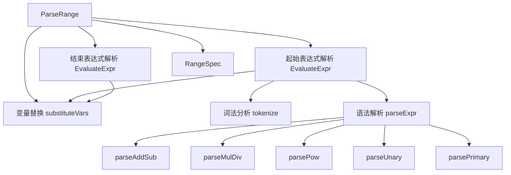

# formula_range 模块深度解析

## 1. 模块概述与问题域

### 1.1 问题的核心

在公式引擎中，循环机制是一个关键特性。然而，简单的固定范围循环（如 `1..10`）在实际使用场景中往往不够灵活。当需要根据动态变量计算循环边界时，例如：

- `1..2^{disks}` - 根据磁盘数量计算上限
- `{start}..{end}` - 完全由变量决定的范围
- `(n+1)..(2^n)` - 复杂的数学表达式作为边界

这时，我们需要一个能够解析并计算这些动态表达式的机制。这就是 `formula_range` 模块要解决的问题。

### 1.2 为什么不直接用现有方案？

你可能会问："为什么不直接使用 Go 的 `text/template` 或其他表达式库？" 答案在于这个模块的设计目标：
- **简洁性** - 只支持必要的运算符，避免过度复杂
- **安全性** - 不允许执行任意代码，只解析数学表达式
- **集成性** - 与公式引擎的变量系统紧密集成
- **可验证性** - 提供语法检查功能，用于公式验证阶段

## 2. 核心抽象与思维模型

### 2.1 关键抽象

这个模块建立在几个核心抽象之上：

1. **RangeSpec** - 范围的最终表示，包含计算后的起始和结束值
2. **表达式解析器** - 一个递归下降解析器，遵循运算符优先级规则
3. **词法分析器** - 将字符串转换为标记流的组件
4. **变量替换器** - 处理 `{varname}` 语法的组件

### 2.2 思维模型

可以将这个模块想象成一个**小型计算器**，它的工作流程如下：

1. 首先，它像一个"翻译官"，将范围表达式（如 `"1..2^{n}"`）拆分为起始和结束两个表达式
2. 然后，它作为一个"填字游戏玩家"，将 `{varname}` 替换为实际值
3. 接着，它扮演"词法分析员"，将表达式拆分成数字、运算符等标记
4. 最后，它成为"数学运算器"，按照正确的优先级计算表达式结果

## 3. 架构与数据流

### 3.1 架构图



### 3.2 核心数据流

让我们通过一个具体例子追踪数据流动：`"1..2^{n}"`，其中 `n="3"`：

1. **入口点**：`ParseRange("1..2^{n}", {"n":"3"})`
2. **范围分割**：使用正则表达式 `rangePattern` 将表达式拆分为 `startExpr="1"` 和 `endExpr="2^{n}"`
3. **变量替换**：对每个表达式调用 `substituteVars`，将 `{n}` 替换为 `"3"`，得到 `endExpr="2^3"`
4. **词法分析**：`tokenize("2^3")` 生成标记流 `[tokNumber(2), tokPow, tokNumber(3), tokEOF]`
5. **语法解析**：`parseExpr` 使用递归下降解析器，按照优先级计算表达式结果
6. **结果组装**：将计算后的起始值 `1` 和结束值 `8` 组装成 `RangeSpec{Start:1, End:8}`

## 4. 核心组件详解

### 4.1 RangeSpec 结构体

```go
type RangeSpec struct {
    Start int // 计算后的起始值（包含）
    End   int // 计算后的结束值（包含）
}
```

这是模块的"输出接口"，表示最终解析和计算后的范围。注意这里使用 `int` 类型，这是一个有意的设计决策 - 范围表达式总是产生整数结果，这与公式引擎中循环的使用场景相匹配。

### 4.2 ParseRange 函数

这是模块的主入口点，它的职责是：
- 验证范围表达式的基本格式（必须是 `start..end`）
- 分割起始和结束表达式
- 分别计算两个表达式
- 组装并返回结果

**设计亮点**：错误处理非常清晰，每个阶段的错误都包含上下文信息，例如 `"evaluating range start %q: %w"`，这使得调试变得更加容易。

### 4.3 EvaluateExpr 函数

这个函数是表达式计算的核心，它协调了三个主要步骤：
1. 变量替换
2. 词法分析
3. 语法解析和计算

**参数**：
- `expr string` - 要计算的表达式
- `vars map[string]string` - 变量映射表

**返回值**：
- `int` - 计算结果
- `error` - 任何计算过程中的错误

### 4.4 词法分析器（tokenize）

词法分析器将字符串表达式转换为标记流。它的设计有几个值得注意的点：

**一元减号处理**：这是一个常见的难点。代码通过查看前一个标记的类型来区分一元减号和二元减号：
```go
if len(tokens) == 0 || (tokens[len(tokens)-1].typ != tokNumber && tokens[len(tokens)-1].typ != tokRParen) {
    // 这是一元减号
}
```

**错误恢复**：词法分析器在遇到无效字符时立即返回错误，而不是尝试继续解析，这符合"快速失败"的设计原则。

### 4.5 递归下降解析器

这是模块中最复杂的部分，它使用递归下降技术来解析表达式，同时正确处理运算符优先级：

**优先级顺序**（从低到高）：
1. `+` 和 `-` （加法和减法）
2. `*` 和 `/` （乘法和除法）
3. `^` （幂运算，右结合）
4. 一元 `-` （一元减号）
5. 括号和数字

**右结合性处理**：幂运算的一个特殊之处是它是右结合的，即 `2^3^2` 应该计算为 `2^(3^2)` 而不是 `(2^3)^2`。代码通过在 `parsePow` 中递归调用自身来实现这一点：
```go
if p.current().typ == tokPow {
    p.advance()
    exp, err := p.parsePow() // 递归调用实现右结合
    if err != nil {
        return 0, err
    }
    return math.Pow(base, exp), nil
}
```

### 4.6 ValidateRange 函数

这个函数是一个**语法检查器**，它在不实际计算表达式的情况下验证其格式正确性。它的工作原理是：
1. 检查基本格式
2. 提取所有变量并用占位符 `1` 替换
3. 尝试词法分析表达式

**设计意图**：这个函数主要用于公式验证阶段，在不知道变量值的情况下检查范围表达式的语法是否正确。

## 5. 依赖分析

### 5.1 被依赖关系

从模块树可以看出，`formula_range` 是 [Formula Engine](formula_types.md) 的子模块，它主要被以下组件使用：
- 公式解析器（[formula_parser](formula_parser.md)）- 在解析公式中的循环时
- 公式验证器 - 在验证公式语法时

### 5.2 依赖关系

这个模块相对独立，只依赖 Go 标准库：
- `fmt` - 错误格式化
- `math` - 数学运算（主要是 `math.Pow`）
- `regexp` - 正则表达式匹配
- `strconv` - 字符串转换
- `strings` - 字符串操作
- `unicode` - Unicode 字符处理

**设计决策**：保持最小依赖是一个明智的选择，这使得模块更加稳定和易于测试。

## 6. 设计决策与权衡

### 6.1 使用递归下降解析器 vs 其他方法

**选择**：递归下降解析器
**替代方案**：Shunting-yard 算法、使用第三方库

**原因**：
- **可读性**：递归下降解析器的代码结构与语法规则直接对应，更容易理解和维护
- **优先级处理**：通过函数调用顺序自然地实现优先级，无需额外的数据结构
- **右结合性**：处理幂运算的右结合性非常自然
- **灵活性**：便于扩展新的运算符或语法特性

**权衡**：
- 递归深度限制：对于非常复杂的表达式可能导致栈溢出（但在实际使用场景中不太可能）
- 代码量相对较多：但对于这个规模的语言来说是可接受的

### 6.2 变量替换的时机

**选择**：在解析之前进行变量替换
**替代方案**：在解析过程中处理变量

**原因**：
- **简化解析器**：解析器只需要处理数字和运算符，不需要了解变量的概念
- **错误隔离**：变量替换的错误和解析错误可以分开处理
- **统一处理**：所有变量替换在一个地方完成，逻辑更清晰

**权衡**：
- 无法区分"未定义的变量"和"语法错误"（未定义的变量会导致语法错误）
- 变量值必须是有效的表达式片段（这在当前设计中是合理的限制）

### 6.3 使用浮点数进行计算

**选择**：在内部使用 `float64` 进行所有计算
**替代方案**：仅使用整数

**原因**：
- 幂运算：`math.Pow` 返回浮点数
- 除法：虽然最终结果是整数，但中间计算可能需要浮点数
- 一致性：所有运算使用相同的类型，简化代码

**权衡**：
- 精度问题：对于非常大的整数可能有精度损失
- 需要最终转换：最后需要将结果转换回 `int`

**缓解措施**：在实际使用场景中，范围表达式通常不会涉及会导致精度问题的极大整数。

### 6.4 有限的运算符集合

**选择**：只支持 `+`、`-`、`*`、`/`、`^`
**替代方案**：支持更多运算符（如 `%`、位运算等）

**原因**：
- **YAGNI 原则**：根据实际需求只实现必要的功能
- **简化实现**： fewer operators mean fewer edge cases
- **降低学习曲线**：用户不需要记住复杂的运算符优先级

**权衡**：
- 灵活性受限：某些复杂计算可能无法直接表示
- 扩展性：如果未来需要更多运算符，需要修改解析器

## 7. 使用指南与示例

### 7.1 基本使用

```go
// 简单范围
spec, err := ParseRange("1..10", nil)
// spec = &RangeSpec{Start: 1, End: 10}

// 使用变量
vars := map[string]string{"n": "3"}
spec, err := ParseRange("1..2^{n}", vars)
// spec = &RangeSpec{Start: 1, End: 8}

// 复杂表达式
vars := map[string]string{"start": "2", "end": "5"}
spec, err := ParseRange("({start}+1)..(2^{end}-1)", vars)
// spec = &RangeSpec{Start: 3, End: 31}
```

### 7.2 验证表达式

```go
// 语法验证（不需要变量值）
err := ValidateRange("1..2^{n}")
// err = nil（语法正确）

err = ValidateRange("1..")
// err = 错误（格式不正确）
```

### 7.3 直接计算表达式

```go
// 直接计算单个表达式
result, err := EvaluateExpr("2^3 + 4", nil)
// result = 12
```

## 8. 边缘情况与注意事项

### 8.1 未定义的变量

**行为**：未定义的变量不会被替换，会导致语法错误
```go
spec, err := ParseRange("1..{undefined}", nil)
// err = 错误，因为 "{undefined}" 不是有效的表达式
```

**建议**：在调用 `ParseRange` 之前，确保所有变量都已定义，或者使用 `ValidateRange` 进行语法检查。

### 8.2 零除

**行为**：检测到零除时会返回错误
```go
spec, err := ParseRange("1..(10/0)", nil)
// err = "division by zero"
```

### 8.3 右结合性

**注意**：幂运算是右结合的
```go
spec, err := ParseRange("1..2^3^2", nil)
// 结果是 1..512 (2^(3^2))，而不是 1..64 ((2^3)^2)
```

### 8.4 空范围

**注意**：模块不会检查起始值是否小于等于结束值
```go
spec, err := ParseRange("10..1", nil)
// spec = &RangeSpec{Start: 10, End: 1}，这是一个有效的结果
// 使用这个范围的代码需要处理 Start > End 的情况
```

### 8.5 浮点数问题

**潜在问题**：由于内部使用浮点数计算，可能会有精度问题
```go
// 对于非常大的整数，可能会有精度损失
spec, err := ParseRange("1..(2^53)", nil)
// 结果可能不是精确的 9007199254740992
```

**缓解**：在实际使用场景中，范围表达式通常不会涉及这么大的整数。

## 9. 总结

`formula_range` 模块是一个精心设计的小型表达式解析器，它解决了公式引擎中动态范围循环的需求。它的设计体现了几个重要的原则：

1. **单一职责** - 每个函数只做一件事，并且做好
2. **清晰的错误处理** - 错误信息包含上下文，便于调试
3. **递归下降解析** - 一种优雅且易理解的解析技术
4. **最小依赖** - 只依赖标准库，保持模块的稳定性

这个模块虽然规模不大，但它展示了如何设计一个既实用又优雅的软件组件。对于需要实现类似表达式解析功能的场景，它提供了一个很好的参考模式。
