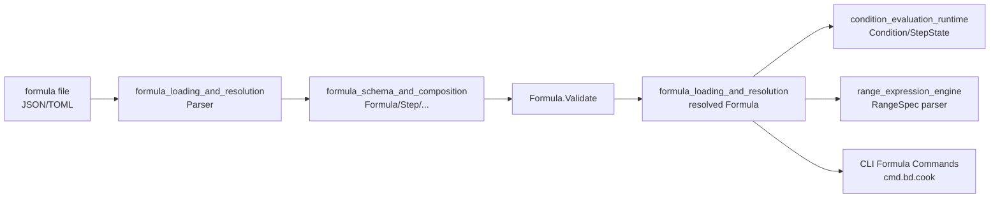

# formula_schema_and_composition 模块深度解析

`formula_schema_and_composition` 可以理解为 Formula 引擎的“宪法层”。它不负责真正执行工作流，也不直接读写数据库；它负责定义 **什么是合法的公式**、**步骤之间可以怎样组合**、以及 **组合语义的最小公共结构**。如果把整个系统想成一个自动化工厂，这个模块就是工程图标准：所有后续工序（加载、解析、条件判断、范围展开、cook/pour 执行）都依赖它提供的结构与约束。没有这层，系统会退化成“各处自己解释 JSON/TOML”，最后得到不可预测的运行行为。

---

## 这个模块解决了什么问题？

公式系统的核心难点不是“把配置读出来”，而是把“人写的模板”变成“机器可稳定执行的工作图”。一个朴素方案是：定义几个松散 struct，解析后直接让下游执行器边跑边判断错误。但这会产生三个代价。第一，错误发现太晚，很多结构性问题（重复 step ID、依赖指向不存在 step）会在执行阶段才爆炸。第二，语义分散，下游每个模块都要自己实现一遍同样的防御逻辑。第三，扩展能力难以演进，因为没有统一组合模型，新增特性（如 aspect/advice、on_complete、waits_for）会导致多处兼容分支。

这个模块选择把“模式（schema）+ 组合（composition）+ 静态校验（validation）”前置。`Formula`、`Step`、`ComposeRules` 等结构把语义压缩成统一数据模型；`Formula.Validate()` 在进入运行期前做结构完整性检查；像 `WaitsForSpec`、`OnCompleteSpec` 这样的专用结构把复杂行为约束在明确合同里。这种设计把复杂性从“运行时不可控分支”转移到“加载期可诊断错误”，本质上是用更强的建模来换取系统可预期性。

---

## 心智模型：把它当作“工作流 AST + 编排规则层”

理解这个模块最有效的方式，是把 `Formula` 看成一种领域专用 AST（抽象语法树）。`Formula` 是根节点，`Step` 是工作单元节点，`Children` 形成层级树，`DependsOn/Needs` 形成跨节点依赖边，`ComposeRules`、`AdviceRule`、`Pointcut` 则像“图变换规则”。

类比一下：
你在做城市规划时，不只是画街道（`steps`），还要定义哪里可以接支路（`BondPoint`）、哪些区域自动触发附加设施（`Hook`）、哪些路口要并行-汇合（`BranchRule`）、哪些路段有门禁（`GateRule`）。这个模块提供的就是这套规划语言本身，而不是施工队。

因此新同学需要在脑中同时保留两层：
第一层是**静态结构层**（字段、类型、引用关系）；第二层是**意图层**（这些字段是为了让后续 parser/condition/range/cook 模块有稳定输入）。这个模块本身几乎不“执行业务”，但它决定了业务可以被怎样执行。

---

## 架构与数据流



从模块树关系看，`formula_schema_and_composition` 位于 Formula Engine 的核心类型层，`formula_loading_and_resolution`、`condition_evaluation_runtime`、`range_expression_engine` 都围绕它展开。典型路径是：公式文件先被加载解析为 `Formula` 结构，然后通过 `Validate()` 做静态完整性检查，校验通过后才进入条件过滤、范围计算、最终 cook/pour 等执行链路。我们能在调用侧看到 `cmd.bd.cook.runCook` 先 `loadAndResolveFormula(...)`，随后再进入后续流程，这与“先 schema、后执行”的分层意图一致。

需要强调一点：当前提供代码中，这个模块对外部调用非常“被动”——它主要提供结构体和方法（如 `Validate`、`GetStepByID`），真正的 orchestrator 在其他模块。所以它的架构角色不是控制流中心，而是**类型合同与前置防线**。

---

## 组件深潜

## `FormulaType` 与 `IsValid()`：最小而关键的分类闸门

`FormulaType` 把公式分成 `workflow`、`expansion`、`aspect` 三类。`IsValid()` 的实现非常直接（switch 白名单），但它的价值在于：避免类型系统在字符串自由输入上失控。这里选择“显式枚举”而不是“开放字符串”，牺牲了扩展时需要改代码的灵活性，换来运行语义的确定性。

## `Formula`：根语义容器

`Formula` 汇总了公式生命周期中最关键的定义面：
`Vars` 负责参数化；`Steps` 定义主流程；`Template` 对应 expansion 语义；`Compose` 负责组合规则；`Advice`/`Pointcuts` 支持 aspect 风格织入；`Extends` 支持继承；`Phase` 传递实例化建议；`Source` 记录来源。

一个非显然但很实用的设计是：`Source`、以及 `Step` 里的 `SourceFormula`/`SourceLocation`。这体现了“可追溯性优先”的思路：当公式经过继承、展开、advice 注入后，最终步骤可能不是在当前文件直接写的。保留来源坐标可以显著降低排障成本。

## `VarDef` 与 `UnmarshalTOML`：对作者友好而不放弃结构化

`VarDef.UnmarshalTOML(data interface{})` 支持两种写法：
- 简写字符串（直接作为 `Default`）
- 详细 table（`description/default/required/enum/pattern/type`）

这是一种典型的人机平衡：给常见场景低摩擦入口，同时保留严谨配置能力。注意它对 table 的字段解析是“按已知字段尝试类型断言”，未知字段会被忽略，错误类型不会逐字段报错；真正硬错误只在顶层 data 既不是 string 也不是 map 时抛出。这让 TOML 兼容性更宽松，但也意味着某些拼写错误可能静默失效，新贡献者需要在上层校验或测试中覆盖。

## `Step`：编排语义的最密集载体

`Step` 不只是一个任务描述体，而是多个子语义的叠加点：
- 基础 issue 语义：`ID`、`Title`、`Description`、`Type`、`Priority`、`Labels`。
- 图关系语义：`DependsOn` + `Needs`（别名形态，后续合并）。
- 动态控制语义：`Condition`、`WaitsFor`、`Gate`、`Loop`、`OnComplete`。
- 组合入口语义：`Expand` + `ExpandVars`。
- 树结构语义：`Children`。
- 可观测性语义：`SourceFormula`、`SourceLocation`（内部字段，不序列化）。

这种“单体承载多语义”会增加字段数量，但换来跨模块传递时的统一对象模型，减少了中间适配层。

## `ComposeRules` 及其子规则：把“如何拼接公式”显式化

`ComposeRules` 统一容纳 `BondPoints`、`Hooks`、`Expand`、`Map`、`Branch`、`Gate`、`Aspects`。这意味着系统把组合视为一等能力，而不是零散特性。它像一个“编排 DSL 的规则包”：

- `BondPoint` 定义可挂接位置（`after_step`/`before_step` 互斥）。
- `Hook` 定义触发式自动挂接（trigger/attach/at/vars）。
- `ExpandRule` 与 `MapRule` 分别覆盖单点替换和批量匹配替换。
- `BranchRule` 显式描述 fork-join。
- `GateRule` 为步骤前置运行时条件。
- `Aspects` 列出要应用的 aspect 公式名。

这里的设计意图是“语义正交”：每个规则类型表达一种清晰变换，而不是把所有变换塞进一个超复杂字段。

## `AdviceRule` / `AdviceStep` / `AroundAdvice` / `Pointcut`

这组结构引入了类似 AOP 的机制：通过 target/pattern 匹配，把步骤插入到目标前后或包裹目标。它的优势在于复用横切关注点（例如审计、安全检查）而不污染主流程定义。代价是可读性压力增加——最终执行图不再等于原始 `steps` 文本，需要依赖追踪字段与可视化工具理解“织入后结构”。

## `Gate`、`LoopSpec`、`OnCompleteSpec`、`WaitsForSpec`

这些是动态运行语义的合同对象：
- `Gate` 定义异步等待条件（类型、标识、超时）。
- `LoopSpec` 支持 `count`、`until+max`、`range+var` 三类迭代表达。
- `OnCompleteSpec` 支持完成后 `for_each` 触发 bond 并绑定变量。
- `WaitsForSpec` 是对 `waits_for` 字符串的解析结果（gate + 可选 spawner）。

它们共同体现一个思路：运行时复杂行为尽量在 schema 层留出清晰结构，以便 parser/runtime 侧按合同执行。

## `Formula.Validate()`：集中式静态防线

`Validate()` 是本模块最关键的行为方法。它采用“收集全部错误再一次性返回”的策略，而不是遇错即停。这样调用者能一次看到所有结构问题，提升作者修复效率。

校验范围覆盖：
- 元信息：`formula` 必填、`version >= 1`、`type` 合法。
- 变量：名称非空，`required` 与 `default` 互斥。
- 步骤：ID 必填且全局唯一、`title` 必填（除非 `expand`）、`priority` 范围 0-4。
- 依赖引用：`depends_on` 与 `needs` 必须指向已知 step（含 children）。
- `waits_for` 值格式与引用合法性。
- `on_complete` 的成对字段与互斥约束。
- compose 中 `bond_points` 的锚点合法性，以及 `hooks` 必填字段。

其中一个很实用的细节是 `stepIDLocations map[string]string`：不仅做“是否重复”，还保留首次定义位置，错误信息会指向 `steps[i]` 或 `steps[i].children[j]`。这对大型公式极其重要。

## 递归辅助函数：`collectChildIDs` 与 `validateChildDependsOn`

这两个函数把“树结构校验”从主流程中拆出。`collectChildIDs` 先递归采集所有子节点 ID 并做重复检查，`validateChildDependsOn` 再递归验证引用字段。这里选择“两阶段（收集后校验）”而不是“边收集边校验所有引用”，避免了前向引用/层级顺序造成的假阴性。

## `ParseWaitsFor` 与 `validateWaitsFor`

`validateWaitsFor` 是严格校验器：只接受 `all-children`、`any-children`、`children-of(step-id)`，并验证 step 是否存在。`ParseWaitsFor` 则是宽松解析器：无值返回 `nil`，非法值也返回 `nil`（注释明确“validation should have caught this”）。这体现了模块内的职责分离：先验证，再解析；解析函数默认运行在“输入已干净”的前提下。

## 便捷查询函数：`GetRequiredVars`、`GetStepByID`、`GetBondPoint`、`StringPtr`

这些方法不是架构核心，但改善了调用体验：
`GetStepByID` 内部走递归 `findStepByID`，对树形 steps 提供统一查找入口；`GetBondPoint` 封装了 `Compose` 为空时的防御；`StringPtr` 方便构造 `VarDef{Default: ...}`。这些小工具减少了上层重复样板代码。

---

## 依赖关系与数据合同分析

从当前代码可见，本模块对外部包的硬依赖非常轻，仅使用标准库 `fmt` 和 `strings`。这意味着它刻意保持“低耦合纯模型层”属性。

从模块关系上看，它是 Formula Engine 里其他子模块的共享合同：
- [formula_loading_and_resolution](formula_loading_and_resolution.md) 负责加载/解析/继承解析，产出 `*Formula`。
- [condition_evaluation_runtime](condition_evaluation_runtime.md) 负责解释 `Condition`/`GateRule` 等运行时条件语义。
- [range_expression_engine](range_expression_engine.md) 负责解释 `LoopSpec.Range` 相关表达式。
- CLI 侧在 [CLI Formula Commands](CLI Formula Commands.md) 中可见 `runCook` 先加载并解析公式，再进入 cook 流程。

这里的关键合同是：**schema 层不执行，执行层不重定义 schema**。一旦 `Step` 字段语义变化（例如 `waits_for` 格式、`on_complete.for_each` 约束），下游 parser/runtime/cook 都会受到影响。这是 intentional coupling：为一致性牺牲了局部自治。

> 说明：当前提供的依赖信息以模块树和部分调用片段为主，未包含完整 `depended_by` 明细列表；因此本文对跨模块调用顺序只描述能被现有代码和注释直接支持的部分。

---

## 设计取舍与背后理由

这个模块最明显的取舍是“显式 schema + 手写校验”而不是引入通用 schema 框架。好处是错误信息可以非常贴近领域（例如 `duplicate id ... first defined at ...`），并且递归树校验、互斥规则、跨字段引用校验都可以按业务语义写清楚。代价是校验逻辑分散在若干函数里，新增字段时需要人工维护一致性。

第二个取舍是 `Step` 结构偏“胖”。把 expand/loop/gate/on_complete/source trace 都放在一个 struct，会让字段数量上升；但对解析和后续传递非常友好，避免出现多个并行 step 类型导致的类型分发复杂度。

第三个取舍是字符串 DSL 的使用，例如 `Condition`、`WaitsFor`、`LoopSpec.Range`、`OnCompleteSpec.ForEach`。这让公式作者表达力很高，也便于配置文件书写；但类型安全下沉到运行时或校验器，意味着错误发现依赖前置验证质量。

第四个取舍是 TOML 解析容错度。`VarDef.UnmarshalTOML` 支持简写并容忍部分字段缺省，提升可用性；但如果字段值类型写错，某些问题可能不会立即硬失败，需要依赖 `Validate` 与上层测试兜底。

---

## 使用方式与示例

一个最小 workflow 公式（JSON）通常像这样：

```json
{
  "formula": "mol-feature",
  "version": 1,
  "type": "workflow",
  "vars": {
    "component": {
      "description": "Component name",
      "required": true
    }
  },
  "steps": [
    {"id": "design", "title": "Design {{component}}"},
    {"id": "implement", "title": "Implement {{component}}", "depends_on": ["design"]}
  ]
}
```

在 Go 侧，典型用法是先构造/加载，再调用 `Validate()`：

```go
f := &formula.Formula{
    Formula: "mol-sample",
    Version: 1,
    Type:    formula.TypeWorkflow,
    Vars: map[string]*formula.VarDef{
        "component": {Required: true},
    },
    Steps: []*formula.Step{
        {ID: "a", Title: "A"},
        {ID: "b", Title: "B", DependsOn: []string{"a"}},
    },
}

if err := f.Validate(); err != nil {
    // 展示聚合错误并阻止进入执行期
    panic(err)
}

reqVars := f.GetRequiredVars()
_ = reqVars
```

`waits_for` 的可接受值应严格遵守校验器合同：

```toml
[[steps]]
id = "aggregate"
title = "Aggregate results"
waits_for = "children-of(spawn-workers)"
```

如果只是解析：

```go
spec := formula.ParseWaitsFor("children-of(spawn-workers)")
// spec.Gate == "all-children"
// spec.SpawnerID == "spawn-workers"
```

---

## 新贡献者最该注意的边界与坑

最容易踩的坑是“字段存在但语义在别处执行”。例如 `Condition`、`LoopSpec.Range`、`GateRule.Condition` 的表达式语义并不在本文件求值，而在其他子模块；你在这里改字符串格式，必须同步审视 [condition_evaluation_runtime](condition_evaluation_runtime.md) 与 [range_expression_engine](range_expression_engine.md) 的兼容性。

第二个坑是 ID 全局唯一性作用域。`Validate()` 会把 children 一起纳入同一个 `stepIDLocations`，也就是跨层级全局去重；不要假设“不同 children 分支可重名”。这是一种有意限制，目的是让依赖引用保持单义。

第三个坑是 `ParseWaitsFor` 的容错行为。它对非法值返回 `nil`，不会报错；错误应由 `Validate()` 抓。调用方如果绕过校验直接解析，可能得到静默退化。

第四个坑是 `OnCompleteSpec` 的契约较强：`for_each` 与 `bond` 必须成对出现，且 `for_each` 必须以 `output.` 开头，`parallel` 与 `sequential` 互斥。这个规则目前只做结构层检查，不保证运行时路径一定存在。

第五个坑是 `VarDef.UnmarshalTOML` 只支持 string 或 map 输入。如果配置作者把 var 写成其他 TOML 类型，会直接得到 `type mismatch for formula.VarDef...`。

---

## 参考阅读

- [formula_loading_and_resolution](formula_loading_and_resolution.md)
- [condition_evaluation_runtime](condition_evaluation_runtime.md)
- [range_expression_engine](range_expression_engine.md)
- [CLI Formula Commands](CLI Formula Commands.md)

这些文档分别覆盖加载解析、条件求值、范围表达式执行、以及命令入口编排；本文不重复其实现细节。