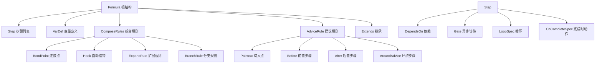

# Formula Types 模块技术深度解析

## 1. 问题域与模块目的

### 为什么需要这个模块？

在复杂的工作流管理系统中，我们经常需要处理以下问题：
- 如何定义可重用的工作流模板？
- 如何在模板中支持变量替换和条件逻辑？
- 如何组合多个工作流模板以构建更复杂的流程？
- 如何在运行时动态扩展工作流结构？

直接硬编码这些工作流会导致代码重复、维护困难和灵活性不足。`formula_types` 模块正是为了解决这些问题而设计的，它提供了一套完整的类型系统和抽象，用于定义、组合和执行工作流模板（称为 "Formula"）。

### 核心设计理念

这个模块的设计思想可以概括为：**将工作流定义为数据，而非代码**。通过将工作流结构表示为可序列化的数据结构（JSON/TOML），我们可以：
- 在运行时动态加载和解析工作流模板
- 支持版本控制和模板继承
- 实现工作流的可视化编辑和验证
- 方便地在不同环境之间共享模板

## 2. 核心抽象与架构

### 核心概念模型

让我们用一个类比来理解这个模块的核心概念：
- **Formula**：就像一个建筑蓝图，定义了整个工作流的结构
- **Step**：蓝图中的单个施工步骤
- **VarDef**：蓝图中的可变参数，允许根据需要调整设计
- **ComposeRules**：将多个蓝图组合在一起的规则
- **AdviceRule**：在特定步骤前后插入额外工作的机制（类似 AOP）

### 架构图



## 3. 核心组件详解

### 3.1 Formula 结构体

`Formula` 是整个模块的核心，代表一个完整的工作流模板。

```go
type Formula struct {
    Formula     string                 // 公式名称/标识符
    Description string                 // 描述信息
    Version     int                    // 版本号
    Type        FormulaType            // 类型：workflow/expansion/aspect
    Extends     []string               // 继承的父公式列表
    Vars        map[string]*VarDef     // 变量定义
    Steps       []*Step                // 步骤定义
    Template    []*Step                // 扩展模板步骤（用于 TypeExpansion）
    Compose     *ComposeRules          // 组合规则
    Advice      []*AdviceRule          // 建议规则
    Pointcuts   []*Pointcut            // 切入点定义（用于 TypeAspect）
    Phase       string                 // 推荐实例化阶段
    Source      string                 // 源文件路径（解析时设置）
}
```

**设计意图**：
- `FormulaType` 区分了三种不同的公式类型，每种有不同的用途
- `Extends` 支持模板继承，允许复用现有模板的定义
- `Vars` 和 `Steps` 分别定义了模板的参数和内容
- `Compose` 和 `Advice` 提供了强大的组合和扩展机制

**关键方法**：
- `Validate()`：验证公式结构的正确性
- `GetRequiredVars()`：获取所有必需变量的列表
- `GetStepByID(id string)`：通过 ID 查找步骤
- `GetBondPoint(id string)`：通过 ID 查找连接点

### 3.2 VarDef 结构体

`VarDef` 定义了模板变量，支持默认值和验证规则。

```go
type VarDef struct {
    Description string        // 变量描述
    Default     *string       // 默认值
    Required    bool          // 是否必需
    Enum        []string      // 允许值列表
    Pattern     string        // 正则表达式验证
    Type        string        // 值类型：string/int/bool
}
```

**设计亮点**：
- 支持 TOML 反序列化的灵活格式：可以是简单字符串或完整表格
- 提供了多种验证机制（枚举、正则、类型）
- 清晰区分了"有默认值"和"无默认值"的情况（使用指针类型）

### 3.3 Step 结构体

`Step` 代表工作流中的一个任务或步骤。

```go
type Step struct {
    ID           string           // 唯一标识符
    Title        string           // 标题（支持变量替换）
    Description  string           // 描述
    Type         string           // 类型：task/bug/feature/epic/chore
    Priority     *int             // 优先级（0-4）
    Labels       []string         // 标签
    DependsOn    []string         // 依赖的步骤 ID
    Needs        []string         // DependsOn 的简化别名
    WaitsFor     string           // 扇出门类型
    Assignee     string           // 默认负责人
    Expand       string           // 要内联的扩展公式
    ExpandVars   map[string]string// 扩展变量覆盖
    Condition    string           // 条件表达式
    Children     []*Step          // 嵌套步骤
    Gate         *Gate            // 异步等待条件
    Loop         *LoopSpec        // 循环定义
    OnComplete   *OnCompleteSpec  // 完成时动作
    
    // 内部追踪字段
    SourceFormula  string          // 来源公式
    SourceLocation string          // 来源位置
}
```

**设计意图**：
- 提供了丰富的字段来描述任务的各个方面
- 支持多种执行控制机制：依赖、条件、循环、异步等待
- `DependsOn` 和 `Needs` 提供了两种表达依赖的方式，提高了灵活性
- 源追踪字段帮助调试和错误报告

### 3.4 ComposeRules 结构体

`ComposeRules` 定义了如何将多个公式组合在一起。

```go
type ComposeRules struct {
    BondPoints []*BondPoint  // 命名连接点
    Hooks      []*Hook        // 自动挂钩
    Expand     []*ExpandRule  // 单个步骤扩展
    Map        []*MapRule     // 批量步骤扩展
    Branch     []*BranchRule  // 分支并行执行
    Gate       []*GateRule    // 条件门
    Aspects    []string       // 要应用的方面公式
}
```

**设计亮点**：
- 提供了多种组合机制，满足不同场景的需求
- `BondPoints` 和 `Hooks` 分别支持显式和隐式的组合
- `Expand` 和 `Map` 提供了细粒度和批量的扩展能力
- `Aspects` 支持横切关注点的模块化

### 3.5 AdviceRule 结构体

`AdviceRule` 定义了步骤转换规则，类似面向切面编程（AOP）的概念。

```go
type AdviceRule struct {
    Target string         // 目标步骤 ID 模式
    Before *AdviceStep    // 前置步骤
    After  *AdviceStep    // 后置步骤
    Around *AroundAdvice  // 环绕步骤
}
```

**设计意图**：
- 允许在不修改原始步骤定义的情况下增强其行为
- 支持前置、后置和环绕三种增强方式
- 使用模式匹配来选择目标步骤，提高了灵活性

## 4. 数据流程

### 公式实例化流程

1. **加载与解析**：
   - 从文件系统加载公式定义
   - 解析 JSON/TOML 格式到 `Formula` 结构体
   - 设置 `Source` 字段追踪来源

2. **继承处理**：
   - 解析 `Extends` 字段引用的父公式
   - 合并变量、步骤和组合规则
   - 子公式的定义覆盖父公式的同名定义

3. **验证**：
   - 调用 `Validate()` 检查结构完整性
   - 验证变量定义（必需 vs 默认值冲突等）
   - 验证步骤 ID 唯一性和依赖引用
   - 验证组合规则的有效性

4. **变量替换**：
   - 收集用户提供的变量值
   - 验证必需变量是否提供
   - 应用默认值
   - 在步骤标题、描述等字段中替换变量

5. **扩展应用**：
   - 应用内联扩展（`Expand` 字段）
   - 应用组合规则中的扩展（`Compose.Expand`）
   - 应用批量扩展（`Compose.Map`）
   - 处理条件步骤（`Condition` 字段）
   - 展开循环（`Loop` 字段）

6. **建议应用**：
   - 匹配切入点（`Pointcut`）
   - 应用前置、后置和环绕建议
   - 调整依赖关系以适应插入的步骤

7. **组合应用**：
   - 应用分支规则（`BranchRule`）
   - 应用门规则（`GateRule`）
   - 处理自动挂钩（`Hook`）
   - 应用方面（`Aspects`）

8. **最终验证与输出**：
   - 再次验证生成的工作流结构
   - 生成最终的问题层次结构
   - 设置源追踪信息

## 5. 设计权衡与决策

### 5.1 数据驱动 vs 代码驱动

**选择**：采用数据驱动的设计，将公式定义为可序列化的数据结构。

**理由**：
- 提高了灵活性：可以在运行时加载和修改公式
- 便于版本控制：公式定义可以像代码一样进行版本管理
- 支持可视化编辑：可以构建 UI 工具来编辑公式
- 简化了测试：可以轻松创建测试用例

**权衡**：
- 失去了一些类型安全：在运行时才能发现某些错误
- 增加了解析和验证的复杂性：需要额外的代码来处理数据格式

### 5.2 继承 vs 组合

**选择**：同时支持继承（`Extends`）和组合（`ComposeRules`）两种机制。

**理由**：
- 继承适合"是一种"关系：例如，"bug 修复流程"是一种"基础流程"
- 组合适合"包含"关系：例如，"发布流程"包含"测试流程"
- 两种机制结合使用可以满足更复杂的场景

**权衡**：
- 增加了概念复杂度：用户需要理解两种机制的区别和适用场景
- 继承可能导致脆弱的基类问题：父公式的修改可能影响多个子公式

### 5.3 显式依赖 vs 隐式依赖

**选择**：主要使用显式依赖（`DependsOn`/`Needs`），同时支持一些隐式机制。

**理由**：
- 显式依赖更清晰：读者可以直接看到步骤之间的关系
- 减少了意外行为：不太可能因为隐式规则导致错误
- 便于工具处理：可以更容易地构建可视化和分析工具

**权衡**：
- 增加了一些样板代码：需要手动指定依赖关系
- 某些场景下可能不够简洁：隐式规则可以减少重复

### 5.4 验证策略

**选择**：在多个阶段进行验证，包括加载时、继承后、扩展后等。

**理由**：
- 早期发现错误：可以在公式加载时就发现基本问题
- 渐进式验证：每个转换步骤后验证，可以更容易定位问题
- 全面性：确保最终生成的工作流是正确的

**权衡**：
- 增加了处理时间：多次验证会有一些性能开销
- 重复代码：需要在多个地方实现类似的验证逻辑

## 6. 使用指南与最佳实践

### 6.1 公式类型选择

- **TypeWorkflow**：用于定义完整的工作流模板，包含一系列步骤
- **TypeExpansion**：用于定义可重用的步骤模式，可以内联到其他公式中
- **TypeAspect**：用于定义横切关注点，可以应用到多个公式中

### 6.2 变量定义最佳实践

- 为所有变量提供清晰的描述
- 合理设置默认值，减少用户需要提供的参数
- 使用枚举和正则表达式进行验证，确保输入的正确性
- 避免过度使用变量，保持公式的简洁性

### 6.3 步骤设计原则

- 保持步骤的粒度适中：既不要太细（导致太多步骤），也不要太粗（难以重用）
- 使用有意义的 ID：便于理解和引用
- 明确设置依赖关系：避免隐式依赖
- 合理使用条件和循环：不要过度复杂化

### 6.4 组合策略

- 优先使用组合而不是继承：组合更灵活，更容易理解
- 设计清晰的连接点：使公式的组合点明确且文档化
- 谨慎使用自动挂钩：确保触发条件清晰且可预测
- 合理使用方面：将横切关注点模块化，但不要过度使用

## 7. 边缘情况与注意事项

### 7.1 循环依赖

**问题**：步骤之间可能形成循环依赖，导致无法执行。

**防护**：`Validate()` 方法会检查依赖关系，但当前实现可能无法检测所有循环依赖情况。

**建议**：
- 在设计公式时注意避免循环依赖
- 使用工具可视化依赖关系
- 在复杂公式中进行额外的循环检测

### 7.2 变量替换边界情况

**问题**：变量替换可能在某些边缘情况下产生意外结果。

**防护**：
- 确保变量名不会与其他语法元素冲突
- 在变量替换后进行验证
- 提供清晰的错误信息

**建议**：
- 使用明确的变量命名约定
- 测试各种边缘情况
- 考虑在变量替换后重新验证公式结构

### 7.3 继承与组合的交互

**问题**：继承和组合同时使用时可能产生意外的交互。

**防护**：
- 明确继承和组合的应用顺序
- 文档化交互行为
- 在验证过程中检查冲突

**建议**：
- 尽量简化：要么主要使用继承，要么主要使用组合
- 如果两者都使用，确保有清晰的使用规范
- 充分测试复杂的组合场景

### 7.4 性能考虑

**问题**：复杂的公式可能导致处理时间过长。

**防护**：
- 优化验证算法
- 缓存解析结果
- 提供性能监控工具

**建议**：
- 合理拆分大公式为多个小公式
- 避免过度嵌套
- 考虑在公式中添加复杂度指标
- 对常用公式进行预编译和缓存

## 8. 总结

`formula_types` 模块提供了一个强大而灵活的工作流模板系统，通过数据驱动的设计、丰富的组合机制和完善的验证体系，解决了工作流定义、重用和组合的复杂问题。

该模块的核心优势在于：
1. **灵活性**：支持多种工作流模式和组合方式
2. **可重用性**：通过继承、扩展和方面机制促进代码复用
3. **可靠性**：提供完善的验证机制，确保公式的正确性
4. **可扩展性**：设计了清晰的扩展点，便于未来添加新功能

对于新加入团队的开发者，理解这个模块的设计理念和核心组件将有助于更有效地使用和扩展工作流系统。
