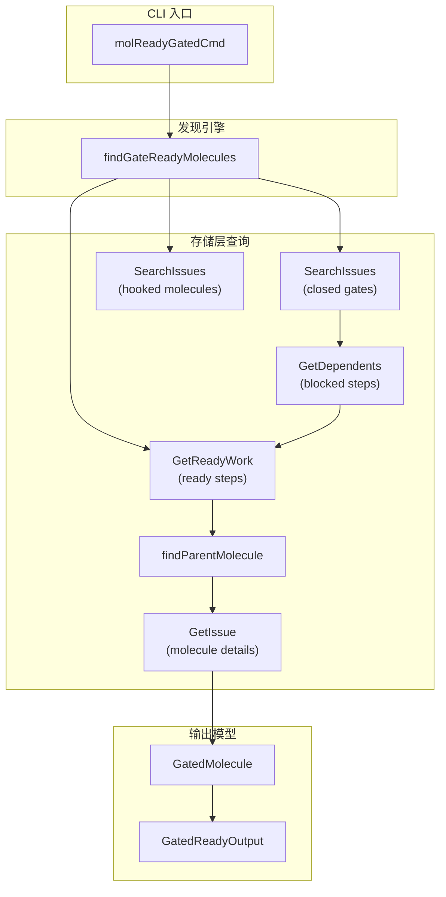

# Gate Discovery Module

## 概述：为什么需要这个模块

想象一个工厂流水线：某些工序必须等待外部条件满足才能继续 —— 比如等待质检报告、等待 CI 测试通过、等待人工审批。在这些条件满足之前，相关的工作单元（molecule）处于"阻塞"状态。一旦条件满足（gate 关闭），这些工作单元应该立即恢复执行。

**Gate Discovery 模块解决的核心问题是**：如何高效地发现哪些 molecule 已经满足了恢复条件，但还没有被分配给任何 agent 处理。

这是一个典型的**状态轮询 + 过滤发现**问题。 naive 的方案可能是遍历所有 molecule 检查它们的状态，但这在大规模系统中效率极低。本模块采用了一种更聪明的策略：从"已关闭的 gate"出发，反向查找被它阻塞的 step，再向上追溯到 parent molecule。这种"从事件源头出发"的设计，将搜索空间从"所有 molecule"缩小到"受最近关闭 gate 影响的 molecule"。

该模块主要被 [Deacon patrol](../cmd/bd/mol_current.md) 使用，用于实现**基于发现的恢复机制**（discovery-based resume）—— 无需显式跟踪 waiter 列表，系统可以自动发现并调度已就绪的工作。

## 架构与数据流



### 数据流详解

整个发现过程遵循一个**漏斗形过滤管道**：

1. **第一层过滤：关闭的 gate**  
   调用 `SearchIssues` 查找所有状态为 `closed` 且类型为 `gate` 的 issue。这一步将搜索范围从"所有 issue"缩小到"最近关闭的 gate"。

2. **第二层过滤：就绪的 step**  
   调用 `GetReadyWork` 获取当前所有就绪的工作项（包括 molecule steps）。这一步建立了"哪些 step 现在可以执行"的白名单。

3. **第三层过滤：排除已挂钩的 molecule**  
   调用 `SearchIssues` 查找所有状态为 `hooked` 的 issue，并通过 `findParentMolecule` 追溯到它们的 parent molecule。这一步确保不会重复调度已经被 agent 领取的工作。

4. **依赖关系追溯**  
   对每个关闭的 gate，调用 `GetDependents` 查找所有依赖于它的 issue（即被它阻塞的 step）。这是核心的"反向查找"逻辑。

5. **交叉验证**  
   检查每个 dependent 是否在"就绪白名单"中，是否在"已挂钩黑名单"外，是否有有效的 parent molecule。

6. **去重与排序**  
   使用 `moleculeMap` 按 molecule ID 去重（一个 molecule 可能有多个 gate 同时关闭），最后按 ID 排序保证输出确定性。

## 核心组件深度解析

### `GatedMolecule`

```go
type GatedMolecule struct {
    MoleculeID    string       `json:"molecule_id"`
    MoleculeTitle string       `json:"molecule_title"`
    ClosedGate    *types.Issue `json:"closed_gate"`
    ReadyStep     *types.Issue `json:"ready_step"`
}
```

**设计意图**：这是一个**投影模型**（projection model），专为 JSON 序列化设计。它不存储完整的 molecule 对象，而是提取调度所需的最小信息集。

**字段语义**：
- `MoleculeID` / `MoleculeTitle`：标识和描述工作单元
- `ClosedGate`：触发恢复的 gate issue，包含 `AwaitType` 等元数据（如 `gh:run`、`gh:pr`、`timer`）
- `ReadyStep`：现在可以执行的具体 step，包含 step 的 ID 和标题

**为什么使用指针**：`ClosedGate` 和 `ReadyStep` 使用指针类型，因为它们是可选的上下文信息。在某些边界情况下（如 gate 已被删除），这些字段可能为 nil，调用方需要处理这种情况。

### `GatedReadyOutput`

```go
type GatedReadyOutput struct {
    Molecules []*GatedMolecule `json:"molecules"`
    Count     int              `json:"count"`
}
```

**设计意图**：这是 CLI 命令的**输出信封**（output envelope）。它遵循 API 设计的最佳实践：
- 始终返回数组（即使为空），避免客户端处理 `null` vs `[]` 的边界情况
- 提供 `Count` 字段，方便客户端快速判断结果规模而无需遍历数组

### `findGateReadyMolecules`

这是模块的核心算法函数。让我们逐段分析其设计决策：

#### 查询策略：为什么分多次查询而不是单次复杂查询？

```go
// Step 1: Find all closed gate beads
gateType := types.IssueType("gate")
closedStatus := types.StatusClosed
gateFilter := types.IssueFilter{
    IssueType: &gateType,
    Status:    &closedStatus,
    Limit:     100,
}
closedGates, err := s.SearchIssues(ctx, "", gateFilter)
```

**设计权衡**：这里选择了**多次简单查询**而非**单次复杂 JOIN 查询**。原因：

1. **存储层抽象**：`DoltStore` 的查询接口不支持复杂的跨表 JOIN。强制实现会导致存储层泄漏到业务逻辑中。

2. **可测试性**：每个查询步骤可以独立 mock 和验证。

3. **渐进式优化**：如果某一步成为瓶颈，可以单独优化（如添加缓存、调整 limit），而不影响其他步骤。

4. **内存可控**：每步限制返回数量（100、500），避免单次查询返回海量数据。

**代价**：多次数据库往返。但在实际场景中，关闭的 gate 数量通常很少（<10），这种 tradeoff 是合理的。

#### 就绪工作查询：为什么需要 `IncludeMolSteps: true`？

```go
readyIssues, err := s.GetReadyWork(ctx, types.WorkFilter{
    Limit: 500, 
    IncludeMolSteps: true,
})
```

**隐式契约**：默认情况下，`GetReadyWork` 会排除 molecule 内部的 step（ID 包含 `-mol-` 或 `-wisp-` 的 issue），因为通常用户只关心顶层工作项。但 gate discovery 需要看到这些内部 step，因为 gate 阻塞的正是它们。

**设计洞察**：这是一个**调用方责任**（caller responsibility）模式。存储层提供通用接口，但允许调用方通过 flag 覆盖默认行为。这避免了为特殊场景创建专用 API，保持了接口的简洁性。

#### 已挂钩 molecule 过滤：为什么需要两层查找？

```go
for _, issue := range hookedIssues {
    // 如果 hooked issue 是 molecule root，直接标记
    hookedMolecules[issue.ID] = true
    // 如果 hooked issue 是 step，查找 parent molecule
    if parentMol := findParentMolecule(ctx, s, issue.ID); parentMol != "" {
        hookedMolecules[parentMol] = true
    }
}
```

**问题空间**：一个 molecule 可能被"挂钩"（hooked）在两种情况下：
1. molecule root 本身被挂钩（整个 molecule 被领取）
2. molecule 内部的某个 step 被挂钩（step 正在执行）

**设计决策**：无论哪种情况，整个 molecule 都应被视为"已占用"。因此需要同时检查 issue 本身和它的 parent。

**边界情况处理**：注意这里的错误处理策略 —— 如果 `SearchIssues` 失败，函数不会立即返回错误，而是将 `hookedIssues` 设为 `nil`，继续执行。这意味着：
- **乐观策略**：宁可重复调度（稍后会被 agent 拒绝），也不要漏掉可执行的工作
- **降级优雅**：过滤是优化，不是 correctness 要求

#### 依赖关系追溯：核心算法

```go
for _, gate := range closedGates {
    dependents, err := s.GetDependents(ctx, gate.ID)
    // ...
    for _, dependent := range dependents {
        if !readyIDs[dependent.ID] {
            continue  // 还未就绪
        }
        moleculeID := findParentMolecule(ctx, s, dependent.ID)
        // ...
        if hookedMolecules[moleculeID] {
            continue  // 已被领取
        }
        // ...
    }
}
```

**算法复杂度**：假设 N 个关闭的 gate，每个 gate 平均 M 个 dependents，则复杂度为 O(N × M)。在实际场景中，N 通常很小（<10），M 也很小（1-3），因此性能可接受。

**为什么使用 `GetDependents` 而不是遍历所有 issue 检查依赖**：  
`GetDependents` 利用数据库的依赖关系索引，直接查询 `depends_on_id = gate.ID` 的记录。这是**索引驱动**的 O(log K) 操作，而遍历所有 issue 是 O(K) 操作。

#### 去重与排序

```go
moleculeMap := make(map[string]*GatedMolecule)
// ... 填充 map ...
// 转换为 slice 并排序
var molecules []*GatedMolecule
for _, mol := range moleculeMap {
    molecules = append(molecules, mol)
}
sort.Slice(molecules, func(i, j int) bool {
    return molecules[i].MoleculeID < molecules[j].MoleculeID
})
```

**为什么需要去重**：一个 molecule 可能有多个 gate（例如同时等待 CI 和人工审批）。当多个 gate 同时关闭时，会产生多条记录指向同一个 molecule。去重确保每个 molecule 只出现一次。

**为什么按 ID 排序**：
1. **确定性输出**：便于测试和调试
2. **增量处理友好**：如果调用方需要分页或断点续传，排序后的结果更容易处理

## 依赖关系分析

### 上游依赖（本模块调用的组件）

| 组件 | 调用方式 | 契约假设 |
|------|----------|----------|
| `DoltStore.SearchIssues` | 查询关闭的 gate 和已挂钩的 issue | 返回结果按某种顺序排列；支持 `IssueType` 和 `Status` 过滤 |
| `DoltStore.GetReadyWork` | 获取就绪工作白名单 | `IncludeMolSteps: true` 会包含 molecule 内部 step |
| `DoltStore.GetDependents` | 查找被 gate 阻塞的 step | 依赖关系存储在独立的依赖表中，可通过 `depends_on_id` 索引查询 |
| `DoltStore.GetIssue` | 获取 molecule 的详细信息 | 返回完整的 `Issue` 对象，包括 `Title` 等字段 |
| `findParentMolecule` | 从 step ID 追溯到 parent molecule | 通过解析 ID 格式或查询依赖关系实现（具体实现需查看该函数） |

### 下游依赖（调用本模块的组件）

根据模块树，本模块主要被以下组件使用：

- **[Deacon patrol](mol_current.md)**：定期调用此命令发现可恢复的 molecule，然后调度给 idle agent
- **CLI 用户**：通过 `bd mol ready --gated` 手动查看可恢复的工作

### 数据契约

**输入契约**：
- 存储层必须正确维护 issue 的 `Status`、`IssueType` 字段
- 依赖关系必须正确记录（当 step A 等待 gate B 时，存在 `A depends_on B` 的记录）
- molecule 的 step 必须能通过 `findParentMolecule` 追溯到 parent

**输出契约**：
- 返回的 `GatedMolecule` 列表中，每个 molecule ID 唯一
- `ClosedGate` 的 `Status` 一定是 `closed`
- `ReadyStep` 一定在 `GetReadyWork` 的结果集中

## 设计决策与权衡

### 1. 推送 vs 拉取模式

**选择**：拉取模式（polling）

**替代方案**：推送模式（当 gate 关闭时，主动通知等待的 molecule）

**权衡分析**：
- **拉取的优势**：实现简单，不依赖事件总线，易于调试和重放
- **拉取的劣势**：有延迟（取决于轮询间隔），可能产生空轮询
- **为什么选择拉取**：系统已有 Deacon patrol 定期运行，复用现有基础设施比引入新的事件系统更简单。且 gate 关闭频率不高，轮询开销可接受。

### 2. 存储层直接访问 vs 领域服务抽象

**选择**：直接访问 `DoltStore`

**替代方案**：创建 `GateDiscoveryService` 封装存储调用

**权衡分析**：
- **直接访问的优势**：代码简单，没有额外的抽象层
- **直接访问的劣势**：业务逻辑与存储实现耦合
- **为什么选择直接访问**：这是一个 CLI 命令，不是核心业务逻辑。抽象的收益不足以抵消复杂性。如果未来需要复用此逻辑，再考虑提取服务层。

### 3. 严格过滤 vs 乐观调度

**选择**：乐观调度（过滤失败时继续执行）

**替代方案**：严格过滤（任何查询失败都返回错误）

**权衡分析**：
- **乐观的优势**：系统更健壮，部分组件故障不影响整体功能
- **乐观的劣势**：可能重复调度（但 agent 领取时会再次检查）
- **为什么选择乐观**：这是一个"发现"功能，不是"执行"功能。漏掉可执行的工作比重复发现更糟糕。

### 4. 内存去重 vs 数据库去重

**选择**：内存去重（使用 `map[string]*GatedMolecule`）

**替代方案**：使用 `SELECT DISTINCT` 在数据库层去重

**权衡分析**：
- **内存去重的优势**：不依赖数据库特性，逻辑清晰，易于调试
- **内存去重的劣势**：占用额外内存（但数据量很小）
- **为什么选择内存去重**：结果集很小（通常 <100），内存开销可忽略。且内存去重允许在去重前进行更复杂的过滤逻辑。

## 使用指南

### 基本用法

```bash
# 查找所有可恢复的 molecule
bd mol ready --gated

# JSON 输出（用于自动化）
bd mol ready --gated --json
```

### JSON 输出示例

```json
{
  "molecules": [
    {
      "molecule_id": "bd-mol-abc123",
      "molecule_title": "Implement user authentication",
      "closed_gate": {
        "id": "bd-gate-xyz789",
        "await_type": "gh:run",
        "status": "closed"
      },
      "ready_step": {
        "id": "bd-step-def456",
        "title": "Deploy to staging"
      }
    }
  ],
  "count": 1
}
```

### 与 Deacon Patrol 集成

Deacon patrol 定期执行此命令，然后对每个返回的 molecule 执行：

```bash
gt sling <agent> --mol <molecule-id>
```

这会将 molecule 挂钩到 agent 的 hook 上，开始执行。

## 边界情况与陷阱

### 1. Gate 被删除

**场景**：gate 在关闭后被删除，但 dependent step 仍然存在。

**当前行为**：`GetDependents` 可能返回空列表，或者返回的 dependent 的 parent molecule 找不到。

**缓解措施**：代码中对每个步骤都有错误检查，遇到错误时 `continue` 跳过，不会导致整个命令失败。

### 2. 并发挂钩

**场景**：在 gate discovery 运行期间，另一个 agent 同时挂钩了同一个 molecule。

**当前行为**：可能返回已经被挂钩的 molecule。

**缓解措施**：这是预期行为。agent 在挂钩前会再次检查 molecule 状态，如果已被挂钩则跳过。这是**最终一致性**模型。

### 3. Limit 截断

**场景**：关闭的 gate 超过 100 个，或就绪 work 超过 500 个。

**当前行为**：只处理前 N 个，超出的被忽略。

**风险**：在极端情况下可能漏掉可执行的 molecule。

**缓解措施**：这些 limit 是保护性措施，防止单次查询返回海量数据。如果实际场景中经常触达 limit，应该调整 limit 值或优化查询策略。

### 4. 时区与时间戳

**场景**：gate 的关闭时间与 ready work 的查询时间存在微小差异。

**当前行为**：使用查询时的快照，可能存在毫秒级的不一致。

**影响**：通常无影响，因为 gate 关闭和 step 就绪是原子操作（在同一个事务中）。

### 5. `findParentMolecule` 的实现依赖

**隐式依赖**：本模块依赖 `findParentMolecule` 函数正确实现。如果该函数的逻辑改变（如 ID 格式变化），本模块可能失效。

**建议**：在修改 `findParentMolecule` 时，需要回归测试此模块。

## 扩展点

### 如何添加新的 gate 类型？

无需修改本模块。gate 类型由 `Issue.AwaitType` 字段标识，本模块只关心 gate 是否 `closed`，不关心具体类型。添加新类型只需：
1. 定义新的 `AwaitType` 值
2. 确保 gate 在条件满足时正确关闭

### 如何优化性能？

1. **缓存关闭的 gate**：如果 gate 关闭频率低，可以缓存上一次查询结果，只查询新关闭的 gate。
2. **批量查询**：将多个 `GetDependents` 调用合并为批量查询。
3. **索引优化**：确保 `depends_on_id` 字段有索引。

### 如何添加更多过滤条件？

修改 `findGateReadyMolecules` 函数，在添加到 `moleculeMap` 之前添加额外的检查逻辑。例如：
- 只返回特定 priority 的 molecule
- 排除特定 label 的 molecule
- 只返回特定 assignee 的 molecule

## 相关模块

- [Molecule Progress & Dispatch](mol_current.md) — Deacon patrol 的实现，使用本模块进行 gate 发现
- [Storage Interfaces](storage_contracts.md) — `DoltStore` 的接口定义
- [Issue Domain Model](issue_domain_model.md) — `Issue`、`IssueType`、`Status` 等核心类型
- [Query & Projection Types](query_and_projection_types.md) — `IssueFilter`、`WorkFilter` 等查询类型
