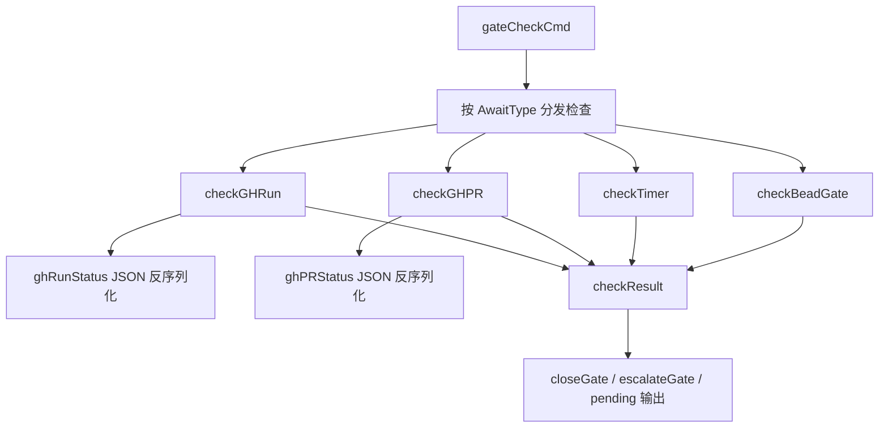

# gate_status_evaluation_models

`gate_status_evaluation_models` 是 `bd gate check` 这条命令里“判定真相”的那一层数据模型：它不负责拉取所有 gate，也不负责最终落库，而是负责把外部世界（GitHub CLI 返回的 JSON）和内部判定语义（resolved / escalated / pending）接起来。可以把它想成一个“裁判记分卡”系统：比赛现场很嘈杂（CLI 输出、跨 rig 查询、超时计算），但最终裁判只认几项结构化指标，再据此宣布“通过、升级、继续等待”。

如果没有这一层模型，`gate check` 很容易退化成一堆分散的字符串判断和即时分支，短期能跑，长期会变成难以维护的 if-else 丛林：新增 gate 类型时会反复复制判定逻辑，错误处理和输出语义也会慢慢不一致。

---

## 这个模块解决的核心问题

在 gate 机制里，“是否可继续推进步骤”本质是一个异步状态判定问题。问题难点不在于单次查询，而在于要统一处理多种来源、不同失败模式和不同时间语义：

`gh:run` 依赖 `gh run view` 的 `status + conclusion` 组合；`gh:pr` 依赖 `state + merged`；`timer` 依赖 `CreatedAt + Timeout` 的时间计算；`bead` 依赖跨 rig 的存储读取。它们的信号来源和字段形态完全不同，但 `gateCheckCmd` 需要一个统一结果面向后续流程：

- 是否 `resolved`（可自动关闭 gate）
- 是否 `escalated`（需要人工关注或触发升级）
- 一条可审计的 `reason`
- 是否出现系统级 `err`

`checkResult`、`ghRunStatus`、`ghPRStatus` 就是围绕这个统一结果面设计出来的最小模型集。

---

## 心智模型（建议这样理解）

把整个模块想成“三段流水线”：

1. **采样层（Sampler）**：从 GitHub CLI、时间、跨 rig 存储采集原始状态。
2. **翻译层（Translator）**：把外部 JSON 映射到 `ghRunStatus` / `ghPRStatus`，把不同 gate 类型转换成统一布尔语义。
3. **裁决层（Judge）**：把每个 gate 的结果装进 `checkResult`，再由 `gateCheckCmd` 决定是 close、escalate 还是保留 pending。

这个模型的关键价值在于把“外部协议差异”与“内部动作语义”解耦：外部怎么表示状态可以变化，但内部只关心 resolved/escalated/reason 这组稳定 contract。

---

## 架构与数据流



从端到端看，`gateCheckCmd` 先通过 `store.SearchIssues(... IssueFilter{IssueType:"gate", ExcludeStatus:[closed]})` 拉取候选 gate，再用 `shouldCheckGate` 做类型筛选。之后每个 gate 都会被路由到对应检查函数，返回统一四元组 `(resolved, escalated, reason, err)`，最终组装成本地结构体 `checkResult`。

接下来的动作完全由 `checkResult` 驱动：

- `resolved=true`：`dry-run` 下打印 would resolve；非 dry-run 走 `closeGate`，内部调用 `store.CloseIssue`。
- `escalated=true`：`dry-run` 下打印 would escalate；非 dry-run 且 `--escalate` 时调用 `escalateGate` 执行 `gt escalate`。
- 两者都 false：保持 pending，仅输出 reason。

这里的设计重点是：**检查阶段不直接做副作用**（除了 `checkGHRun` 里可能发生的 `await_id` 回写，后文会讲），而是先统一结果，再统一处理副作用，降低行为分叉。

---

## 核心组件深潜

## `type checkResult`

`checkResult` 是 `gateCheckCmd` 内部的聚合结果模型，字段包含：`gate *types.Issue`、`resolved`、`escalated`、`reason`、`err`。它的作用不是对外 API，而是把多种检查器输出规整成同一处理面。

设计上它把“业务状态”与“系统错误”并存：例如 gh 命令失败会放进 `err`，而“PR not found”这类可业务化处理的情况可能表达为 `escalated=true` 且 `err=nil`。这让命令可以在批处理时继续跑完其它 gate，而不是遇到单点失败就整体退出。

## `type ghRunStatus`

`ghRunStatus` 映射 `gh run view <id> --json status,conclusion,name` 的响应字段：`Status`、`Conclusion`、`Name`。它是外部 JSON 到内部判定逻辑之间的薄适配层。

为什么不用 `map[string]interface{}` 直接解析？因为 gate 判定对字段有严格语义依赖（比如 `completed+success` 才 resolve），用结构体可在编译期固定字段意图，避免动态类型断言散落在业务逻辑里。

## `type ghPRStatus`

`ghPRStatus` 映射 `gh pr view <id> --json state,merged,title` 的响应字段：`State`、`Merged`、`Title`。判定逻辑里既看 `State` 也看 `Merged`，例如 `CLOSED` 但 `Merged=true` 仍视为 resolved。

这体现了一个很实际的工程取舍：不只依赖单字段状态机，而是组合字段做稳健判定，以应对外部系统状态语义的细粒度差异。

## `checkGHRun(gate *types.Issue)`

`checkGHRun` 是 `gh:run` 的核心判定器。它先读取 `gate.AwaitID`，若为空直接返回 pending reason。若 `AwaitID` 非纯数字，会把它当 workflow 名称提示，调用 `discoverRunIDByWorkflowName` 找最新 run，再调用 `updateGateAwaitID` 回写 gate。

这个“自动发现并回写”是一个非显然设计选择：它牺牲了检查函数的纯函数特性，换来了用户体验（支持用 workflow 名而非 run ID 建 gate）。代价是：`check` 命令在逻辑上不仅“读状态”，还可能“写状态”，新贡献者要特别注意 dry-run 与幂等预期（目前该回写不受 `dry-run` 保护）。

随后函数执行 `gh run view`，反序列化到 `ghRunStatus`，并按状态机判定：

- `completed + success` => resolved
- `completed + failure/canceled/...` => escalated
- `in_progress/queued/pending/waiting` => pending

错误处理上它区分了“系统错误”和“业务异常信号”：CLI 缺失属于 `err`，run not found 则映射成 `escalated`。这使得运营语义更贴近“需要介入”的实际场景。

## `checkGHPR(gate *types.Issue)`

`checkGHPR` 逻辑与 `checkGHRun` 对称：调用 `gh pr view`，解析 `ghPRStatus`，再按 `State/Merged` 组合判定。

值得注意的是它把 `PR not found` 视作 `escalated=true`，并非 `err`。这意味着系统认为“对象不存在”更像业务失败（需要处理的 gate 条件异常），而不是命令执行失败。

## `checkTimer(gate *types.Issue, now time.Time)`

`checkTimer` 基于 `gate.CreatedAt.Add(gate.Timeout)` 计算过期。它显式声明 timers “resolve but never escalate”，即便签名返回 `escalated`，也总是 false（`//nolint:unparam` 注释也在强调这是设计意图）。

这个决定把 timer 视为“自动放行闸门”而不是“超时告警器”。好处是简单、可预测；代价是如果团队希望超时触发升级，需要在上层另加策略，而不是在这里直接改语义。

## `checkBeadGate(ctx, awaitID)`

`checkBeadGate` 负责跨 rig 判定，`await_id` 必须是 `<rig>:<bead-id>`。它会：

- 解析并校验格式；
- 通过 `beads.FindBeadsDir` 找当前 beads 根；
- 通过 `routing.ResolveBeadsDirForRig` 找目标 rig 路径；
- 用 `dolt.NewFromConfigWithOptions(... ReadOnly:true)` 打开目标存储；
- `GetIssue` 后检查目标 bead 是否 `StatusClosed`。

它的架构角色是“只读探针”：不参与跨 rig 事务，也不缓存远端连接。每次检查即时打开、即时关闭，确保一致性优先于性能。对于 gate 数量很大时，这会是热点开销点。

## `shouldCheckGate(gate, typeFilter)`

这是类型过滤器，支持三种语义：空/`all` 全部、`gh` 匹配所有 `gh:` 前缀、其它值做完全相等匹配。这个函数让 CLI 参数语义集中，避免在主循环里重复分支。

## `closeGate` 与 `escalateGate`

`closeGate` 很薄，只代理到 `store.CloseIssue`。`escalateGate` 则调用外部 `gt escalate` 命令，并将 stdout/stderr 直连当前进程。

`escalateGate` 的失败策略是“告警但不中断”：即使升级命令失败，`gate check` 仍继续处理。这延续了该模块“批处理韧性优先”的总体思路。

---

## 依赖分析（调用关系与契约）

从当前源码可确认的下游依赖包括：

- `internal.types.types.Issue` 与 `IssueFilter`：提供 gate 的核心字段契约（如 `AwaitType`、`AwaitID`、`Timeout`、`Waiters`、`CreatedAt`）。详见 [issue_domain_model](issue_domain_model.md) 与 [query_and_projection_types](query_and_projection_types.md)。
- `internal.storage.storage.Storage`：通过全局 `store` 使用 `SearchIssues` / `GetIssue` / `UpdateIssue` / `CloseIssue`。详见 [storage_contracts](storage_contracts.md)。
- `internal.routing.routes.ResolveBeadsDirForRig`：将 rig 名称解析到目标 `.beads` 目录。详见 [route_resolution_and_storage_routing](route_resolution_and_storage_routing.md)。
- `internal.beads.beads.FindBeadsDir`：发现当前仓库 beads 上下文。详见 [repository_discovery_and_redirect](repository_discovery_and_redirect.md)。
- `internal.storage.dolt` 构造函数：用于只读打开目标 rig 存储，属于后端实现耦合点。详见 [Dolt Storage Backend](Dolt Storage Backend.md)。
- 外部进程依赖：`gh`（GitHub 查询）与 `gt`（升级动作）。

上游方面，`checkResult`、`ghRunStatus`、`ghPRStatus` 都在 `cmd/bd/gate.go` 内由 `gateCheckCmd` 直接消费；它们不是通用跨包类型，而是命令级内部模型。这个定位减少了跨模块 API 负担，但也意味着复用性有限。

另一个隐式跨文件契约是：`checkGHRun` 依赖 `GHWorkflowRun` 与 `updateGateAwaitID`，这两个符号定义在 `gate_discover` 相关代码（`cmd.bd.gate_discover.GHWorkflowRun`、`cmd.bd.gate_discover.updateGateAwaitID`）。也就是说，这个模块与 [github_run_discovery_model](github_run_discovery_model.md) 存在编译级耦合。

---

## 设计取舍与背后原因

这个模块里最关键的取舍不是语法层面，而是操作语义层面。

第一，作者选择了“统一判定面 + 分类型采样器”的结构，而不是为每种 gate 各写一条完全独立命令流。这样做让 `gate check` 的输出与后续动作一致（resolved/escalated/pending/error 四象限），降低了认知成本。代价是所有 gate 类型都要适配到同一语义框架，某些类型的特殊需求（例如 timer 超时升级）会被压平。

第二，GitHub 查询走外部 `gh` CLI，而不是内嵌 HTTP client。好处是复用用户本地认证上下文，开发成本低；坏处是运行环境依赖更重、错误模式更脆弱（本地未安装、输出变化、CLI 行为差异）。代码里大量 `stderr` 字符串匹配就是这种选择的直接副作用。

第三，批处理过程中大量采用“继续执行”策略：单 gate 失败记错并继续下一条。这在运维场景下很合理，因为 gate 集合通常是独立项；但也意味着调用方不能仅靠进程 exit code 推断所有项都成功，需要读 summary（或 JSON 汇总）才完整。

第四，`checkBeadGate` 每次检查都临时打开目标存储，偏向正确性和隔离性，不做连接复用。对于少量 gate 这是稳妥实现；对于大批量跨 rig gate，性能可能成为瓶颈。

---

## 使用方式与实战示例

常见调用方式：

```bash
# 检查所有 open gates
bd gate check

# 只检查 GitHub gate
bd gate check --type=gh

# 仅预演，不做 close/escalate 动作
bd gate check --dry-run

# 允许对 escalated gate 触发 gt escalate
bd gate check --escalate
```

如果你在代码中扩展新 gate 类型，建议沿用现有 contract：让新检查函数返回 `(resolved, escalated, reason, err)`，并在 `gateCheckCmd` 的分发 switch 中新增分支。这样不用改后续处理框架。

例如（示意骨架，函数名与签名遵循现有模式）：

```go
switch {
case gate.AwaitType == "timer":
    result.resolved, result.escalated, result.reason, result.err = checkTimer(gate, now)
// 新类型放这里，保持同样返回契约
}
```

---

## 新贡献者最容易踩的坑

最容易忽略的一点是 `dry-run` 语义并非“绝对无副作用”。在 `checkGHRun` 场景下，如果 `AwaitID` 是 workflow 名称，代码会调用 `updateGateAwaitID` 回写发现的 run ID；这发生在结果处理阶段之前，因此不受 `dry-run` 分支保护。

另一个高频坑是把 `await_id` 当作自由文本。对 `bead` 类型它必须严格满足 `<rig>:<bead-id>`，否则只会得到 pending reason，不会进入可关闭状态。对 `gh:run` 类型，非数字值会被当成 workflow hint；如果 hint 对应多个工作流或没有近期 run，结果可能持续 pending 或 escalate。

还要留意字符串匹配驱动的错误分类。当前逻辑通过 `stderr` 包含 `"not found"`、`"Could not resolve"` 等字样来判定业务含义，这对外部 CLI 文案变化敏感。升级 gh 版本后若文案变动，可能导致错误被归类为 `err` 而非 `escalated`（或反之）。

最后，`checkResult` 是函数内局部类型，不可跨函数复用。若你想抽离检查执行器到独立文件，第一步往往是把该类型提升为包级定义或定义统一接口，否则重构时会遇到可见性和重复定义问题。

---

## 参考阅读

- [github_run_discovery_model](github_run_discovery_model.md)：`GHWorkflowRun` 与 `updateGateAwaitID` 所在的配套模型/逻辑。
- [issue_domain_model](issue_domain_model.md)：`types.Issue` 的 gate 相关字段定义（`AwaitType/AwaitID/Timeout/Waiters`）。
- [storage_contracts](storage_contracts.md)：`SearchIssues`、`UpdateIssue`、`CloseIssue` 等存储契约。
- [route_resolution_and_storage_routing](route_resolution_and_storage_routing.md)：跨 rig 路径解析。
- [repository_discovery_and_redirect](repository_discovery_and_redirect.md)：当前 `.beads` 上下文发现与重定向。
- [Dolt Storage Backend](Dolt Storage Backend.md)：跨 rig 读取时底层存储打开行为。
