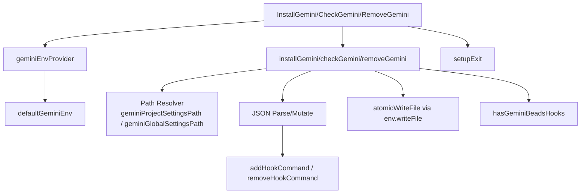

# gemini_hooks_setup

`gemini_hooks_setup` 模块的职责很聚焦：把 `bd prime` 这条命令“接线”到 Gemini CLI 的生命周期钩子里，并且保证这件事可安装、可检测、可移除、可重复执行。你可以把它理解成一个“插座适配器”：`bd` 的能力本身不在这里实现，这里只负责把 Gemini 认识的配置结构（`.gemini/settings.json`）改成能在合适时机触发 `bd prime` 的形状。如果用最朴素的方式（直接覆盖配置文件）去做，会很容易破坏用户已有配置、引入重复钩子、或在并发写入时损坏文件；这个模块的设计重点正是避免这些“配置集成层”的典型坑。

## 这个模块解决了什么问题（Problem Space）

Gemini CLI 并不知道 `beads` 的上下文初始化逻辑，它只会在固定事件点执行配置里的 hook。`bd` 需要在会话启动和压缩前这两个时机做 prime（常规或 stealth），否则上下文状态可能不完整，后续体验会退化。问题在于：Gemini 的 hook 配置不是“单字段开关”，而是嵌套 JSON 结构，且用户可能已经有自己的 hooks。模块需要在“不接管整份配置”的前提下，做到三件事：

1. 增量安装：只添加 `bd prime` 相关命令，不破坏其他配置。
2. 幂等安装：重复执行 `bd setup gemini` 不应不断追加重复项。
3. 可逆操作：移除时只删 `bd prime` / `bd prime --stealth`，保留其他 hooks。

因此它的定位不是业务逻辑层，而是一个**配置编排与结构化补丁层**。

## 心智模型（Mental Model）

把 `settings.json` 想成一栋已经有人居住的公寓，`gemini_hooks_setup` 不是重装整栋楼，而是派一个施工队只在指定房间（`hooks.SessionStart`、`hooks.PreCompress`）安装一个标准电源插座（`bd prime` 命令），并在撤场时只拆自己装的插座，不动住户原有线路。

技术上，这个心智模型对应三个抽象：

`geminiEnv` 是“运行环境适配器”，把标准输出、错误输出、路径定位、文件系统读写都注入进来，核心逻辑 (`installGemini` / `checkGemini` / `removeGemini`) 因此可以独立测试。`InstallGemini` / `CheckGemini` / `RemoveGemini` 是 CLI 入口包装层，负责把错误转换为退出码（通过 `setupExit(1)`）。而 JSON 增删逻辑复用同包里 Claude 模块的 `addHookCommand` 和 `removeHookCommand`，体现了“不同 agent 后端，共用 hook 结构操作器”的策略。

## 架构与数据流



入口函数先获取 `geminiEnv`，这一步把真实系统依赖（`os.UserHomeDir`、`os.Getwd`、`os.ReadFile`、`atomicWriteFile`）收敛到一个结构体里。随后，安装/检测/移除分别进入内部纯逻辑函数。安装路径会先确定目标文件（项目或全局），确保目录存在，再读取并反序列化已有配置，最后只修改 `hooks` 子结构并原子写回。检测路径不会修改文件，它按“全局优先、项目次之”的顺序调用 `hasGeminiBeadsHooks`。移除路径会解析已有 hooks 后执行定向删除，并写回结果。

这里最关键的数据契约是 Gemini settings 的形状：`hooks` 期望是 `map[string]interface{}`，其中事件键（如 `SessionStart`、`PreCompress`）对应数组，每个数组元素里再有 `hooks` 数组，内部命令对象包含 `command` 字段。模块通过类型断言逐层下钻，任何层级不符合预期都采取“跳过/创建默认结构”而非 panic。

## 组件深潜

### `type geminiEnv`

`geminiEnv` 是本模块可测试性的核心。它不仅携带 `homeDir` 与 `projectDir`，还把 `ensureDir/readFile/writeFile` 抽象成函数字段。这样测试可以把真实 I/O 替换为临时目录或 stub，而生产环境使用 `defaultGeminiEnv` 注入真实实现。

这个选择是典型的“轻量依赖注入”：没有引入复杂接口层级，但足够隔离外部副作用。代价是字段较多，且调用方必须保证这些函数契约一致（例如 `writeFile` 应该是覆盖写语义）。

### `defaultGeminiEnv() (geminiEnv, error)`

这个工厂函数做两件事：解析 home/workdir，并绑定默认 I/O 行为。写文件使用 `atomicWriteFile`（来自同目录 `utils.go`），不是直接 `os.WriteFile`。这是一个很重要的设计意图：避免并发或异常中断造成 settings 文件部分写入损坏。

### `geminiProjectSettingsPath` / `geminiGlobalSettingsPath`

这两个函数看似简单，但它们把路径规则“显式编码”为稳定契约：项目级写 `<project>/.gemini/settings.json`，全局写 `<home>/.gemini/settings.json`。当路径策略要演进时，这里是唯一修改点。

### `InstallGemini(project, stealth)` 与 `installGemini(...)`

外层 `InstallGemini` 是 CLI 包装层：拿 env、打印错误、失败退出。真正逻辑在 `installGemini`。

`installGemini` 的机制可以分成四步：先选路径并提示用户；再 `ensureDir` 保证目录存在；之后读取已有 JSON（文件不存在时用空 map 起步）；最后通过 `addHookCommand` 向 `SessionStart` 和 `PreCompress` 注入命令，再 `MarshalIndent` + 原子写回。

两个非显然点：第一，Gemini 使用 `PreCompress`（而不是 Claude 的 `PreCompact`），这是跨后端兼容里最容易写错的细节。第二，`stealth` 不影响结构，只影响命令字符串 (`bd prime` vs `bd prime --stealth`)，因此移除逻辑必须同时处理两种变体。

### `CheckGemini()` 与 `checkGemini(env)`

检查逻辑是“存在性验证”，不是“精确配置审计”。它只要在全局或项目任一 settings 中发现符合条件的命令，就判定已安装。顺序是先全局后项目，因此当两者都存在时会报告全局。

返回错误使用 `errGeminiHooksMissing` 这个哨兵错误，方便调用层统一退出码处理，也让测试可以稳定断言失败语义。

### `RemoveGemini(project)` 与 `removeGemini(env, project)`

移除流程遵循“尽量不惊扰用户”的策略：文件不存在时返回成功并提示 `No settings file found`；`hooks` 不存在也视为可接受状态。真正删除时调用 `removeHookCommand` 四次，覆盖两个事件 × 两个命令变体，防止历史安装模式不同导致残留。

注意这里不会删除整个 `hooks` 对象，也不会删除非 beads 的 hook，体现了最小侵入原则。

### `hasGeminiBeadsHooks(settingsPath string) bool`

这是一个容错扫描器。它直接 `os.ReadFile` 后逐层类型断言，只要在 `SessionStart` 或 `PreCompress` 下发现 `command` 为 `bd prime` 或 `bd prime --stealth` 即返回 true。解析失败、结构不匹配、文件不存在都统一返回 false。

这种“宽松解析 + 布尔结果”适合 status check 场景：调用方只关心有没有，不关心具体坏在哪。代价是诊断能力较弱（不会告诉你是哪层结构错了）。

## 依赖关系分析

从调用侧看，这个模块主要被 CLI setup 命令路径使用（暴露的入口是 `InstallGemini` / `CheckGemini` / `RemoveGemini`）。这些入口遵循 setup 子系统统一的退出模型：错误即 `setupExit(1)`（见 [exit handling](CLI Setup Commands.md)；若该文档尚未生成，可参考同目录 `exit.go`）。

从被调用侧看，核心外部依赖很少，集中在：

- `EnsureDir` 与 `atomicWriteFile`（来自 setup 工具层），分别保证目录存在和原子写。
- `addHookCommand` / `removeHookCommand`（定义在 `claude.go`），负责 hook 数组级别增删与去重。
- `encoding/json`、`os`、`filepath` 等标准库。

最值得关注的耦合是它与 `addHookCommand/removeHookCommand` 的结构契约耦合：如果 Gemini settings 的 JSON schema 发生变化，而这两个函数仍按 Claude 风格结构写入，Gemini 模块会静默产生“写入成功但 Gemini 不识别”的错误集成。这种耦合降低了实现重复，但把跨后端 schema 演进风险集中到了共享函数上。可参考 [claude_hooks_setup](claude_hooks_setup.md) 理解共享逻辑背景。

## 设计取舍与权衡

这个模块明显偏向“简单稳妥而非高度抽象”。它没有引入通用 Hook DSL，也没有把不同 Agent 的 schema 差异完全参数化，而是保留 Gemini 专用入口函数，并仅复用底层数组增删算法。这样做的好处是阅读成本低、变更影响面清晰，坏处是跨 agent 代码重复存在（例如路径解析、安装检查模板高度相似）。

在正确性与性能之间，选择了正确性：每次安装/移除都完整读写 JSON 文件，操作频率很低，因此性能不是关键；而原子写和保留现有配置能显著降低配置损坏风险。

在自治与一致性之间，选择了一致性：退出码处理、输出风格、错误路径都和 setup 其它模块对齐。这使 CLI 行为可预期，但也意味着该模块不是“纯库函数”，它默认运行在命令行交互语境中。

## 使用方式与示例

常见命令模式：

```bash
# 全局安装（默认）
bd setup gemini

# 项目级安装
bd setup gemini --project

# stealth 模式
bd setup gemini --stealth

# 检查是否安装
bd hooks gemini --check

# 移除
bd setup gemini --remove
```

安装后，`settings.json` 中会出现类似结构（示意）：

```json
{
  "hooks": {
    "SessionStart": [
      {
        "matcher": "",
        "hooks": [
          { "type": "command", "command": "bd prime" }
        ]
      }
    ],
    "PreCompress": [
      {
        "matcher": "",
        "hooks": [
          { "type": "command", "command": "bd prime" }
        ]
      }
    ]
  }
}
```

如果传入 `--stealth`，仅 `command` 字段变为 `bd prime --stealth`。

## 新贡献者需要特别注意的点（Gotchas）

第一，`hasGeminiBeadsHooks` 使用的是 `os.ReadFile`，而不是 `env.readFile`。这意味着它不像安装/移除那样易于注入 mock，测试和未来重构时要注意一致性。

第二，`addHookCommand` 和 `removeHookCommand` 内部使用 `fmt.Printf` 直接写标准输出，而不是 `env.stdout`。在多数 CLI 场景无伤大雅，但在捕获输出的测试或嵌入式调用场景，这会造成输出通道不一致。

第三，`checkGemini` 的判定是“任一位置命中即成功”，并不验证两个事件是否都存在，也不验证命令参数是否完整。这是有意的宽松策略，但如果你要做“严格审计模式”，需要新增更强约束的检查函数。

第四，安装时对现有 JSON 结构采用 `map[string]interface{}` 弱类型操作；一旦 Gemini schema 引入更复杂类型（例如对象化 matcher 规则），当前逻辑可能只能部分兼容。改动前建议先补一组覆盖真实 settings 样本的回归测试（可参考 `gemini_test.go` 模式）。

## 参考阅读

- [CLI Hook Commands](CLI Hook Commands.md)：hook 状态展示与相关命令模型。
- [hook_runtime_and_status](hook_runtime_and_status.md)：hook 运行态输出结构。
- [init_hook_bootstrap_and_detection](init_hook_bootstrap_and_detection.md)：初始化与检测相关的命令侧模型。
