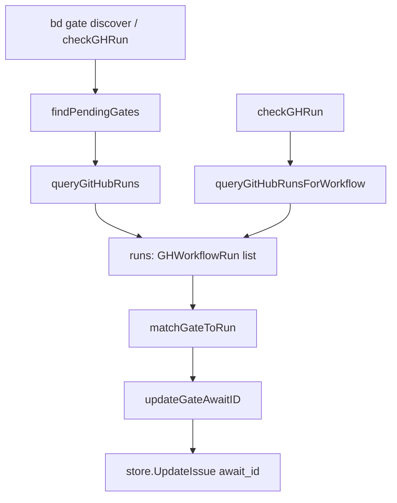

# github_run_discovery_model

`github_run_discovery_model` 这一层，解决的是一个很现实的工程断层：gate 系统要轮询 GitHub Actions 的运行状态，但很多 gate 在创建时并不知道最终的 `run ID`，只知道“应该是这个分支、这个提交、或者这个 workflow”。如果直接要求用户手工填数字 ID，流程会非常脆弱；如果完全靠猜，又容易误绑到错误 run。这个模块的价值，就是在“可用性”和“正确性”之间做一个可解释的折中：先把 GitHub 的 run 信息结构化，再用一套有权重的启发式去匹配 gate，最后把匹配结果落回 `await_id`，让后续 [gate_status_evaluation_models](gate_status_evaluation_models.md) 能稳定地做状态判定。

---

## 架构角色与心智模型

可以把它想成一个“机场行李转盘匹配员”：传送带上是最近的 GitHub workflow runs，手里待认领的票据是 `gh:run` gates。票据有时写了精确编号（numeric `await_id`），有时只写“看起来像某个 workflow 名”。这个模块做的事不是验证行李内容，而是先把“票据和行李对上号”。

它在架构里的角色是 **发现器（discovery orchestrator）+ 轻量数据模型（`GHWorkflowRun`）**：

- 它向下游调用 GitHub CLI（`gh run list`）获取候选 run 集合；
- 它向上游服务 `bd gate discover` 命令，并间接服务 `checkGHRun` 的自动发现路径；
- 它把匹配出的 `DatabaseID` 回写到 gate 的 `await_id`，让后续轮询逻辑从“模糊线索”进入“精确查询”。



上图里有两条入口路径：一条是显式命令 `runGateDiscover` 的批量发现；另一条是 [gate_status_evaluation_models](gate_status_evaluation_models.md) 中 `checkGHRun` 的按需发现（当 `AwaitID` 非数字时会调用 `discoverRunIDByWorkflowName`）。两条路径共享同一模型 `GHWorkflowRun` 和同一写回函数 `updateGateAwaitID`，这就是该模块的“连接点价值”。

---

## 数据如何流动（端到端）

在 `runGateDiscover` 路径里，数据流是四段式的。

第一段是候选 gate 收集。`findPendingGates` 通过 `store.SearchIssues` + `types.IssueFilter` 先拿到 open gate，再用 `needsDiscovery` 二次筛选，只保留 `AwaitType == "gh:run"` 且 `AwaitID` 为空或非数字的项。这里的设计意图很清晰：不要动已经绑定了 numeric run ID 的 gate，避免重复写入和错误覆盖。

第二段是候选 run 收集。`queryGitHubRuns` 调用 `gh run list --json ...`，反序列化成 `[]GHWorkflowRun`。`GHWorkflowRun` 不是随便挑字段；它精确包含了匹配打分需要的维度（`HeadBranch`、`HeadSha`、`CreatedAt`、`Status`）和输出展示需要的维度（`WorkflowName`、`Name`、`URL`）。这意味着模型本身就是算法输入契约。

第三段是匹配。`matchGateToRun` 对每个 gate 扫描 runs 并打分：workflow hint 强约束、commit/branch 匹配、与 gate 创建时间接近度、以及运行状态偏好。最终选择分数最高者，并用阈值 `>= 30` 过滤低置信度结果。这里不是“找第一个符合条件”的简化实现，而是显式地把“多个弱信号叠加”编码成稳定策略。

第四段是落库。`updateGateAwaitID` 用 `store.UpdateIssue` 将 `await_id` 更新为匹配到的 numeric run ID。到这一步，`github_run_discovery_model` 的职责结束，后续状态判断交给 `checkGHRun`（`gh run view <id>`）执行。

在 `checkGHRun` 的按需发现路径里，`discoverRunIDByWorkflowName` 会调用 `queryGitHubRunsForWorkflow(workflow, 5)`，取最新一条 run 并返回其 `DatabaseID`。这条路径偏向“快速确定一个可用 ID”，比批量发现更直接，但灵活性也更低（只看给定 workflow 的最近记录）。

---

## 组件深潜

## `type GHWorkflowRun`

`GHWorkflowRun` 是该模块唯一显式导出的核心模型，映射 `gh run list --json` 的输出。它的关键价值不在“存数据”，而在于把外部 CLI 的动态 JSON 收敛为静态结构，给匹配算法提供稳定输入面。

字段设计上有两个层次：

- 识别层：`DatabaseID`, `HeadBranch`, `HeadSha`, `CreatedAt`
- 解释层：`WorkflowName`, `Name`, `Status`, `Conclusion`, `URL`, `DisplayTitle`

识别层用于算法决策，解释层用于人类可读输出与诊断。这个分层让日志与算法都不需要再去解析原始 JSON。

## `runGateDiscover(cmd *cobra.Command, args []string)`

这是批量发现入口，组织整个流程：读 flag、找 gate、查 runs、匹配、更新。它的设计是“失败隔离”的批处理：单个 gate 更新失败不会中断全局，只在 stderr 打印错误并继续下一个。对于 CI/运维类命令，这种策略通常比 fail-fast 更实用。

同时它支持 `--dry-run`，但 dry-run 只影响最终写回，不影响前面的发现和匹配计算。这保证了预演结果与真实执行的选择逻辑一致。

## `findPendingGates()` / `needsDiscovery()` / `isNumericRunID()`

这组三个函数构成“是否需要发现”的判定前门。`needsDiscovery` 的语义是：仅当 gate 是 `gh:run`，且 `AwaitID` 为空或非数字时才进入发现流程。这里隐含了一个非常重要的契约：**非数字 `AwaitID` 被解释为 workflow hint**，而不是错误值。

`isNumericRunID` 只是 `isNumericID` 的本地别名，目的是维持 discover 语境的可读性，而不是重复实现校验。

## `queryGitHubRuns(branch string, limit int)`

这是外部数据采样器。它首先 `exec.LookPath("gh")` 做环境探测，再构造 `gh run list` 参数并 JSON 反序列化。选择 CLI 而不是 GitHub REST SDK，明显是为了复用用户当前 `gh` 认证态和减少 API 接入代码。

代价是对本地运行环境更敏感：`gh` 缺失、输出格式变化、CLI 错误文本变化都会直接影响行为。

## `matchGateToRun(gate *types.Issue, runs []GHWorkflowRun, maxAge time.Duration)`

这是模块的“决策心脏”。它不是单条件过滤器，而是打分器。

- workflow hint 匹配：+200（且不匹配则直接跳过）
- commit 匹配：+100
- branch 匹配：+50
- 时间接近：+10~30
- in_progress/queued：+5

然后以最高分胜出，并要求最低置信阈值 `30`。这个选择的含义是：允许不完美信息下的自动绑定，但拒绝“仅凭远古时间近似”之类低置信度猜测。

## `workflowNameMatches(hint, workflowName, runName string)` / `getWorkflowNameHint()`

`workflowNameMatches` 处理的是 GitHub workflow 命名现实：用户可能写 display name，也可能写文件名，可能有 `.yml/.yaml` 后缀，也可能没有。函数通过大小写不敏感比较和后缀归一化，把这几种常见变体统一起来。

这部分看似小，但它直接决定“hint 模式”能否在真实团队命名习惯里可用。

## `updateGateAwaitID(_ interface{}, gateID, runID string)`

这个函数非常薄，只做 `store.UpdateIssue(... {"await_id": runID} ...)`，却是跨模块共享点：`runGateDiscover` 和 `checkGHRun`（通过 `discoverRunIDByWorkflowName` 分支）都依赖它。薄封装的价值在于把写入字段名集中管理，减少未来字段演进时的散改风险。

---

## 依赖关系与契约

该模块的下游依赖（它调用谁）主要有三类。

第一类是领域与存储契约：`types.Issue`、`types.IssueFilter`、`store.SearchIssues`、`store.UpdateIssue`。它依赖这些契约来筛选 gate 和回写 `await_id`。相关背景可看 [issue_domain_model](issue_domain_model.md)、[query_and_projection_types](query_and_projection_types.md)、[storage_contracts](storage_contracts.md)。

第二类是仓库上下文：`beads.GetRepoContext()`、`GitCmdCWD("rev-parse", ...)`，用于获取当前 branch/commit，作为匹配信号。背景可看 [repo_context_resolution_and_git_execution](repo_context_resolution_and_git_execution.md) 和 [Beads Repository Context](Beads Repository Context.md)。

第三类是外部 CLI：`gh`。`queryGitHubRuns` 和 `queryGitHubRunsForWorkflow` 都通过 `exec.Command` 间接依赖它的输出 schema。

上游依赖（谁调用它）至少包括两条可确认链路：

- `gate discover` 命令直接调用 `runGateDiscover`；
- `checkGHRun` 在 `AwaitID` 非数字时调用 `discoverRunIDByWorkflowName`，进而使用 `GHWorkflowRun` 模型并最终调用 `updateGateAwaitID`。

这意味着它虽然位于 CLI 层，但已经成为 `gh:run` gate 生命周期中的共享基础设施，不是一个“孤立子命令”。

---

## 设计取舍与背后原因

一个关键取舍是“启发式匹配”而不是“严格唯一键绑定”。严格绑定最安全，但要求 gate 创建时就有 run ID；现实里这经常做不到，尤其在 workflow 刚触发或由异步系统创建 gate 的场景。启发式方案牺牲了一点确定性，换来自动化可用性。

第二个取舍是“本地上下文优先”。`matchGateToRun` 用当前工作目录的 branch/commit 作为强信号，适合开发者在本地仓库操作 `bd gate discover` 的主流路径。但这也意味着如果 gate 来自其他分支上下文，匹配可能偏离预期。

第三个取舍是“CLI 复用优先于 SDK 可控性”。用 `gh` CLI 的好处是少维护认证与 API 细节；坏处是文本错误处理脆弱、可测试性较差、以及运行环境要求更高。当前代码明显接受了这个权衡。

第四个取舍是“共享写回函数 + 命令层实现”。`updateGateAwaitID` 被 `gate discover` 和 `checkGHRun` 共享，减少重复；但它仍位于 `cmd` 层，而不是下沉到独立 service 层，导致该逻辑的复用边界受包结构限制。

---

## 使用方式与扩展建议

典型用法：

```bash
# 自动发现所有待绑定 gh:run gate
bd gate discover

# 预演，不写回 await_id
bd gate discover --dry-run

# 只看指定分支，限制候选 run 数量
bd gate discover --branch main --limit 10

# 调整可匹配时间窗
bd gate discover --max-age 45m
```

如果你要扩展匹配策略，最稳妥的入口是 `matchGateToRun` 的打分段，而不是在外层循环里追加早退逻辑。原因是外层早退会破坏“多信号综合决策”的可解释性；在打分层扩展，你仍能保留“谁得分最高、为什么得分”的心智一致性。

如果你要扩展 `GHWorkflowRun` 字段，请同时检查两条调用链：`queryGitHubRuns` 和 `queryGitHubRunsForWorkflow` 的 `--json` 字段列表必须同步，否则会出现“结构体有字段但源数据未填充”的静默退化。

---

## 边界条件与新贡献者注意事项

最常见的坑是把 `AwaitID` 的非数字值当错误。这里它是合法 workflow hint；只有在发现/匹配失败后才表现为“无法自动绑定”。修改相关逻辑时，不要破坏这条向后兼容语义。

另一个高风险点是时间与时区。`matchGateToRun` 使用 `time.Time` 比较 `run.CreatedAt` 与 `gate.CreatedAt`，并结合 `maxAge`。如果上游时间源精度或时区处理发生变化，匹配分数会明显波动。

`runGateDiscover` 的 `--dry-run` 语义仅覆盖写回步骤；它仍会真实调用 `gh` 并执行匹配。因此在离线或无权限环境里，dry-run 也可能失败。这是“预演业务副作用”而非“预演系统依赖”。

最后，`queryGitHubRunsForWorkflow` 当前取“最新一条 run”（`runs[0]`）作为确定结果。这种确定性很实用，但在高频触发 workflow 的仓库里，最新 run 未必属于目标 gate 的那次变更。若未来误绑案例增多，优先考虑把 commit/branch 约束引入该路径，而不是简单增大 limit。

---

## 参考阅读

- [gate_status_evaluation_models](gate_status_evaluation_models.md)（`checkGHRun`、`ghRunStatus`、`checkResult` 的判定模型）
- [gate_status_evaluation_models](gate_status_evaluation_models.md)（同模块内与本模块的共享调用关系）
- [issue_domain_model](issue_domain_model.md)
- [query_and_projection_types](query_and_projection_types.md)
- [storage_contracts](storage_contracts.md)
- [repo_context_resolution_and_git_execution](repo_context_resolution_and_git_execution.md)
- [Beads Repository Context](Beads Repository Context.md)
