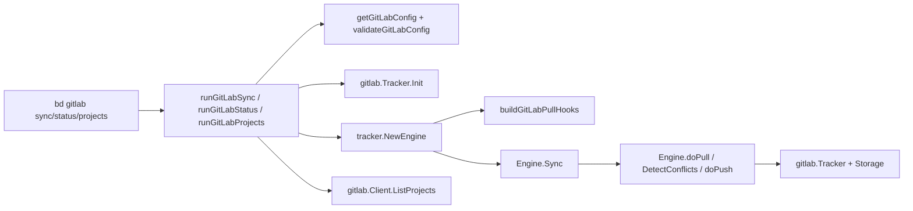

# gitlab_cli_sync_and_config

`gitlab_cli_sync_and_config`（对应 `cmd/bd/gitlab.go`）是 `bd` CLI 里 GitLab 集成的“命令编排层”。它的价值不在于实现同步算法，而在于把命令行输入（flags）、配置来源（store / `dbPath` / 环境变量）、安全约束（token 与 URL 校验）、以及 GitLab 特有行为（拉取时 ID 生成）拼装成一次可执行的同步会话。可以把它想成“总控台”：真正执行拉/推的是下游 `tracker.Engine` 和 `internal.gitlab.tracker.Tracker`，但是否允许起飞、用什么策略飞、飞完怎么报告，全部由这层决定。

## 这个模块解决了什么问题（以及为什么不能天真实现）

如果只写一个“能跑”的 GitLab 同步命令，最直观做法是：命令函数里直接读环境变量，直接调 GitLab API，然后直接写本地库。这种做法短期简单，长期会失控：一旦你要支持 `--dry-run`、双向冲突策略、只拉不推、只推不拉、配置优先级、只读仓库保护，逻辑会迅速散落到多个分支，难以测试也难以复用。

本模块的设计 insight 是：**CLI 层只负责“策略解释”和“运行时装配”，不负责“同步执行细节”**。于是它把同步算法外包给 [sync_orchestration_engine](sync_orchestration_engine.md)（`tracker.Engine`），把平台适配外包给 [tracker_adapter](tracker_adapter.md)（`gitlab.Tracker`），自身专注于把用户意图转译成稳定的 `tracker.SyncOptions` + hooks + 前置校验。

## 心智模型：一个“指挥官”驱动两套“专业部队”

理解这个模块的最好方式，是把它看成“指挥官 + 两支部队”：

第一支部队是 **同步编排引擎**（`tracker.Engine`）。它按固定三阶段执行：`pull -> conflict detection -> push`。第二支部队是 **GitLab 适配器**（`gitlab.Tracker` + `gitlab.Client`），负责把通用同步动作翻译成 GitLab API 操作。

而 `cmd/bd/gitlab.go` 就像作战指挥官：它不亲自开火，但决定这次任务是演习（`--dry-run`）还是真执行，是单向推进（`--pull-only` / `--push-only`）还是双向，冲突时听谁（`--prefer-local` / `--prefer-gitlab` / `--prefer-newer`），并在任务前检查补给（配置）和战场权限（只读保护）。

## 架构与数据流



`sync` 路径是核心热路径：`runGitLabSync` 先做配置解析和校验，再初始化 `gitlab.Tracker`，创建 `tracker.Engine`，注入 `PullHooks`，构建 `tracker.SyncOptions`，最后调用 `engine.Sync(ctx, opts)`。根据 `internal.tracker.engine.Engine.Sync` 的实现，若未显式指定 pull/push 会默认双向；双向时还会调用 `DetectConflicts`，并按冲突策略在 `resolveConflicts` 阶段决定“跳过 push”或“强制 push”。

`status` 路径是纯本地可观测：读取配置、脱敏输出 token、做静态校验，不触发远端网络请求。`projects` 路径是轻量 API 探针：验证配置后调用 `client.ListProjects(ctx)`，帮助用户确认 token 权限和 project 可见性。

## 组件深潜

### `GitLabConfig`

`GitLabConfig` 是一个非常克制的配置载体，只包含 `URL`、`Token`、`ProjectID`。这种极简结构的好处是边界清晰：CLI 层只关心“连接 GitLab 所需最低配置”，更复杂映射和字段规则不在这里承担，避免命令入口膨胀。

### `getGitLabConfig()` 与 `getGitLabConfigValue(ctx, key)`

这组函数定义了配置解析优先级：

1. 若全局 `store` 已可用，优先 `store.GetConfig`；
2. 若 `store == nil` 但 `dbPath` 有值，临时 `dolt.New(...).GetConfig`；
3. 都拿不到时，再回退到环境变量（通过 `gitlabConfigToEnvVar` 映射）。

这个设计解决了 CLI 常见的“运行上下文不稳定”问题：有时命令在已打开 store 的会话中运行，有时只知道路径。它牺牲了一点实现简洁性（多一个临时 store 分支），换来更一致的用户体验。

### `gitlabConfigToEnvVar(key string)`

这是配置键到环境变量名的显式映射，仅支持 `gitlab.url`、`gitlab.token`、`gitlab.project_id`。显式映射而非动态拼接，虽然冗长，但减少拼写偏差和隐式约定带来的排障成本。

### `validateGitLabConfig(config GitLabConfig) error`

该函数不做网络连通性验证，而做三类静态保障：

- 必填项存在：URL、Token、ProjectID；
- 错误信息可操作：直接告诉用户 `bd config` 或环境变量写法；
- URL 安全策略：拒绝一般 `http://`，只允许 `http://localhost` 与 `http://127.0.0.1` 的本地开发例外。

这里的“why”很清晰：token 是高价值凭据，默认强制 HTTPS 能显著降低明文传输风险。

### `maskGitLabToken(token string) string`

用于 `status` 命令安全展示，只保留前 4 位，其余掩码。它刻意在“可识别”和“不泄漏”之间取中点：让用户能确认自己用的是哪把 token，但不把完整秘密暴露在终端历史里。

### `getConflictStrategy(preferLocal, preferGitLab, preferNewer bool)`

冲突策略由三个 flag 互斥表达。函数先计数有几个策略 flag 被设置，超过一个直接报错；否则返回三选一，默认 `prefer-newer`。这种实现比“后写覆盖前写”更严格，能阻断歧义输入。

在 `runGitLabSync` 中，该策略会映射到 `tracker.SyncOptions.ConflictResolution`：

- `ConflictStrategyPreferLocal` -> `tracker.ConflictLocal`
- `ConflictStrategyPreferGitLab` -> `tracker.ConflictExternal`
- 默认 -> `tracker.ConflictTimestamp`

### `generateIssueID(prefix string)`

这是 GitLab pull 场景的本地 ID 生成器，格式是：`<prefix>-<timestamp_ms>-<atomic_counter>-<random_hex>`。组合设计有三个层次：

- 时间戳保证大体有序；
- `atomic` 计数防止同毫秒高并发碰撞；
- 随机字节降低进程重启后碰撞概率。

它不是全局强一致 ID 系统，但对于 CLI 导入场景是务实且足够稳健的方案。

### `buildGitLabPullHooks(ctx context.Context) *tracker.PullHooks`

该函数为 `Engine` 注入 GitLab 特有 pull 行为。目前只设置 `GenerateID`：如果导入 issue 没有本地 `issue.ID`，就按 `issue_prefix`（默认 `bd`）生成一个。

关键点在于：它只影响 **pull 导入**，不改 push 行为。这体现了模块的边界控制——GitLab 特化最小化注入，尽量复用通用引擎默认逻辑。

### `getGitLabClient(config GitLabConfig) *gitlab.Client`

简单工厂函数，统一通过 `gitlab.NewClient(config.Token, config.URL, config.ProjectID)` 创建客户端，避免 `runGitLabProjects` 之类的命令重复拼装连接参数。

### `runGitLabStatus(cmd, args)`

`status` 命令强调“读多写零”：它打印当前配置（token 脱敏），调用 `validateGitLabConfig` 给出配置健康结论。一个很重要的行为是：即使配置非法，它也返回 `nil`（即命令流程成功结束），因为其职责是“诊断输出”而不是“执行同步”。

### `runGitLabProjects(cmd, args)`

`projects` 命令是权限与项目发现工具：先校验配置，再调用 `client.ListProjects(ctx)` 列出 `ID/Name/Path/WebURL`。它的设计价值是把“先知道 project_id 才能配置 project_id”的闭环打通，尤其在自建 GitLab 或多组权限场景下很实用。

### `runGitLabSync(cmd, args)`

这是主入口，职责是把 CLI 意图转换为同步计划。

它的执行顺序很有代表性：先校验配置，再做写操作保护（非 dry-run 时 `CheckReadonly("gitlab sync")`），再做参数互斥检查（`--pull-only` 与 `--push-only`，以及冲突策略 flags），接着 `ensureStoreActive()` 保证数据库可用，然后初始化 `gitlab.Tracker`。

之后它创建 `tracker.NewEngine(gt, store, actor)`，设置消息回调（`OnMessage` 输出到命令 stdout，`OnWarning` 输出到 stderr），注入 `engine.PullHooks = buildGitLabPullHooks(ctx)`，构建 `tracker.SyncOptions`，最后调用 `engine.Sync(ctx, opts)`。

这里最关键的非显然点是：**该模块并不自己处理冲突，也不直接调 GitLab API 拉推 issue**。冲突检测与解决在 `Engine.Sync` 的标准流程中完成（`DetectConflicts` + `resolveConflicts`）；GitLab API 调用由 `gitlab.Tracker.FetchIssues/CreateIssue/UpdateIssue` 执行。这让 CLI 层保持薄、同步策略保持一致。

### `parseGitLabSourceSystem(sourceSystem string)`

该工具函数解析形如 `gitlab:<projectID>:<iid>` 的字符串，返回 `(projectID, iid, ok)`。在给定源码片段中没有看到它在本文件被直接调用，因此它更像是为同包其他逻辑或后续扩展准备的解析原语。可确定的是，它对格式和数值都做了严格校验，不会静默吞错。

## 依赖分析：它调用谁、谁调用它、中间契约是什么

从调用方向看，本模块是 CLI 边界层，被 Cobra 路由调用：`init()` 中 `rootCmd.AddCommand(gitlabCmd)`，并挂载 `sync/status/projects` 子命令。

向下依赖主要分三层。第一层是存储与运行时：`store.GetConfig`、`ensureStoreActive`、`CheckReadonly`，以及无活动 store 时的 `dolt.New` 临时打开。第二层是 tracker 框架：`tracker.NewEngine`、`tracker.SyncOptions`、`tracker.PullHooks`。第三层是 GitLab 适配：`gitlab.Tracker.Init`、`gitlab.NewClient`、`client.ListProjects`。

数据契约上，`runGitLabSync` 输出的是 `tracker.SyncOptions`，输入的是 CLI flags；`Engine.Sync` 输出的是 `tracker.SyncResult`（含 `SyncStats`）；`PullHooks.GenerateID` 通过修改 `*types.Issue` 产生副作用；`validateGitLabConfig` 用 `error` 表达可执行性。任何上游若改变这些契约（例如 `SyncOptions` 字段重命名或 `Tracker.Init` 行为变化），该模块会第一时间受影响。

另外，结合 `internal.tracker.engine.Engine` 的实现可见一个关键链路：`Engine.Sync` 成功后会写回 `<configPrefix>.last_sync`（即 `gitlab.last_sync`）。虽然本文件不直接写这个配置，但它通过 `ConfigPrefix()` 间接依赖了这条框架约定。

## 设计决策与权衡

这个模块最明显的选择是“薄编排、重复用”。它放弃了在命令层做高度定制（例如自己实现 push 去重、冲突合并），转而最大化复用 `tracker.Engine`。代价是阅读时必须跨模块理解流程，但收益是跨 tracker 行为一致、维护成本更低。

第二个权衡是配置解析的鲁棒性优先于简洁性。`getGitLabConfigValue` 的三层读取（store / 临时 dolt / env）实现略繁琐，却显著减少“在不同启动方式下配置行为不同”的问题。

第三个权衡是安全默认值优先。`validateGitLabConfig` 对非本地 HTTP 直接拒绝，可能增加某些测试环境配置成本，但能默认避免 token 明文传输风险。

第四个权衡是 ID 生成策略偏“工程实用主义”。`generateIssueID` 不是严格分布式唯一方案，但在 CLI pull 导入场景足够低碰撞且实现简单，符合成本收益比。

## 使用与配置示例

```bash
# 1) 配置 GitLab 连接
bd config gitlab.url https://gitlab.com
bd config gitlab.token <your_token>
bd config gitlab.project_id <group%2Fproject 或 numeric id>

# 2) 查看配置健康
bd gitlab status

# 3) 列出可访问项目（验证权限/发现 project）
bd gitlab projects

# 4) 同步
bd gitlab sync                 # 双向
bd gitlab sync --pull-only     # 仅拉取
bd gitlab sync --push-only     # 仅推送
bd gitlab sync --dry-run       # 预演

# 5) 冲突策略
bd gitlab sync --prefer-local
bd gitlab sync --prefer-gitlab
bd gitlab sync --prefer-newer
```

环境变量兜底：

```bash
export GITLAB_URL=https://gitlab.com
export GITLAB_TOKEN=...
export GITLAB_PROJECT_ID=group%2Fproject
```

## 新贡献者最该注意的边界与坑

第一个坑是 flag 互斥。`--pull-only` 与 `--push-only` 不能同时给；冲突策略三旗标也必须至多一个。不要在调用链下游“容错吞掉”这类输入错误，否则会把歧义带入同步逻辑。

第二个坑是 `status` 的返回语义。`runGitLabStatus` 在配置不合法时打印 `❌` 但返回 `nil`。这是有意设计（诊断命令不应以退出码中断流水线），改动时要评估 CI/脚本兼容性。

第三个坑是配置来源优先级。若 `store` 中已有非空配置，环境变量不会覆盖。排障“环境变量不生效”时，先检查 `store.GetConfig` 路径。

第四个坑是临时 store 打开失败会静默降级到环境变量分支（`getGitLabConfigValue` 忽略 `dolt.New` 错误）。这有助于容错，但也可能掩盖 `dbPath` 配置错误，需要在调试时主动检查路径有效性。

第五个坑是 push hook 未在本模块设置。当前只注入了 `PullHooks.GenerateID`；push 的过滤、内容比较等行为走 `Engine` 默认路径。如果你要做 GitLab 特定 push 策略，请评估是否应新增 `engine.PushHooks`，并确保与通用引擎契约一致。

第六个坑是 `parseGitLabSourceSystem` 的使用范围。它解析的是 `gitlab:<projectID>:<iid>`，而 `gitlab.Tracker.BuildExternalRef` 可能返回 URL 或 `gitlab:<identifier>`。两种格式并不等价，扩展时要明确场景，避免把 parser 用在错误数据源上。

## 相关模块参考

- [sync_orchestration_engine](sync_orchestration_engine.md)
- [tracker_plugin_contracts](tracker_plugin_contracts.md)
- [tracker_adapter](tracker_adapter.md)
- [client_and_api_types](client_and_api_types.md)
- [Storage Interfaces](Storage Interfaces.md)
- [routing_lookup_primitives](routing_lookup_primitives.md)
