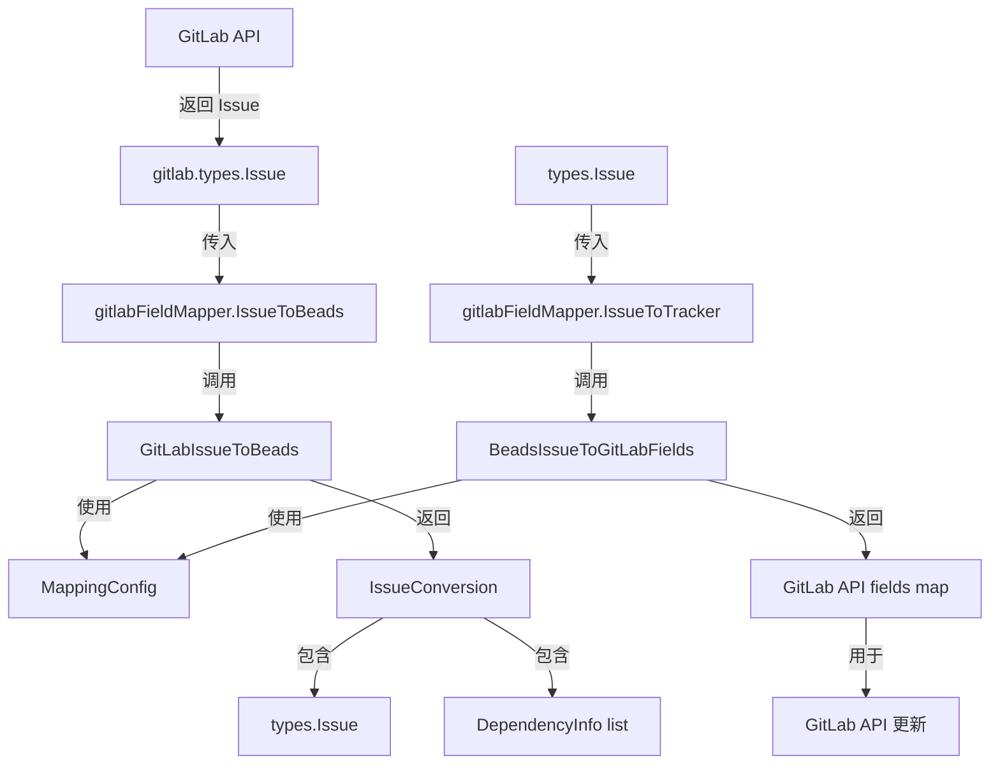

# GitLab 字段映射器 (gitlab_fieldmapper) 深度技术解析

## 1. 模块概述

### 问题背景
当你需要在一个独立的项目管理系统（beads）和 GitLab 之间同步问题（issues）时，你会发现它们的字段模型完全不同。GitLab 使用标签（labels）来表示优先级和类型，而 beads 有专门的数字优先级字段和枚举类型字段。GitLab 的状态只有 "opened"、"closed" 等简单状态，而 beads 有更丰富的状态如 "in_progress"、"blocked"、"deferred"。

这就是 `gitlab_fieldmapper` 模块要解决的问题：它是一个**双向适配器**，负责在 GitLab 的数据模型和 beads 的内部数据模型之间进行无缝转换。

### 设计理念
这个模块的核心设计思想是**配置驱动的转换层**。它不是硬编码转换规则，而是通过 `MappingConfig` 来定义映射关系，使得转换逻辑既灵活又可维护。同时，它实现了标准化的 `tracker.FieldMapper` 接口，确保与其他 tracker 集成（如 Jira、Linear）保持一致的架构。

---

## 2. 架构与数据流向

### 核心组件关系图



### 数据流向详解

#### 从 GitLab 到 beads 的转换流程（Pull 方向）
1. **数据输入**：`gitlabFieldMapper` 接收 `tracker.TrackerIssue`，其中 `Raw` 字段是 `*gitlab.Issue`
2. **转换调度**：`IssueToBeads` 方法调用 `GitLabIssueToBeads` 函数进行核心转换
3. **字段提取**：
   - 从 GitLab 标签中解析优先级（`priority::high` → 1）
   - 从标签和状态中确定 beads 状态
   - 从标签中提取问题类型
4. **依赖处理**：将 GitLab 的 `DependencyInfo` 转换为 `tracker.DependencyInfo`
5. **结果输出**：返回 `tracker.IssueConversion`，包含转换后的 `types.Issue` 和依赖信息

#### 从 beads 到 GitLab 的转换流程（Push 方向）
1. **数据输入**：接收 `*types.Issue`
2. **转换调度**：`IssueToTracker` 方法调用 `BeadsIssueToGitLabFields` 函数
3. **字段构建**：
   - 将 beads 数字优先级转换为 GitLab 标签（1 → `priority::high`）
   - 将 beads 状态转换为 GitLab 状态和标签
   - 构建包含类型、优先级、状态的完整标签列表
4. **结果输出**：返回 `map[string]interface{}`，可直接用于 GitLab API 更新

---

## 3. 核心组件深度解析

### gitlabFieldMapper 结构体
**位置**：`internal/gitlab/fieldmapper.go`

这是模块的核心结构体，它非常简洁——只包含一个 `*MappingConfig` 字段。这种设计体现了**组合优于继承**的原则，所有转换逻辑都通过配置来驱动，而不是硬编码在结构体方法中。

```go
type gitlabFieldMapper struct {
    config *MappingConfig
}
```

### MappingConfig 配置结构
**位置**：`internal/gitlab/mapping.go`

这个结构体定义了转换的规则集，是整个模块的"大脑"：

```go
type MappingConfig struct {
    PriorityMap  map[string]int    // 优先级标签值 → beads 优先级 (0-4)
    StateMap     map[string]string // GitLab 状态 → beads 状态
    LabelTypeMap map[string]string // 类型标签值 → beads 问题类型
    RelationMap  map[string]string // GitLab 链接类型 → beads 依赖类型
}
```

**设计亮点**：
- **可配置性**：用户可以自定义标签映射，而不必修改代码
- **默认值支持**：`DefaultMappingConfig()` 提供了合理的默认映射
- **防御性复制**：默认配置创建时会复制映射，避免外部修改

### 核心转换方法

#### PriorityToBeads / PriorityToTracker
这对方法处理优先级的双向转换。GitLab 使用标签（如 `priority::high`），而 beads 使用数字（0-4）。

**设计决策**：当找不到匹配的映射时，`PriorityToBeads` 默认返回 2（medium），`PriorityToTracker` 默认返回 "medium"。这是一个**安全默认**策略，确保转换不会失败，而是使用一个中性值。

#### StatusToBeads / StatusToTracker
状态转换更复杂，因为 GitLab 的状态模型更简单。

**关键逻辑**：
- GitLab 的 "closed" 状态优先于任何状态标签
- 对于 "in_progress"、"blocked"、"deferred" 等 beads 独有的状态，使用 GitLab 标签来表示
- 转换回 GitLab 时，只有 "closed" 状态会改变 GitLab 的 issue 状态，其他状态通过标签表示

#### TypeToBeads / TypeToTracker
类型转换支持两种标签格式：
- 带前缀的标签：`type::bug`
- 裸标签：`bug`

**设计亮点**：`typeFromLabels` 函数会先检查带前缀的标签，然后再检查裸标签，提供了灵活性。

#### IssueToBeads / IssueToTracker
这是两个**全量转换**方法，负责整个 issue 的双向转换。

**IssueToBeads 的关键步骤**：
1. 类型断言：确保 `ti.Raw` 是 `*gitlab.Issue`
2. 调用 `GitLabIssueToBeads` 进行核心转换
3. 转换依赖信息：将 GitLab 的 IID（项目内部 ID）转换为字符串格式的外部 ID

**IssueToTracker 的关键步骤**：
1. 调用 `BeadsIssueToGitLabFields` 构建 GitLab API 字段
2. 返回的 map 可以直接传递给 GitLab API

---

## 4. 关键设计决策与权衡

### 4.1 标签作为扩展字段
**决策**：使用 GitLab 的标签系统来表示 beads 的高级字段（优先级、类型、中间状态）

**原因**：
- GitLab 的原生字段有限，无法直接映射 beads 的丰富模型
- 标签是 GitLab 的强大功能，支持筛选和搜索
- 这种方式对 GitLab 用户透明，不破坏他们的现有工作流

**权衡**：
- ✅ 优点：不需要 GitLab Premium 功能，兼容性好
- ❌ 缺点：标签可能会变得很杂乱，需要约定命名空间（如 `priority::`、`type::`）

### 4.2 配置驱动 vs 硬编码
**决策**：使用 `MappingConfig` 来定义转换规则，而不是硬编码

**原因**：
- 不同的团队可能使用不同的标签约定
- 便于测试：可以在测试中使用不同的配置
- 符合开闭原则：对扩展开放，对修改关闭

**权衡**：
- ✅ 优点：灵活性高，可定制性强
- ❌ 缺点：增加了配置的复杂性，需要用户理解映射关系

### 4.3 安全默认策略
**决策**：当转换失败或找不到映射时，返回合理的默认值，而不是错误

**例子**：
- 未知优先级 → 2 (medium)
- 未知状态 → "open"
- 未知类型 → "task"

**原因**：
- 同步过程不应该因为一个字段的映射问题而完全失败
- 这是一个**最终一致性**系统，用户可以后续手动修正
- 减少了同步过程中的中断点

**权衡**：
- ✅ 优点：系统鲁棒性强，同步更可靠
- ❌ 缺点：可能会默默地 "丢失" 一些信息，需要用户注意

### 4.4 时间估算与权重的转换
**决策**：将 GitLab 的 weight（整数）与 beads 的 estimated_minutes（分钟）进行转换，假设 1 weight = 60 分钟

**原因**：
- GitLab 的 weight 是一个抽象概念，没有固定的时间单位
- 假设 1 weight = 1 小时是一个常见的行业约定
- 这是一个合理的默认值，用户可以通过不设置 weight 来避免转换

**权衡**：
- ✅ 优点：提供了有用的默认转换，满足大多数场景
- ❌ 缺点：对于使用不同 weight 含义的团队来说，这个转换可能不准确

---

## 5. 依赖关系与接口契约

### 模块依赖关系

`gitlab_fieldmapper` 模块处于 GitLab 集成的中间层，它依赖于以下模块：

1. **[tracker](tracker_integration_framework.md)** 模块：定义了 `FieldMapper` 接口和相关类型
2. **[types](core_domain_types.md)** 模块：提供了 beads 的核心数据类型
3. **[gitlab.types](gitlab_integration.md)** 模块：定义了 GitLab 的数据类型
4. **[gitlab.mapping](gitlab_integration.md)** 模块：提供了 `MappingConfig` 和转换函数

### 被依赖情况

这个模块被 **[gitlab.tracker](gitlab_integration.md)** 模块使用，在 GitLab 同步过程中进行字段转换。

### 接口契约

`gitlabFieldMapper` 严格实现了 `tracker.FieldMapper` 接口：

```go
type FieldMapper interface {
    PriorityToBeads(trackerPriority interface{}) int
    PriorityToTracker(beadsPriority int) interface{}
    StatusToBeads(trackerState interface{}) types.Status
    StatusToTracker(beadsStatus types.Status) interface{}
    TypeToBeads(trackerType interface{}) types.IssueType
    TypeToTracker(beadsType types.IssueType) interface{}
    IssueToBeads(trackerIssue *TrackerIssue) *IssueConversion
    IssueToTracker(issue *types.Issue) map[string]interface{}
}
```

**重要契约**：
- 所有方法都应该是**幂等**的：多次调用应该返回相同的结果
- `IssueToBeads` 如果类型断言失败，应该返回 `nil`
- `IssueToTracker` 返回的 map 应该只包含 GitLab API 接受的字段

---

## 6. 使用与扩展

### 基本使用

创建一个默认配置的字段映射器：

```go
import (
    "github.com/steveyegge/beads/internal/gitlab"
)

// 创建默认配置的映射器
config := gitlab.DefaultMappingConfig()
mapper := &gitlab.gitlabFieldMapper{config: config}
```

### 自定义配置

你可以创建自定义的映射配置：

```go
customConfig := &gitlab.MappingConfig{
    PriorityMap: map[string]int{
        "urgent": 0,
        "high":   1,
        "normal": 2,
        "low":    3,
    },
    StateMap: map[string]string{
        "opened": "open",
        "closed": "closed",
    },
    LabelTypeMap: map[string]string{
        "bug":      "bug",
        "feature":  "feature",
        "story":    "story",
    },
    RelationMap: map[string]string{
        "blocks":        "blocks",
        "is_blocked_by": "blocked_by",
    },
}
```

### 扩展点

如果你需要扩展这个模块，有几个天然的扩展点：

1. **自定义转换函数**：你可以创建自己的转换函数，然后在 `gitlabFieldMapper` 中调用它们
2. **包装器模式**：创建一个包装 `gitlabFieldMapper` 的结构体，添加额外的转换逻辑
3. **中间件**：在转换前后添加自定义逻辑（如日志记录、验证等）

---

## 7. 注意事项与常见陷阱

### 7.1 标签命名空间约定
**陷阱**：GitLab 标签没有内置的命名空间概念，所以我们依赖 `::` 作为分隔符。如果用户已经在使用包含 `::` 的标签，可能会冲突。

**缓解**：文档清楚地说明了标签约定，并且在 `filterNonScopedLabels` 中会过滤掉这些特殊标签。

### 7.2 状态转换的优先级
**陷阱**：GitLab 的 "closed" 状态优先于任何状态标签。如果你有一个已关闭的 issue，即使它有 `status::in_progress` 标签，也会被转换为 "closed" 状态。

**原因**：这是一个故意的设计决策，因为在 GitLab 中，closed 状态是一个强信号。

### 7.3 依赖转换的 IID 使用
**陷阱**：依赖转换使用 GitLab 的 IID（项目内部 ID），而不是全局 ID。这是因为 IID 是用户在 GitLab 界面中看到的 ID，更直观。

**注意**：如果你在多个项目之间同步，需要确保 IID 的上下文正确。

### 7.4 空指针处理
**陷阱**：`GitLabIssueToBeads` 函数假设 `gl.WebURL` 是存在的，但在某些 API 响应中可能没有这个字段。

**缓解**：在实际使用中，应该确保从 GitLab API 获取的数据包含所有必要的字段。

### 7.5 时间估算的舍入
**陷阱**：当从 beads 转换回 GitLab 时，estimated_minutes 会被除以 60 并截断（整数除法）。这意味着 90 分钟会变成 1 weight，而不是 1.5。

**原因**：GitLab 的 weight 只支持整数。

---

## 8. 总结

`gitlab_fieldmapper` 模块是一个精心设计的适配器，它解决了 GitLab 和 beads 之间数据模型不匹配的问题。它的核心优势在于：

1. **配置驱动**：灵活的映射配置，适应不同的团队约定
2. **安全默认**：合理的默认值，确保同步过程的鲁棒性
3. **标签利用**：巧妙地使用 GitLab 标签来扩展其数据模型
4. **接口一致**：实现了标准的 `FieldMapper` 接口，与其他 tracker 集成保持一致

这个模块体现了**适配器模式**和**配置优于约定**的设计思想，是整个 GitLab 集成中不可或缺的一部分。

---

## 参考链接

- [GitLab Integration](gitlab_integration.md) - 了解整个 GitLab 集成模块
- [Tracker Integration Framework](tracker_integration_framework.md) - 了解 tracker 集成框架
- [Core Domain Types](core_domain_types.md) - 了解 beads 的核心数据类型
