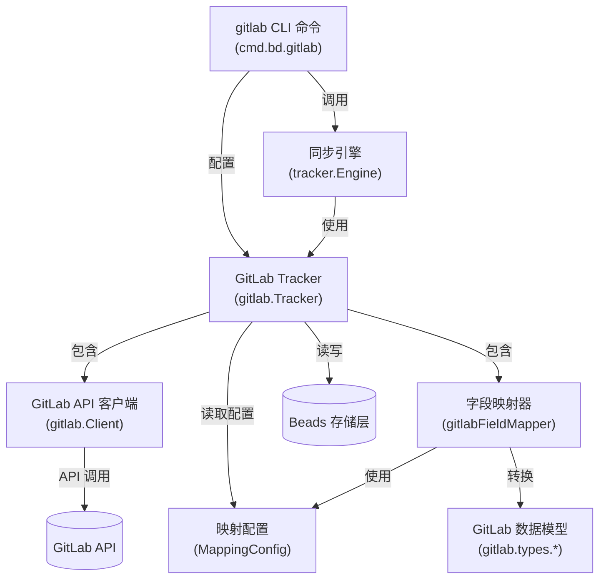

# GitLab Integration 模块技术深度解析

## 1. 概述

### 模块解决的问题

`gitlab_integration` 模块解决了 beads 系统与 GitLab 之间的双向同步问题。在一个完整的项目管理流程中，团队可能同时使用 beads 进行项目建模和任务编排，同时使用 GitLab 进行代码协作和 issue 跟踪。这导致了两套数据系统的割裂——同样的任务信息需要在两个地方维护，容易产生不一致性、重复劳动和信息偏差。

简单的单向同步或定期导入无法满足团队的协作需求。我们需要一个能处理：
- **双向同步**（beads → GitLab 和 GitLab → beads）
- **冲突解决**（同一 issue 在两边都有修改时如何处理）
- **字段映射**（不同系统的字段体系不一致）
- **增量同步**（只同步有变化的内容）
- **依赖关系同步**（维护 issue 之间的关联关系）

的完整解决方案。这就是 `gitlab_integration` 模块的设计目标。

### 核心心理模型

理解这个模块的最佳方式是把它想象成**两国之间的翻译官和外交官**：

- **翻译官**（FieldMapper）：负责将一种语言（GitLab 的数据模型）翻译成另一种语言（beads 的数据模型），处理状态、优先级、类型等概念的转换。
- **外交官**（Tracker）：负责与对方系统建立外交关系（认证连接），进行正式会谈（API 调用），并在遇到争端时执行冲突解决协议。
- **大使馆**（Client）：在对方国家设立的常驻机构，负责实际的通信和文件传递。

而 [tracker engine](tracker_integration_framework.md) 则像**外交部**——提供通用的协议框架和协调机制，让不同的 "外交官"（GitLab、Linear、Jira 等）都能在统一的体系下工作。

---

## 2. 架构设计

### 组件关系图



### 数据流与组件角色

#### 核心组件职责

1. **`gitlab.Tracker`**（外交官）
   - 实现了 `IssueTracker` 接口，是整个 GitLab 集成的核心协调者
   - 持有 `Client`、`FieldMapper`、`MappingConfig` 和存储连接
   - 负责 issue 的获取、创建、更新等核心操作

2. **`gitlabFieldMapper`**（翻译官）
   - 负责 GitLab 数据模型与 beads 数据模型之间的双向转换
   - 使用 `MappingConfig` 来处理状态、标签、优先级等的语义映射

3. **`gitlab.Client`**（大使馆）
   - 封装了对 GitLab REST API 的所有调用
   - 处理认证、请求构建、响应解析等底层通信细节

4. **`MappingConfig`**（翻译词典）
   - 定义了 GitLab 概念到 beads 概念的映射规则
   - 包含状态映射、优先级映射、标签类型映射、关系类型映射等

5. **`cmd.bd.gitlab`**（CLI 入口）
   - 提供用户友好的命令行接口
   - 处理配置加载、参数验证、结果输出等 UI 层逻辑
   - 将用户请求委托给 [tracker engine](tracker_integration_framework.md) 执行

---

## 3. 核心组件深度分析

### 3.1 `gitlab.Tracker` - 核心协调者

**设计意图**：`Tracker` 是 GitLab 集成的门面（Facade），它将复杂的同步逻辑封装在简洁的 `IssueTracker` 接口背后，使其能与通用的同步引擎协同工作。

**核心实现**：
```go
type Tracker struct {
    client *Client        // GitLab API 客户端
    config *MappingConfig // 字段映射配置
    store  storage.Storage // beads 存储层
}
```

**关键方法**：
- `Init()`: 从 beads 配置存储中加载映射配置，初始化客户端
- `FetchIssues()`: 批量从 GitLab 获取 issues，并转换为通用格式
- `CreateIssue()`: 将 beads 的 issue 推送到 GitLab 创建
- `UpdateIssue()`: 更新 GitLab 上已存在的 issue
- `FieldMapper()`: 返回字段映射器供引擎使用

**设计洞察**：`Tracker` 本身不包含复杂的同步逻辑——它只负责与 GitLab 的通信和数据转换。真正的同步编排（如冲突检测、双向合并、状态管理）都在上层的 [tracker engine](tracker_integration_framework.md) 中处理。这种关注点分离使得集成新的 tracker 变得简单，只需实现 `IssueTracker` 接口即可。

### 3.2 `gitlabFieldMapper` - 语义翻译官

**设计意图**：不同的 issue tracker 对相同概念有不同的表示方式。GitLab 的 "closed" 状态可能对应 beads 的 "done" 状态；GitLab 的 "priority::high" 标签可能对应 beads 的优先级 3。`gitlabFieldMapper` 的职责就是处理这种**语义不匹配**。

**核心转换**：
- **状态映射**：GitLab 的 "opened"/"closed" → beads 的 "open"/"done" 等
- **优先级映射**：GitLab 标签（如 "priority::high"）→ beads 的数值优先级（0-4）
- **类型映射**：GitLab 标签（如 "type::bug"）→ beads 的 issue 类型
- **依赖关系映射**：GitLab 的 "relates to"/"blocks" → beads 的依赖类型

**设计洞察**：字段映射不是简单的一一对应——它需要处理**信息不对称**。例如，beads 有明确的优先级字段，但 GitLab 是通过标签来表示的。这就需要 `FieldMapper` 在读取时从标签中提取优先级，在写入时将优先级转换回标签。

### 3.3 `gitlab.Client` - API 通信层

**设计意图**：封装 GitLab REST API 的复杂性，提供类型安全的 Go 接口。处理认证、分页、错误处理、速率限制等底层细节。

**核心能力**：
- 认证：通过 Personal Access Token 进行 OAuth2 认证
- 分页：自动处理 GitLab API 的分页响应
- 错误处理：将 GitLab 的错误响应转换为有意义的 Go 错误
- 资源操作：Issues、Labels、Milestones、Issue Links 等的 CRUD

**安全设计**：
```go
// 强制 HTTPS（除本地开发外）
if strings.HasPrefix(config.URL, "http://") &&
    !strings.HasPrefix(config.URL, "http://localhost") &&
    !strings.HasPrefix(config.URL, "http://127.0.0.1") {
    return fmt.Errorf("gitlab.url must use HTTPS")
}
```

### 3.4 CLI 层 - 用户接口

**设计意图**：提供直观的命令行接口，让用户能轻松配置和触发同步。

**核心命令**：
- `gitlab sync`: 执行双向同步
- `gitlab status`: 显示配置和连接状态
- `gitlab projects`: 列出可访问的 GitLab 项目

**配置策略**（优先级从高到低）：
1. 命令行标志（仅部分选项）
2. beads 配置存储（`bd config gitlab.*`）
3. 环境变量（`GITLAB_*`）

---

## 4. 同步流程深度解析

### 4.1 完整同步数据流

让我们跟踪一次 `bd gitlab sync` 命令的执行流程：

```
1. CLI 层启动
   ↓
2. 加载配置 (getGitLabConfig)
   - 从存储或环境变量读取 URL、Token、ProjectID
   ↓
3. 验证配置 (validateGitLabConfig)
   - 检查必要字段
   - 强制 HTTPS（除本地外）
   ↓
4. 初始化 Tracker
   - 创建 gitlab.Tracker 实例
   - 调用 Tracker.Init() 加载映射配置
   ↓
5. 创建同步引擎 (tracker.NewEngine)
   - 配置 PullHooks（用于生成 beads issue ID）
   - 设置消息和警告回调
   ↓
6. 执行同步 (engine.Sync)
   ↓
   ├─→ 6a. Pull（如果启用）
   │   ├─ 从 GitLab FetchIssues
   │   ├─ 通过 FieldMapper 转换为 beads Issue
   │   ├─ 调用 PullHooks.GenerateID 生成本地 ID
   │   └─ 存储到本地
   │
   └─→ 6b. Push（如果启用）
       ├─ 检测本地变更
       ├─ 通过 FieldMapper 转换为 GitLab 格式
       ├─ 调用 Tracker.Create/UpdateIssue
       └─ 更新本地 external_ref
   ↓
7. 冲突解决（如需要）
   - 根据策略（prefer-newer/prefer-local/prefer-gitlab）解决
   ↓
8. 输出结果
   - 显示 Pulled/Pushed/Conflicts 统计
```

### 4.2 冲突解决策略

模块提供了三种冲突解决策略：

| 策略 | 行为 | 适用场景 |
|------|------|----------|
| `prefer-newer` | 选择最近更新的版本（默认） | 大多数协作场景 |
| `prefer-local` | 始终保留 beads 版本 | beads 作为单一数据源时 |
| `prefer-gitlab` | 始终使用 GitLab 版本 | GitLab 作为单一数据源时 |

**设计洞察**：默认选择 `prefer-newer` 是基于一个合理的假设——在大多数情况下，最近的修改反映了最新的意图。但这种策略并非完美：如果一方进行了无意义的编辑（如修正错别字），而另一方进行了重要的状态变更，"最新"不一定是"最好"的。这就是为什么模块提供了其他选项。

### 4.3 ID 生成机制

当从 GitLab 拉取新 issue 时，需要为其生成一个 beads ID。`generateIssueID` 函数采用了多重保证机制：

```go
// {prefix}-{timestamp}-{counter}-{random}
// 例如: bd-1734567890-1-a1b2c3d4
```

- **前缀**：可配置，默认为 "bd"
- **时间戳**：毫秒级，保证时序性
- **计数器**：原子递增，防止同一毫秒内的冲突
- **随机字节**：防止进程重启后的计数器重置冲突

**设计洞察**：为什么不直接使用 GitLab 的 ID？因为 beads 需要在与 GitLab 断开连接时也能独立工作（例如离线创建 issues）。使用自主生成的 ID 保证了系统的自主性，同时通过 `external_ref` 字段维护与 GitLab 的关联。

---

## 5. 设计决策与权衡

### 5.1 关注点分离：Tracker vs Engine

**决策**：将 GitLab 特定的逻辑放在 `Tracker` 中，而通用的同步逻辑放在 `tracker.Engine` 中。

**权衡**：
- ✅ **优点**：
  - 新增 tracker（如 Linear、Jira）时无需重写同步逻辑
  - 同步算法的改进能惠及所有 tracker
  - 清晰的接口契约使得测试和维护更容易
- ⚠️ **缺点**：
  - 对于简单的用例可能显得过度设计
  - Tracker 接口需要足够灵活以适应不同 tracker 的特性

**为什么这样选择**：项目从一开始就规划了支持多个 tracker，因此这个抽象是必要的投资。

### 5.2 配置分层：环境变量 vs 配置存储

**决策**：支持三种配置来源（命令行标志 > 配置存储 > 环境变量）

**权衡**：
- ✅ **优点**：
  - 灵活：适应不同的部署场景（开发/CI/生产）
  - 安全：Token 可以通过环境变量注入，避免写入配置文件
  - 持久：常用配置可以保存在存储中，无需每次输入
- ⚠️ **缺点**：
  - 配置来源不透明：用户可能不清楚当前生效的配置来自哪里
  - 调试困难：问题可能由配置优先级导致

### 5.3 同步粒度：全量 vs 增量

**决策**：当前实现使用全量拉取 + 变更检测的方式，而非 GitLab 的 webhooks。

**权衡**：
- ✅ **优点**：
  - 简单可靠：不依赖 GitLab 的 webhook 配置
  - 无状态：每次同步都是自包含的，容易调试
  - 最终一致性保证：即使错过一些变更，下次同步也能补上
- ⚠️ **缺点**：
  - 效率较低：每次都要拉取所有 issues
  - 不是实时的：变更需要等待下一次同步
  - API 配额：频繁同步可能消耗 GitLab API 配额

**为什么这样选择**：对于大多数用户场景，定期同步（如每小时一次）已经足够。简单性和可靠性的权衡是值得的。

---

## 6. 使用指南与常见模式

### 6.1 基本配置流程

1. **设置基本配置**：
   ```bash
   bd config gitlab.url https://gitlab.com
   bd config gitlab.token glpat-xxxxxxxxxxxx
   bd config gitlab.project_id my-group/my-project
   ```

2. **验证配置**：
   ```bash
   bd gitlab status
   ```

3. **首次同步**（推荐先干运行）：
   ```bash
   bd gitlab sync --dry-run
   # 确认无误后
   bd gitlab sync
   ```

### 6.2 高级同步选项

**仅拉取**：
```bash
bd gitlab sync --pull-only
```

**仅推送**：
```bash
bd gitlab sync --push-only
```

**冲突解决策略**：
```bash
bd gitlab sync --prefer-local  # 保留本地版本
bd gitlab sync --prefer-gitlab  # 使用 GitLab 版本
bd gitlab sync --prefer-newer   # 使用较新版本（默认）
```

### 6.3 字段映射配置

通过 beads 配置可以自定义字段映射（需要编辑配置存储）：

```
gitlab.mapping.state.opened = "open"
gitlab.mapping.state.closed = "done"
gitlab.mapping.priority.priority::high = 3
gitlab.mapping.priority.priority::low = 1
gitlab.mapping.type.type::bug = "bug"
gitlab.mapping.type.type::feature = "feature"
```

---

## 7. 边缘情况与注意事项

### 7.1 常见陷阱

1. **HTTP 而不是 HTTPS**
   - 模块会拒绝非本地的 HTTP URL，防止 Token 明文传输
   - 如果必须使用 HTTP（如内网测试），使用 `localhost` 或 `127.0.0.1`

2. **Token 权限不足**
   - Token 需要 `api` 范围才能读写 issues
   - 仅 `read_api` 只能拉取，无法推送

3. **Project ID  vs 项目路径**
   - 可以使用数字 ID（如 12345）或 URL 编码的路径（如 `group%2Fproject`）
   - 使用 `bd gitlab projects` 查看可访问的项目及其 ID

### 7.2 限制与已知问题

1. **附件同步**：当前不同步 issue 附件
2. **复杂的 Markdown**：GitLab 和 beads 的 Markdown 渲染可能有细微差异
3. **速率限制**：GitLab API 有速率限制，大量项目同步时需要注意
4. **删除同步**：删除操作不会同步——需要在两边手动删除

### 7.3 调试技巧

1. **使用干运行**：`--dry-run` 可以查看会发生什么而不实际修改
2. **查看状态**：`bd gitlab status` 可以快速诊断配置问题
3. **Token 掩码**：状态输出中的 Token 只显示前 4 位，安全且有助于识别

---

## 8. 与其他模块的关系

- **依赖**：
  - [Tracker Integration Framework](tracker_integration_framework.md)：提供通用的同步引擎和接口契约
  - [Core Domain Types](core_domain_types.md)：定义 `Issue`、`Dependency` 等核心数据结构
  - [Dolt Storage Backend](dolt_storage_backend.md)：提供持久化存储
- **被依赖**：
  - CLI 命令层：`cmd.bd.gitlab` 是用户使用此模块的主要入口
  - [CLI Routing Commands](cli_routing_commands.md)：通过 `cmd.bd.gitlab.GitLabConfig` 集成到路由系统中

---

## 总结

`gitlab_integration` 模块是一个精心设计的适配器层，它通过清晰的关注点分离和灵活的抽象，解决了 beads 与 GitLab 之间的双向同步问题。它的核心价值不在于"能同步"，而在于"能可靠地、可配置地、安全地同步"，同时为未来支持更多的 tracker 提供了可扩展的框架。

理解这个模块的关键是认识到它不仅仅是一个 API 包装器——它是两个不同系统之间的**语义桥梁**，处理的不仅是数据格式的转换，更是概念模型的对齐。
