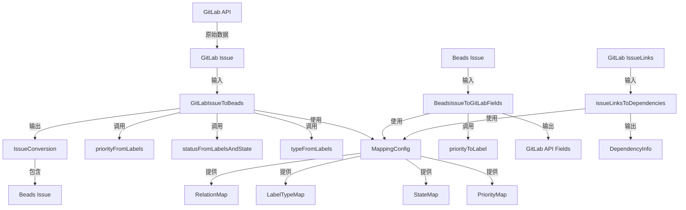

# GitLab Mapping 模块技术深度解析

## 概述

GitLab Mapping 模块是 Beads 系统与 GitLab 之间的**翻译层**，它负责在两个系统的数据模型之间进行双向转换。想象一下，这就像一位精通两种语言的外交官，不仅要翻译字面意思，还要确保文化背景和语义意图的准确传达。

这个模块解决的核心问题是：GitLab 和 Beads 虽然都处理问题跟踪，但它们对同一概念的表示方式截然不同。GitLab 使用标签（如 `priority::high`、`type::bug`）来编码元数据，而 Beads 有专门的字段（`Priority`、`IssueType`）。Mapping 模块的职责就是在这两种范式之间优雅地转换，同时保留所有业务语义。

## 架构与数据流程

### 核心架构图



### 数据流程解析

数据在这个模块中的流动遵循清晰的双向路径：

1. **GitLab → Beads 路径**：
   - 从 GitLab API 获取原始 Issue 数据
   - `GitLabIssueToBeads` 作为入口点，协调整个转换过程
   - 分别调用三个专用函数提取不同维度的信息：
     - `priorityFromLabels`：从标签中解析优先级
     - `statusFromLabelsAndState`：结合状态和标签确定状态
     - `typeFromLabels`：从标签中识别问题类型
   - 最终生成包含 Beads Issue 和依赖信息的 `IssueConversion` 结构

2. **Beads → GitLab 路径**：
   - 接收 Beads Issue 作为输入
   - `BeadsIssueToGitLabFields` 构建 GitLab API 可接受的字段映射
   - 调用 `priorityToLabel` 将数值优先级转换回标签形式
   - 生成包含标题、描述、标签、权重等的字段映射

3. **依赖关系转换**：
   - 处理 GitLab 的 IssueLinks 数据
   - `issueLinksToDependencies` 解析链接方向和类型
   - 生成 Beads 系统可用的 DependencyInfo 结构

## 核心组件深度解析

### MappingConfig 结构体

```go
type MappingConfig struct {
    PriorityMap  map[string]int    // priority label value → beads priority (0-4)
    StateMap     map[string]string // GitLab state → beads status
    LabelTypeMap map[string]string // type label value → beads issue type
    RelationMap  map[string]string // GitLab link type → beads dependency type
}
```

**设计意图**：这是整个模块的配置中枢，采用了**策略模式**的思想。通过将映射关系外部化为配置，而不是硬编码在转换逻辑中，实现了高度的灵活性。用户可以根据自己的 GitLab 标签约定自定义映射，而无需修改核心转换代码。

**关键特点**：
- 每个字段都是一个映射表，定义了 GitLab 概念到 Beads 概念的转换规则
- 所有映射都是可配置的，没有硬编码的转换逻辑
- 这种设计使得同一个转换代码可以适应不同的 GitLab 项目设置

### DefaultMappingConfig 函数

```go
func DefaultMappingConfig() *MappingConfig {
    // Copy PriorityMapping to avoid external modification
    priorityMap := make(map[string]int, len(PriorityMapping))
    for k, v := range PriorityMapping {
        priorityMap[k] = v
    }

    // Copy typeMapping to avoid external modification
    labelTypeMap := make(map[string]string, len(typeMapping))
    for k, v := range typeMapping {
        labelTypeMap[k] = v
    }

    return &MappingConfig{
        PriorityMap: priorityMap,
        StateMap: map[string]string{
            "opened":   StatusMapping["open"],
            "closed":   StatusMapping["closed"],
            "reopened": StatusMapping["open"],
        },
        LabelTypeMap: labelTypeMap,
        RelationMap: map[string]string{
            "blocks":        "blocks",
            "is_blocked_by": "blocked_by",
            "relates_to":    "related",
        },
    }
}
```

**设计意图**：提供一个开箱即用的标准配置，同时确保配置的安全性。注意这里的两个关键设计决策：

1. **防御性复制**：函数显式复制了 `PriorityMapping` 和 `typeMapping`，而不是直接引用。这是一个重要的**安全性设计**，防止外部代码修改这些全局映射表，从而影响所有使用默认配置的代码。

2. **单一事实来源**：注释明确提到 "Uses exported mapping constants from types.go as the single source of truth"，这体现了良好的软件工程实践，避免了数据重复定义。

### priorityFromLabels 函数

```go
func priorityFromLabels(labels []string, config *MappingConfig) int {
    for _, label := range labels {
        prefix, value := parseLabelPrefix(label)
        if prefix == "priority" {
            if p, ok := config.PriorityMap[strings.ToLower(value)]; ok {
                return p
            }
        }
    }
    return 2 // Default to medium
}
```

**设计意图**：从 GitLab 标签中提取优先级信息。这个函数体现了几个关键的设计思想：

1. **约定优于配置**：函数假设 GitLab 中使用 `priority::*` 格式的作用域标签来表示优先级，这是一种约定。

2. **容错设计**：如果找不到优先级标签，函数不会报错，而是返回默认的中等优先级（2）。这确保了转换过程的健壮性。

3. **大小写不敏感**：通过 `strings.ToLower(value)` 处理，使得标签值的大小写不影响匹配结果。

### statusFromLabelsAndState 函数

```go
func statusFromLabelsAndState(labels []string, state string, config *MappingConfig) string {
    // Closed state always wins
    if state == "closed" {
        return "closed"
    }

    // Check for status label
    for _, label := range labels {
        prefix, value := parseLabelPrefix(label)
        if prefix == "status" {
            normalized := strings.ToLower(value)
            if normalized == "in_progress" {
                return "in_progress"
            }
            if normalized == "blocked" {
                return "blocked"
            }
            if normalized == "deferred" {
                return "deferred"
            }
        }
    }

    // Default: map GitLab state to beads status
    if s, ok := config.StateMap[state]; ok {
        return s
    }
    return "open"
}
```

**设计意图**：这是一个**优先级决策引擎**，它展示了如何处理多个信息源之间的冲突和优先级。关键设计点：

1. **明确的优先级顺序**：
   - GitLab 的 "closed" 状态具有最高优先级，无条件返回 "closed"
   - 其次检查 `status::*` 标签
   - 最后才使用 GitLab 的基本状态映射

2. **为什么 closed 状态优先？**：这是一个业务决策。在问题跟踪系统中，"已关闭"是一个最终状态，即使有其他标签指示不同的状态，closed 应该始终胜出。

3. **硬编码的状态值**：注意这里对于 "in_progress"、"blocked"、"deferred" 的判断是硬编码的，这是一个设计权衡点。它使得这些状态成为系统的一等公民，不依赖于配置，但也降低了灵活性。

### typeFromLabels 函数

```go
func typeFromLabels(labels []string, config *MappingConfig) string {
    for _, label := range labels {
        prefix, value := parseLabelPrefix(label)
        if prefix == "type" {
            if t, ok := config.LabelTypeMap[strings.ToLower(value)]; ok {
                return t
            }
        }
        // Also check bare labels (no prefix)
        if prefix == "" {
            if t, ok := config.LabelTypeMap[strings.ToLower(value)]; ok {
                return t
            }
        }
    }
    return "task" // Default to task
}
```

**设计意图**：这个函数体现了**兼容性设计**，它同时支持两种标签格式：

1. **作用域标签**：如 `type::bug`，这是推荐的格式，清晰明确
2. **裸标签**：如直接使用 `bug`，这是为了兼容那些没有使用作用域标签约定的 GitLab 项目

这种双重支持使得系统可以适应不同的 GitLab 项目实践，提高了模块的适用性。

### GitLabIssueToBeads 函数

这是模块的核心转换函数，它将 GitLab Issue 转换为 Beads Issue。让我们分析其设计要点：

1. **SourceSystem 的构造**：
   ```go
   sourceSystem := fmt.Sprintf("gitlab:%d:%d", gl.ProjectID, gl.IID)
   ```
   这是一个精心设计的标识符格式，它包含了足够的信息来唯一标识 GitLab 中的问题，同时也指明了来源系统。

2. **权重转换**：
   ```go
   if gl.Weight > 0 {
       estimatedMinutes := gl.Weight * 60
       issue.EstimatedMinutes = &estimatedMinutes
   }
   ```
   这里假设 GitLab 的 weight 单位是小时，乘以 60 转换为分钟。这是一个**约定性假设**，如果用户的 GitLab 项目使用不同的权重单位，需要通过配置来调整。

3. **渐进式增强**：函数首先构建基本的 Issue 结构，然后逐步添加可选字段（估算时间、经办人、时间戳）。这种结构使得代码清晰易读，也便于处理可选字段。

### BeadsIssueToGitLabFields 函数

这个函数执行反向转换，将 Beads Issue 转换为 GitLab API 可接受的字段。关键设计点：

1. **标签构建策略**：
   - 首先添加类型标签：`type::` + 问题类型
   - 然后添加优先级标签：`priority::` + 优先级标签
   - 接着添加状态标签（仅用于非 open/closed 状态）
   - 最后添加用户定义的其他标签

2. **状态处理的不对称性**：
   - 对于 "in_progress"、"blocked"、"deferred" 状态，使用标签表示
   - 对于 "closed" 状态，使用 `state_event: "close"` 来触发 GitLab 的状态变更
   - 这种不对称设计反映了两个系统状态模型的差异

3. **估算时间的反向转换**：
   ```go
   if issue.EstimatedMinutes != nil && *issue.EstimatedMinutes > 0 {
       fields["weight"] = *issue.EstimatedMinutes / 60
   }
   ```
   这里使用整数除法，可能会导致精度损失。这是一个**设计权衡**，接受了可能的精度损失，以换取与 GitLab 权重模型的兼容性。

### issueLinksToDependencies 函数

这个函数处理 GitLab IssueLinks 到 Beads DependencyInfo 的转换，展示了如何处理**关系方向**：

1. **方向解析逻辑**：
   ```go
   if link.SourceIssue != nil && link.SourceIssue.IID == sourceIID {
       // We are the source, target is the dependency
       if link.TargetIssue != nil {
           toIID = link.TargetIssue.IID
       }
   } else if link.TargetIssue != nil && link.TargetIssue.IID == sourceIID {
       // We are the target, source is the dependency
       if link.SourceIssue != nil {
           toIID = link.SourceIssue.IID
       }
   }
   ```
   这段代码仔细处理了链接的方向性，确保正确识别哪个问题是依赖方，哪个是被依赖方。

2. **默认关系类型**：如果无法识别链接类型，默认使用 "related"，这是一个安全的默认值，不会错误地表示阻塞关系。

### 辅助函数

#### priorityToLabel
```go
func priorityToLabel(priority int) string {
    switch priority {
    case 0:
        return "critical"
    case 1:
        return "high"
    case 2:
        return "medium"
    case 3:
        return "low"
    case 4:
        return "none"
    default:
        return "medium"
    }
}
```

这个函数是 `priorityFromLabels` 的反向操作，注意它是硬编码的，不依赖于配置。这是一个设计决策，确保 Beads 内部的优先级数值（0-4）有稳定的语义。

#### filterNonScopedLabels
```go
func filterNonScopedLabels(labels []string) []string {
    var filtered []string
    for _, label := range labels {
        prefix, _ := parseLabelPrefix(label)
        // Skip scoped labels that we handle specially
        if prefix == "priority" || prefix == "status" || prefix == "type" {
            continue
        }
        filtered = append(filtered, label)
    }
    return filtered
}
```

这个函数过滤掉那些已经被转换为 Beads 专门字段的标签，避免信息重复。它确保了 Beads 的 Labels 字段只包含真正的标签，而不是编码的元数据。

## 依赖分析

### 被依赖关系

这个模块被以下模块依赖：
- **gitlab_tracker**：GitLab 跟踪器实现，使用此模块进行数据转换
- **gitlab_fieldmapper**：字段映射器，可能使用此模块的映射逻辑

### 依赖关系

此模块依赖：
- **types**：核心领域类型，特别是 `Issue`、`IssueType`、`Status` 等
- **gitlab_types**：GitLab 特定的数据类型，如 `Issue`、`IssueLink`、`IssueConversion` 等

### 数据契约

模块与外部系统的关键数据契约：

1. **GitLab 标签约定**：
   - 优先级标签：`priority::critical`、`priority::high` 等
   - 类型标签：`type::bug`、`type::feature` 等
   - 状态标签：`status::in_progress`、`status::blocked` 等

2. **SourceSystem 格式**：`gitlab:<project-id>:<issue-iid>`

3. **权重假设**：GitLab weight 单位为小时，Beads 使用分钟

## 设计决策与权衡

### 1. 配置驱动 vs 硬编码

**决策**：采用混合策略，映射表可配置，但核心转换逻辑和一些关键值（如状态名称）是硬编码的。

**权衡分析**：
- ✅ 灵活性：用户可以自定义映射关系
- ✅ 稳定性：核心语义保持不变，避免配置错误导致系统行为不一致
- ❌ 有限性：某些转换（如优先级标签名称）无法通过配置修改

**替代方案**：完全可配置的系统，所有转换都通过配置定义。但这会增加系统复杂性，并且可能导致不同部署之间的行为差异过大。

### 2. 防御性复制

**决策**：在 `DefaultMappingConfig` 中显式复制映射表，而不是直接引用。

**权衡分析**：
- ✅ 安全性：防止外部代码意外修改全局映射
- ✅ 隔离性：每个配置实例独立，互不影响
- ❌ 内存开销：需要额外的内存来存储复制的映射表
- ❌ 性能：有轻微的复制开销

这个决策体现了**安全性优先**的设计原则，在这个场景下，内存和性能开销是微不足道的，而安全性和隔离性则至关重要。

### 3. 优先级顺序的确定

**决策**：在 `statusFromLabelsAndState` 中，closed 状态 > status 标签 > 基本状态映射。

**权衡分析**：
- ✅ 符合直觉：closed 是最终状态，应该胜出
- ✅ 灵活性：通过标签可以表示更多状态
- ❌ 可能混淆：用户可能不理解为什么某些标签似乎被忽略

这个决策基于对问题跟踪系统工作方式的深刻理解，closed 状态在大多数工作流中确实具有最高优先级。

### 4. 双向转换的不对称性

**决策**：GitLab → Beads 和 Beads → GitLab 的转换逻辑不完全对称。

**权衡分析**：
- ✅ 实用性：每个方向都针对目标系统进行了优化
- ❌ 复杂性：理解整个转换过程需要考虑两个不同的路径
- ❌ 潜在的信息损失：往返转换可能不会完全恢复原始数据

这种不对称性是必要的，因为两个系统的能力和数据模型不同。模块的职责是尽可能保留语义，而不是逐字复制。

### 5. 默认值的选择

**决策**：
- 优先级默认为 2（medium）
- 类型默认为 "task"
- 状态默认为 "open"
- 关系类型默认为 "related"

**权衡分析**：
- ✅ 健壮性：即使缺少信息，转换也能完成
- ✅ 安全性：默认值都是相对中性的，不会导致错误的业务决策
- ❌ 可能掩盖问题：静默使用默认值可能使用户不知道某些信息缺失

这些默认值的选择体现了**安全失败**（fail-safe）的设计原则，选择最不会导致错误业务后果的值作为默认。

## 使用指南与示例

### 基本使用

```go
// 创建默认映射配置
config := gitlab.DefaultMappingConfig()

// 转换 GitLab Issue 为 Beads Issue
glIssue := // 从 GitLab API 获取的 Issue
conversion := gitlab.GitLabIssueToBeads(glIssue, config)
beadsIssue := conversion.Issue

// 转换 Beads Issue 回 GitLab 字段
glFields := gitlab.BeadsIssueToGitLabFields(beadsIssue, config)
// 使用 glFields 调用 GitLab API 更新 Issue
```

### 自定义映射配置

```go
config := gitlab.DefaultMappingConfig()

// 自定义优先级映射
config.PriorityMap["urgent"] = 0
config.PriorityMap["important"] = 1
config.PriorityMap["routine"] = 2
config.PriorityMap["minor"] = 3

// 自定义状态映射
config.StateMap["resolved"] = "closed"
config.StateMap["in_review"] = "in_progress"

// 自定义类型映射
config.LabelTypeMap["enhancement"] = "feature"
config.LabelTypeMap["defect"] = "bug"

// 自定义关系映射
config.RelationMap["depends_on"] = "blocked_by"
config.RelationMap["implements"] = "related"
```

### 依赖关系转换

```go
sourceIID := 123 // 当前问题的 IID
links := // 从 GitLab API 获取的 IssueLinks
deps := gitlab.issueLinksToDependencies(sourceIID, links, config)

// 使用 deps 处理依赖关系
for _, dep := range deps {
    fmt.Printf("Issue %d %s issue %d\n", dep.FromGitLabIID, dep.Type, dep.ToGitLabIID)
}
```

## 边缘情况与注意事项

### 1. 标签匹配的大小写不敏感性

**问题**：标签匹配是大小写不敏感的（通过 `strings.ToLower`），这意味着 `Priority::High` 和 `priority::high` 会被视为相同。

**影响**：这通常是期望的行为，但如果 GitLab 项目有意使用大小写来区分不同的标签，可能会导致意外的匹配。

**建议**：在 GitLab 项目中统一标签的大小写规范，避免依赖大小写来区分标签。

### 2. 权重转换的精度损失

**问题**：将 Beads 的分钟估算转换为 GitLab 的权重时，使用整数除法，可能导致精度损失。例如，90 分钟会被转换为 1 权重，而不是 1.5。

**影响**：往返转换可能不会完全恢复原始值。

**缓解**：如果需要更高的精度，可以考虑修改代码使用浮点权重，但这需要 GitLab API 的支持。

### 3. 状态转换的单向性

**问题**：GitLab 的 "reopened" 状态被映射到 Beads 的 "open"，但反向转换时，Beads 的 "open" 状态不会触发 GitLab 的重新打开操作。

**影响**：在 Beads 中将已关闭的问题重新打开，不会自动反映到 GitLab。

**缓解**：需要额外的逻辑来处理这种情况，可能需要跟踪原始状态或使用特定的状态转换事件。

### 4. 标签过滤的潜在问题

**问题**：`filterNonScopedLabels` 过滤掉所有 `priority::*`、`status::*`、`type::*` 标签，即使某些标签可能是用户有意保留的。

**影响**：用户无法在 Beads 中看到这些标签。

**缓解**：如果需要保留这些标签，可以修改过滤逻辑，或者在转换后手动添加回来。

### 5. 依赖关系方向的复杂性

**问题**：`issueLinksToDependencies` 中的方向逻辑可能难以理解，特别是对于不熟悉 GitLab IssueLinks 结构的开发者。

**影响**：修改这部分代码时容易引入错误。

**建议**：在修改此函数时，务必编写全面的单元测试，覆盖各种链接场景。

### 6. 硬编码的状态值

**问题**：`statusFromLabelsAndState` 和 `BeadsIssueToGitLabFields` 中的一些状态值是硬编码的，如 "in_progress"、"blocked"、"deferred"。

**影响**：这些状态无法通过配置自定义。

**缓解**：如果需要自定义这些状态，需要修改代码，将它们移到配置中。

## 扩展点与未来改进

### 1. 可插拔的标签解析器

当前的标签解析逻辑是硬编码的，未来可以考虑将其抽象为接口，允许用户提供自定义的标签解析策略。

### 2. 更丰富的映射规则

当前的映射是简单的键值对，可以考虑扩展为支持更复杂的规则，如正则表达式匹配、默认值规则等。

### 3. 双向转换的对称性保证

可以添加验证逻辑，确保往返转换（GitLab → Beads → GitLab）尽可能保留原始数据，或者明确记录信息损失。

### 4. 映射配置的版本控制

随着系统的发展，映射规则可能会变化。添加配置版本控制可以帮助平滑迁移。

## 总结

GitLab Mapping 模块是一个精心设计的翻译层，它在保持灵活性的同时，确保了数据转换的一致性和可靠性。通过将映射关系外部化为配置，同时保持核心转换逻辑的稳定性，模块实现了良好的平衡。

这个模块的设计体现了几个重要的软件工程原则：
- **约定优于配置**：提供合理的默认约定，同时允许配置覆盖
- **安全失败**：选择中性的默认值，确保即使缺少信息也能继续工作
- **防御性编程**：通过复制映射表等方式防止意外修改
- **明确的优先级**：在多个信息源冲突时，有明确的决策规则

对于新加入团队的开发者，理解这个模块的关键是把握其**双向翻译**的核心职责，以及**配置与硬编码混合**的设计策略。在修改代码时，要特别注意保持两个方向转换的语义一致性，并全面测试各种边缘情况。
